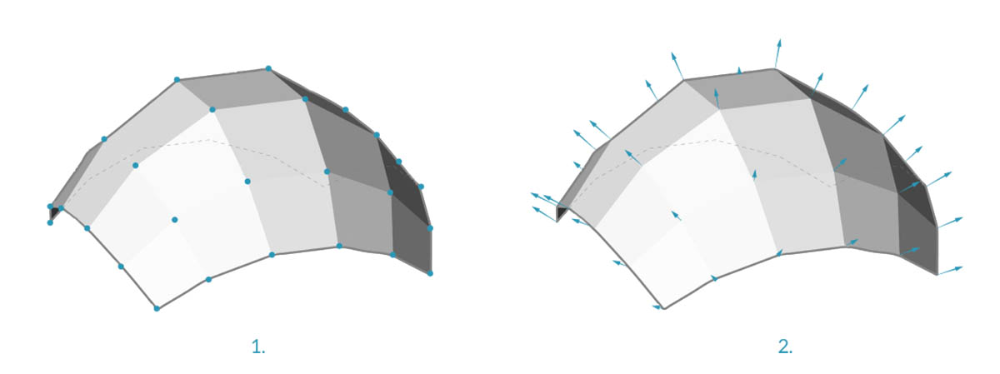

# Netze

## Netze in Dynamo

### Was ist ein Netz?

Im Bereich der computergestützten Modellierung stellen [Netze](7-meshes.md#mesh) eine der am weitesten verbreiteten Formen für die Darstellung von 3D-Geometrie dar. Netzgeometrie besteht im Allgemeinen aus einer Sammlung von Vierecken oder Dreiecken. Sie kann eine einfache und flexible Alternative zum Arbeiten mit NURBS sein, und Netze werden in praktisch allen Bereichen verwendet, von Renderings und Visualisierungen bis hin zur digitalen Fertigung und zum 3D-Druck.

### Netzelemente

Dynamo definiert Netze mit einer Flächen-Scheitelpunkt-Datenstruktur. Auf elementarster Ebene handelt es sich bei dieser Struktur einfach um eine Sammlung von Punkten, die in Polygonen gruppiert sind. Die Punkte eines Netzes werden als Scheitelpunkte bezeichnet, während die oberflächenartigen Polygone als Flächen bezeichnet werden.

Um ein Netz zu erstellen, benötigen Sie eine Liste von Scheitelpunkten und ein System für die Gruppierung dieser Scheitelpunkte in Flächen. Dies wird auch als Indexgruppe bezeichnet.

> 1. Liste von Scheitelpunkten
> 2. Liste von Indexgruppen zum Definieren von Flächen

### Mesh Toolkit

Der Funktionsumfang in Bezug auf Netze von Dynamo kann durch die Installation des Pakets [Mesh Toolkit](https://github.com/DynamoDS/Dynamo/wiki/Dynamo-Mesh-Toolkit) erweitert werden. Das Dynamo Mesh Toolkit bietet Werkzeuge zum Importieren von Netzen aus externen Dateiformaten, zum Erstellen von Netzen aus Dynamo Geometrieobjekten und zum manuellen Erstellen von Netzen aus ihren Scheitelpunkten und Indizes.

Die Bibliothek enthält auch Werkzeuge zum Ändern und Reparieren von Netzen sowie zum Extrahieren horizontaler Scheiben zur Verwendung in der Fertigung.

Ein Beispiel zur Verwendung dieses Pakets finden Sie in den [Fallstudien zu Mesh Toolkit](../../custom-nodes-and-packages/11-packages/11-2\_mesh-toolkit.md).

## Vertiefung...

### Netz

Ein Netz ist eine Sammlung von Vierecken und Dreiecken, die eine Oberfläche oder einen Volumenkörper darstellt. Wie bei Volumenkörpern enthält auch die Struktur von Netzobjekten Scheitelpunkte, Kanten und Flächen. Darüber hinaus gibt es weitere Eigenschaften, die Netze eindeutig machen, z. B. Normalen.

> 1. Netzscheitelpunkte
> 2. Netzkanten: \*Kanten mit nur einer angrenzenden Fläche werden als "nackt" bezeichnet. Alle anderen Kanten sind "angezogen".
> 3. Netzflächen

### Scheitelpunkte + Scheitelpunktnormalen

Die Scheitelpunkte eines Netzes entsprechen einfach einer Liste von Punkten. Der Index der Scheitelpunkte ist beim Konstruieren eines Netzes oder Abrufen von Informationen über die Struktur eines Netzes sehr wichtig. Für jeden Scheitelpunkt gibt es auch eine entsprechende Scheitelpunktnormale (Vektor), die die durchschnittliche Richtung der verbundenen Flächen beschreibt und Sie dabei unterstützt, die nach innen und nach außen gerichtete Orientierung des Netzes zu verstehen.

> 1. Scheitelpunkte
> 2. Scheitelpunktnormalen

### Flächen

Eine Fläche ist eine geordnete Liste von drei oder vier Scheitelpunkten. Die "Oberflächendarstellung" einer Netzfläche ist deshalb gemäß der Position der indizierten Scheitelpunkte impliziert. Sie verfügen bereits über die Liste der Scheitelpunkte, die ein Netz bilden. Statt also individuelle Punkte anzugeben, um eine Fläche zu definieren, verwenden Sie einfach den Index der Scheitelpunkte. Dies ermöglicht Ihnen auch die Verwendung desselben Scheitelpunkts in weiteren Flächen.

> 1. Quadratische Fläche, die aus den Indizes 0, 1, 2 und 3 erstellt wurde
> 2. Dreieckige Fläche, die aus den Indizes 1, 4 und 2 erstellt wurde. Beachten Sie, dass die Indexgruppen in ihrer Reihenfolge verschoben werden können – solange die Sequenz gegen den Uhrzeigersinn angeordnet ist, ist die Fläche korrekt definiert

### Netze und NURBS-Oberflächen im Vergleich

Welche Unterschiede bestehen zwischen Netz- und NURBS-Geometrie? Wann möchten Sie die eine Geometrie anstelle der anderen verwenden?

#### Parametrisierung

In einem früheren Kapitel haben wir gesehen, dass NURBS-Oberflächen durch eine Reihe von NURBS-Kurven in zwei Richtungen definiert werden. Diese Richtungen werden als `U` und `V` bezeichnet und ermöglichen, dass eine NURBS-Oberfläche gemäß einer zweidimensionalen Oberflächendomäne parametrisiert wird. Die Kurven selbst werden als Gleichungen im Computer gespeichert, sodass die resultierenden Oberflächen auf einen beliebigen, verhältnismäßig kleinen Genauigkeitsbereich berechnet werden können. Es kann jedoch schwierig sein, mehrere NURBS-Oberflächen miteinander zu kombinieren. Das Verbinden von zwei NURBS-Oberflächen führt zu einem Flächenverband, in dem verschiedene Bereiche der Geometrie unterschiedliche UV-Parameter und Kurvendefinitionen aufweisen.

> 1. Oberfläche
> 2. Isoparametrische (Isoparm) Kurve
> 3. Steuerpunkt der Oberfläche
> 4. Steuerpunkt des Flächenverbands
> 5. Isoparametrischer Punkt
> 6. Oberflächenrahmen
> 7. Netz
> 8. Nackte Kante
> 9. Maschennetz
> 10. Netzkanten
> 11. Scheitelpunktnormale
> 12. Netzfläche/Netzflächennormale

Netze auf der anderen Seite bestehen aus einer diskreten Anzahl von genau definierten Scheitelpunkten und Flächen. Das Netzwerk von Scheitelpunkten kann im Allgemeinen nicht durch einfache `UV`-Koordinaten definiert werden. Da die Anzahl an Flächen diskret ist, bestimmt sich daraus auch der Genauigkeitsgrad des Netzes, der nur geändert werden kann, indem das Netz neu definiert und weitere Flächen hinzugefügt werden. Das Fehlen der mathematischen Beschreibungen ermöglicht Netzen die flexiblere Handhabung komplexer Geometrie innerhalb eines einzelnen Netzes.

### Lokaler und globaler Einfluss im Vergleich

Ein weiterer wichtiger Unterschied ist das Ausmaß, in dem sich eine lokale Änderung der Netz- oder NURBS-Geometrie auf die gesamte Form auswirkt. Das Verschieben von einem Scheitelpunkt eines Netzes wirkt sich nur auf die an diesen Scheitelpunkt angrenzenden Flächen aus. In NURBS-Oberflächen ist das Ausmaß des Einflusses wesentlich komplizierter und richtet sich sowohl nach dem Grad der Oberfläche als auch nach den Gewichtungen und Knoten der Steuerpunkte. Allgemein wird durch das Verschieben eines einzelnen Steuerpunkts in einer NURBS-Oberfläche eine glattere, umfassendere Änderungen in der Geometrie erzeugt.

> 1. NURBS-Oberfläche: Das Verschieben eines Steuerpunkts wirkt sich über die Form hinaus aus.
> 2. Netzgeometrie – Das Verschieben eines Scheitelpunkts wirkt sich nur auf die angrenzenden Elemente aus.

Eine Analogie, die hilfreich sein kann, besteht im Vergleich eines Vektorbilds (bestehend aus Linien und Kurven) mit einem Rasterbild (bestehend aus einzelnen Pixeln). Wenn Sie die Anzeige eines Vektorbilds vergrößern, sind die Kurven weiterhin klar und deutlich zu sehen, während das Vergrößern eines Rasterbilds dazu führt, dass die einzelnen Pixel größer werden. In dieser Analogie können NURBS-Oberflächen mit einem Vektorbild verglichen werden, da eine glatte mathematische Beziehung besteht, während sich ein Netz ähnlich wie ein Rasterbild mit einer festgelegten Auflösung verhält.

##
