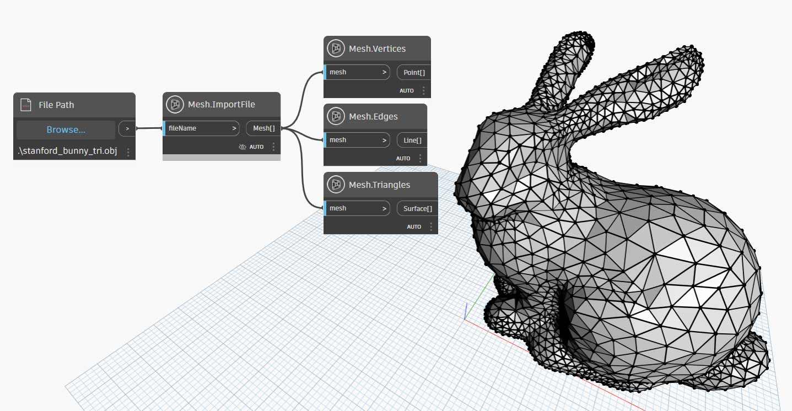

# メッシュ

## Dynamo のメッシュ

### メッシュとは

コンピュータ モデリングの分野では、3D ジオメトリを表現する形式として[メッシュ](7-meshes.md#mesh)が広く普及しています。メッシュ ジオメトリは一般的に四角形または三角形の集合で構成され、NURBS 操作の代替として、軽量で柔軟なジオメトリにすることができます。メッシュは、レンダリングやビジュアライゼーションからデジタル製造や 3D プリントまで、あらゆる用途に使用されます。

### メッシュの要素

Dynamo では、面と頂点のデータ構造を使用してメッシュを定義します。最も基本的なレベルでは、この構造はポリゴンにグループ化された単なる点の集合です。メッシュの点を頂点と呼び、サーフェスのような形状のポリゴンを面と呼びます。

メッシュを作成するには、頂点のリストと、それらの頂点をインデックス グループと呼ばれる面にグループ化するための仕組みが必要です。

> 1. 頂点のリスト
> 2. 面を定義するためのインデックス グループのリスト

### Mesh Toolkit

Dynamo のメッシュ機能は、[Mesh Toolkit](https://github.com/DynamoDS/Dynamo/wiki/Dynamo-Mesh-Toolkit) パッケージをインストールすることによって拡張することができます。Dynamo Mesh Toolkit は、外部ファイル形式からメッシュを読み込む機能、Dynamo のジオメトリ オブジェクトからメッシュを作成する機能、頂点とインデックスからメッシュを手動で作成する機能を提供するライブラリです。

このライブラリには、メッシュの変更や修復を行うためのツールや、製造処理で使用する水平方向のスライスを抽出するためのツールも用意されています。

このパッケージの使用例については、「[Mesh Toolkit のケース スタディ](https://github.com/DynamoDS/Dynamo/wiki/Dynamo-Mesh-Toolkit#nodes)」を参照してください。

## 詳細を説明します。

### メッシュ

メッシュは、サーフェスまたはソリッド ジオメトリを表す四角形と三角形の集まりです。メッシュ オブジェクトは、ソリッドと同様に、頂点、辺、面から構成されます。メッシュには、標準のプロパティの他に、法線のような独自のプロパティもあります。

> 1. メッシュの頂点
> 2. メッシュの辺: 隣接する面が 1 つだけの辺を「裸の辺」と呼びます。それ以外のすべての辺を、「おおわれた辺」と呼びます。
> 3. メッシュの面

### 頂点と頂点法線

メッシュの頂点は、単純な点のリストです。メッシュを作成する場合や、メッシュの構造に関する情報を取得する場合、頂点のインデックスは非常に重要です。各頂点には、対応する頂点法線(ベクトル)があります。この頂点法線は、頂点において隣接する面の方向の平均を表すため、メッシュが「内向き」か「外向き」かを判断する場合に役立ちます。

> 1. 頂点
> 2. 頂点法線

### 面

面は、3 つまたは 4 つの頂点の順番付きリストです。そのため、メッシュ面の「サーフェス」としての表示方法は、インデックス化された頂点の位置によって決まります。メッシュを構成する頂点のリストは既に作成されているため、ここでは個々の点を指定して面を定義するのではなく、頂点のインデックスをそのまま使用します。これにより、複数の面で同じ頂点を使用することができます。

> 1. 四角形の面は、0、1、2、3 のインデックスから構成されます。
> 2. 三角形の面は、1、4、2 のインデックスから構成されます。インデックス グループの順序は、変更することができます。ただし、反時計回りに並んでいる必要があります。これにより、面が正しく定義されます。

### メッシュと NURBS サーフェスとの比較

メッシュ ジオメトリと NURBS ジオメトリとの違いは何でしょうか。どのような場合にどちらのジオメトリを使用したらよいのでしょうか。

#### パラメータ化

前の章で、NURBS サーフェスは 2 つの方向に向かう一連の NURBS 曲線によって定義されるということを説明しました。これらの方向には、`U` と `V` というラベルが付けられます。これにより、2 次元サーフェスの範囲に応じて、NURBS サーフェスをパラメータ化することができます。曲線自体は、計算式としてコンピュータに格納されます。これにより、生成されるサーフェスを任意の精度で計算することができます。ただし、複数の NURBS サーフェスを結合するのは難しい場合があります。2 つの NURBS サーフェスを結合すると、ポリサーフェスが作成されます。ジオメトリの異なる部分には、異なる UV パラメータと曲線がそれぞれ定義されます。

> 1. サーフェス
> 2. アイソパラメトリック(Isoparm)曲線
> 3. サーフェス制御点
> 4. サーフェス制御ポリゴン
> 5. パラメトリック点
> 6. サーフェス フレーム
> 7. メッシュ
> 8. 裸の辺
> 9. メッシュ ネットワーク
> 10. メッシュの辺
> 11. 頂点法線
> 12. メッシュ面、メッシュ面の法線

NURBS サーフェスとは異なり、メッシュは、正確に定義された複数の不連続な頂点と面で構成されます。頂点のネットワークは、通常、単純な `UV` 座標で定義することはできません。面は互いに連続していないため、精度はメッシュ内で定義されます。精度を高めるには、メッシュを変更し、面の数を増やす必要があります。メッシュには数学的な表現方法がないため、1 つのメッシュ内で複雑なジオメトリをより柔軟に処理することができます。

### ローカルな影響とグローバルな影響

メッシュと NURBS サーフェスのもう一つの重要な違いは、メッシュ内または NURBS ジオメトリ内のローカルの変更が形状全体に与える影響の度合いです。メッシュで 1 つの頂点を移動すると、その頂点に隣接する面だけが影響を受けます。NURBS サーフェスの場合、影響の範囲はより複雑で、サーフェスの次数、制御点のウェイト、制御点のノットによって影響の範囲が異なります。ただし、一般的には、NURBS サーフェスで 1 つの制御点を移動した場合の方が、ジオメトリの変更はより広範囲で滑らかなものになります。

> 1. NURBS サーフェスで 1 つの制御点を移動すると、形状全体に影響が及びます。
> 2. メッシュ ジオメトリで 1 つの頂点を移動すると、隣接する要素にのみ影響が及びます。

この対比関係は、直線と曲線で構成されるベクター イメージと、個々のピクセルで構成されるラスター イメージとの関係に似ています。ベクター イメージを拡大表示しても曲線はくっきりと表示されるのに対して、ラスター イメージを拡大表示すると個々のピクセルが拡大されて表示されます。つまり、NURBS サーフェスは、数学的に滑らかな関係があるという点でベクター イメージに似ています。一方メッシュは、一定の解像度を持つという点でラスター イメージに似ています。

##
