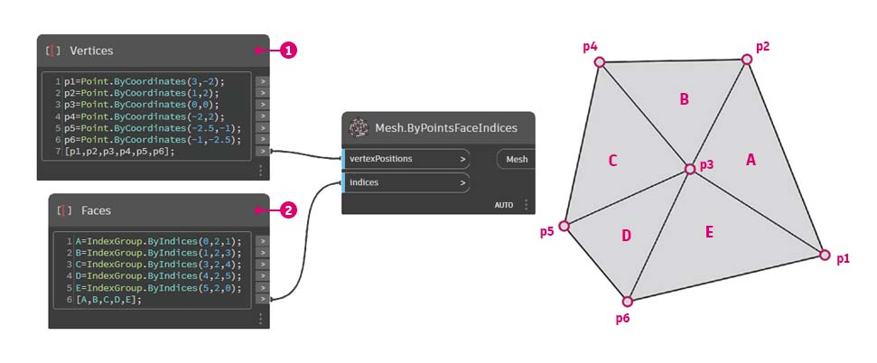
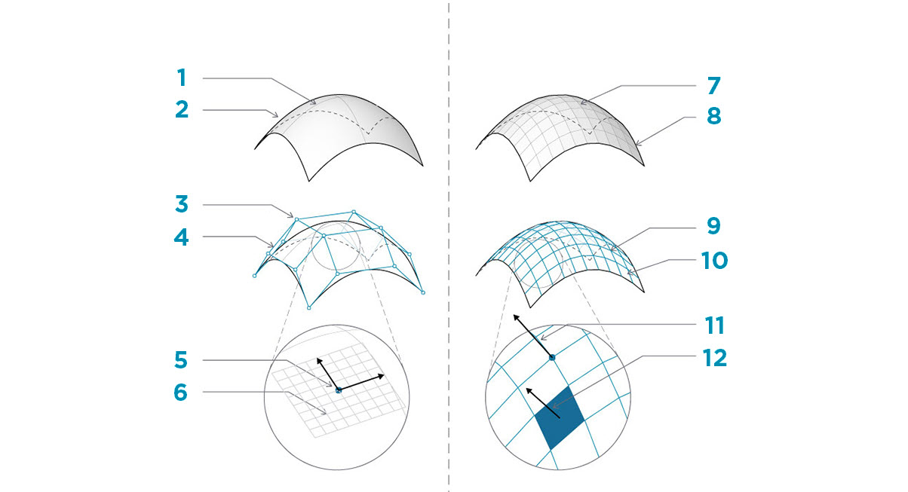

# 网格

## Dynamo 中的网格

### 什么是网格？

在计算建模领域，[网格](7-meshes.md#mesh)是表示三维几何图形的最普遍形式之一。网格几何图形通常由一组四边形或三角形组成，它可以是使用 NURBS 的轻量级和灵活的替代方案，并且网格用于从渲染和可视化到数字制造和三维打印的所有领域。

### 网格元素

Dynamo 使用“面-顶点”数据结构定义网格。在最基本的层次上，此结构只是分组为多边形的点集。网格的点称为“顶点”，而类似曲面的多边形称为“面”。

要创建网格，我们需要一列顶点和将这些顶点分组为面的系统（称为“索引组”）。

> 1. 顶点列表
> 2. 用于定义面的索引组列表

### Mesh Toolkit

Dynamo 的网格功能可通过安装[“Mesh Toolkit”](https://github.com/DynamoDS/Dynamo/wiki/Dynamo-Mesh-Toolkit)软件包进行扩展。Dynamo Mesh Toolkit 包提供了多种工具，可从外部文件格式输入网格、从 Dynamo 几何图形对象创建网格，以及按顶点和索引手动构建网格。

该库还提供了一些工具，可用于修改网格、修复网格或提取水平切片以在制造中使用。

例如，有关使用此软件包的信息，请访问 [Mesh Toolkit 案例研究](../../custom-nodes-and-packages/11-packages/11-2\_mesh-toolkit.md)。

## 深入探讨...

### 网格

网格是表示曲面或实体几何图形的四边形和三角形的集合。像实体一样，网格对象的结构包括顶点、边和面。还有一些使网络独一无二的特性，例如法线。

> 1. 网格顶点
> 2. 网格边 *仅具有一个邻接面的边称为“裸边”。 所有其他边均为“装饰边”
> 3. 网格面

### 顶点 + 顶点法线

网格的顶点只是一列点。在构建网格或获取网格结构的相关信息时，顶点的索引非常重要。对于每个顶点，还有一个相应的顶点法线（向量），它描述了附加面的平均方向，并帮助我们了解网格的“入”和“出”方向。

> 1. 顶点
> 2. 顶点法线(Vertex Normals)

### 面

面是由三个或四个顶点组成的有序列表。因此，根据要建立索引的顶点位置，网格面的“曲面”表示处于隐含状态。我们已经拥有构成网格的顶点列表，因此无需提供单独的点来定义面，只需使用顶点的索引即可。这样，我们还可以在多个面中使用同一顶点。

> 1. 使用索引 0、1、2 和 3 创建的四边形面
> 2. 使用索引 1、4 和 2 创建的三角形面 请注意，索引组可以按其顺序移动 - 只要该顺序按逆时针顺序排序，相应面将正确定义

### 网格与 NURBS 曲面

网格几何图形与 NURBS 几何图形有何不同？何时可能要使用其中一个而不是另一个？

#### 参数化

在前一章中，我们看到 NURBS 曲面由一系列沿两个方向的 NURBS 曲线进行定义。这些方向标有 `U` 和 `V`，并允许根据二维曲面域对 NURBS 曲面进行参数化。曲线本身作为方程存储在计算机中，从而允许将生成的曲面计算为任意小的精度。但是，将多个 NURBS 曲面组合在一起可能会非常困难。连接两个 NURBS 曲面将生成多重曲面，其中几何图形的不同部分将具有不同的 UV 参数和曲线定义。

> 1. 曲面
> 2. 等参（等参线）曲线
> 3. 曲面控制点
> 4. 曲面控制多边形
> 5. 等参点
> 6. 曲面框架
> 7. 网格
> 8. 裸边
> 9. 网格网络
> 10. 网格边
> 11. 顶点法线(Vertex Normal)
> 12. 网格面/网格面法线

另一方面，网格由许多离散的精确定义的顶点和面组成。顶点网络通常无法通过简单的 `UV` 坐标进行定义；由于面是离散的，因此精度量内置到网格中，并只能通过优化网格和添加更多面来进行更改。由于缺少数学描述，因此网格可以更灵活地处理单个网格内的复杂几何图形。

### 局部影响与全局影响

另一个重要区别是网格或 NURBS 几何图形中的局部更改影响整个形状的程度。移动网格的一个顶点只会影响与该顶点相邻的面。在 NURBS 曲面中，影响范围更加复杂，具体取决于曲面的阶数以及控制点的权重和结。但通常，在 NURBS 曲面中移动单个控制点会在几何图形中产生更平滑、更广泛的更改。

> 1. NURBS 曲面 - 移动控制点具有延伸到形状上的影响
> 2. 网格几何图形 - 移动顶点仅对相邻图元有影响

一个可能有用的类比是将向量图像（由直线和曲线组成）与光栅图像（由各个像素组成）进行比较。如果放大向量图像，曲线将保持清晰明了，而放大光栅图像的结果是看到各个像素变大。在此类比中，可以将 NURBS 曲面与向量图像进行比较，因为存在平滑的数学关系，而网格的行为与具有设定分辨率的光栅图像类似。

##
