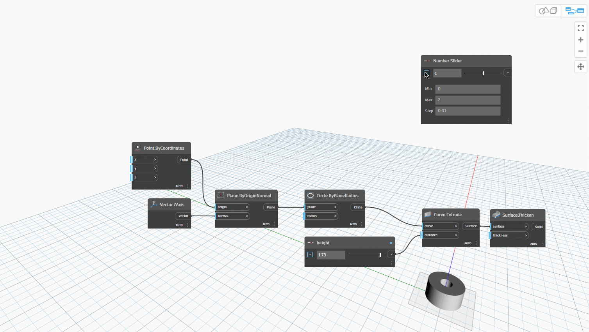
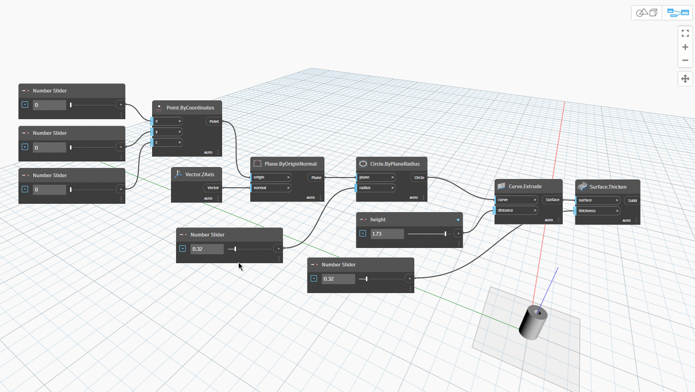

# Data

Data jsou součástí našich programů. Prochází dráty a zadávají vstupy pro uzly, kde se zpracují do nové formy výstupních dat. Pojďme si prohlédnout definici dat, jak jsou strukturována a začít je používat v aplikaci Dynamo.

## Co jsou data?

Data jsou souborem hodnot kvalitativních nebo kvantitativních proměnných. Nejjednodušší forma dat jsou například čísla jako `0`, `3.14` nebo `17`. Data však mohou být také různých typů: proměnná představující měnící se čísla (`height`), znaky (`myName`); geometrii (`Circle`) nebo seznam datových položek (`1,2,3,5,8,13,...`).

V aplikaci Dynamo přidáváme data do vstupních portů uzlů – můžeme mít data bez akcí, ale potřebujeme data ke zpracování akcí, které reprezentují uzly. Pokud do pracovního prostoru přidáme uzel, pokud nebude mít k dispozici žádný vstup, bude výsledkem funkce, nikoli výsledek akce.

> 1. Jednoduchá data
> 2. Data a akce (Uzel A) se úspěšně spustí
> 3. Akce (Uzel A) bez zadání dat vrátí obecnou funkci

### Null – Nedostatek dat

Dávejte pozor na nulové hodnoty. Typ `'null'` představuje nedostatek dat. I když je to abstraktní koncept, pravděpodobně se k němu dostanete při práci s vizuálním programováním. Pokud akce nevytvoří platný výsledek, uzel vrátí hodnotu null.

Testování nulových hodnot a odstraňování nulových hodnot z datové struktury je klíčovou součástí vytváření robustních programů.

| Ikona                                                  | Název/Syntaxe   | Vstupy | Výstupy |
| ----------------------------------------------------- | ------------- | ------ | ------- |
|  | Object.IsNull | obj    | booleovský    |

### Datové struktury

Při vizuálním programování můžeme velmi rychle vygenerovat velké množství dat a vyžadovat způsob správy jejich hierarchie. Jedná se o úlohu datových struktur, organizačních schémat, ve kterých ukládáme data. Specifika datových struktur a způsob jejich použití se liší mezi jednotlivými programovacími jazyky.

V aplikaci Dynamo přidáme hierarchii k datům prostřednictvím seznamů. To prozkoumáme v pozdějších kapitolách, ale začneme jednoduše:

Seznam představuje kolekci položek umístěných do jedné struktury dat:

* Mám pět prstů (_položek_) na ruce (_seznam_).
* Deset domů (_položek_) je na mojí ulici (_seznam_).

> 1. Uzel **Number Sequence** definuje seznam čísel pomocí vstupů _start_, _amount_ a _step_. Pomocí těchto uzlů jsme vytvořili dva samostatné seznamy deseti čísel, z nichž jeden se pohybuje v rozsahu _100–109_ a druhý se pohybuje v rozsahu _0–9_.
> 2. Uzel **List.GetItemAtIndex** slouží k výběru položky v seznamu na určitém indexu. Při výběru hodnoty _0_ se první položka zobrazí v seznamu (v tomto případě _100_).
> 3. Pokud použijeme stejný postup na druhý seznam, získáme hodnotu _0_, první položku v seznamu.
> 4. Nyní sloučíme dva seznamy do jednoho pomocí uzlu **List.Create**. Uzel vytvoří _seznam seznamů._ Tím se změní struktura dat.
> 5. Pokud použijete znovu parametr **List.GetItemAtIndex**, s indexem nastaveným na hodnotu _0_, získáme první řádek seznamu seznamů. To znamená, že se seznam považuje za položku, což se poněkud liší od ostatních skriptovacích jazyků. V pozdějších kapitolách se dostaneme k pokročilejší manipulaci se seznamy a datovými strukturami.

Základní koncept pro pochopení hierarchie dat v aplikaci Dynamo: **S  ohledem na datovou strukturu jsou seznamy považovány za položky.** Jinými slovy, aplikace Dynamo funguje s postupem shora dolů pro pochopení datových struktur. Co to znamená? Pojďme to projít s příkladem.

## Cvičení: Použití dat k vytvoření řetězu válců

> Kliknutím na odkaz níže si stáhněte vzorový soubor.
>
> Úplný seznam vzorových souborů najdete v dodatku.



V tomto prvním příkladu sestavíme válec se skořepinou, který prochází hierarchií geometrie, o níž se v této části pojednává.

### Část I: Nastavení grafu pro jeden válec s některými měnitelnými parametry.

1\. Přidejte uzel **Point.ByCoordinates** – po přidání uzlu na pracovní plochu vidíme bod v počátku osnovy náhledu aplikace Dynamo. Výchozí hodnoty vstupů _x,y_ a _z_ jsou _0.0_, což nám dává bod v tomto umístění.

2\. **Plane.ByOriginNormal** – Dalším krokem v hierarchii geometrie je rovina. Existuje několik způsobů, jak vytvořit rovinu, my pro vstup použijeme počátek a normálu. Počátek je uzel bodu vytvořený v předchozím kroku.

**Vector.ZAxis –** Toto je sjednocený vektor ve směru Z. Všimněte si, že nejsou k dispozici vstupy, pouze vektor o hodnotě [0,0,1]. Toto je vstupní hodnota _normal_ pro uzel **Plane.ByOriginNormal**. Tím se v náhledu aplikace Dynamo zobrazí obdélníková rovina.

3\. **Circle.ByPlaneRadius –** Rozšiřujeme hierarchii. Nyní vytvoříme oblouk z roviny v předchozím kroku. Po zapojení do uzlu se v počátku zobrazí kružnice. Výchozí poloměr v uzlu je hodnota _1_.

4\. **Curve.Extrude –** Teď provedeme vylepšení přidáním hloubky a přechodem do třetího rozměru. Tento uzel vytvoří povrch z křivky jejím vysunutím. Výchozí vzdálenost v uzlu je _1_ a měli bychom ve výřezu vidět válec.

5\. **Surface.Thicken –** Tento uzel nám umožňuje vytvořit uzavřené těleso odsazením povrchu o danou vzdálenost a uzavřením tvaru. Výchozí hodnota tloušťky je _1_ a válec se skořepinou je ve výřezu zobrazen v souladu s těmito hodnotami.

6\. **Number Slider –** Místo použití výchozích hodnot pro všechny tyto vstupy přidejte do modelu parametrický ovládací prvek.

**Domain Edit –** po přidání posuvníku čísla na pracovní plochu klikněte na stříšku v levé horní části a zobrazte možnosti domény.

**Min/Max/Step -** Změňte hodnoty _min_, _max_ a _step_ na _0_,_2_ a _0.01_. Toto provedeme, abychom mohli řídit velikost celkové geometrie.

7\. **Number Sliders –** Ve všech výchozích vstupech zkopírujte a vložte tento posuvník čísla (vyberte posuvník, stiskněte Ctrl+C a pak Ctrl+V) několikrát, dokud nebudou mít všechny vstupy s výchozími hodnotami posuvník. Aby definice fungovala, některé hodnoty posuvníku musí být větší než nula (například k zesílení plochy je potřeba hloubka vysunutí).

8\. Nyní jsme vytvořili parametrický válec se skořepinou s těmito posuvníky. Zkuste některé z těchto parametrů změnit a sledujte, jak se geometrie dynamicky aktualizuje ve výřezu aplikace Dynamo.

**Number Sliders –** Přidali jsme na plochu hodně posuvníků a je potřeba vyčistit rozhraní nástroje, který jsme právě vytvořili. Klikněte pravým tlačítkem na jeden posuvník, vyberte položku Přejmenovat a změňte název každého posuvníku na název odpovídající jeho parametru (Thickness (Tloušťka), Radius (Poloměr), Height (Výška) atd.).

### Část II: Vyplnění pole válců z části I

9\. V tomto okamžiku jsme vytvořili úžasnou věc s rozšiřujícím se válcem. Toto je aktuálně jeden objekt, podívejme se, jak vytvořit pole válců, které zůstávají dynamicky propojeny. Za tímto účelem vytvoříme seznam válců, místo práce s jednou položkou.

**Addition (+) –** Naším cílem je přidat řadu válců vedle válce, který jsme vytvořili. Pokud chceme přidat jeden válec vedle aktuálního válce, je nutné zvážit poloměr válce a tloušťku jeho skořepiny. Toto číslo získáme sečtením dvou hodnot posuvníků.

10\. Tento krok je mnohem náročnější, takže ho projdeme pomalu: cílem je vytvořit seznam čísel, která definují umístění každého válce v řadě.

> a. **Multiplication –** Nejprve chceme vynásobit hodnotu z předchozího kroku hodnotou 2. Hodnota z předchozího kroku představuje poloměr a chceme válec posunout o plný průměr.
>
> b. **Number Sequence –** Pomocí tohoto uzlu vytvoříme pole čísel. První vstup je uzel _multiplication_ z předchozího kroku do hodnoty _step_. Hodnotu _start_ lze nastavit na _0.0_ pomocí uzlu _number_.
>
> c. **Integer Slider –** Pro hodnotu _amount_ připojíme posuvník celého čísla. Tím se definuje počet vytvořených válců.
>
> d. **Output –** Tento seznam zobrazuje vzdálenost přesunutou pro každý válec v poli a je parametricky řízen původními posuvníky.

11\. Tento krok je dostatečně jednoduchý – zadejte posloupnost definovanou v předchozím kroku do vstupu _x_ původního uzlu **Point.ByCoordinates**. Tím nahradíte posuvník _pointX_, který lze odstranit. Nyní se ve výřezu zobrazuje pole válců (zkontrolujte, zda je číslo posuvníku větší než 0).

12\. Řetěz válců je stále dynamicky spojen se všemi posuvníky. Upravte každý posuvník, abyste viděli aktualizaci definice.

