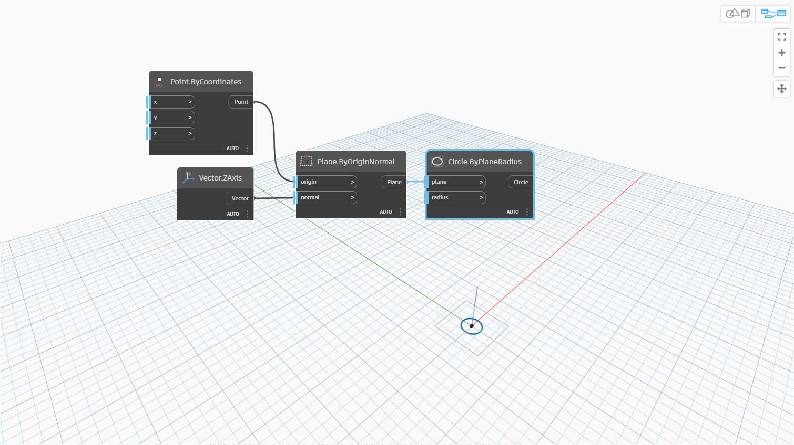
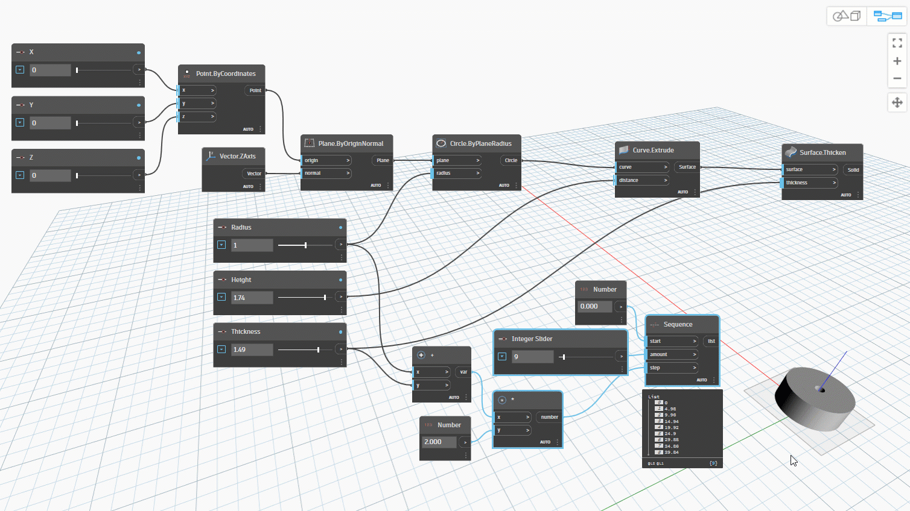

# Dane

Dane są niezbędnym elementem programów. Podróżują przez przewody, trafiając na wejścia węzłów, w których są przetwarzane i przekształcane do nowej postaci — danych wyjściowych. Przeanalizujmy definicję danych, ich strukturę i rozpocznijmy korzystanie z nich w dodatku Dynamo.

## Co to są dane?

Dane to zestaw wartości zmiennych jakościowych lub ilościowych. Najprostszą formą danych są liczby, takie jak `0`, `3.14` lub `17`. Jednak dane mogą być wielu innych typów, jak na przykład zmienna reprezentująca zmieniające się liczby (`height`), znaki (`myName`), geometria (`Circle`) lub lista elementów danych (`1,2,3,5,8,13,...`).

W dodatku Dynamo dodaje się/przekazuje się dane do portów wejściowych węzłów — można mieć dane bez operacji, ale aby przetworzyć operacje reprezentowane przez węzły, dane są niezbędne. Po dodaniu węzła do obszaru roboczego, jeśli nie ma on żadnych wejść, wynik będzie funkcją, a nie wynikiem samej operacji.

> 1. Proste dane
> 2. Pomyślne wykonanie danych i operacji (węzeł A)
> 3. Operacja (węzeł A) bez danych wejściowych zwraca funkcję ogólną

### Null — brak danych

Uwaga: typ `'null'` „null” reprezentuje brak danych. Chociaż jest to pojęcie abstrakcyjne, często można się z nim spotkać podczas pracy z programowaniem wizualnym. Jeśli operacja nie utworzy poprawnego wyniku, węzeł zwróci wartość null.

Testowanie pod kątem wartości null i usuwanie ich ze struktury danych jest kluczową częścią tworzenia skutecznych programów.

| Ikona                                                  | Nazwa/składnia   | Dane wejściowe | Dane wyjściowe |
| ----------------------------------------------------- | ------------- | ------ | ------- |
|  | Object.IsNull | obj    | bool    |

### Struktury danych

Programowanie wizualne umożliwia bardzo szybkie generowanie dużej ilości danych, co może wymagać metod zarządzania ich hierarchią. Taka właśnie jest rola struktur danych, schematów organizacyjnych, w których przechowujemy dane. Specyfika struktur danych i sposób ich używania zależą od konkretnego języka programowania.

W dodatku Dynamo dodajemy hierarchię do danych za pomocą list. Przeanalizujemy to szczegółowo w kolejnych rozdziałach, ale na początek możemy po prostu stwierdzić, że:

Lista reprezentuje kolekcję elementów umieszczonych w jednej strukturze danych:

* Mam pięć palców (_elementy_) dłoni (_lista_).
* Na mojej ulicy (_lista_) jest dziesięć domów (_elementy_).

> 1. Węzeł **Number Sequence** definiuje listę liczb za pomocą wejść _start_, _amount_ i _step_. Za pomocą tych węzłów utworzyliśmy dwie oddzielne listy dziesięciu liczb, jedna z nich obejmuje liczby _100–109_, a druga — _0–9_.
> 2. Węzeł **List.GetItemAtIndex** wybiera element z listy o określonym indeksie. W przypadku wybrania indeksu _0_ pobieramy pierwszy element z listy (w tym przypadku _100_).
> 3. Stosując ten sam proces do drugiej listy, otrzymujemy wartość _0_, czyli pierwszy element na liście.
> 4. Teraz scalamy dwie listy w jedną, używając węzła **List.Create**. Warto zauważyć, że węzeł tworzy _listę list_. Powoduje to zmianę struktury danych.
> 5. Teraz gdy ponownie użyjemy węzła **List.GetItemAtIndex** z indeksem _0_, pobierzemy pierwszą listę na liście list. Oznacza to, że lista jest traktowana jak element — stanowi to pewną różnicę w porównaniu z innymi językami skryptowymi. W kolejnych rozdziałach bardziej szczegółowo zajmiemy się manipulowaniem listami i strukturami danych.

Kluczowe pojęcie hierarchii danych w dodatku Dynamo, które należy zrozumieć: **w odniesieniu do struktury danych listy są traktowane jak elementy.** Innymi słowy, analizując strukturę danych, dodatek Dynamo stosuje proces „od góry do dołu”. Co to oznacza? Przeanalizujmy to na przykładzie.

## Ćwiczenie: używanie danych do tworzenia łańcucha walców

> Pobierz plik przykładowy, klikając poniższe łącze.
>
> Pełna lista plików przykładowych znajduje się w załączniku.



W pierwszym przykładzie złożymy walec z powłoką, stosując hierarchię geometrii opisaną w tej sekcji.

### Część I. Konfigurowanie wykresu dla jednego walca z pewnymi zmieniającymi się parametrami.

1\. Dodaj węzeł **Point.ByCoordinates**. Po dodaniu węzła do obszaru rysunku widać punkt w początku siatki podglądu dodatku Dynamo. Domyślne wartości wejść _x, y_ i _z_ to _0,0_, co daje punkt w tym położeniu.

2\. **Plane.ByOriginNormal —** następny krok w hierarchii geometrii to płaszczyzna. Istnieje kilka sposobów skonstruowania płaszczyzny — użyjemy dla wejścia pozycji origin i normal. Origin (początek) to węzeł punktu utworzony w poprzednim kroku.

**Vector.ZAxis —** jest to wektor jednostkowy w kierunku z. Warto zwrócić uwagę, że nie ma wejść, tylko wektor o wartości [0,0,1]. Użyjemy go jako wejścia _normal_ dla węzła **Plane.ByOriginNormal**. Pozwala to uzyskać prostokątną płaszczyznę w podglądzie dodatku Dynamo.

3\. **Circle.ByPlaneRadius —** dodając następny etap w hierarchii, tworzymy teraz krzywą z płaszczyzny w poprzednim kroku. Po utworzeniu podłączenia do węzła uzyskujemy okrąg w początku. Domyślna wartość promienia (radius) węzła wynosi _1_.

4\. **Curve.Extrude —** teraz dodamy temu elementowi wyrazu, nadając mu głębię i dodając trzeci wymiar. Ten węzeł tworzy powierzchnię z krzywej poprzez jej wyciągnięcie. Domyślna odległość w węźle wynosi _1_, a w rzutni powinien być widoczny walec.

5\. **Surface.Thicken —** ten węzeł umożliwia uzyskanie zamkniętej bryły przez odsunięcie powierzchni o określoną odległość i zamknięcie formy. Domyślna wartość grubości wynosi _1_, a w rzutni widoczny jest walec z powłoką, zgodny z tymi wartościami.

6\. **Number Slider —** zamiast używać domyślnych wartości dla wszystkich tych wejść, dodajmy do modelu kontrolę parametryczną.

**Domain Edit —** po dodaniu do obszaru rysunku węzła Number Slider kliknij daszek w lewym górnym rogu, aby wyświetlić opcje domeny.

**Min/Max/Step —** zmień wartości _min_, _max_ i _step_ na odpowiednio _0_, _2_ i _0,01_. Umożliwia to sterowanie wielkością całkowitej geometrii.

7\. **Węzły Number Slider —** we wszystkich domyślnych wejściach skopiujmy i wklejmy kilka razy ten suwak liczby (wybierz suwak, naciśnij klawisze Ctrl+C, a następnie klawisze Ctrl+V), tak aby wszystkie wejścia z domyślnymi wartościami miały zamiast nich suwaki. Niektóre z wartości suwaka muszą być większe od zera, aby definicja działała (na przykład potrzebna jest głębokość wyciągnięcia w celu pogrubienia powierzchni).

8\. Za pomocą tych suwaków utworzyliśmy teraz parametryczny walec z powłoką. Spróbuj zmieniać niektóre z tych parametrów i obserwuj, jak geometria jest aktualizowana dynamicznie w rzutni dodatku Dynamo.

**Węzły Number Slider —** w ramach kontynuacji dodaliśmy wiele suwaków do obszaru rysunku i musimy oczyścić interfejs właśnie utworzonego narzędzia. Kliknij prawym przyciskiem myszy jeden suwak, wybierz polecenie „Zmień nazwę” i zmień nazwę każdego suwaka na odpowiednią dla danego parametru (thickness — „grubość”, Radius — „promień”, Height — „wysokość” itp.).

### Część II. Wypełnianie szyku walców z części I

9\. W tym momencie mamy już utworzony wspaniały walec z pogrubieniem. Obecnie jest to jeden obiekt. Przyjrzyjmy się temu, jak utworzyć szyk walców pozostających dynamicznie połączonych. W tym celu utworzymy listę walców, zamiast pracować z pojedynczym elementem.

**Dodawanie (+) —** naszym celem jest dodanie wiersza walców obok utworzonego walca. Aby dodać jeden walec przylegający do bieżącego, musimy uwzględnić zarówno promień walca, jak i grubość jego powłoki. Uzyskamy tę liczbę przez dodanie dwóch wartości suwaków.

10\. Ten krok jest trudniejszy, więc przeanalizujmy go powoli: celem końcowym jest utworzenie listy liczb definiujących położenie każdego walca w wierszu.

> a. **Mnożenie —** najpierw pomnożymy wartość z poprzedniego kroku przez 2. Wartość z poprzedniego kroku reprezentuje promień. Chcemy przesunąć walec o pełną średnicę.
>
> b. **Number Sequence —** za pomocą tego węzła tworzymy szyk liczb. Pierwsze wejście to węzeł mnożenia (_multiplication_) z poprzedniego kroku skierowany do wartości _step_. Wartość _start_ można ustawić na _0,0_ za pomocą węzła _number_.
>
> c. **Integer Slider** — w przypadku wartości _amount_ połączymy suwak liczby całkowitej. Określi to liczbę utworzonych walców.
>
> d. **Output** — na tej liście znajduje się przesunięcie każdego walca w szyku i jest ona parametrycznie sterowana przez oryginalne suwaki.

11\. Ten krok jest prosty — podłącz sekwencję zdefiniowaną w poprzednim kroku do wejścia _x_ oryginalnego węzła **Point.ByCoordinates**. Spowoduje to zastąpienie suwaka _pointX_, który można usunąć. Teraz widzimy szyk walców w rzutni (upewnij się, że suwak liczby całkowitej ma wartość większą niż 0).

12\. Łańcuch cylindrów jest nadal dynamicznie połączony ze wszystkimi suwakami. Zmieniaj wartości poszczególnych suwaków i obserwuj aktualizację definicji.

