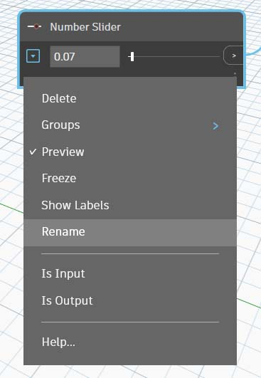

# “数据”

数据是我们程序的内容。它穿过连线，为节点提供输入，在这些节点中处理为新形式的输出数据。让我们回顾一下数据的定义、数据的结构，然后开始在 Dynamo 中使用它。

## 什么是数据？

数据是一组定性变量或定量变量的值。最简单形式的数据是数字，如 `0`、`3.14` 或 `17`。但数据也可以是多种不同的类型：表示变化数字的变量 (`height`)；字符 (`myName`)；几何图形 (`Circle`)；或一列数据项 (`1,2,3,5,8,13,...`)。

在 Dynamo 中，我们会向节点的输入端口添加/提供数据 - 我们可以具有无需操作的数据，但我们需要数据来处理节点表示的操作。将某个节点添加到工作空间后，如果未提供任何输入，则结果将为函数，而不是操作本身的结果。

> 1. 简单数据
> 2. 数据和操作（A 节点）成功执行
> 3. 没有数据输入的操作（A 节点）返回通用函数

### 空值 - 缺少数据

注意空值，`'null'` 类型表示缺少数据。尽管这是一个抽象概念，但在使用可视化编程时，您可能会遇到这种情况。如果某个操作未创建有效结果，则节点会返回空值。

测试空值并从数据结构中删除空值是创建健壮程序的关键部分。

| 图标                                                  | 名称/语法   | 输入(Inputs) | 输出 |
| ----------------------------------------------------- | ------------- | ------ | ------- |
|  | Object.IsNull | obj    | bool    |

### 数据结构

在进行可视化编程时，我们可以非常快速地生成大量数据，并需要一种方式来管理其层次结构。这是数据结构的作用，也是我们存储数据的组织方案。数据结构的具体内容及其使用方法具体取决于编程语言。

在 Dynamo 中，我们通过列表向数据添加层次结构。我们将在后续章节中深入探讨这一点，但先让我们简单介绍一下：

列表表示放置在一个数据结构中的项目集合：

* 我手（_列表_）上有五根手指（_项目_）。
* 我的街道（_列表_）上有十座房屋（_项目_）。

> 1. **“Number Sequence”** 节点使用 _“start”_ 、 _“amount”_ 和 _“step”_ 输入来定义一列数字。使用这些节点，我们创建了两个包含十个数字的单独列表，一个列表的范围为 _100-109_，另一列表的范围为 _0-9_。
> 2. **“List.GetItemAtIndex”** 节点会选择列表中特定索引处的项目。选择 _“0”_ 时，我们会得到列表中的第一项（在本例中为 _“100”_ ）。
> 3. 通过将相同过程应用于第二个列表，得到的值为 _“0”_，即列表中的第一项。
> 4. 现在，我们使用 **“List.Create”** 节点将这两个列表合并为一个列表。请注意，该节点将创建 _一列列表_ 。这会更改数据的结构。
> 5. 再次使用 **“List.GetItemAtIndex”** 时，如果索引设置为 _“0”_，则我们将获得该列列表中的第一个列表。这就是将列表视为项目的含义，这与其他脚本编写语言略有不同。在后面的章节中，我们将通过列表操作和数据结构获得更高级的功能。

在 Dynamo 中了解数据层次结构的关键概念：**在数据结构方面，列表被视为项目**。换句话说，Dynamo 通过自上而下的过程来了解数据结构。这意味着什么？我们通过一个示例来介绍它。

## 练习：使用数据创建圆柱体链

> 单击下面的链接下载示例文件。
>
> 可以在附录中找到示例文件的完整列表。



在此第一个示例中，我们装配了一个带壳圆柱体，该圆柱体遍历本节中讨论的几何图像层次结构。

### 第 I 部分：使用一些可更改的参数为一个圆柱体设置图形。

1.添加 **“Point.ByCoordinates”** \- 向画布添加节点后，我们会在 Dynamo 预览栅格的原点处看到一个点。_“x,y”_和_“z”_输入的默认值为_“0.0”_，从而在此位置处向我们提供一个点。

2\.**Plane.ByOriginNormal** \- 几何图形层次结构中的下一步是平面。有几种构建平面的方法，我们使用原点和法线作为输入。原点是在上一步中创建的点节点。

**Vector.ZAxis** \- 这是 Z 方向上单位化的向量。请注意，没有输入，仅有值为 [0,0,1] 的向量。我们将此项用作 **“Plane.ByOriginNormal”** 节点的 _“normal”_ 输入。这样，我们在 Dynamo 预览中就得到了一个矩形平面。

3\.**Circle.ByPlaneRadius** \- 逐步扩展层次结构，我们现在基于上一步中的平面创建曲线。在连接到节点后，我们会在原点处得到一个圆。节点上的默认半径值为 _“1”_。

4\.**Curve.Extrude** \- 现在，我们通过增加其深度并进入第三维，使该内容弹出。该节点基于曲线创建曲面，方法是拉伸该曲线。节点上的默认距离为 _“1”_，应该可以在视口中看到一个圆柱体。

5\.**Surface.Thicken** \- 此节点通过将曲面偏移给定距离并闭合形状，从而为我们提供一个闭合实体。默认厚度值为 _“1”_，我们会在视口中看到一个与这些值对应的带壳圆柱体。

6\.**数字滑块** \- 我们不使用所有这些输入的默认值，而是向模型添加一些参数化控件。

**域编辑** \- 在向画布添加数字滑块后，单击左上角的插入符号可显示域选项。

**最大值/最小值/步长** \- 将 _“min”_ 、 _“max”_ 和 _“step”_ 值分别更改为 _“0”_ 、 _“2”_ 和 _“0.01”_。我们这样做的目的是控制整个几何图形的大小。

7\.**数字滑块** \- 在所有默认输入中，我们复制并粘贴此数字滑块（选择滑块、按 Ctrl+C，然后按 Ctrl+V）多次，直到具有默认值的所有输入都有滑块为止。某些滑块值必须大于零，才能使定义生效（即：需要拉伸深度才能加厚曲面）。

8\.现在，我们已使用这些滑块创建参数化带壳圆柱体。尝试调整其中一些参数，然后在 Dynamo 视口中动态查看几何图形更新。

**数字滑块** \- 更进一步对此进行介绍，我们已向画布添加了很多滑块，并且需要清理刚刚创建的工具的界面。在一个滑块上单击鼠标右键、选择“重命名...”，然后将每个滑块更改为其参数的相应名称（厚度、半径、高度等）。

### 第 II 部分：基于第 I 部分填充圆柱体阵列

9\.此时，我们创建了一个令人惊叹的加厚圆柱体。目前，这是一个对象，让我们来看看如何创建一个圆柱体阵列，其中圆柱体保持动态链接。为此，我们将创建一列圆柱体，而不是使用单个项。

**加(+)** \- 我们的目的是在创建的圆柱体旁边添加一排圆柱体。如果要添加一个与当前圆柱体相邻的圆柱体，我们需要考虑圆柱体的半径及其壳厚度。通过添加滑块的两个值，可得到此数字。

10\.该步骤更加复杂，因此让我们缓慢地逐步介绍：最终目的是创建一列数字，用于定义每个圆柱体在一排中的位置。

> a.**相乘** \- 首先，我们要将上一步中的值乘以 2。上一步中的值表示半径，我们希望将圆柱体移动整个直径。
>
> b.**数字序列** \- 使用此节点创建数字数组。第一个输入是上一步中的 _“multiplication”_ 节点到 _“step”_ 值。可以使用 _“number”_ 节点将 _“start”_ 值设置为 _“0.0”_。
>
> c.**整数滑块** \- 对于 _“amount”_ 值，我们会连接整数滑块。这将定义创建多少个圆柱体。
>
> d.**输出** \- 此列表显示阵列中每个圆柱体移动的距离，并由原始滑块以参数化方式驱动。

11\.此步骤足够简单 - 将上一步中定义的序列连接到原始 **“Point.ByCoordinates”** 的 _“x”_ 输入。这将替换可以删除的滑块 _“pointX”_。现在，在视口中可以看到圆柱体阵列（确保整数滑块大于 0）。

12\.圆柱体链仍与所有滑块动态链接。调整每个滑块以观察定义更新！

