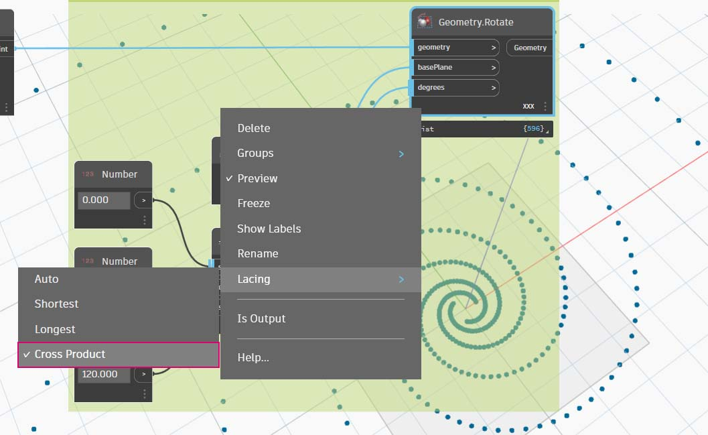

# 数学的方法

データの最も単純な形式が数値だとするならば、数値を関連づける最も簡単な方法は数学的方法を活用することです。割り算のような単純な演算子から、三角関数などの複雑な計算式まで、数学的方法は数値の関係とパターンを調べるための非常に便利な方法です。

### 算術演算子

演算子は、代数関数と 2 つの入力値を組み合わせて使用する一連のコンポーネントであり、1 つの出力値を生成します(加算、減産、乗算、除算など)。演算子は、[Operators] > [Actions]で使用できます。

| アイコン                                                  | 名前(構文)     | 入力                     | 出力      |
| ----------------------------------------------------- | ----------------- | -------------------------- | ------------ |
| (1) (1) (1).jpg>)       | 加算(**+**)       | var[]...[], var[]...[] | var[]...[] |
| (1) (1) (1).jpg>)    | 減算(**-**)  | var[]...[], var[]...[] | var[]...[] |
| (1) (1) (1).jpg>) | 乗算(*) | var[]...[], var[]...[] | var[]...[] |
| (1) (1) (1).jpg>)       | 除算(**/**)    | var[]...[], var[]...[] | var[]...[] |

## 演習: 黄金螺旋式

> 下のリンクをクリックして、サンプル ファイルをダウンロードします。
>
> すべてのサンプル ファイルの一覧については、付録を参照してください。



### パート I: パラメータ式

演算子と変数を組み合わせて、**式**を使用してより複雑な関係を形成します。スライダを使用して、入力パラメータでコントロールできる式を作成します。

1. パラメータ式内の「t」を表す数列を作成しますので、らせん構造を定義するのに十分な大きさがあるリストを使用します。

**Number Sequence** ノードで、_start、amount_、_step_ という 3 つの入力に基づいて数列を定義します。

2\.上記の手順により、パラメータ領域を定義するための数値のリストが作成されます。次に、黄金螺旋式を表すノードのグループを作成します。

黄金螺旋は、次の等式として定義されます。

$$
x = r cos θ = a cos θ e^{bθ}
$$

$$
y = r sin θ = a sin θe^{bθ}
$$

次の図は、ビジュアル プログラミング形式の黄金螺旋を表しています。ここからは、順を追ってノード グループを確認していきます。ビジュアル プログラムと記述形式の等式との相違点に注意してください。

> a.**Number Slider** ノードを使用して、キャンバスに 2 つの数値スライダを追加します。これらのスライダは、パラメータ式の変数である「_a_」と「_b_」を表します。これらの変数は、柔軟に変化する定数や、必要な結果に合わせて調整可能なパラメータを表します。
>
> b.**Multiplication (*)** ノードはアスタリスクで表されます。このノードを繰り返し使用して、乗算変数を接続します。
>
> c.**Math.RadiansToDegrees** ノードで「_t_」の値を角度に変換して、三角関数内でその角度を評価します。Dynamo では、三角関数の評価には角度が既定で使用されます。
>
> d.**Math.Pow** ノードは、「_t_」および数値「_e_」の関数として動作し、フィボナッチ数列を作成します。
>
> e.**Math.Cos と Math.Sin** ノードは、三角関数です。パラメータ指定の各点の X 座標と Y 座標を識別します。
>
> f.**Watch** ノードで、出力値として 2 つのリストが生成されたことを確認します。これらのリストが、らせんの生成に使用される点群の _x_ 座標と _y_ 座標になります。

### パート II: 計算式からジオメトリへ

上記の手順でも問題なく機能しますが、多数のノードを使用するため、手間がかかります。より効率的なワークフローを作成するには、[DesignScript](../../8_coding_in_dynamo/8-1_code-blocks-and-design-script/2-design-script-syntax.md) を確認し、Dynamo 表現の文字列を 1 つのノード内に定義します。次の手順では、パラメータ式を使用してフィボナッチ曲線を描画する方法について確認します。

**Point.ByCoordinates** ノードの _x_ 入力に上部の乗算ノードを接続し、_y_ 入力に下部の乗算ノードを接続します。この操作により、パラメータで制御された点群のらせん構造が画面上に表示されます。

**Polycurve.ByPoints** ノードは、前のステップの **Point.ByCoordinates** を _points_ に接続します。ここでは閉曲線は作成しないため、_connectLastToFirst_ 入力には何も接続しなくてかまいません。この操作により、前の手順で定義した各点を通過するらせん構造が作成されます。

これで、フィボナッチ曲線が作成されました。ここからは、2 つの演習で「オウムガイ」と「ヒマワリ」を作成してみましょう。これらは自然界にみられる形状を抽象的に表しているばかりではなく、フィボナッチ曲線の 2 つの異なる適用例を的確に表現しています。

### パート III: らせん構造からオウムガイへ

円弧を作成するための **Circle.ByCenterPointRadius** ノードの入力ポートに、前の手順と同じ値を接続します。radius 入力の値は既定で _1.0_ に設定されているため、出力として円弧が即座に表示されます。点群が基準点から遠ざかっていく様子がよくわかります。

**数列**のノード グループは「_t_」の元の配列です。これを **Circle.ByCenterPointRadius** の radius 入力に接続すると、円弧の中心は基準点から離れていきますが、円の半径は次第に長くなっていき、特長的な形状のらせん構造が作成されます。

余裕があれば、これを 3D に変換してみてください。

### パート IV: オウムガイから螺旋葉序へ

ここまでの手順では、円弧を重ねたオウムガイのような形状を作成しました。次に、パラメータ制御のグリッドを使用してみましょう。ここでは、フィボナッチ曲線の基本的ならせんを使用して、フィボナッチ グリッドを作成していきます。結果として、[ヒマワリ](https://blogs.unimelb.edu.au/sciencecommunication/2018/09/02/this-flower-uses-maths-to-reproduce/)のようならせん形状が作成されます。

最初に、前の演習と同じ手順を実行します。**Point.ByCoordinates** ノードを使用して、点群をらせん状に並べた配列を作成します。

<figure><figcaption></figcaption></figure>

次に、これらの手順に従って、さまざまな回転の一連のらせんを生成します。

> a.**Geometry.Rotate** ノードには、同じ名前のノードが複数存在します。_geometry_、_basePlane_、_degrees_ という入力を持つ **Geometry.Rotate** ノードを選択してください。geometry 入力に **Point.ByCoordinates** ノードを接続します。このノードを右クリックして、レーシングが「直積」に設定されていることを確認します。
>
> 
>
> b.**Plane.XY** ノードを _basePlane_ 入力に接続します。これにより、基準点に向かって回り込んでいくように点が描画されます。基準点の位置は、らせんの基準の位置と同じです。
>
> c.**Number Range** ノードで角度を入力することにより、複数の巻き筋を作成します。**Number Range** コンポーネントを使用すると、この操作をすばやく実行することができます。このコンポーネントを _degrees_ 入力に接続します。
>
> d.**Number** ノードをキャンバスに 3 つ追加して縦に並べ、数値の範囲を定義します。上から下に、それぞれ _0.0、360.0_、_120.0_ の値を割り当てます。これらの値により、らせんの巻き筋が制御されます。**Number Range** ノードに 3 つの Number ノードを接続すると、結果が出力されます。

出力結果が渦の流れのようになってきました。**Number Range** パラメータの一部を調整して、出力結果がどのように変わるか確認してみましょう。

**Number Range** ノードの step の入力値を _120.0_ から _36.0_ に変更します。この操作により、巻き筋の数が増え、グリッドの密度が上がります

**Number Range** ノードの step の入力値を _36.0_ から _3.6_ に変更します。この操作により、グリッドの密度が大幅に上がり、螺旋の方向が不明瞭になります。これで、ヒマワリが完成しました。

