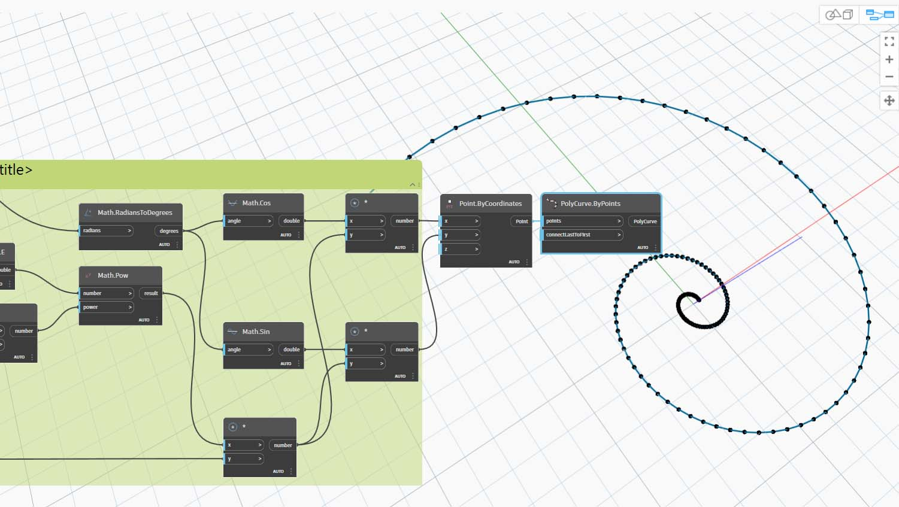
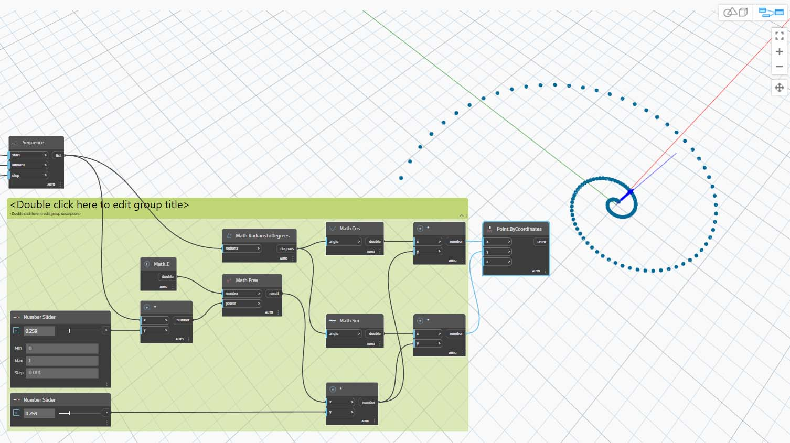
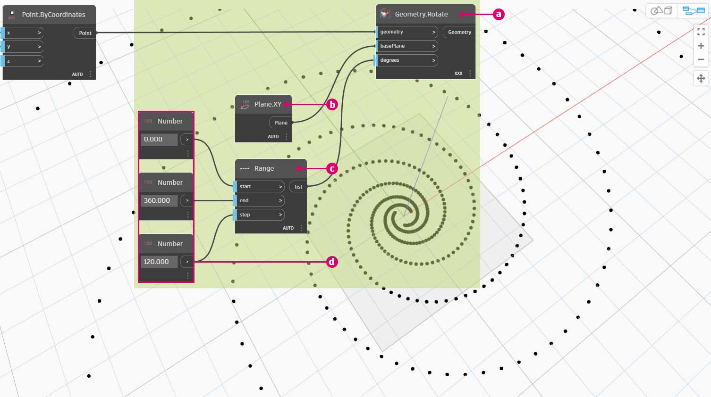

# Matemática

Se a forma mais simples de dados forem os números, a forma mais fácil de relacionar esses números será através da matemática. De operadores simples, como dividir até funções trigonométricas, ou fórmulas mais complexas, a matemática é uma ótima forma de começar a explorar as relações e os padrões numéricos.

### Operadores aritméticos

Os operadores são um conjunto de componentes que usam funções algébricas com dois valores de entrada numéricos, o que resulta em um valor de saída (adição, subtração, multiplicação, divisão etc.). Eles podem ser encontrados em Operadores>Ações.

| Ícone                                                  | Nome (Sintaxe)     | Entradas                     | Saídas      |
| ----------------------------------------------------- | ----------------- | -------------------------- | ------------ |
| (1) (1) (1).jpg>)       | Adicionar (**+**)       | var[]...[], var[]...[] | var[]...[] |
| (1) (1) (1).jpg>)    | Subtrair (**-**)  | var[]...[], var[]...[] | var[]...[] |
| (1) (1) (1).jpg>) | Multiplicar (*) | var[]...[], var[]...[] | var[]...[] |
| (1) (1) (1).jpg>)       | Dividir (**/**)    | var[]...[], var[]...[] | var[]...[] |

## Exercício: Fórmula da espiral dourada

> Faça o download do arquivo de exemplo clicando no link abaixo.
>
> É possível encontrar uma lista completa de arquivos de exemplo no Apêndice.



### Parte I: Fórmula paramétrica

Combine operadores e variáveis para formar uma relação mais complexa através de **Fórmulas**. Use os controles deslizantes para criar uma fórmula que pode ser controlada com parâmetros de entrada.

1. Crie a sequência de números que representa o “t” na equação paramétrica; portanto, queremos usar uma lista suficientemente grande para definir uma espiral.

**Sequência de números:** defina uma sequência de números com base em três entradas: _início, quantidade_ e _etapa_.

2\. A etapa acima criou uma lista de números para definir o domínio paramétrico. Em seguida, crie um grupo de nós que representa a equação da espiral dourada.

A espiral dourada é definida como a equação:

$$
x = r cos θ = a cos θ e^{bθ}
$$

$$
y = r sin θ = a sin θe^{bθ}
$$

A imagem abaixo representa a espiral dourada na forma de programação visual. Quando você percorrer o grupo de nós, tente prestar atenção ao paralelo entre o programa visual e a equação escrita.

> a. **Controle deslizante de número**: adicione dois controles deslizantes de número à tela. Esses controles deslizantes representarão as variáveis _a_ e _b_ da equação paramétrica. Eles representam uma constante que é flexível ou parâmetros que podem ser ajustados para um resultado desejado.
>
> b. **Multiplicação (*)**: o nó de multiplicação é representado por um asterisco. Usaremos isso repetidamente para conectar variáveis de multiplicação.
>
> c. **Math.RadiansToDegrees**: os valores “_t_” precisam ser convertidos em graus para sua avaliação nas funções trigonométricas. Lembre-se de que o Dynamo usa como padrão a unidade de graus para avaliar essas funções.
>
> d. **Math.Pow**: como uma função de “_t_” e o número “_e_” que cria a sequência de Fibonacci.
>
> e. **Math.Cos e Math.Sin**: essas duas funções trigonométricas diferenciarão a coordenada x e a coordenada y, respectivamente, de cada ponto paramétrico.
>
> f. **Inspeção**: agora vemos que nossa saída é formada por duas listas, que serão as coordenadas _x_ e _y_ dos pontos usados para gerar a espiral.

### Parte II: Da fórmula à geometria

Agora a maioria dos nós da etapa anterior funcionará bem, mas isso requer muito trabalho. Para criar um fluxo de trabalho mais eficiente, observe o [DesignScript](../../8_coding_in_dynamo/8-1_code-blocks-and-design-script/2-design-script-syntax.md) para definir uma sequência de caracteres de expressões do Dynamo em um nó. Nesta próxima série de etapas, vamos analisar o uso da equação paramétrica para desenhar a espiral de Fibonacci.

**Point.ByCoordinates:** conecte o nó de multiplicação superior à entrada “_x_” e a parte inferior à entrada “_y_”. Agora vemos uma espiral paramétrica de pontos na tela.

**Polycurve.ByPoints:** conecte **Point.ByCoordinates** da etapa anterior a _pontos_. Podemos deixar _connectLastToFirst_ sem entrada porque não estamos criando uma curva fechada. Isso cria uma espiral que passa por cada ponto definido na etapa anterior.

Agora concluímos a espiral de Fibonacci. A partir daqui, vamos aprofundar isso em dois exercícios separados, que chamaremos de nautiloide e girassol. Esses são abstrações de sistemas naturais, mas os dois aplicativos diferentes da espiral de Fibonacci serão bem representados.

### Parte III: Da espiral ao nautiloide

**Circle.ByCenterPointRadius:** vamos usar um nó de círculo aqui com as mesmas entradas da etapa anterior. O valor do raio tem como padrão _1,0_, de modo que vemos uma saída imediata de círculos. Torna-se imediatamente legível como os pontos se afastam da origem.

**Sequência de números:** essa é a matriz original de “_t_”. Conectando isso ao valor do raio de **Circle.ByCenterPointRadius**, os centros do círculo ainda ficam bastante afastados da origem, mas o raio dos círculos está aumentando, criando um gráfico de círculo de Fibonacci moderno.

Você ganhará pontos de bônus se fizer em 3D.

### Parte IV: Do nautiloide à filotaxia

Agora que fizemos uma casca circular nautiloide, vamos passar para os eixos paramétricos. Vamos usar uma rotação básica na espiral de Fibonacci para criar um eixo de Fibonacci, e o resultado é modelado de acordo com o [crescimento de sementes de girassol](https://blogs.unimelb.edu.au/sciencecommunication/2018/09/02/this-flower-uses-maths-to-reproduce/).

Como ponto de partida, vamos começar com a mesma etapa do exercício anterior: criar uma matriz de espiral de pontos com o nó **Point.ByCoordinates**.

<figure><figcaption></figcaption></figure>

Em seguida, siga estas minietapas para gerar uma série de espirais em várias rotações.

> a. **Geometry.Rotate:** há diversas opções de **Geometry.Rotate**; assegure-se de que você selecionou o nó com _geometry_,_basePlane_ e _degrees_ como entradas. Conecte **Point.ByCoordinates** à entrada da geometria. Clique com o botão direito do mouse nesse nó e verifique se a amarra está definida como “Produto transversal”
>
> 
>
> b. **Plane.XY:** conecte à entrada _basePlane_. Vamos rotacionar em torno da origem, que é a mesma localização da base da espiral.
>
> c. **Intervalo de números:** para nossa entrada de graus, desejamos criar várias rotações. Podemos fazer isso rapidamente com um componente do **Intervalo de números**. Conecte isso à entrada _graus_.
>
> d. **Número:** para definir o intervalo de números, adicione três nós de número à tela na ordem vertical. De cima para baixo, atribua valores de _0,0,360,0,_ e _120,0_, respectivamente. Esses valores controlam a rotação da espiral. Observe os resultados de saída no nó **Intervalo de números** após conectar os três nós de número ao nó.

Nossa saída está começando a se parecer com um redemoinho. Vamos ajustar alguns dos parâmetros de **Intervalo de números** e ver como os resultados mudam.

Altere o tamanho da etapa do nó **Intervalo de números** de _120,0_ para _36,0_. Observe que isso está criando mais rotações e, portanto, nos oferece um eixo mais denso.

Altere o tamanho da etapa do nó **Intervalo de números** de _36,0_ para _3,6_. Isso nos oferece agora um eixo muito mais denso, e a direcionalidade da espiral é pouca clara. Senhoras e senhores, criamos um girassol.

