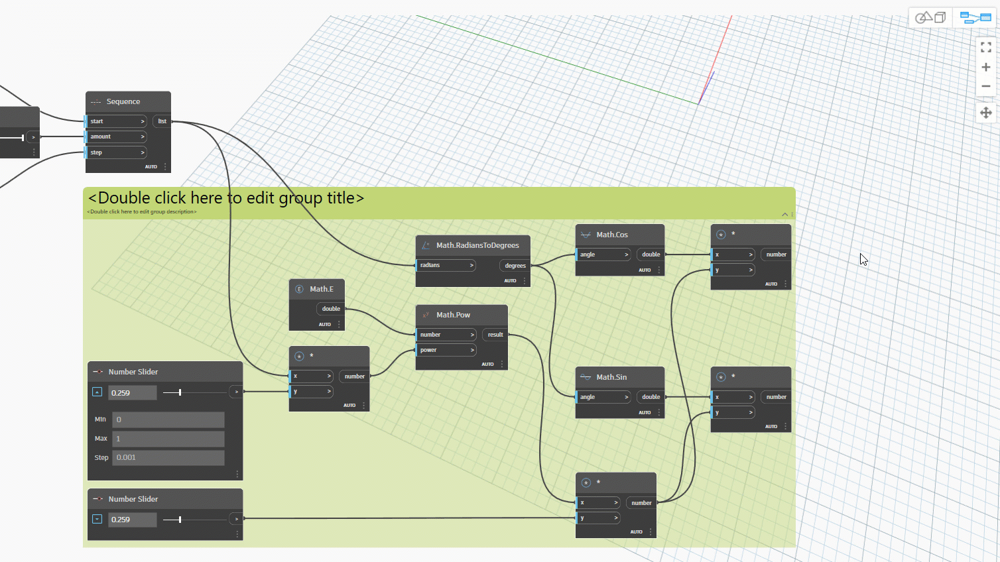
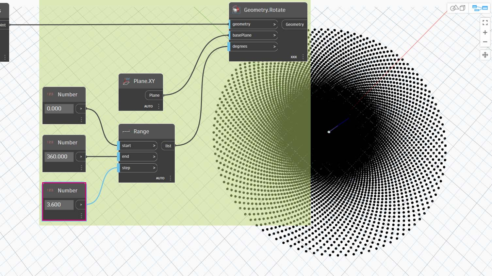

# Matematica

Se il formato più semplice di dati è rappresentato dai numeri, il modo più semplice per correlare tali numeri è la matematica. Dai semplici operatori come la divisione fino alle funzioni trigonometriche e alle formule più complesse, la matematica è un ottimo modo per iniziare ad esplorare relazioni e modelli numerici.

### Operatori aritmetici

Gli operatori sono un insieme di componenti che utilizzano funzioni algebriche con due valori di input numerico, che producono un valore di output (addizione, sottrazione, moltiplicazione, divisione e così via). Questi sono disponibili in Operators > Actions.

| Icona                                                | Nome (Sintassi)     | Input                     | Output      |
| --------------------------------------------------- | ----------------- | -------------------------- | ------------ |
|        | Add (**+**)       | var[]...[], var[]...[] | var[]...[] |
|     | Subtract (**-**)  | var[]...[], var[]...[] | var[]...[] |
|  | Multiply ( ***** ) | var[]...[], var[]...[] | var[]...[] |
|        | Divide (**/**)    | var[]...[], var[]...[] | var[]...[] |

## Esercizio: Formula della spirale aurea

> Scaricare il file di esempio facendo clic sul collegamento seguente.
>
> Un elenco completo di file di esempio è disponibile nell'Appendice.



### Parte I: Formula parametrica

Combinare operatori e variabili per formare una relazione più complessa mediante le **formule**. Utilizzare i dispositivi di scorrimento per creare una formula che possa essere controllata con i parametri di input.

1\. Creare una sequenza di numeri che rappresenta la "t" nell'equazione parametrica, pertanto si desidera utilizzare un elenco di dimensioni sufficienti per definire una spirale.

**Number Sequence:** definire una sequenza di numeri in base a tre input: _start, amount_ e _step_.

2\. Con il passaggio precedente è stato creato un elenco di numeri per definire il dominio parametrico. Quindi, creare un gruppo di nodi che rappresenta l'equazione della spirale aurea.

La spirale aurea viene definita come l'equazione:

$$ x = r cos θ = a cos θ e^{bθ} $$

$$ y = r sin θ = a sin θe^{bθ} $$

L'immagine seguente rappresenta la spirale aurea sotto forma di programmazione visiva. Quando si scorre il gruppo di nodi, provare a prestare attenzione al parallelo tra il programma visivo e l'equazione scritta.

> a. **Number Slider:** aggiungere due dispositivi di scorrimento numerici all'area di disegno. Questi dispositivi di scorrimento rappresenteranno le variabili _a_ e _b_ dell'equazione parametrica. Rappresentano una costante flessibile o parametri che è possibile regolare per ottenere il risultato desiderato.
>
> b. **Multiplication (*)**: il nodo della moltiplicazione è rappresentato da un asterisco. Questa opzione verrà utilizzata ripetutamente per collegare le variabili della moltiplicazione.
>
> c. **Math.RadiansToDegrees:** i valori "_t_" devono essere convertiti in gradi per la loro valutazione nelle funzioni trigonometriche. Tenere presente che, in Dynamo, per default vengono utilizzati i gradi per valutare queste funzioni.
>
> d. **Math.Pow:** come funzione di "_t_" e del numero "_e_" si crea la sequenza di Fibonacci.
>
> e. **Math.Cos e Math.Sin:** queste due funzioni trigonometriche differenziano rispettivamente la coordinata x e la coordinata y di ogni punto parametrico.
>
> f. **Watch:** ora è possibile vedere che l'output comprende due elenchi, che saranno le coordinate _x_ e _y_ dei punti utilizzati per generare la spirale.

### Parte II: Dalla formula alla geometria

Ora, la maggior parte dei nodi del passaggio precedente funzionerà correttamente, ma richiede molto lavoro. Per creare un workflow più efficiente, esaminare [DesignScript ](../../8\_coding\_in\_dynamo/8-1\_code-blocks-and-design-script/2-design-script-syntax.md)per definire una stringa di espressioni di Dynamo in un nodo. In questa serie successiva di passaggi, verrà utilizzata l'equazione parametrica per disegnare la spirale di Fibonacci.

**Point.ByCoordinates:** collegare il nodo della moltiplicazione superiore all'input "_x_" e quello inferiore all'input "_y_". Viene visualizzata una spirale parametrica di punti sullo schermo.

**Polycurve.ByPoints:** collegare **Point.ByCoordinates** del passaggio precedente a _points_. È possibile lasciare _connectLastToFirst_ senza input perché non si sta creando una curva chiusa. In questo modo si crea una spirale che passa per ogni punto definito nel passaggio precedente.

A questo punto è stata completata la spirale di Fibonacci. Da qui procedere ulteriormente con due esercizi separati, che si chiameranno Nautilus e Girasole. Si tratta di astrazioni di sistemi naturali, ma le due diverse applicazioni della spirale di Fibonacci saranno ben rappresentate.

### Parte III: Dalla spirale a Nautilus

**Circle.ByCenterPointRadius:** in questo caso, verrà utilizzato un nodo Circle con gli stessi input del passaggio precedente. Il valore di default del raggio è _1.0_, pertanto viene visualizzato un output immediato dei cerchi. Diventa immediatamente evidente l'ulteriore divergenza dei punti rispetto all'origine.

**Number Sequence:** questa è la serie originale di "_t_". Collegando questo valore al valore del raggio di **Circle.ByCenterPointRadius**, i centri dei cerchi sono ancora più divergenti dall'origine, ma il raggio dei cerchi aumenta, creando uno stravagante grafico a forma di cerchio di Fibonacci.

Punti bonus se lo si rende 3D.

### Parte IV: Da Nautius a Phyllotaxis

Ora che è stata creata una conchiglia Nautilus circolare, si può passare alle griglie parametriche. Si utilizzerà una rotazione di base sulla spirale di Fibonacci per creare una griglia di Fibonacci e il risultato verrà modellato dopo la [crescita dei semi di girasole](https://blogs.unimelb.edu.au/sciencecommunication/2018/09/02/this-flower-uses-maths-to-reproduce/).

Come punto di partenza, iniziare con lo stesso passaggio dell'esercizio precedente: la creazione di una serie di punti della spirale con il nodo **Point.ByCoordinates**.

\

Quindi, seguire questi mini passaggi per generare una serie di spirali con rotazione diversa.

> a. **Geometry.Rotate:** sono disponibili diverse opzioni di **Geometry.Rotate**; assicurarsi di aver scelto il nodo con _geometry_, _basePlane_ e _degrees_ come input. Collegare **Point.ByCoordinates** all'input geometry. Fare clic con il pulsante destro del mouse su questo nodo e verificare che il collegamento sia impostato su Globale.
>
> 
>
> b. **Plane.XY:** collegare all'input _basePlane_. Si ruoterà attorno all'origine, che è la stessa posizione della base della spirale.
>
> c. **Range:** per l'input degrees, si desidera creare più rotazioni. È possibile farlo rapidamente con un componente di **Range**. Collegarlo all'input _degrees_.
>
> d. **Number:** per definire l'intervallo di numeri, aggiungere tre nodi di numeri all'area di disegno in ordine verticale. Dall'alto verso il basso, assegnare rispettivamente i valori di _0.000, 360.000_ e _120.000_. Questi determinano la rotazione della spirale. Notare i risultati di output del nodo **Range** dopo aver collegato i tre nodi di numero al nodo stesso.

L'output sta iniziando a somigliare ad un vortice. Regolare alcuni dei parametri di **Range** e vedere come cambiano i risultati.

Modificare la dimensione di incremento del nodo **Range** da _120.000_ a _36.600_. Notare che in questo modo si creano più rotazioni e quindi si fornisce una griglia più densa.

Modificare la dimensione di incremento del nodo **Range** da _36.000_ a _3.600_. In questo modo si ottiene una griglia molto più densa e la direzionalità della spirale non è chiara. Ecco, è stato creato un girasole.

