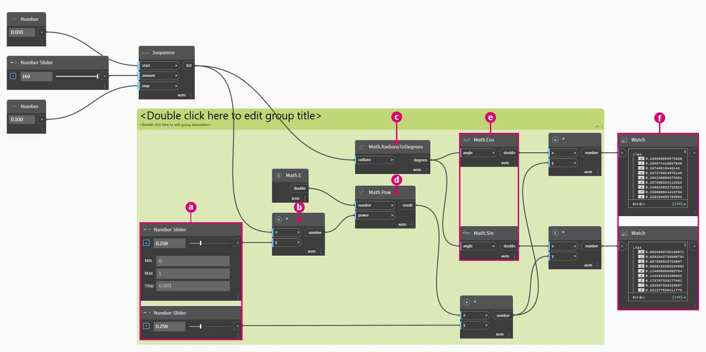
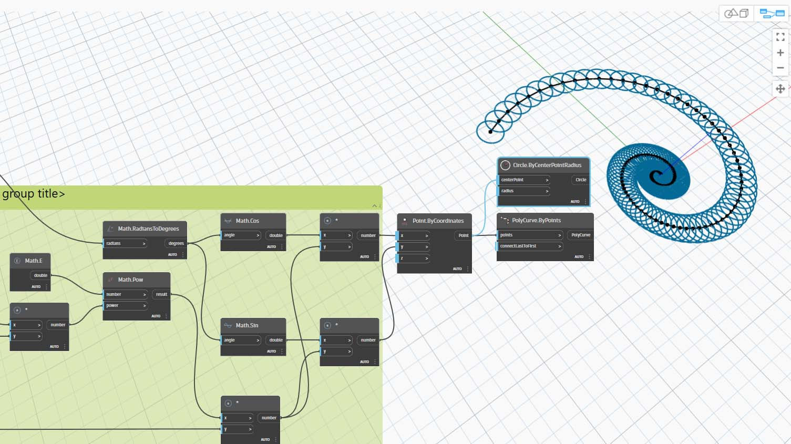

# Matematika

Pokud jsou nejjednodušší formou dat čísla, nejjednodušším způsobem, jak se tato čísla mohou odlišit, je použití funkce Mathematics. Od jednoduchých operátorů, jako je dělení, až k trigonometrickým funkcím, možnost Math je skvělým způsobem, jak začít zkoumat číselné vztahy a vzory.

### Aritmetické operátory

Operátory jsou sada komponent, které používají algebraické funkce se dvěma číselnými vstupními hodnotami, které vrací jednu výstupní hodnotu (součet, rozdíl, násobení, dělení atd.). Najdete je pod položkou Operátory > Akce.

| Ikona                                                | Název (Syntaxe)     | Vstupy                     | Výstupy      |
| --------------------------------------------------- | ----------------- | -------------------------- | ------------ |
|        | Součet (**+**)       | var[]...[], var[]...[] | var[]...[] |
|     | Rozdíl (**-**)  | var[]...[], var[]...[] | var[]...[] |
|  | Násobení (**\***) | var[]...[], var[]...[] | var[]...[] |
|        | Dělení (**/**)    | var[]...[], var[]...[] | var[]...[] |

## Cvičení: Vzorec zlaté spirály

> Kliknutím na odkaz níže si stáhněte vzorový soubor.
>
> Úplný seznam vzorových souborů najdete v dodatku.



### Část I: Parametrický vzorec

Kombinací operátorů a proměnných vytvořte složitější vztah prostřednictvím **vzorců**. Pomocí posuvníků vytvořte vzorec, který lze řídit pomocí vstupních parametrů.

1\. Vytvořte posloupnost čísel, která představuje „t“ v parametrické rovnici. Chceme tedy použít seznam, který je dostatečně velký k definici spirály.

**Number Sequence:** Definuje posloupnost čísel na základě tří vstupů: _start, amount_ a _step_.

2\. Výše uvedený krok vytvořil seznam čísel definujících parametrickou doménu. Dále vytvořte skupinu uzlů představující rovnici zlaté spirály.

Zlatá spirála je definována jako následující rovnice:

$$ x = r cos θ = a cos θ e^{bθ} $$

$$ y = r sin θ = a sin θe^{bθ} $$

Obrázek níže znázorňuje zlatou spirálu ve vizuální programové podobě. Při procházení skupiny uzlů se snažte věnovat pozornost souvislosti mezi vizuálním programem a psanou rovnicí.

> a. **Number Slider:** Přidejte na kreslicí plochu dva posuvníky. Tyto posuvníky budou představovat proměnné _a_ a _b_ parametrické rovnice. Představují konstantu, která je flexibilní, nebo parametry, které lze upravit podle požadovaného výsledku.
>
> b. b. **Násobení (\*)**: Uzel násobení je reprezentován hvězdičkou. Toto použijeme opakovaně k připojení násobných proměnných
>
> c. **Math.RadiansToDegree:** Hodnoty '_t_' je nutné převést na stupně pro jejich vyhodnocení v trigonometrických funkcích. Nezapomeňte, že aplikace Dynamo pro vyhodnocení těchto funkcí ve výchozím stavu používá stupně.
>
> d. **Math.Pow:** jako funkce '_t_' a čísla '_e_' vytvoří Finobacciho posloupnost.
>
> e. **Math.Cos a Math.Sin:** Tyto dvě trigonometrické funkce odliší souřadnice X a souřadnice Y každého parametrického bodu.
>
> f. **Watch: **Nyní vidíte, že náš výstup jsou dva seznamy, které budou tvořit souřadnice _x_ a _y_ bodů použitých k vytvoření spirály.

### Část II: Od vzorce ke geometrii

Většina uzlů z předchozího kroku bude fungovat dobře, ale jedná se o pracný postup. Chcete-li vytvořit efektivnější pracovní postup, přečtěte si v části [DesignScript](../../8\_coding\_in\_dynamo/8-1\_code-blocks-and-design-script/2-design-script-syntax.md) jak definovat řetězec výrazů aplikace Dynamo do jednoho uzlu. V následující řadě kroků se podíváme, jak použít parametrickou rovnici k nakreslení Fibonacciho spirály.

**Point.ByCoordinates:** Spojte horní uzel násobení se vstupem _x_ a dolní část se vstupem _y_. Nyní vidíte parametrickou spirálu bodů na obrazovce.

**Polycurve.ByPoints**: Spojte uzel **Point.ByCoordinates** z předchozího kroku se vstupem _points_. Možnost _connectLastToFirst_ můžeme nechat bez vstupu, protože neděláme uzavřený oblouk. Tím se vytvoří spirála, která prochází každým bodem definovaným v předchozím kroku.

Nyní jsme dokončili Fibonacciho spirálu. Pokračujme dvěma různými cvičeními, které pojmenujeme Loděnka a Slunečnice. Jedná se o abstrakce přírodních systémů, ale dvě různá použití Fibonacciho spirály budou dobře zastoupena.

### Část III: Od spirály k loděnce

**Circle.ByCenterPointRadius:** Zde použijeme kruhový uzel se stejnými vstupy jako v předchozím kroku. Výchozí hodnota poloměru je _1.0_, takže je vidět okamžitý výstup kružnic. Je okamžitě vidět, jak se body dále vzdalují od počátku.

**Number Sequence:** Toto je původní pole '_t_'. Jeho připojením k hodnotě poloměru v uzlu **Circle.ByCenterPointRadius** se středy kružnic stále vzdalují od počátku, ale poloměry kružnic se zvětšují, což vytváří zábavný Fibonacciho kruhový graf.

Bonusové body, pokud to vytvoříte ve 3D.

### Část IV: Od loděnky k fylotaxii

Nyní, když jsme vytvořili kruhovou ulitu loděnky, přejděme k parametrickým osnovám. Použijeme základní otočení Fibonacciho spirály k vytvoření Fibonacciho rastru a výsledek bude modelován po [růstu slunečnicových semen](https://blogs.unimelb.edu.au/sciencecommunication/2018/09/02/this-flower-uses-maths-to-reproduce/).

Jako výchozí bod použijeme stejný krok z předchozího cvičení: Vytvoření spirálového pole bodů pomocí uzlu **Point.ByCoordinates**.

\

Dále postupujte podle těchto krátkých kroků a vygenerujte řadu spirál s různým natočením.

> a. **Geometry.Rotate:** Existuje několik možností **Geometry.Rotate**. Ujistěte se, že jste vybrali uzel se vstupy _geometry_, _basePlane_ a _degrees_. Připojte položku **Point.ByCoordinates** ke vstupu geometrie. Klikněte pravým tlačítkem na tento uzel a ujistěte se, že je vázání nastaveno na možnost Kartézský součin.
>
> 
>
> b. **Plane.XY:** Připojte se ke vstupu _basePlane_. Budeme se otáčet kolem počátku, což je stejné umístění jako základna spirály.
>
> c. **Number Range:** Pro náš vstup stupně chceme vytvořit více otočení. To můžeme rychle provést pomocí komponenty **Number Range.** Připojte jej ke vstupu _degrees_.
>
> d. **Number:** A k definování rozsahu čísel přidejte na kreslicí plochu ve vertikálním pořadí tři uzly čísel. Shora dolů přiřaďte hodnoty _0.0,360.0_ a _120.0_ v uvedeném pořadí. Tato čísla řídí otáčení spirály. Po připojení tří uzlů čísel k uzlu si všimněte výstupních výsledků z uzlu **Number Range**.

Náš výstup se začíná podobat víru. Upravíme některé parametry položky **Number Range** a podíváme se, jak se změní výsledky.

Změňte velikost kroku uzlu **Number Range** z _120.0_ na _36.0_. Všimněte si, že tím vznikají další otáčení, a proto získáváme hustší osnovu.

Změňte velikost kroku uzlu **Number Range** z _36.0_ na _3.6_. Tím získáme mnohem hustší osnovu a směr spirály je nejasný. Dámy a pánové, vytvořili jsme slunečnici.

