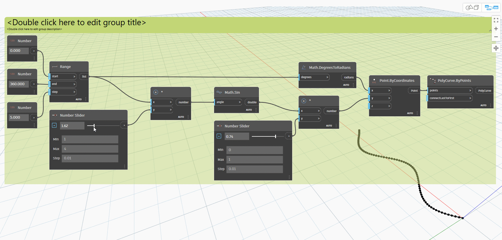

# Логика

**Логика** (а точнее **условная логика**) позволяет задать действие или набор действий в зависимости от результата проверки. После прохождения проверки выдается логическое значение `True` или `False`, которое можно использовать для управления ходом программы.

### Логические выражения

Числовые переменные могут хранить целый диапазон различных чисел. В логических переменных хранятся только два значения: «Истина» или «Ложь», да или нет, 1 или 0. Из-за ограниченной применимости логические операции можно не так часто встретить в расчетах.

### Условные выражения

Выражение «If» является ключевым для программирования. Если _некое условие_ истинно, то происходит _что-то одно_; в противном случае происходит _что-то другое_. Действие, выполняемое после проверки с помощью данного выражения, зависит от логического значения. Существует несколько способов определения выражения If в Dynamo.

| Значок                                             | Имя (синтаксис)             | Входные данные            | Выходные данные |
| ------------------------------------------------ | ------------------------- | ----------------- | ------- |
|                         | If (**If**)               | test, true, false | результат  |
| \(1) (1) (1).jpg>) | Code Block (**(x?y:z);**) | X, Y, Z           | результат  |

Рассмотрим краткий пример с каждым из этих трех узлов в действии, используя условное выражение If.

На этом изображении в узле _boolean_ задано значение _true_. Это означает, что на выходе появится строка _this is the result if true (это результат при истинном значении)_. Три узла, образующие выражение _If_, работают одинаково.

Напомним, что узлы работают одинаково. Если для _boolean_ изменить значение на _false_, результатом будет число _пи_, как определено в исходном операторе _If_.

## Упражнение «Логика и геометрия»

> Скачайте файл с примером, щелкнув ссылку ниже.
>
> Полный список файлов с примерами можно найти в приложении.



### Часть I. Фильтрация списка

1. Используем логику, чтобы разделить список чисел на список четных и список нечетных чисел.

> a. **Number Range.** Добавление диапазона чисел в рабочую область.
>
> b. **Numbers.** Добавление трех узлов Number в рабочую область. Каждый узел Number должен иметь следующие значения: _0.0_ для _start_, _10.0_ для _end_ и _1.0_ для _step_
>
> c. **Output**. На выходе получается список из 11 чисел в диапазоне от 0 до 10.
>
> d. **Modulo (%)**. **Диапазон номеров** в качестве входных данных для _x_ и значение _2.0_ в качестве входных данных для _y_. При этом рассчитывается остаток каждого числа в списке при делении на 2. На выходе из этого списка будет представлен список чередующихся значений 0 и 1.
>
> e. **Equality Test (==)**. Добавление в рабочую область проверки равенства. Соедините выходные данные _modulo_ с входным параметром _x_, а значение _0.0_ с входным параметром _y_.
>
> f. **Watch**. В качестве выходных данных проверки равенства будет представлен список значений «Истина» (true) и «Ложь» (false). С помощью этих значений элементы будут разделяться в списке. _0_ (или _true_) соответствует четным числам, а _1_ (или _false_) — нечетным.
>
> g. **List.FilterByBoolMask.** Этот узел отфильтровывает значения по двум разным спискам в зависимости от вводимого логического выражения. Соедините исходный _диапазон чисел_ с входным параметром _list_, а выходной параметр _проверки равенства_ с входным параметром _mask_. В выходных данных _in_ представлены истинные значения, а в _out_ — ложные.
>
> h. **Watch.** В результате мы получили списки четных и нечетных чисел. Итак, с помощью логических операторов мы разделили списки по определенному признаку.

### Часть II. От логики к геометрии

Применим логику из первого упражнения к моделированию.

2\. За основу возьмем предыдущее упражнение с теми же узлами. Помимо изменения формата, единственными исключениями будут следующие.

> a. Используйте узел **Sequence** с этими входными значениями.
>
> b. Отсоединен входной параметр list от узла **List.FilterByBoolMask**. Эти узлы пока не нужны, но они потребуются позже.

3\. Начнем с создания отдельной группы Graph, как показано на изображении выше. Эта группа узлов представляет собой параметрическое уравнение для определения линейной кривой. Примечания.

> a. Первый регулятор **Number Slider** представляет частоту волны в диапазоне от 1 до 4 с шагом 0,01.
>
> b. Второй регулятор **Number Slider** представляет амплитуду волны в диапазоне от 0 до 1 с шагом 0,01.
>
> c. **PolyCurve.ByPoints.** Если скопировать приведенную выше схему узлов, на видовом экране предварительного просмотра Dynamo будет создана синусоидальная кривая.

При вводе данных используйте числовые узлы для более статических свойств и регуляторы чисел для более гибких свойств. Необходимо сохранить исходный диапазон чисел, который определяется в начале этого шага. Однако синусоидальная кривая, которую мы пытаемся создать, должна обладать определенной гибкостью. Перемещая регуляторы, можно видеть частотные и амплитудные изменения кривой.

4\. Забежим немного вперед и посмотрим на конечный результат, чтобы представить, каким он должен быть. Первые два шага выполняются отдельно, теперь их нужно соединить. С помощью базовой синусоидальной кривой будет определяться местоположение компонентов молнии, а с помощью логики «истина/ложь» — элементы меньшего или большего размера.

> a. **Math.RemapRange.** С помощью последовательности чисел, созданной на шаге 02, сформируем новую последовательность чисел, перенастроив диапазон. Исходные числа из шага 01 имеют диапазон от 0 до 100. С помощью входных параметров _newMin_ и _newMax_ диапазон значений изменяется на 0–1 соответственно.

5\. Создайте узел **Curve.PointAtParameter**, а затем соедините выходной параметр **Math.RemapRange** из шага 04 с входным параметром _param_.

На этом шаге создаются точки вдоль кривой. Диапазон чисел был перенастроен на 0–1, так как входной параметр _param_ ищет значения в этом диапазоне. Значение _0_ соответствует начальной точке, а значение _1_ — конечным точкам. Все промежуточные числа относятся к диапазону _[0,1]_.

6\. Соедините выходной параметр узла **Curve.PointAtParameter** с узлом **List.FilterByBoolMask**, чтобы разделить список четных и нечетных индексов.

> a. **List.FilterByBoolMask.** Соедините узел **Curve.PointAtParameter** из предыдущего шага с входным параметром _list_.
>
> b. **Watch.** Узел Watch для _in_ и узел Watch для _out_ показывают, что имеется два списка — c четными и нечетными индексами. Тот же самый порядок точек используется в кривой, что демонстрируется на следующем шаге.

7\. Далее используйте результат вывода из узла **List.FilterByBoolMask** на шаге 05 для создания геометрий с размерами в соответствии с индексами.

**Cuboid.ByLength.** Для создания молнии вдоль синусоидальной кривой воспроизведите связи, представленные на изображении выше. В данном случае кубоид — это просто рамка, размер которой определяется в зависимости от точки кривой в центре рамки. Теперь логика деления «четные/нечетные» в модели должна быть понятной.

> a. Список кубоидов с четными индексами.
>
> b. Список кубоидов с нечетными индексами.

Готово! Вы только что запрограммировали процесс определения геометрических размеров в соответствии с логической операцией, показанной в этом упражнении.
