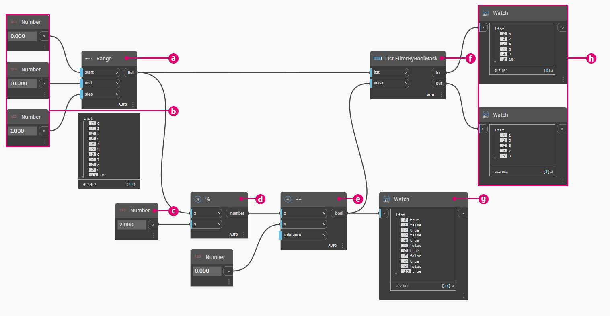

# Logika

Modul **Logic** nebo konkrétněji **Conditional Logic** umožňuje určit akci nebo sadu akcí na základě testu. Po vyhodnocení testu budeme mít booleovskou hodnotu představující `True` nebo `False`, kterou můžeme použít k řízení toku programu.

### Booleovské hodnoty

Číselné proměnné mohou ukládat celou řadu různých čísel. Booleovské proměnné mohou ukládat pouze dvě hodnoty, které se označují jako True nebo False, Yes nebo No, 1 nebo 0. Pomocí booleovských hodnot lze výpočty provádět jen zřídka, protože jsou omezené.

### Podmíněné výrazy

Výraz „If“ je klíčovou koncepcí programování: „Pokud je _tato hodnota_ pravdivá, _toto_ se stane, jinak se stane _něco jiného_. Výsledná akce výrazu je řízena booleovskou hodnotou. Příkaz „If“ lze v aplikaci Dynamo definovat několika způsoby:

| Ikona                                            | Název (Syntaxe)             | Vstupy            | Výstupy |
| ----------------------------------------------- | ------------------------- | ----------------- | ------- |
|          | If (**If**)               | test, true, false | výsledek  |
|           | Formula (**IF(x,y,z)**)   | x, y, z           | výsledek  |
|  | Code Block (**(x?y:z);**) | x? y, z           | výsledek  |

Pojďme si projít stručný příklad každého z těchto tří uzlů v akci pomocí podmíněného výrazu „If“.

Na tomto obrázku je hodnota _boolean_ nastavena na hodnotu _true_, což znamená, že výsledkem je řetězec: _„toto je výsledek, pokud je hodnota true“._ Tři uzly vytvářející výraz _If_ zde fungují identicky.

Uzly opět fungují identicky. Pokud je hodnota _boolean_ změněna na _false_, výsledkem je číslo _Pi_, jak je definováno v původním výrazu _If_.

## Cvičení: Logika a geometrie

> Kliknutím na odkaz níže si stáhněte vzorový soubor.
>
> Úplný seznam vzorových souborů najdete v dodatku.



### Část I: Filtrování seznamu

1. Pomocí logiky rozdělíme seznam čísel do seznamu sudých čísel a seznamu lichých čísel.

> a. **Number Range –** Přidejte na kreslicí plochu číselný rozsah.
>
> b. **Numbers –** Přidejte na kreslicí plochu tři uzly čísel. Hodnoty pro jednotlivé uzly čísel by měly být: _0.0_ pro _start_, _10.0_ pro _end_ a _1.0_ pro _step_.
>
> c. **Output –** Náš výstup je seznam 11 čísel v rozsahu od 0 do 10.
>
> d. **Modulo (%)–** **Number Range** do _x_ a _2.0_ do _y_. Tím se vypočítá zbytek po dělení 2 pro každé číslo v seznamu. Výstup z tohoto seznamu nám poskytne seznam hodnot, které se mění v rozmezí 0 až 1.
>
> e. **Test rovnosti (==) –** Přidá na kreslicí plochu test rovnosti. Výstup _modulo_ připojte ke vstupu _x_ a _0.0_ ke vstupu _y_.
>
> f. **Watch –** Výstupem testu rovnosti je seznam hodnot, které se mění na hodnotu true a false. Jedná se o hodnoty použité k oddělení položek v seznamu. _0_ (nebo _true_) představuje sudá čísla a (_1_ nebo _false_) představuje lichá čísla.
>
> g. **List.FilterByBoolMask –** Tento uzel filtruje hodnoty do dvou různých seznamů na základě vstupní booleovské hodnoty. Původní uzel _number range_ připojte ke vstupu _list_ a výstup _testu rovnosti_ připojte ke vstupu _mask_. Výstup _in_ představuje hodnoty true, zatímco výstup _out_ představuje hodnoty false.
>
> h. **Watch –** Výsledkem je seznam sudých čísel a seznam lichých čísel. Použili jsme logické operátory k oddělení seznamů do vzorů.

### Část II: Od logiky ke geometrii

Budeme vycházet z logiky stanovené v prvním cvičení a použijeme toto nastavení na operaci modelování.

2\. Vyjdeme z předchozího cvičení se stejnými uzly. Jediné výjimky (kromě změny formátu jsou):

> a. a. Použijte uzel **Sequence** s těmito vstupními hodnotami.
>
> b. Seznam in jsme odpojili od uzlu **List.FilterByBoolMask**. Tyto uzly zatím necháme stranou, ale později se nám v tomto cvičení budou hodit.

3\. Začneme vytvořením samostatné skupiny grafů, jak je znázorněno na obrázku výše. Tato skupina uzlů představuje parametrickou rovnici k definování oblouku úsečky. Několik poznámek:

> a. První uzel **Number Slider** představuje frekvenci vlny, měl by mít min. hodnotu 1, max. hodnotu 4 a krok 0.01.
>
> b. Druhý uzel **Number Slider** představuje amplitudu vlny, měl by mít min. hodnotu 0, max. hodnotu 1 a krok 0.01.
>
> c. **PolyCurve.ByPoints –** Pokud je zkopírováno výše uvedené schéma uzlu, výsledkem je sinusoida ve výřezu náhledu aplikace Dynamo.

Zde je metoda pro vstupy: použijte uzly čísel pro statické vlastnosti a posuvníky pro flexibilnější hodnoty. Chceme zachovat původní číselný rozsah, který definujeme na začátku tohoto kroku. Křivka sinu, kterou zde vytvoříme, by však měla mít určitou flexibilitu. Posunutím těchto posuvníků můžeme sledovat, jak oblouk aktualizuje svou frekvenci a amplitudu.

4\. Trochu přeskočíme v definici, takže se podíváme na konec, abychom mohli odkazovat na to, k čemu míříme. První dva kroky jsou provedeny samostatně, nyní je chceme spojit. Pomocí základní sinusové křivky budeme řídit umístění komponent zipu a pomocí logiky true/false budeme přepínat mezi malými a většími poli.

> a. **Math.RemapRange –** Pomocí číselné sekvence vytvořené v kroku 02 vytvoříme novou řadu čísel přemapováním rozsahu. Původní čísla z kroku 01 jsou v rozsahu 0-100. Tato čísla se pohybují v rozsahu od 0 do 1 podle hodnot _newMin_ a _newMax_.

5\. Vytvořte uzel **Curve.PointAtParameter** a potom připojte výstup **Math.RemapRange** z kroku 04 ke vstupu _param_.

Tento krok vytvoří body podél křivky. Čísla byla přemapována na 0 až 1, protože vstup _param_ hledá hodnoty v tomto rozsahu. Hodnota _0_ představuje počáteční bod, hodnota _1_ představuje koncové body. Všechna čísla mezi hodnotami jsou vyhodnocena v rozsahu _[0,1]_.

6\. Připojte výstup z uzlu **Curve.PointAtParameter** k uzlu **List.FilterByBoolMask**, abyste oddělili seznam lichých a sudých indexů.

> a. **List.FilterByBoolMask** – Připojte uzel **Curve.PointAtParameter** z předchozího kroku ke vstupu _list_.
>
> b. **Watch** – Uzel Watch pro _in_ a uzel Watch pro _out_ zobrazuje, že máme dva seznamy představující sudé a liché indexy. Tyto body jsou seřazeny stejným způsobem na křivce, kterou ukážeme v dalším kroku.

7\. Dále použijeme výsledek výstupu z uzlu **List.FilterByBoolMask** v kroku 05 k vygenerování geometrií s velikostmi podle jejich indexů.

**Cuboid.ByLength –** Znovu vytvořte spojení uvedená na obrázku výše, abyste získali zip podél sinusové křivky. Kvádr je pouze kvádr a definujeme jeho velikost na základě bodu křivky ve středu kvádru. Logika sudého nebo lichého rozdělení by nyní měla být v modelu jasná.

> a. Seznam kvádrů v sudých indexech.
>
> b. Seznam kvádrů v lichých indexech.

Voila! Právě jste naprogramovali proces definování rozměrů geometrie podle logické operace, kterou jsme si předvedli v tomto cvičení.
