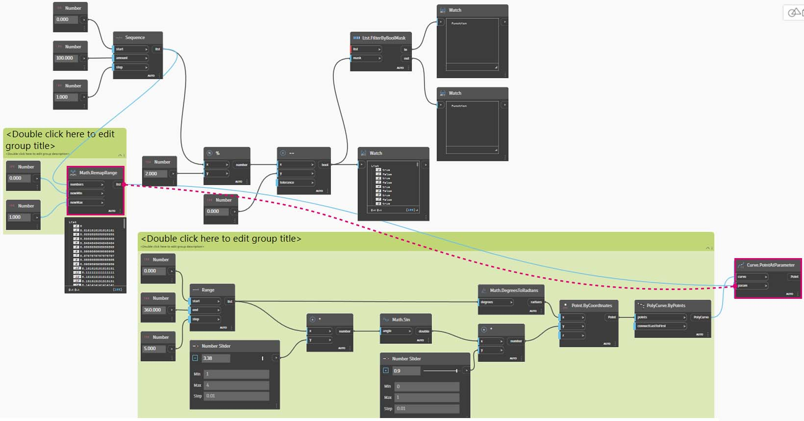

# 逻辑

**逻辑**，或更确切地说是**条件逻辑**，允许我们基于测试指定一个操作或操作集。在评估测试后，我们将得到一个布尔值，该值表示 `True` 或 `False`，我们可以使用它来控制程序流。

### 布尔

数字变量可以存储整个范围的不同数字。布尔变量只能存储两个名为“True”或“False”、“Yes”或“No”、“1”或“0”的值。由于布尔范围有限，我们很少使用布尔来执行计算。

### 条件语句

“If”语句是编程中的关键概念：如果 _this_ 为 true，则 _that_ 发生；否则 _something else_ 发生。语句的结果操作由布尔值驱动。在 Dynamo 中，有多种方法可定义“If”语句：

| 图标                                            | 名称（语法）             | 输入(Inputs)            | 输出 (Outputs) |
| ----------------------------------------------- | ------------------------- | ----------------- | ------- |
|          | 如果 (**If**)               | test, true, false | 结果  |
|           | 公式 (**IF(x,y,z)**)   | x, y, z           | 结果  |
|  | 代码块 (**(x?y:z);**) | x? y, z           | 结果  |

接下来，我们来看一个简短示例，分别介绍这三个节点在使用“If”条件语句时的行为。

在本图中，_“boolean”_设置为_“true”_，这意味着结果是字符串读取：_“this is the result if true”_。在此处，创建_“If”_语句的三个节点的工作方式相同。

同样，该节点的工作方式也相同。如果_“boolean”_更改为_“false”_，则结果是_“Pi”_数字，如原始_“If”_语句中所定义。

## 练习：逻辑和几何图形

> 单击下面的链接下载示例文件。
>
> 可以在附录中找到示例文件的完整列表。



### 第 I 部分：过滤列表

1. 我们使用逻辑将一列数字分隔为一列偶数和一列奇数。

> a.**Number Range** \- 向画布添加一个数字范围。
>
> b.**Numbers** \- 向画布添加三个数字节点。每个数字节点的值应为：_“start”_为_“0.0”_、_“end”_为_“10.0”_以及_“step”_为_“1.0”_。
>
> c.**Output** \- 输出是一列 11 个数字（范围从 0 到 10）。
>
> d.**求模(%)** -**“Number Range”**连接到_“x”_，_“2.0”_连接到_“y”_。这将计算列表中每个数字除以 2 的余数。此列表的输出将给出一列介于 0 和 1 之间的交替值。
>
> e.**相等测试 (==)** \- 向画布添加相等测试。将_“modulo”_输出连接到_“x”_输入，将_“0.0”_输入连接到_“y”_输入。
>
> f.**Watch** \- 相等测试的输出是一列介于 true 和 false 之间的交替值。这些值用于分隔列表中的项目。_0_（或 _true_）表示偶数，_1_（或 _false_）表示奇数。
>
> g.**List.FilterByBoolMask** \- 此节点会根据输入布尔值将值过滤为两个不同的列表。将原始_“number range”_连接到_“list”_输入，将_“equality test”_输出连接到_“mask”_输入。_“in”_输出表示 true 值，而_“out”_输出表示 false 值。
>
> h.**Watch** \- 结果，我们现在得到了一列偶数和一列奇数。我们已使用逻辑运算符将列表分成各图案！

### 第 II 部分：从逻辑到几何图形

在第一个练习中建立的逻辑基础上，我们将此设置应用于建模操作。

2\.我们将从上一个具有相同节点的练习跳转。唯一的例外（除了更改格式外）:

> a.使用具有这些输入值的**“Sequence”**节点。
>
> b.我们已取消将列表输入连接到**“List.FilterByBoolMask”**。现在，我们将这些节点放在旁边，但稍后在练习中，它们会派上用场。

3\.首先，我们创建一组单独的图形，如上图所示。该组节点表示参数方程，用于定义曲线。几点注意事项：

> a.第一个**“数字滑块”**表示波浪的频率，其最小值应为 1，最大值应为 4，步长应为 0.01。
>
> b.第二个**“数字滑块”**表示波浪的振幅，其最小值应为 0，最大值应为 1，步长应为 0.01。
>
> c.**PolyCurve.ByPoints** \- 如果复制上述节点图表，则在 Dynamo 预览视口中结果为正弦曲线。

此处的输入方法：使用数字节点可获得更多静态特性，使用数字滑块可获得更多灵活特性。我们希望保留在此步骤开头定义的原始数字范围。但是，我们在此处创建的正弦曲线应该具有一定的灵活性。我们可以移动这些滑块，来观察曲线更新的频率和振幅。

4\.我们在定义中跳过一点，从而看一下最终结果，以便我们可以参照所得到的内容。前两个步骤是分别进行的，我们现在要将这两个步骤连接起来。我们将使用基础正弦曲线来驱动拉链组件的位置，我们将使用 true/false 逻辑以在小框和大框之间交替。

> a.**Math.RemapRange** \- 使用在步骤 02 中创建的数字序列，我们通过重新映射范围来创建一系列新数字。原始数字来自步骤 01，范围为 0-100。这些数字介于 0 到 1，分别通过_“newMin”_和_“newMax”_输入。

5\.创建**“Curve.PointAtParameter”**节点，然后将步骤 04 中的**“Math.RemapRange”**输出连接为其_“param”_输入。

此步骤将沿曲线创建点。我们将数字重新映射为 0 到 1，因为_“param”_的输入将查找此范围中的值。值为_“0”_表示开始点，值为_“1”_表示结束点。介于两者之间的所有数字均在_“[0,1]”_范围内求值。

6\.将**“Curve.PointAtParameter”**的输出连接到**“List.FilterByBoolMask”**，以分隔奇数和偶数索引列表。

> a.**List.FilterByBoolMask** \- 将上一步的**“Curve.PointAtParameter”**连接到_“list”_输入。
>
> b.**Watch** -_“in”_的观察节点和_“out”_的观察节点表明，我们有表示偶数索引和奇数索引的两个列表。这些点在曲线上的排序方式相同，我们将在下一步中进行演示。

7\.接下来，我们将在步骤 05 中使用**“List.FilterByBoolMask”**的输出结果，以根据其索引生成具有大小的几何图形。

**Cuboid.ByLengths** \- 重新创建在上图中所见到的连接，以沿正弦曲线获得拉链。立方体在此处就是一个框，我们将基于框中心的曲线点定义其大小。现在，偶数/奇数分割的逻辑在模型中应该一清二楚。

> a.偶数索引处的立方体列表。
>
> b.奇数索引处的立方体列表。

大功告成！您刚刚编写了一个根据本练习中演示的逻辑操作定义几何图形尺寸的过程。
