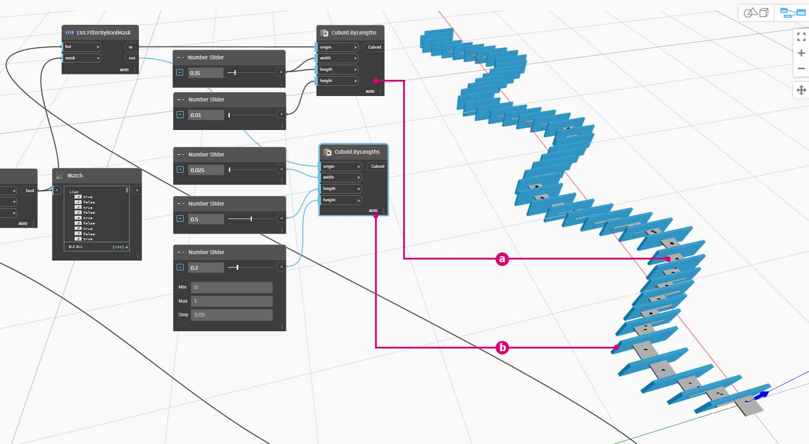

# Lógica

A **Lógica** ou, mais especificamente, a **Lógica condicional**, permite especificar uma ação ou conjunto de ações com base em um teste. Após avaliar o teste, teremos um valor booleano que representa `True` ou`False`, que podemos usar para controlar o fluxo do programa.

### Booleanos

As variáveis numéricas podem armazenar um intervalo completo de números diferentes. As variáveis booleanas somente podem armazenar dois valores referidos como True ou False, Yes ou No, 1 ou 0. Raramente usamos operações booleanas para realizar cálculos devido ao seu intervalo limitado.

### Declarações condicionais

A declaração “If” é um conceito-chave em programação: “se _isso_ for verdadeiro, _aquilo_ acontecerá; caso contrário, _outra coisa_ acontecerá. A ação resultante da declaração é controlada por um valor booleano. Há várias maneiras de definir uma declaração “If” no Dynamo:

| Ícone                                         | Nome (Sintaxe)             | Entradas            | Saídas |
| -------------------------------------------- | ------------------------- | ----------------- | ------- |
|                     | Se (**If**)               | teste, true, false | resultado  |
|                | Fórmula (**IF(x,y,z)**)   | x, y, z           | resultado  |
| \(1) (1).jpg>) | Bloco de código (**(x?y:z);**) | X, Y, Z           | resultado  |

Vamos examinar um breve exemplo de cada um desses três nós em ação usando a declaração condicional “Se”.

Nessa imagem, o valor _booleano_ está definido como _true_, o que significa que o resultado é uma sequência de caracteres com a inscrição: _“this is the result if true”_ (esse será o resultado se for verdadeiro). Os três nós que criam a declaração _If_ estão funcionando de forma idêntica aqui.

Novamente, os nós estão funcionando de forma idêntica. Se o valor _booleano_ for alterado para _false_, nosso resultado será o número _Pi_, conforme definido na declaração _If_ original.

## Exercício: Lógica e geometria

> Faça o download do arquivo de exemplo clicando no link abaixo.
>
> É possível encontrar uma lista completa de arquivos de exemplo no Apêndice.



### Parte I: Filtrar uma lista

1. Vamos usar a lógica para separar uma lista de números em uma lista de números pares e uma lista de números ímpares.

> a. **Intervalo de números** – adicione um intervalo de números à tela.
>
> b. **Números** – adicione três nós de número à tela. O valor para cada nó de número deve ser: _0,0_ para _início_, _10,0_ para _fim_ e _1,0_ para _etapa_.
>
> c. **Saída** – nossa saída é uma lista de 11 números que varia entre 0 e 10.
>
> d. **Módulo (%)** – **Intervalo de números** em _x_ e _2,0_ em _y_. Isso calcula o resto de cada número na lista dividida por 2. A saída dessa lista fornece uma lista de valores alternados entre 0 e 1.
>
> e. **Teste de igualdade (==)** – adicione um teste de igualdade à tela. Conecte a saída _módulo_ à entrada _x_ e _0,0_ à entrada _y_.
>
> f. **Inspeção** – a saída do teste de igualdade é uma lista de valores que alternam entre true e false. Esses são os valores usados para separar os itens na lista. _0_ (ou _true_) representa números pares e (_1_ ou _false_) representa números ímpares.
>
> g. **List.FilterByBoolMask** – esse nó filtrará os valores em duas listas diferentes com base no booleano de entrada. Conecte o _intervalo de números_ original à entrada _lista_ e a saída _teste de igualdade_ à entrada _máscara_. A saída _in_ representa valores true, enquanto a saída _out_ representa valores false.
>
> h. **Inspeção** – como resultado, agora temos uma lista de números pares e uma lista de números ímpares. Usamos operadores lógicos para separar as listas em padrões.

### Parte II: Da lógica à geometria

Desenvolvendo a lógica estabelecida no primeiro exercício, vamos aplicar essa configuração a uma operação de modelagem.

2\. Vamos passar do exercício anterior com os mesmos nós. As únicas exceções (além da alteração do formato) são:

> a. Use um nó **Sequência** com esses valores de entrada.
>
> b. Desconectamos a entrada da lista in em **List.FilterByBoolMask**. Colocaremos esses nós de lado por enquanto, mas eles serão úteis no exercício posteriormente.

3\. Vamos começar criando um grupo separado de gráficos, como mostrado na imagem acima. Esse grupo de nós representa uma equação paramétrica para definir uma curva de linha. Algumas observações:

> a. O primeiro **Controle deslizante de número** representa a frequência da onda; deve ter um mínimo de 1, um máximo de 4 e uma etapa de 0,01.
>
> b. O segundo **Controle deslizante de número** representa a amplitude da onda; deve ter um mínimo de 0, um máximo de 1 e uma etapa de 0,01.
>
> c. **PolyCurve.ByPoints** – se o diagrama de nós acima for copiado, o resultado será uma curva sinusoidal na viewport de Visualização do Dynamo.

Método para as entradas: use os nós de número nas propriedades mais estáticas e os controles deslizantes de número nas mais flexíveis. Queremos manter o intervalo de números original que estávamos definindo no início desta etapa. No entanto, a curva seno criada aqui deve ter alguma flexibilidade. É possível mover esses controles deslizantes para observar a curva atualizar sua frequência e amplitude.

4\. Vamos pular um pouco a definição e examinar o resultado final para que possamos fazer referência ao ponto em que estamos chegando. As duas primeiras etapas são feitas separadamente. Agora queremos conectar as duas. Usaremos a curva sinusoidal base para controlar a localização dos componentes do compactador e usaremos a lógica true/false para alternar entre caixas pequenas e caixas maiores.

> a. **Math.RemapRange** – usando a sequência de números criada na etapa 02, vamos criar uma nova série de números remapeando o intervalo. Os números originais da etapa 01 variam entre 0 e 100. Esses números variam entre 0 e 1 nas entradas _newMin_ e _newMax_, respectivamente.

5\. Crie um nó **Curve.PointAtParameter** e, em seguida, conecte a saída **Math.RemapRange** da etapa 04 como sua entrada de _parâmetro_.

Essa etapa cria pontos ao longo da curva. Remapeamos os números de 0 a 1, pois a entrada _parâmetro_ está procurando valores nesse intervalo. Um valor de _0_ representa o ponto inicial e um valor de _1_ representa os pontos finais. Todos os números entre esses valores avaliam dentro do intervalo _[0,1]_.

6\. Conecte a saída de **Curve.PointAtParameter** a **List.FilterByBoolMask** para separar a lista de índices ímpares e pares.

> a. **List.FilterByBoolMask** – conecte **Curve.PointAtParameter** da etapa anterior à entrada _lista_.
>
> b. **Inspeção** – um nó de inspeção para _in_ e um nó de inspeção para _out_ mostram que temos duas listas que representam índices pares e ímpares. Esses pontos estão ordenados da mesma maneira na curva, o que demonstramos na próxima etapa.

7\. Em seguida, vamos usar o resultado de saída de **List.FilterByBoolMask** na etapa 05 para gerar geometrias com tamanhos de acordo com seus índices.

**Cuboid.ByLengths** – recrie as conexões vistas na imagem acima para obter um compactador ao longo da curva sinusoidal. Um cuboide é apenas uma caixa aqui, e estamos definindo seu tamanho com base no ponto da curva no centro da caixa. A lógica da divisão par/ímpar agora deve estar clara no modelo.

> a. Lista de cuboides em índices pares.
>
> b. Lista de cuboides em índices ímpares.

Pronto. Você acabou de programar um processo de definição das cotas de geometria de acordo com a operação lógica demonstrada neste exercício.
