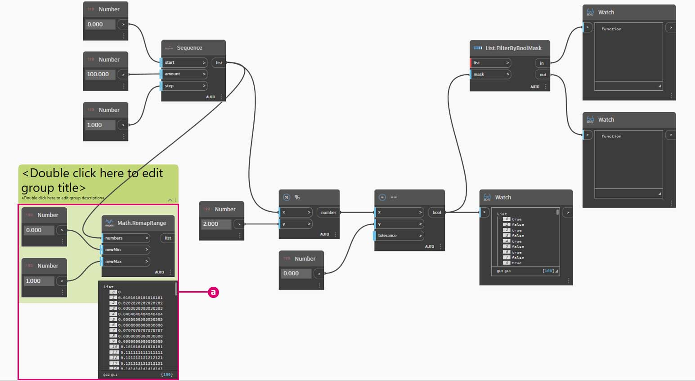

# Lógica

La **lógica** o, más específicamente, la **lógica condicional** nos permite especificar una acción o un conjunto de acciones basadas en una prueba. Tras evaluar la prueba, dispondremos de un valor booleano que representa `True` o `False` que podemos utilizar para controlar el flujo del programa.

### Booleanos

Las variables numéricas pueden almacenar una gran variedad de números diferentes. Las variables booleanas solo pueden almacenar dos valores denominados Verdadero o Falso, Sí o No, 1 o 0. Rara vez utilizamos booleanos para realizar cálculos debido a su rango limitado.

### Instrucciones condicionales

La instrucción "If" ("si") es un concepto clave en la programación: "Si _esto_ es cierto, _eso_ ocurre; de lo contrario, _otra cosa_ ocurre. La acción resultante de la instrucción se rige por un valor booleano. Hay varias formas de definir una instrucción "If" en Dynamo:

| Icono                                         | Nombre (sintaxis)             | Entradas            | Salidas |
| -------------------------------------------- | ------------------------- | ----------------- | ------- |
|                     | If (**If**)               | test, true, false | resultado  |
|                | Formula (**IF(x,y,z)**)   | x, y, z           | resultado  |
| \(1) (1).jpg>) | Code Block (**(x?y:z);**) | x? y, z           | resultado  |

Veamos un breve ejemplo de cada uno de estos tres nodos en acción mediante la instrucción condicional "If".

En esta imagen, el nodo _Boolean_ se ha establecido en _Verdadero (True)_, lo que significa que el resultado es una cadena que dice: "_este es el resultado si es verdadero"._ Los tres nodos que crean la instrucción _If_ funcionan de la misma forma aquí.

De nuevo, los nodos funcionan de la misma forma. Si el nodo _Boolean_ se cambia a _Falso (False)_, el resultado es el número _Pi_, tal y como se define en la instrucción _If_ original.

## Ejercicio: lógica y geometría

> Descargue el archivo de ejemplo. Para ello, haga clic en el vínculo siguiente.
>
> En el Apéndice, se incluye una lista completa de los archivos de ejemplo.



### Parte I: filtrado de una lista

1. Usemos la lógica para separar una lista de números en una lista de números pares y una lista de números impares.

> a. **Number Range**: añada un rango de números al lienzo.
>
> b. Nodos **Number**: añada tres nodos numéricos al lienzo. El valor de cada nodo numérico debe ser _0,0_ para _start_, _10,0_ para _end_ y _1,0_ para _step_.
>
> c. **Salida**: nuestra salida es una lista de 11 números que van del 0 al 10.
>
> d. **Módulo (%)**: **Number Range** se conecta a _x_ y _2,0_ a _y_. De este modo, se calcula el resto de cada número de la lista dividido por 2. La salida de esta lista nos proporciona una lista de valores alternantes entre 0 y 1.
>
> e. **Prueba de igualdad (==)**: añada una prueba de igualdad al lienzo. Conecte la salida de _módulo_ a la entrada _x_ y _0,0_ en la entrada _y_.
>
> f. **Watch**: la salida de la prueba de igualdad es una lista de valores que alterna entre verdadero y falso. Estos son los valores utilizados para separar los elementos de la lista. _0_ (o _true_) representa números pares y _1_ (o _false_) representa números impares.
>
> g. **List.FilterByBoolMask**: este nodo filtrará los valores en dos listas diferentes en función del valor booleano de entrada. Conecte el nodo _Number Range_ original a la entrada _list_ y la salida de la _prueba de igualdad_ en la entrada _mask_. La salida _in_ representa los valores verdaderos, mientras que la salida _out_ representa los valores falsos.
>
> h. **Watch**: como resultado, ahora tenemos una lista de números pares y una de impares. Hemos utilizado operadores lógicos para separar las listas en patrones.

### Parte II: de la lógica a la geometría

Basándonos en la lógica establecida en el primer ejercicio, vamos a aplicar esta configuración en una operación de modelado.

2\. Comenzaremos por donde dejamos el ejercicio anterior, con los mismos nodos. Las únicas excepciones (además de cambiar el formato) son las siguientes:

> a. Utilice un nodo **Sequence** con estos valores de entrada.
>
> b. Se ha desconectado la entrada list en **List.FilterByBoolMask**. Dejaremos estos nodos a un lado por ahora, pero en fases posteriores del ejercicio serán muy útiles.

3\. Creemos primero un grupo independiente de gráficos, como se muestra en la imagen anterior. Este grupo de nodos representa una ecuación paramétrica para definir una curva de línea. Información que debemos tener en cuenta:

> a. El primer **control deslizante de número** representa la frecuencia de la onda; debe tener un mínimo de 1, un máximo de 4 y un paso de 0,01.
>
> b. El segundo **control deslizante de número** representa la amplitud de la onda; debe tener un mínimo de 0, un máximo de 1 y un paso de 0,01.
>
> c. **PolyCurve.ByPoints**: si se copia el diagrama de nodos anterior, el resultado es una curva de seno en la ventana de vista preliminar de Dynamo.

El método que se sigue para las entradas es utilizar nodos numéricos para las propiedades más estáticas y controles deslizantes de número para las más flexibles. Vamos a mantener el rango de números original que definimos al principio de este paso. Sin embargo, la curva de seno que se crea aquí debe tener cierta flexibilidad. Se pueden mover estos controles deslizantes para ver cómo se actualiza la frecuencia y la amplitud de la curva.

4\. Vamos a saltar un poco en la definición, así que veamos el resultado final para que podamos tener como referencia lo que vamos a conseguir. Los dos primeros pasos se realizan por separado; ahora queremos conectar los dos. Utilizaremos la curva de seno base para controlar la ubicación de los componentes de cremallera y utilizaremos la lógica de verdadero/falso para alternar entre cuadros pequeños y cuadros más grandes.

> a. **Math.RemapRange**: con la secuencia de números creada en el paso 02, vamos a crear una nueva serie de números reasignando el rango. Los números originales del paso 01 van del 0 al 100. Estos números oscilan entre 0 y 1 en las entradas _newMin_ y _newMax_ respectivamente.

5\. Cree un nodo **Curve.PointAtParameter** y, a continuación, conecte la salida **Math.RemapRange** del paso 04 como su entrada _param_.

Este paso crea puntos a lo largo de la curva. Hemos reasignado los números a entre 0 y 1 porque la entrada _param_ busca valores en este rango. El valor _0_ representa el punto inicial; el valor _1_ representa los puntos finales. Todos los números que se encuentran en medio se evalúan dentro del rango de _[0,1]_.

6\. Conecte la salida de **Curve.PointAtParameter** a **List.FilterByBoolMask** para separar la lista de índices pares e impares.

> a. **List.FilterByBoolMask**: conecte el nodo **Curve.PointAtParameter** del paso anterior a la entrada _list_.
>
> b. **Watch**: un nodo de visualización para _in_ y otro para _out_ indican que hay dos listas que representan índices pares e impares. Estos puntos se ordenan de la misma forma en la curva, que se muestra en el siguiente paso.

7\. A continuación, vamos a utilizar el resultado de salida de **List.FilterByBoolMask** en el paso 05 para generar geometrías con tamaños según sus índices.

**Cuboid.ByLengths**: reproduzca las conexiones representadas en la imagen anterior para obtener una cremallera a lo largo de la curva de seno. Un cubo es solo un cuadro, y estamos definiendo su tamaño basándonos en el punto de curva del centro del cuadro. La lógica de la división par/impar debería ser clara ahora en el modelo.

> a. Lista de ortoedros en índices uniformes.
>
> b. Lista de ortoedros en índices impares.

Y eso es todo. Acaba de programar un proceso para definir las cotas de geometría de acuerdo con la operación lógica que se muestra en este ejercicio.
