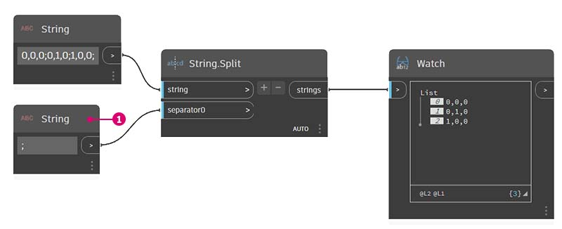
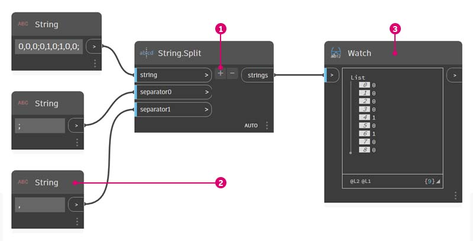
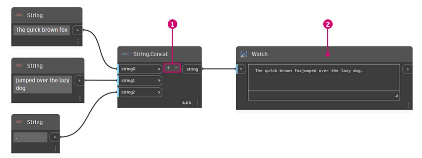
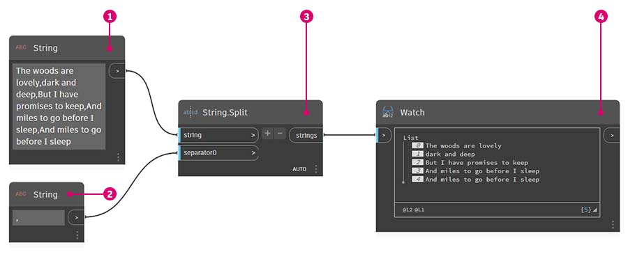
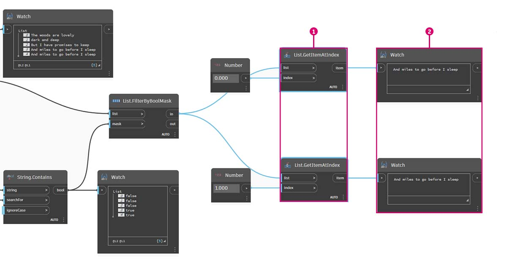
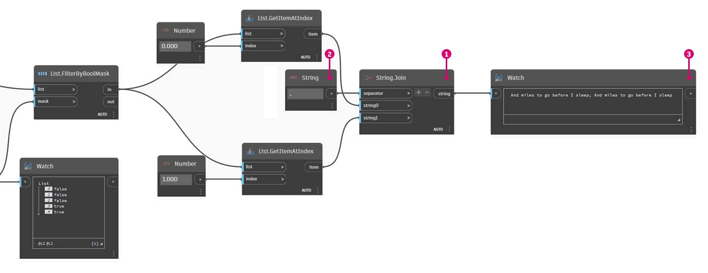

# Řetězce

### Co je to řetězec?

Formálně je **řetězec** posloupnost znaků představujících písmennou konstantu nebo určitý typ proměnné. Neformálně je řetězec označení pro text. Pracovali jsme s celými i desetinnými čísly, abychom mohli řídit parametry, a stejně můžeme pracovat s textem.

### Vytváření řetězců

Řetězce lze použít pro širokou řadu aplikací, včetně definování uživatelských parametrů, opatření sady dokumentace poznámkami a analýzy textových datasetů. Uzel řetězce se nachází v kategorii Core>Input.

Výše uvedené vzorové uzly jsou řetězce. Číslo může být reprezentováno jako řetězec, jako písmeno nebo celé pole textu.

## Cvičení

> Kliknutím na odkaz níže si stáhněte vzorový soubor.
>
> Úplný seznam vzorových souborů najdete v dodatku.



### Dotazování řetězců

Pomocí dotazů na řetězce můžete rychle analyzovat velké množství dat. O některých základních operacích, které mohou urychlit pracovní postup a pomoci při interoperabilitě softwaru, se budeme bavit.

Následující obrázek vychází z řetězce dat pocházejících z externí tabulky. Řetězec představuje vrcholy obdélníku v rovině XY. V miniaturním cvičení projdeme některé operace rozdělení řetězce:

> 1. Oddělovač „;“ rozdělí každý vrchol obdélníku. Tím se vytvoří seznam se třemi položkami pro každý vrchol.

> 1. Kliknutím na tlačítko _+_ uprostřed uzlu vytvoříte nový oddělovač.
> 2. Na kreslicí plochu přidejte řetězec „_,_“ a zadejte jej do nového vstupu oddělovače.
> 3. Výsledkem je nyní seznam deseti položek. Uzel se nejprve rozdělí podle položky _separator0_ a potom podle položky _separator1_.

Zatímco výše uvedený seznam položek může vypadat jako čísla, jsou stále považovány za samostatné řetězce v aplikaci Dynamo. Aby bylo možné vytvořit body, je nutné jejich datový typ převést z řetězce na číslo. To se provádí pomocí uzlu **String.ToNumber**.

> 1. Tento uzel je přímočarý. Připojte výsledky uzlu **String.Split** ke vstupu. Výstup nevypadá jinak, ale datový typ je nyní _number_ místo _string_.

Po několika základních doplňkových operacích je nyní v počátku nakreslen trojúhelník na základě původního vstupu řetězce.

### Manipulace s řetězci

Protože řetězec je obecným textovým objektem, jsou použity v široké škále aplikací. Podívejme se na některé hlavní akce v aplikaci Dynamo v části Core>String Category:

Tato metoda spojí dva řetězce v zadaném pořadí. Vezme všechny řetězcové literály v seznamu a vytvoří z nich jeden sloučený řetězec.

Následující obrázek představuje zřetězení tří řetězců:

> 1. Řetězce přidejte nebo odeberte ze zřetězení kliknutím na tlačítka +/- uprostřed uzlu.
> 2. Výstup obsahuje jeden zřetězený řetězec, včetně mezer a interpunkcí.

Metoda spojení je velmi podobný zřetězení, s výjimkou toho, že má přidanou hladinu interpunkcí.

Pokud jste pracovali v aplikaci Excel, mohli jste potkat soubor CSV. To znamená hodnoty oddělené čárkou. K vytvoření podobné datové struktury lze jako oddělovač s uzlem **String.Join** použít čárku (nebo v tomto případě dvě pomlčky).

Následující obrázek představuje spojení dvou řetězců:

> 1. Vstup oddělovače umožňuje vytvořit řetězec, který rozdělí spojené řetězce.

### Práce s řetězci

V tomto cvičení použijeme metody dotazování a manipulace s řetězci, abychom dekonstruovali poslední sloku díla Roberta Frosta [Stopping By Woods on a Snowy Evening](http://www.poetryfoundation.org/poem/171621). Není to právě použití z praxe, ale pomůže nám to pochopit koncept akcí řetězců, když je použijeme na čitelné řádky básně.

Začneme základním rozdělením řetězce sloky. Nejprve si všimneme, že zápis je formátován na základě čárek. Tento formát použijeme k rozdělení každého řádku do jednotlivých položek.

> 1. Základní řetězec je vložen do uzlu **String**.
> 2. K označení oddělovače se používá další uzel **String**. V tomto případě používáme čárku.
> 3. Na kreslicí plochu je přidán uzel **String.Split** a je připojen ke dvěma řetězcům.
> 4. Výstup ukazuje, že jsme nyní rozdělili čáry do jednotlivých prvků.

Teď se pojďme dostat k dobré části básně: poslední dva řádky. Původní sloka byla jedna datová položka. Tato data jsme rozdělili na jednotlivé položky v prvním kroku. Teď musíme najít text, který hledáme. I když to _můžeme_ provést výběrem posledních dvou položek seznamu, pokud by se jednalo o celou knihu, nechtěli bychom si vše pročítat a ručně izolovat jednotlivé prvky.

> 1. Místo ručního vyhledávání použijeme uzel **String.Contains** k vyhledání sady znaků. To je podobné jako příkaz Najít v textovém procesoru. V tomto případě získáme výsledek true nebo false, pokud je tento podřetězec nalezen v položce.
> 2. Ve vstupu _searchFor_ definujeme podřetězec, který hledáme v rámci sloky. Použijeme uzel **String** s textem „And miles“.
> 3. Výstup nám dává seznam hodnot false a true. Pomocí této booleovské logiky filtrujeme prvky v dalším kroku.

> 1. **List.FilterByBoolMask** je uzel, který chceme použít k procházení hodnot false a true. Výstup „in“ vrátí výrazy s hodnotou „mask“ vstupu true, zatímco výstup „out“ vrací příkazy, které jsou false.
> 2. Náš výstup z „in“ je podle očekávání a dává nám poslední dva řádky sloky.

Teď chceme tyto dva řádky sloučit dohromady. Při zobrazení výstupu předchozího kroku si všimneme, že jsou v seznamu dvě položky:

> 1. Pomocí dvou uzlů **List.GetItemAtIndex** lze izolovat položky pomocí hodnot 0 a 1 jako vstupu index.
> 2. Výstup každého uzlu nám poskytne v pořadí poslední dva řádky.

Ke sloučení těchto dvou položek do jedné použijte uzel **String.Join**:

> 1. Po přidání uzlu **String.Join** si všimneme, že potřebujeme oddělovač.
> 2. K vytvoření oddělovače přidáme na kreslicí plochu uzel **String** a zadáme do něj čárku.
> 3. Poslední výstup sloučil poslední dvě položky do jedné.

Může se zdát, že je to hodně práce pro izolování posledních dvou řádků, a je to pravda, řetězcové operace často vyžadují nějakou přípravnou práci. Jsou však škálovatelné a lze je relativně snadno použít u velkých datasetů. Pokud parametricky pracujete s tabulkami a interoperabilitou, nezapomeňte na řetězcové operace.
