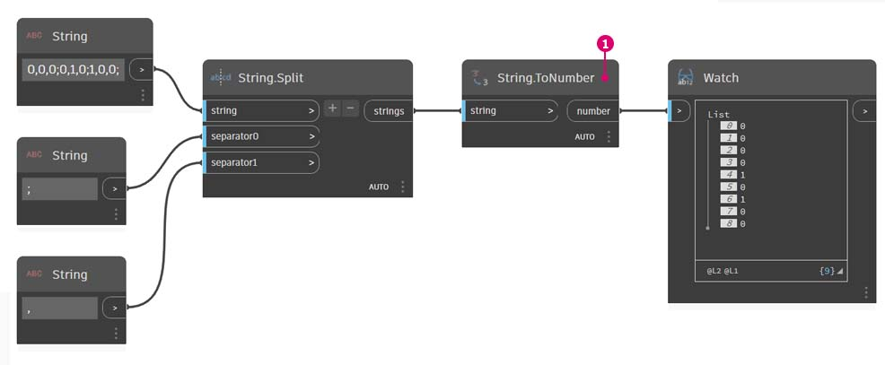
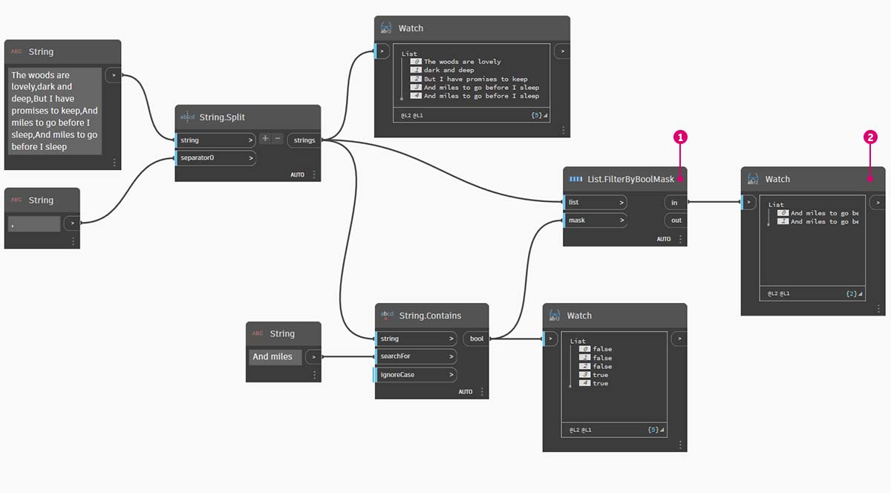

# Cadenas

### ¿Qué es una cadena?

Formalmente, una **cadena** es una secuencia de caracteres que representa una constante literal o algún tipo de variable. Informalmente, una cadena es texto en la jerga de la programación. Hemos trabajado con números, enteros y decimales, para controlar los parámetros y podemos hacer lo mismo con el texto.

### Creación de cadenas

Las cadenas se pueden utilizar para una amplia gama de aplicaciones, como la definición de parámetros personalizados, la anotación de conjuntos de documentación y el análisis mediante conjuntos de datos basados en texto. El nodo string se encuentra en la categoría Core > Input.

Los nodos de ejemplo anteriores son cadenas. Un número puede representarse como una cadena, al igual que una letra o una matriz completa de texto.

## Ejercicio

> Descargue el archivo de ejemplo. Para ello, haga clic en el vínculo siguiente.
>
> En el Apéndice, se incluye una lista completa de los archivos de ejemplo.



### Consulta de cadenas

Puede analizar rápidamente grandes cantidades de datos consultando cadenas. Hablaremos de algunas operaciones básicas que pueden acelerar un flujo de trabajo y ayudar a mejorar la interoperabilidad de software.

La imagen siguiente se basa en una cadena de datos procedentes de una hoja de cálculo externa. La cadena representa los vértices de un rectángulo en el plano XY. Vamos a desglosar algunas operaciones de división de cadenas en un ejercicio de miniaturas:

> 1. El separador ";" divide cada vértice del rectángulo. De este modo, se crea una lista con tres elementos para cada vértice.

> 1. Al pulsar "_+_" en el centro del nodo, se crea un nuevo separador.
> 2. Añada una cadena "_,_" al lienzo y conéctela a la nueva entrada de separador.
> 3. Nuestro resultado es ahora una lista de diez artículos. El nodo realiza la división primero en función de _separator0_ y, a continuación, en función de _separator1_.

Aunque los elementos de la lista anterior pueden tener el aspecto de números, se siguen considerando cadenas individuales en Dynamo. Para crear puntos, su tipo de datos debe convertirse de una cadena a un número. Esto se realiza con el nodo **String.ToNumber**.

> 1. Este nodo es sencillo. Conecte los resultados de **String.Split** a la entrada. La salida no tiene un aspecto diferente, pero el tipo de datos es ahora un _número_ en lugar de una _cadena_.

Con algunas operaciones básicas adicionales, ahora se ha dibujado un triángulo en el origen en función de la entrada de cadena original.

### Manipulación de cadenas

Dado que una cadena es un objeto de texto genérico, alberga una amplia gama de aplicaciones. Echemos un vistazo a algunas de las acciones principales de la categoría Core > String de Dynamo:

Este es un método para fusionar dos cadenas en orden. Toma cada cadena literal de una lista y crea una cadena combinada.

A continuación, se representa la concatenación de tres cadenas:

> 1. Añada o sustraiga cadenas a la concatenación haciendo clic en los botones +/- del centro del nodo.
> 2. La salida es una cadena concatenada, incluidos espacios y signos de puntuación.

El método de unión es muy similar a la concatenación, excepto que tiene una capa añadida de signos de puntuación.

Si ha trabajado en Excel, es posible que haya encontrado un archivo CSV. Se trata de un archivo de valores separados por comas. Se puede utilizar una coma (o, en este caso, dos guiones) como separador con el nodo **String.Join** para crear una estructura de datos similar.

La imagen anterior representa la unión de dos cadenas:

> 1. La entrada "separator" permite crear una cadena que divide las cadenas unidas.

### Trabajo con cadenas

En este ejercicio, vamos a usar métodos de consulta y manipulación de cadenas para deconstruir la última estrofa del poema [Alto en el bosque en una noche de invierno](http://www.poetryfoundation.org/poem/171621) de Robert Frost. No es la aplicación más práctica, pero nos ayudará a comprender las acciones de cadenas conceptuales a medida que las aplicamos a líneas legibles de ritmo y rima.

Comencemos con una división de cadenas básica de la estrofa. Primero, observamos que el formato de la escritura se basa en comas. Utilizaremos este formato para separar cada línea en elementos individuales.

> 1. La cadena base se pega en un nodo **String**.
> 2. Se utiliza otro nodo **String** para indicar el separador. En este caso, usamos una coma.
> 3. Se añade un nodo **String.Split** al lienzo y se conecta a las dos cadenas.
> 4. La salida muestra ahora que hemos separado las líneas en elementos individuales.

Ahora, vamos a la parte buena del poema: las dos últimas líneas. La estrofa original era un elemento de datos. En el primer paso, separamos estos datos en elementos individuales. Ahora debemos buscar el texto que deseamos encontrar. Y, aunque _podemos_ hacerlo seleccionando los dos últimos elementos de la lista, si se tratara de un libro completo, no sería un método eficaz leerlo todo y aislar manualmente los elementos.

> 1. En lugar de realizar una búsqueda manual, se utiliza un nodo **String.Contains** para realizar una búsqueda de un conjunto de caracteres. Esto es similar a utilizar el comando "Buscar" en un procesador de texto. En este caso, obtenemos un valor de "verdadero" o "falso" si se encuentra esa subcadena en el elemento.
> 2. En la entrada _searchFor_, definimos la subcadena que buscamos dentro de la estrofa. Vamos a usar un nodo **String** con el texto "And miles".
> 3. La salida nos proporciona una lista de resultados de verdadero y falso. Utilizaremos esta lógica booleana para filtrar los elementos en el siguiente paso.

> 1. **List.FilterByBoolMask** es el nodo que debemos utilizar para seleccionar los resultados con valor "false" (falso) y "true" (verdadero). La salida "in" devuelve las instrucciones con una entrada "mask" de "verdadero", mientras que la salida "out" devuelve las que tienen un valor de "falso".
> 2. Nuestra salida de "in" es como se esperaba, ya que devuelve las dos frases finales de la estrofa.

Ahora, vamos a dejar clara la repetición de la estrofa fusionando las dos líneas. Al visualizar el resultado del paso anterior, observamos que hay dos elementos en la lista:

> 1. Mediante dos nodos **List.GetItemAtIndex**, se pueden aislar los elementos con los valores 0 y 1 como entrada del índice.
> 2. La salida de cada nodo nos proporciona, por orden, las dos líneas finales.

Para fusionar estos dos elementos en uno, se utiliza el nodo **String.Join**:

> 1. Después de añadir el nodo **String.Join**, observamos que necesitamos un separador.
> 2. Para crear el separador, se añade un nodo **String** al lienzo y se escribe una coma.
> 3. La última salida ha fusionado los dos últimos elementos en uno.

Puede parecer muy laborioso aislar las dos últimas líneas y es cierto que, a menudo, las operaciones de cadena requieren trabajo inicial. Pero son escalables y se pueden aplicar a grandes conjuntos de datos con relativa facilidad. Si trabaja paramétricamente con hojas de cálculo e interoperabilidad, asegúrese de mantener en mente las operaciones de cadena.
