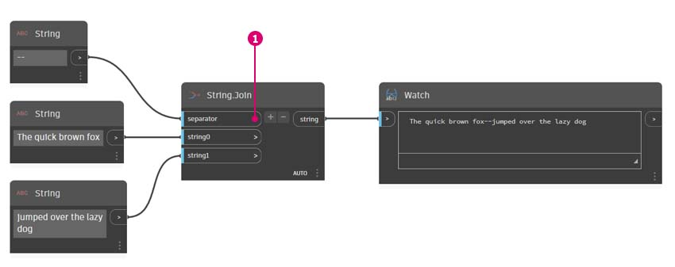

# Sequências

### O que é uma sequência de caracteres?

Formalmente, uma **String** é uma sequência de caracteres que representa uma constante literal ou algum tipo de variável. De forma informal, uma sequência de caracteres é jargão de programação para texto. Trabalhamos com números, tanto números inteiros quanto decimais, para controlar os parâmetros e podemos fazer o mesmo com o texto.

### Criar sequências de caracteres

É possível usar as sequências de caracteres para uma ampla gama de aplicativos, incluindo a definição de parâmetros personalizados, a anotação de conjuntos de documentação e a análise através de conjuntos de dados com base em texto. O nó String está localizado em Núcleo>Categoria de entrada.

Os nós de amostra acima são sequências de caracteres. É possível representar um número como uma sequência de caracteres, assim como uma letra ou uma matriz de texto inteira.

## Exercício

> Faça o download do arquivo de exemplo clicando no link abaixo.
>
> É possível encontrar uma lista completa de arquivos de exemplo no Apêndice.



### Consultar as sequências de caracteres

É possível analisar rapidamente grandes quantidades de dados ao consultar sequências de caracteres. Falaremos sobre algumas operações básicas que podem acelerar um fluxo de trabalho e ajudar na interoperabilidade do software.

A imagem abaixo considera uma sequência de caracteres de dados proveniente de uma planilha externa. A sequência de caracteres representa os vértices de um retângulo no plano XY. Vamos analisar algumas operações de divisão de sequências de caracteres no exercício em miniatura:

> 1. O separador “;” divide cada vértice do retângulo. Isso cria uma lista com três itens para cada vértice.

> 1. Pressionando “_+_” no meio do nó, criamos um novo separador.
> 2. Adicione uma sequência de caracteres “_,_” à tela e conecte-se à nova entrada do separador.
> 3. Nosso resultado é agora uma lista de dez itens. Primeiro, o nó é dividido com base em _separator0_ e, em seguida, com base em _separator1_.

Embora a lista de itens acima possa parecer ser de números, eles ainda são considerados sequências de caracteres individuais no Dynamo. Para criar pontos, seu tipo de dados precisa ser convertido de uma sequência de caracteres em um número. Isso é feito com o nó **String.ToNumber**

> 1. Esse nó é simples. Conecte os resultados de **String.Split** à entrada. A saída não parece diferente, mas o tipo de dados é agora um _número_ em vez de uma _sequência de caracteres_.

Com algumas operações adicionais básicas, agora temos um triângulo desenhado na origem com base na entrada original da sequência de caracteres.

### Manipular sequências de caracteres

Como uma sequência de caracteres é um objeto de texto genérico, ela armazena uma ampla gama de aplicações. Vamos analisar algumas das principais ações em Núcleo>Categoria de sequência de caracteres no Dynamo:

Este é um método que consiste em mesclar duas sequências de caracteres em ordem. Usa cada sequência de caracteres literais de uma lista e cria uma sequência de caracteres mesclada.

Veja a seguir a representação da concatenação das três sequências de caracteres:

> 1. Adicione ou subtraia sequências de caracteres da concatenação clicando nos botões +/- no centro do nó.
> 2. A saída fornece uma sequência de caracteres concatenada, com espaços e sinais de pontuação incluídos.

O método de união é muito similar a concatenar, exceto que tem uma camada de pontuação adicionada.

Se você já tiver trabalhado no Excel, poderá já ter visto um arquivo CSV. Isso significa valores separados por vírgulas. É possível usar uma vírgula (ou, neste caso, dois traços) como separador com o nó **String.Join** para criar uma estrutura de dados similar.

A imagem a seguir representa a união das duas sequências de caracteres:

> 1. A entrada do separador permite criar uma sequência de caracteres que divide as sequências de caracteres unidas.

### Trabalhar com sequências de caracteres

Neste exercício, vamos usar métodos de consulta e manipulação de sequências de caracteres para desconstruir a estrofe final de Robert Frost: [Parando em bosques em uma noite de neve](http://www.poetryfoundation.org/poem/171621). Não é o aplicativo mais prático, mas nos ajuda a compreender as ações de sequências de caracteres conceituais conforme as aplicamos às linhas legíveis de ritmo e rima.

Vamos começar com uma divisão básica da sequência de caracteres da estrofe. Primeiro, percebemos que a escrita é formatada com base em vírgulas. Usaremos esse formato para separar cada linha em itens individuais.

> 1. A sequência de caracteres base é colada em um nó **String**.
> 2. Outro nó **String** é usado para indicar o separador. Neste caso, usamos uma vírgula.
> 3. Um nó **String.Split** é adicionado à tela e conectado às duas sequências de caracteres.
> 4. A saída mostra que separamos as linhas em elementos individuais.

Agora, vamos chegar à parte boa do poema: as duas últimas linhas. A estrofe original era um item de dados. Separamos esses dados em itens individuais na primeira etapa. Agora, precisamos pesquisar o texto que estamos procurando. Embora seja _possível_ fazer isso selecionando os últimos dois itens da lista, se este fosse um livro inteiro, não iríamos querer ler tudo e isolar manualmente os elementos.

> 1. Em vez de pesquisar manualmente, usamos o nó **String.Contains** para executar uma pesquisa de um conjunto de caracteres. Isso é semelhante a usar o comando “Localizar” em um processador de texto. Neste caso, obteremos um retorno de “true” ou “false” se a subsequência de caracteres for encontrada no item.
> 2. Na entrada _searchFor_, definimos uma subsequência de caracteres que estamos procurando na estrofe. Vamos usar um nó **String** com o texto “E milhas”.
> 3. A saída nos fornece uma lista de valores false e true. Usaremos essa lógica booleana para filtrar os elementos na próxima etapa.

> 1. **List.FilterByBoolMask** é o nó que queremos usar para selecionar os valores false e true. A saída “in” retorna as declarações com uma entrada “mask” com valores “true”, enquanto a saída “out” retorna as que têm valores “false”.
> 2. Nosso resultado de “in” é conforme esperado, e isso nos dá as duas linhas finais da estrofe.

Agora, queremos enfatizar a repetição da estrofe, mesclando as duas linhas. Quando visualizamos a saída da etapa anterior, notamos que há dois itens na lista:

> 1. Usando dois nós **List.GetItemAtIndex**, podemos isolar os itens usando os valores de 0 e 1 como entrada do índice.
> 2. A saída de cada nó gera, em ordem, as duas linhas finais.

Para mesclar esses dois itens em um único, usamos o nó **String.Join**:

> 1. Após adicionar o nó **String.Join**, notamos que precisamos de um separador.
> 2. Para criar o separador, adicionamos um nó **String** à tela e digitamos uma vírgula.
> 3. O resultado final mesclou os últimos dois itens em um.

Pode parecer muito trabalhoso isolar as duas últimas linhas; e é verdade, as operações de sequência de caracteres geralmente exigem algum trabalho inicial. Mas elas são escalonáveis e podem ser aplicadas a grandes conjuntos de dados com relativa facilidade. Se você estiver trabalhando parametricamente com planilhas e interoperabilidade, lembre-se de considerar as operações de sequência de caracteres.
