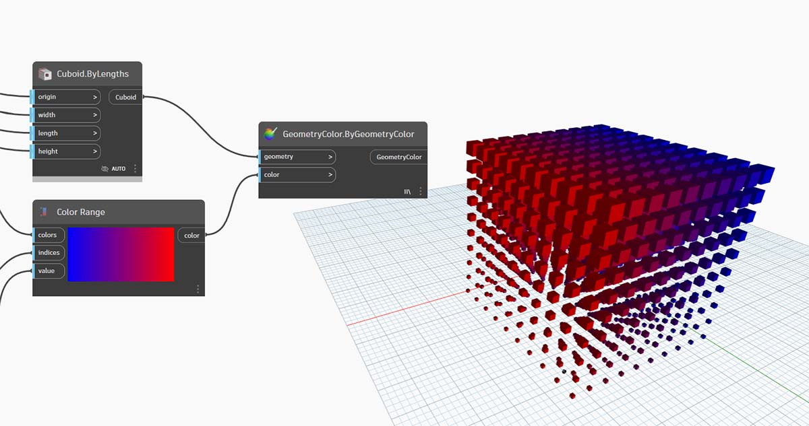
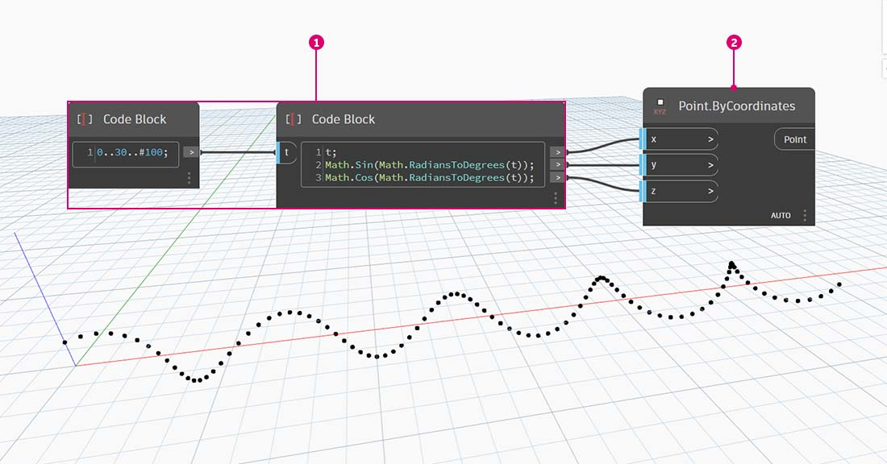
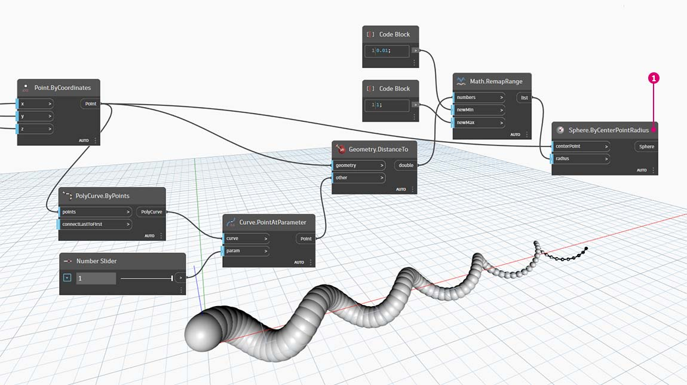
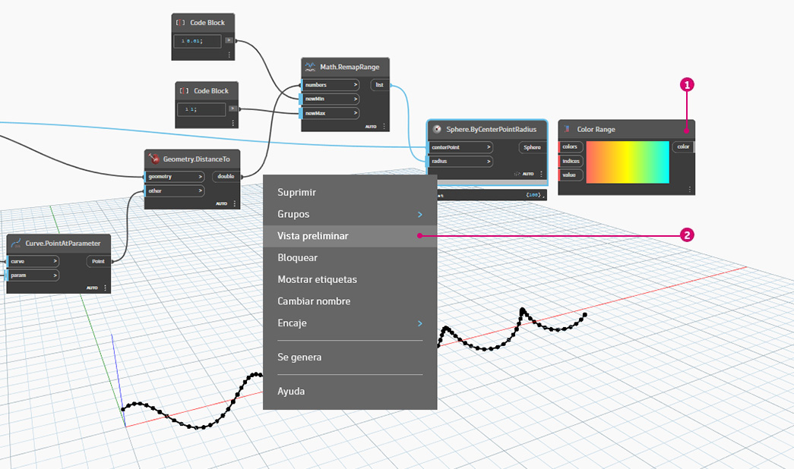
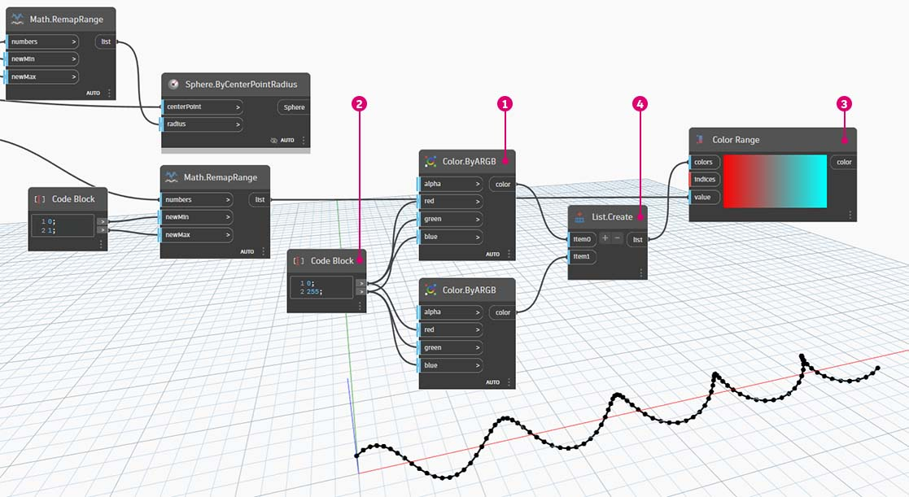
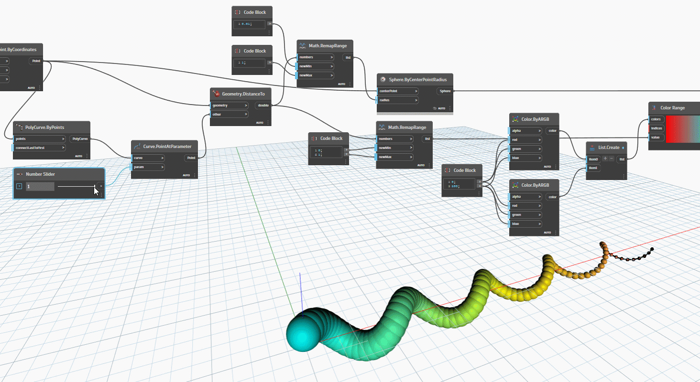
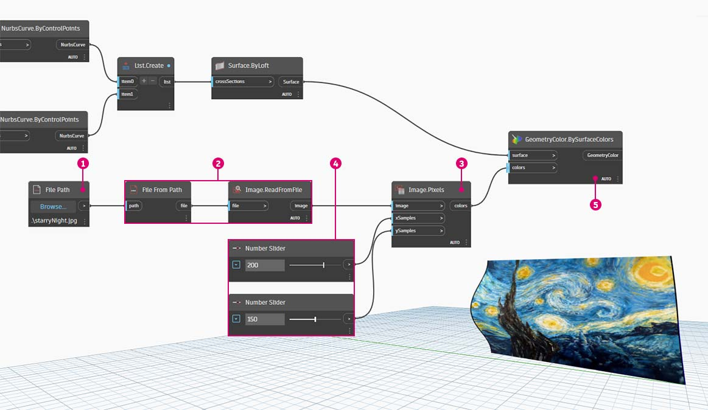
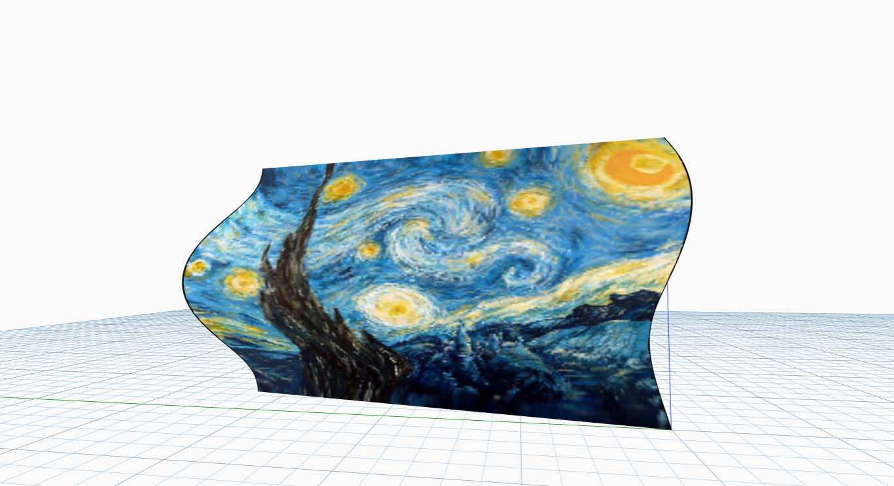

# Цвет

Цвет — это тип данных, который помогает создавать наглядные визуальные представления, а также отражать различия в результатах визуального программирования. При работе с абстрактными данными и численными переменными бывает трудно определить, что именно изменилось и в какой степени. Для решения этой проблемы можно использовать цвета.

### Создание цветов

Цвета в Dynamo создаются с использованием входных данных ARGB, что является сокращенным обозначением комбинации альфа-канала (Alpha) с красным (Red), зеленым (Green) и синим (Blue) каналами. Альфа-канал служит для задания _прозрачности_ цвета, а остальные три канала используются как основные цвета для создания всего цветового спектра.

| Значок                                     | Имя (синтаксис)                 | Входные данные  | Выходные данные |
| ---------------------------------------- | ----------------------------- | ------- | ------- |
| \.jpg>) | Цвет ARGB (**Color.ByARGB**) | A,R,G,B | color   |

### Запрос значений цвета

Цвета в таблице ниже запрашивают свойства, использованные для настройки итогового цвета: альфа, красный цвет, зеленый цвет и синий цвет. Обратите внимание, что узел Color.Components включает все четыре свойства в качестве портов вывода, поэтому его удобнее всего использовать для запроса свойств цвета.

| Значок                                          | Имя (синтаксис)                     | Входные данные | Выходные данные    |
| --------------------------------------------- | --------------------------------- | ------ | ---------- |
| \(1) (1).jpg>) | Альфа (**Color.Alpha**)           | color  | A          |
| \.jpg>)         | Красный (**Color.Red**)               | color  | R          |
| \(1) (1).jpg>) | Зеленый (**Color.Green**)           | color  | G          |
| \.jpg>)        | Синий (**Color.Blue**)             | color  | B          |
| \.jpg>)   | Компоненты (**Color.Components**) | color  | A, R, G, B |

Цвета в таблице ниже соответствуют **цветовому пространству HSB**. Разделение цвета на такие составляющие, как оттенок, насыщенность и яркость, является более понятным и привычным с точки зрения интерпретации цвета. Какого оттенка должен быть цвет? Насколько ярким он должен быть? Насколько светлым или темным? Отвечая на эти вопросы, мы тем самым разбиваем цвет на составляющие, то есть на оттенок, насыщенность и яркость соответственно.

| Значок                                         | Имя (синтаксис)                     | Входные данные | Выходные данные    |
| -------------------------------------------- | --------------------------------- | ------ | ---------- |
| \.jpg>)        | Оттенок (**Color.Hue**)               | color  | Оттенок        |
| \.jpg>) | Насыщенность (**Color.Saturation**) | color  | Насыщенность |
| \.jpg>) | Яркость (**Color.Brightness**) | color  | Brightness |

### Цветовой диапазон

Цветовой диапазон аналогичен узлу **Remap Range** из упражнения [\#part-ii-from-logic-to-geometry](3-logic.md#part-ii-from-logic-to-geometry "mention"): он повторно сопоставляет список чисел с другой областью. Однако вместо сопоставления с областью _чисел_ цветовой диапазон выполняет сопоставление с _цветовым градиентом_ в соответствии со входными значениями в диапазоне от 0 до 1.

Текущий узел хорошо выполняет свои функции, но с ним может быть трудно добиться нужных результатов с первого раза. Чтобы уверенно работать с цветовым градиентом, стоит несколько раз опробовать его на практике в интерактивном режиме. Выполните небольшое упражнение, чтобы узнать, как настроить градиент, так чтобы цвета на выходе соответствовали заданным числам.

> 1. Определите три цвета. С помощью узла **Code Block** определите _красный, зеленый_ и _синий_ цвета, назначив каждому из них соответствующие сочетания значений _0_ и _255_.
> 2. **Создайте список.** Объедините три цвета в один список.
> 3. Определите индексы. Создайте список для определения положения ручек каждого цвета (в диапазоне от 0 до 1). Обратите внимание, что для зеленого цвета задано значение 0,75. Это смещает зеленый цвет на 3/4 вдоль горизонтального градиента в регуляторе цветового диапазона.
> 4. **Code Block**. Введите значения (от 0 до 1), которые будут преобразованы в цвета.

### Образец цвета

Узел **Display.ByGeometry** позволяет раскрашивать геометрию на видовом экране Dynamo. Это позволяет наглядно показывать различные типы геометрии, демонстрировать параметрические концепции и задавать условные обозначения для расчета при моделировании. В качестве входных данных здесь требуются только геометрия и цвет. Для создания градиента, как на изображении выше, порт ввода **Color** соединяется с узлом **Range**.

### Цвет на поверхностях

Узел **Display.BySurfaceColors** позволяет использовать цвет для сопоставления данных на поверхности. Это дает нам широкие возможности для визуализации данных, полученных с помощью таких типов дискретного анализа, как расчеты инсоляции и энергопотребления, а также анализ близости. Применение цвета к поверхности в Dynamo аналогично применению текстуры к материалу в других средах САПР. Выполните небольшое упражнение ниже, чтобы ознакомиться с этим инструментом.

.jpg)

## Упражнение

### Базовая спираль с цветами

> Скачайте файл примера, щелкнув указанную ниже ссылку.
>
> Полный список файлов примеров можно найти в приложении.



В этом упражнении основное внимание уделяется параметрическому управлению цветом параллельно с геометрией. Геометрия — стандартная спираль, определение которой выполнено ниже с помощью узла **Code Block**. Это простой и быстрый способ создания параметрической функции. Так как на данном уроке рассматривается работа с цветом (а не с геометрией), то Code Block идеально подходит для быстрого создания спирали без загромождения рабочей области. Мы будем использовать Code Block все чаще и чаще по мере изучения более сложных процессов.

> 1. **Code Block:** создайте два узла Code Block, используя приведенные выше формулы. Это быстрый параметрический метод создания спирали.
> 2. **Point.ByCoordinates**: соедините порты координат этого узла с тремя портами вывода узла Code Block.

Отображается массив точек, которые образуют спираль. Далее необходимо создать кривую, проходящую через точки, чтобы получить изображение спирали.

> 1. **PolyCurve.ByPoints:** соедините порт вывода **Point.ByCoordinates** с портом ввода _points_ этого узла. Отображается спиральная кривая.
> 2. **Curve.PointAtParameter:** соедините порт вывода **PolyCurve.ByPoints** с портом ввода _curve_. Это требуется, чтобы создать параметрическую точку притяжения, которая перемещается вдоль кривой. Так как кривая вычисляет положение точки с помощью параметра, необходимо задать значение _param_ в диапазоне от 0 до 1.
> 3. **Number Slider:** добавьте этот узел в рабочую область и измените значение _min_ на _0,0_, значение _max_ на _1.0_, а значение _step_ на _.01_. Соедините порт вывода регулятора с портом ввода _param_ узла **Curve.PointAtParameter**. Появляется точка, которая перемещается вдоль спирали в соответствии с положением регулятора (0 — в начальной точке, 1 — в конечной).

Создав опорную точку, мы можем сравнить расстояние от нее до исходных точек, определяющих геометрию спирали. Данное расстояние будет определять геометрию и цвет.

> 1. **Geometry.DistanceTo:** соедините порт вывода узла **Curve.PointAtParameter** с портом _input_ этого узла. Соедините узел **Point.ByCoordinates** с входным параметром «geometry».
> 2. **Watch:** в результате мы получаем список значений расстояния от каждой точки спирали до опорной точки, перемещающейся вдоль кривой.

Следующий шаг — определение параметров на основе списка расстояний между точками спирали и опорной точкой. Эти значения расстояний будут использованы для определения радиусов сфер, размещаемых вдоль кривой. Чтобы обеспечить подходящий размер сфер, необходимо _повторно сопоставить_ значения расстояния.

> 1. **Math.RemapRange:** соедините порт вывода узла **Geometry.DistanceTo** с портом ввода numbers.
> 2. **Code Block**: соедините узел Code Block со значением _0,01_ с портом ввода _newMin_, а узел Code Block со значением _1_ с портом ввода _newMax_.
> 3. **Watch**: соедините порт вывода **Math.RemapRange** с одним узлом, а порт вывода **Geometry.DistanceTo** — с другим. Сравните результаты.

Выполнив этого шаг, мы получили повторно сопоставленный список расстояний меньшего диапазона. При необходимости можно задать другие значения _newMin_ и _newMax_. Новые значения будут повторно сопоставлены и будут иметь одинаковый _коэффициент распределения_ в пределах области.

> 1. **Sphere.ByCenterPointRadius:** соедините порт вывода узла **Math.RemapRange** с портом ввода _radius_, а порт вывода исходного узла **Point.ByCoordinates** — с портом ввода _centerPoint_.

Измените значение числового регулятора и посмотрите, как при этом изменится размер сфер. Теперь у нас есть параметрический шаблон.

Размер сфер является представлением параметрического массива, определяемого опорной точкой, перемещающейся вдоль кривой. Применим эту же концепцию к радиусу сфер, чтобы определить их цвет.

> 1. **Color Range:** добавьте в рабочую область этот узел. При наведении указателя мыши на порт ввода _value_ обратите внимание, что запрашиваемые числа находятся в диапазоне от 0 до 1. Необходимо повторно сопоставить числа, указанные для порта вывода узла **Geometry.DistanceTo**, чтобы они были совместимы с этой областью.
> 2. **Sphere.ByCenterPointRadius**: временно отключите предварительный просмотр узла (_щелкните правой кнопкой мыши, а затем выберите «Предварительный просмотр»_).

> 1. **Math.RemapRange:** эта процедура должна быть вам уже знакома. Соедините порт вывода узла **Geometry.DistanceTo** с портом ввода numbers.
> 2. **Code Block:** аналогично шагу выше задайте значение _0_ для порта ввода _newMin_ и _1_ для порта ввода _newMax_. Обратите внимание, что в данном случае мы задаем два порта вывода для одного узла Code Block.
> 3. **Color Range:** соедините порт вывода узла **Math.RemapRange** с портом ввода _value_.

> 1. **Color.ByARGB**: этот блок позволит нам создать два цвета. Хотя процесс может показаться не самым очевидным, по сути, это то же самое, что и работа с цветами RGB в другом программном обеспечении. Просто здесь мы используем возможности визуального программирования.
> 2. **Code Block:** создайте два значения — _0_ и _255_. Соедините два порта вывода с двумя портами ввода **Color.ByARGB** в соответствии с изображением выше (или создайте другие цвета на свой выбор).
> 3. **Color Range:** порт ввода _colors_ запрашивает список цветов. Необходимо создать этот список из двух цветов, заданных на предыдущем шаге.
> 4. **List.Create:**: объедините два цвета в один список. Соедините порт вывода этого узла с портом ввода _colors_ узла **Color Range**.

> 1. **Display.ByGeometryColor:** соедините узел **Sphere.ByCenterPointRadius** с портом ввода _geometry_, а узел _Color Range_ — с портом ввода _color_. К области кривой применяется мягкий цветовой градиент.

Если изменить в определении значение узла **Number Slider**, который мы изучили ранее, то цвета и размеры геометрии будут обновлены. Цвета и размер радиуса в данном случае связаны напрямую, и теперь между этими двумя параметрами существует и визуальная связь.

### Упражнение по работе с цветом на поверхностях

> Скачайте файл примера, щелкнув указанную ниже ссылку.
>
> Полный список файлов примеров можно найти в приложении.



Сначала необходимо создать поверхность (или выбрать существующую поверхность в качестве опорной) для использования в качестве входных данных для узла **Display.BySurfaceColors**. В этом примере поверхность образуется путем лофтинга между синусоидой и косинусоидой.

> 1. Эта группа узлов создает точки вдоль оси Z с последующим смещением в соответствии с функциями синуса и косинуса. Затем два полученных списка точек используются для создания NURBS-кривых.
> 2. **Surface.ByLoft**: сформируйте интерполированную поверхность между NURBS-кривыми из списка.

> 1. **File Path**: выберите файл изображения, который будет использоваться в качестве образца для пиксельных данных на последующих этапах.
> 2. С помощью узла **File.FromPath** преобразуйте путь к файлу в файл, а затем передайте этот файл в узел **Image.ReadFromFile**, чтобы вывести изображение для использования в качестве образца.
> 3. **Image.Pixels**: используйте изображение в качестве входных данных и введите значение количества образцов, получаемых вдоль осей X и Y изображения.
> 4. **Slider**: задайте значения количества образцов для узла **Image.Pixels**.
> 5. **Display.BySurfaceColors**: сопоставьте массив значений цветов на поверхности со значениями по осями X и Y соответственно.

Просмотрите увеличенную предварительную версию итоговой поверхности с разрешением 400 x 300.

