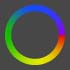
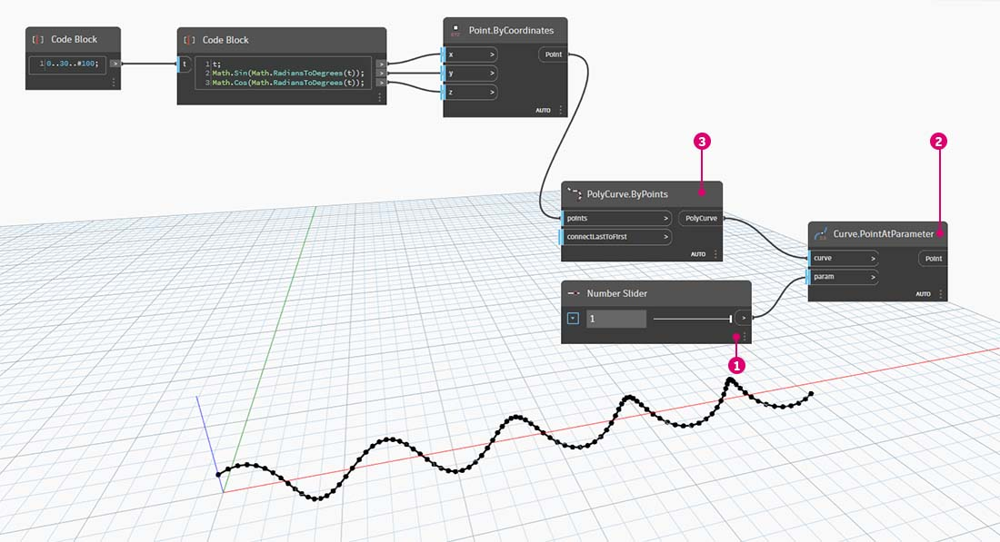

# 顏色 

對於營造引人注目的視覺效果以及彩現視覺程式輸出的差異而言，顏色是很棒的資料類型。使用抽象資料及不同的數字時，有時很難查看變更的項目與變更程度。顏色在這裡大有用武之地。

### 建立顏色

在 Dynamo 中使用 ARGB 輸入建立顏色。這對應於 Alpha、紅色、綠色與藍色通道。Alpha 代表顏色的 _透明度_，而其他三項用作主要顏色以協同產生顏色的整個光譜。

| 圖示                                     | 名稱 (語法)                 | 輸入  | 輸出 |
| ---------------------------------------- | ----------------------------- | ------- | ------- |
| .jpg>) | ARGB 顏色 (**Color.ByARGB**) | A、R、G、B | color   |

### 查詢顏色值

以下表格中的顏色會查詢用於定義顏色的性質：Alpha、紅色、綠色與藍色。請注意，Color.Components 節點會提供所有四項作為不同輸出，因此該節點更適合查詢顏色的性質。

| 圖示                                              | 名稱 (語法)                     | 輸入 | 輸出    |
| ------------------------------------------------- | --------------------------------- | ------ | ---------- |
| (1) (2) (2).jpg>) | Alpha (**Color.Alpha**)           | color  | A          |
|                    | 紅色 (**Color.Red**)               | color  | R          |
| (1) (2) (1).jpg>) | 綠色 (**Color.Green**)           | color  | G          |
|                   | 藍色 (**Color.Blue**)             | color  | B          |
| .jpg>)       | 組成 (**Color.Components**) | color  | A、R、G、B |

以下表格中的顏色對應於 **HSB 顏色空間**。將顏色分為色相、飽和度與亮度可以更直觀地解譯顏色：顏色應該是怎樣的？顏色是什麼色彩？顏色的明暗程度應該是怎樣的？這是分別劃分的色相、飽和度與亮度。

| 圖示                                         | 名稱 (語法)                     | 輸入 | 輸出    |
| -------------------------------------------- | --------------------------------- | ------ | ---------- |
|               | 色相 (**Color.Hue**)               | color  | 色相        |
| .jpg>) | 飽和度 (**Color.Saturation**) | color  | 飽和度 |
| .jpg>) | 亮度 (**Color.Brightness**) | color  | 亮度 |

### 顏色範圍

顏色範圍類似於[\#part-ii-from-logic-to-geometry](3-logic.md#part-ii-from-logic-to-geometry "mention")練習的 **Remap Range** 節點：可將數字清單重新對映到其他範圍。但它並非對映到 _數字_ 範圍，而是根據介於 0 至 1 的輸入數字對映到 _顏色漸層_。

目前的節點運作正常，但第一次就要讓所有內容正常運作可能會有些困難。熟悉顏色漸層的最佳方式是以互動方式對其進行測試。接下來我們進行快速練習，以檢閱如何設置輸出顏色對應於數字的漸層。

> 1. 定義三種顏色：使用 **Code Block** 節點，透過插入 _0_ 與 _255_ 的適當組合來定義 _red、green_ 與 _blue_。
> 2. **建立清單：** 將三種顏色合併到一個清單中。
> 3. 定義索引：建立清單以定義每種顏色的掣點位置 (從 0 至 1)。請注意值 0.75 為綠色。這會在顏色範圍滑棒上，將綠色置於水平漸層長度的 3/4 處。
> 4. **Code Block**：要轉換為顏色的輸入值 (介於 0 至 1 之間)。

### 顏色預覽

使用 **Display.ByGeometry** 節點可以在 Dynamo 視埠中查看顏色幾何圖形。這有助於區分不同類型的幾何圖形、展示參數式概念，或定義模擬的分析圖例。輸入很簡單：幾何圖形與顏色。若要建立類似上面影像的漸層，請將顏色輸入連接至 **Color** **Range** 節點。

### 曲面上的顏色

透過 **Display.BySurfaceColors** 節點，我們可以使用顏色對映整個曲面上的資料！此功能帶來某些振奮人心的可能性，可以對透過離散分析 (例如日光、能源及鄰近) 取得的資料進行視覺化。在 Dynamo 中將顏色套用至曲面類似於在其他 CAD 環境中將材質套用至材料。接下來在以下簡短練習中示範如何使用此工具。

.jpg)

## 練習

### 有顏色的基本螺旋線

> 按一下下方的連結下載範例檔案。
>
> 附錄中提供完整的範例檔案清單。



本練習的內容主要是以參數式方法控制顏色及幾何圖形。幾何圖形是一個基本螺旋線，我們下面使用 **Code Block** 定義。這是快速輕鬆的參數式函數建立方式，由於我們的焦點是顏色 (而不是幾何圖形)，因此我們使用程式碼區塊高效建立螺旋線，而不贅述圖元區。隨著手冊改用更先進的材料，我們將更頻繁地使用程式碼區塊。

> 1. **Code Block：** 定義包含上述公式的兩個程式碼區塊。這是快速建立螺旋線的參數式方法。
> 2. **Point.ByCoordinates**：將程式碼區塊的三項輸出插入節點的座標。

現在我們可以看到建立螺旋線的一系列點。下一步是建立通過這些點的曲線，以便能看到螺旋。

> 1. **PolyCurve.ByPoints：** 將 **Point.ByCoordinates** 輸出連接至節點的 _points_ 輸入。我們會得到一條螺旋曲線。
> 2. **Curve.PointAtParameter：** 將 **PolyCurve.ByPoints** 輸出連接至 _curve_ 輸入。此步驟的目的是建立沿曲線滑動的參數式牽引點。由於曲線透過參數對點進行演算，因此我們需要輸入 0 與 1 之間的 _param_ 值。
> 3. **Number Slider：** 加入圖元區後，將 _min_ 值變更為 _0.0_，_max_ 值變更為 _1.0_，_step_ 值變更為 _0.01_。將滑棒輸出插入 **Curve.PointAtParameter** 的 _param_ 輸入。現在，我們將看到沿螺旋線的長度由滑棒的百分比表示的點 (0 表示起點，1 表示終點)。

建立參考點後，現在我們比較從參考點到螺旋原始定義點的距離。此距離值將驅動幾何圖形與顏色。

> 1. **Geometry.DistanceTo：** 將 **Curve.PointAtParameter** 輸出連接至 _輸入_。將 **Point.ByCoordinates** 連接至 geometry 輸入。
> 2. **Watch：** 產生的結果將顯示從每個螺旋點至曲線上參考點之距離的清單。

下一步驟是使用從螺旋點至參考點之距離的清單來驅動參數。我們將使用這些距離值來定義曲線上一系列圓球的半徑。若要讓圓球保持合適的大小，我們需要 _重新對映_ 距離值。

> 1. **Math.RemapRange：** 將 **Geometry.DistanceTo** 輸出連接至數字輸入。
> 2. **Code Block：** 將值為 _0.01_ 的程式碼區塊連接至 _newMin_ 輸入，將值為 _1_ 的程式碼區塊連接至 _newMax_ 輸入。
> 3. **Watch：** 將 **Math.RemapRange** 輸出連接至一個節點，將 **Geometry.DistanceTo** 輸出連接至另一個節點。比較結果。

此步驟已將距離清單重新對映到較小的範圍。我們可以採用合適的任何方式編輯 _newMin_ 與 _newMax_ 值。這些值將重新對映，並在整個範圍內具有相同的 _分配比率_

> 1. **Sphere.ByCenterPointRadius：** 將 **Math.RemapRange** 輸出連接至 _radius_ 輸入，將原始 **Point.ByCoordinates** 輸出連接至 _centerPoint_ 輸入。

變更數字滑棒的值，查看圓球大小更新。我們現在有一個參數式波浪

圓球的大小展示出由曲線上的參考點定義的參數式陣列。接下來我們應用相同的概念，使用圓球半徑來驅動其顏色。

> 1. **Color Range：** 加入圖元區頂部。懸停在 _value_ 輸入上時，我們會注意到要求的數字介於 0 與 1 之間。我們需要重新對映 **Geometry.DistanceTo** 輸出中的數字，以便其與此範圍相容。
> 2. **Sphere.ByCenterPointRadius：** 我們暫時停用此節點的預覽 (_按一下右鍵 >「預覽」_)

> 1. **Math.RemapRange：** 此程序似乎應該很熟悉。將 **Geometry.DistanceTo** 輸出連接至數字輸入。
> 2. **Code Block：** 與之前的步驟類似，為 _newMin_ 輸入建立值 _0_，為 _newMax_ 輸入建立值 _1_。請注意，在此案例中，我們可以從一個程式碼區塊定義兩個輸出。
> 3. **Color Range：** 將 **Math.RemapRange** 輸出連接至 _value_ 輸入。

> 1. **Color.ByARGB：** 這是我們為了建立兩種顏色將執行的作業。雖然此程序可能貌似有些難，但是它與其他軟體中的 RGB 顏色相同，我們只是剛剛使用視覺程式設計來執行此作業而已。
> 2. **Code Block：** 建立 _0_ 與 _255_ 兩個值。將兩個輸出插入與以上影像相同的兩個 **Color.ByARGB** 輸入 (或建立您最愛的兩種顏色)。
> 3. **Color Range：**_colors_ 輸入要求提供顏色清單。我們需要使用上一步驟中建立的兩種顏色建立此清單。
> 4. **List.Create：** 將兩種顏色合併到一個清單中。將輸出插入 **Color Range** 的 _colors_ 輸入。

> 1. **Display.ByGeometryColor：** 將 **Sphere.ByCenterPointRadius** 連接至 _geometry_ 輸入，將 _Color Range_ 連接至 _color_ 輸入。現在，我們已在整個曲線範圍內建立平滑的漸層。

如果我們變更之前定義中 **Number Slider** 的值，顏色與大小就會更新。在此案例中，顏色與半徑大小直接相關：我們現在已在兩個參數之間建立視覺連結！

### 曲面上的顏色練習

> 按一下下方的連結下載範例檔案。
>
> 附錄中提供完整的範例檔案清單。



首先，我們需要建立 (或參考) 將用作 **Display.BySurfaceColors** 節點輸入的曲面。在此範例中，我們將在正弦及餘弦曲線之間進行斷面混成。

> 1. 此節點群組將沿 Z 軸建立點，然後根據正弦及餘弦函數將其取代。然後，使用兩點清單產生 NURBS 曲線。
> 2. **Surface.ByLoft**：在清單的 NURBS 曲線之間產生內插曲面。

> 1. **File Path**：選取將針對下游像素資料進行取樣的影像檔案
> 2. 使用 **File.FromPath** 將檔案路徑轉換為檔案，然後傳送至 **Image.ReadFromFile** 以輸出供取樣的影像
> 3. **Image.Pixels**：輸入影像，並提供沿影像的 x 和 y 維度將使用的取樣值。
> 4. **滑棒**：提供 **Image.Pixels** 的取樣值
> 5. **Display.BySurfaceColors**：分別沿 X 與 Y 軸在整個曲面內對映一系列顏色值

取樣解析度為 400x300 之輸出曲面的特寫預覽

