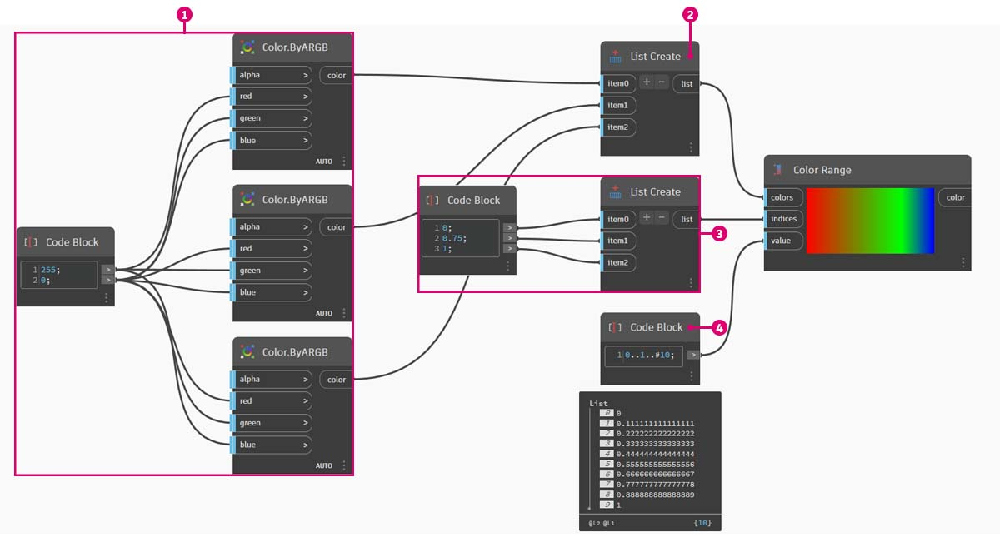

# Kolor

Kolor to doskonały typ danych do tworzenia atrakcyjnych wizualizacji, a także do przedstawiania różnic w danych wyjściowych programu wizualnego. Podczas pracy z abstrakcyjnymi danymi i różnymi liczbami czasami trudno jest dostrzec, co się zmienia i w jakim stopniu. To doskonała sytuacja do zastosowania kolorów.

### Tworzenie kolorów

Kolory w dodatku Dynamo są tworzone przy użyciu danych wejściowych ARGB. Odpowiadają one kanałom alfa, czerwonemu, zielonemu i niebieskiemu. Alfa określa _przezroczystość_ koloru, natomiast pozostałe trzy kanały są używane jako kolory podstawowe, łączone w celu generowania całego spektrum barw.

| Ikona                                          | Nazwa (składnia)                 | Dane wejściowe  | Dane wyjściowe |
| --------------------------------------------- | ----------------------------- | ------- | ------- |
|  | Kolor ARGB (**Color.ByARGB**) | A, R, G, B | color   |

### Zapytania o wartości kolorów

Kolory w poniższej tabeli umożliwiają wykonywanie zapytań o właściwości użyte do zdefiniowania koloru: alfa, czerwony, zielony i niebieski. Należy zauważyć, że węzeł Color.Components zawiera wszystkie cztery elementy wyjściowe, a więc jest zalecany do wykonywania zapytań o właściwości koloru.

| Ikona                                             | Nazwa (składnia)                     | Dane wejściowe | Dane wyjściowe    |
| ------------------------------------------------ | --------------------------------- | ------ | ---------- |
|  | Alfa (**Color.Alpha**)           | color  | A          |
|        | Red (**Color.Red**)               | color  | R          |
|  | Green (**Color.Green**)           | color  | G          |
|       | Blue (**Color.Blue**)             | color  | B          |
|  | Components (**Color.Components**) | color  | A, R, G, B |

Kolory w poniższej tabeli odpowiadają **przestrzeni kolorów HSB**. Podział koloru na barwę, nasycenie i jasność jest bardziej intuicyjny pod względem interpretacji kolorów: jaki to kolor? Jak bardzo jest intensywny? Jak bardzo jest jasny lub ciemny? To właśnie podział na barwę, nasycenie i jasność.

| Ikona                                              | Nazwa (składnia)                     | Dane wejściowe | Dane wyjściowe    |
| ------------------------------------------------- | --------------------------------- | ------ | ---------- |
|         | Hue (**Color.Hue**)               | color  | Hue        |
|  | Saturation (**Color.Saturation**) | color  | Saturation |
|  | Brightness (**Color.Brightness**) | color  | Brightness |

### Zakres kolorów

Węzeł Color Range jest podobny do węzła **Remap Range** z [\#part-ii-from-logic-to-geometry](3-logic.md#part-ii-from-logic-to-geometry "mention")ćwiczenia: ponownie odwzorowuje listę liczb w innej dziedzinie. Zamiast jednak odwzorowywać je w dziedzinie _liczb_, odwzorowuje je jako _gradient kolorów_ na podstawie liczb wejściowych z zakresu od 0 do 1.

Ten węzeł działa dobrze, ale osiągnięcie właściwego efektu za pierwszym razem może być trudne. Najlepszym sposobem na poznanie gradientu kolorów jest przetestowanie go przez interakcję. Wykonamy szybkie ćwiczenie, aby poznać sposób konfigurowania gradientu, w którym kolory wyjściowe odpowiadają liczbom.

> 1. Zdefiniuj trzy kolory: za pomocą węzła **Code Block** zdefiniuj kolory _red, green_ i _blue_ (czerwony, zielony i niebieski), podłączając odpowiednie kombinacje wartości _0_ i _255_.
> 2. **Utwórz listę:** scal trzy kolory w jedną listę.
> 3. Zdefiniuj indeksy: utwórz listę, aby zdefiniować położenie uchwytów każdego koloru (w zakresie od 0 do 1). Zwróć uwagę na wartość 0,75 dla koloru zielonego. Spowoduje to umieszczenie koloru zielonego w 3/4 linii poziomej gradientu na suwaku zakresu kolorów.
> 4. Węzeł **Code Block**: wartości wejściowe (z zakresu od 0 do 1) do przekształcenia na kolory.

### Podgląd koloru

Węzeł **Display.ByGeometry** umożliwia pokolorowanie geometrii w rzutni dodatku Dynamo. To umożliwia rozdzielanie różnych typów geometrii, przedstawianie koncepcji parametrycznych, czy definiowanie legendy analizy na potrzeby symulacji. Elementy wejściowe są proste: „geometry” i „color”. Aby utworzyć gradient taki, jak na powyższym rysunku, należy połączyć element wejściowy „color” z węzłem **Color** **Range**.

### Kolor na powierzchniach

Węzeł **Display.BySurfaceColors** umożliwia odwzorowywanie danych na powierzchni za pomocą koloru. Ta funkcja wprowadza wiele ciekawych możliwości wizualizacji danych uzyskanych metodą analizy dyskretnej, na przykład światła słonecznego, energii i bliskości. Stosowanie koloru do powierzchni w dodatku Dynamo przebiega podobnie do stosowania tekstury do materiału w innych środowiskach CAD. W krótkim ćwiczeniu poniżej pokazano, jak używać tego narzędzia.

.jpg)

## Ćwiczenie

### Helisa podstawowa z kolorami

> Pobierz plik przykładowy, klikając poniższe łącze.
>
> Pełna lista plików przykładowych znajduje się w załączniku.



W tym ćwiczeniu skupiono się na parametrycznym sterowaniu kolorem równolegle do geometrii. Geometria to podstawowa helisa, zdefiniowana poniżej przy użyciu węzła **Code Block**. To szybki i łatwy sposób tworzenia funkcji parametrycznej. Ponieważ skupiamy się na kolorze (a nie na geometrii), używamy bloku kodu, aby sprawnie utworzyć helisę bez nadmiernego zajmowania obszaru rysunku. Będziemy używać bloków kodu częściej, gdy przejdziemy do bardziej zaawansowanych zagadnień.

> 1. Węzeł **Code Block**: zdefiniuj dwa węzły Code Block, używając powyższych formuł. To szybka metoda parametrycznego tworzenia spirali.
> 2. Węzeł **Point.ByCoordinates**: połącz trzy elementy wyjściowe z węzła Code Block ze współrzędnymi tego węzła.

Teraz widzimy szyk punktów tworzących helisę. Kolejnym etapem jest utworzenie krzywej przechodzącej przez te punkty, aby można było zwizualizować helisę.

> 1. Węzeł **PolyCurve.ByPoints**: połącz element wyjściowy węzła **Point.ByCoordinates** z elementem wejściowym _points_ tego węzła. Otrzymujemy krzywą o kształcie helisy.
> 2. Węzeł **Curve.PointAtParameter**: połącz element wyjściowy węzła **PolyCurve.ByPoints** z elementem wejściowym _curve_. Celem tego kroku jest utworzenie parametrycznego punktu przyciągania, który przesuwa się wzdłuż krzywej. Ponieważ punkt na krzywej jest obliczany na podstawie parametru, należy wprowadzić wartość _param_ z zakresu od 0 do 1.
> 3. Węzeł **Number Slider**: po dodaniu do obszaru rysunku zmień wartość _min_ na _0,0_, wartość _max_ na _1,0_, a wartość _step_ na _0,01_. Połącz element wyjściowy suwaka z elementem wejściowym _param_ węzła **Curve.PointAtParameter**. Teraz widzimy punkt na helisie, któremu odpowiada wartość procentowa na suwaku (0 w punkcie początkowym, 1 w punkcie końcowym).

Po utworzeniu punktu odniesienia możemy porównać odległość punktu odniesienia od punktów pierwotnie definiujących helisę. Wartość odległości będzie określać zarówno geometrię, jak i kolor.

> 1. Węzeł **Geometry.DistanceTo**: połącz element wyjściowy węzła **Curve.PointAtParameter** z elementem _input_. Połącz węzeł **Point.ByCoordinates** z wejściem geometry.
> 2. Węzeł **Watch**: wynik pokazuje listę odległości każdego punktu na helisie od punktu odniesienia na krzywej.

Kolejnym etapem jest sterowanie parametrami za pomocą listy odległości punktów na helisie od punktu odniesienia. Tych wartości odległości użyjemy do zdefiniowania promieni szeregu sfer wzdłuż krzywej. Aby zachować odpowiednie rozmiary sfer, należy _ponownie odwzorować_ wartości odległości.

> 1. Węzeł **Math.RemapRange**: połącz element wyjściowy węzła **Geometry.DistanceTo** z elementem wejściowym „numbers”.
> 2. Węzeł **Code Block**: połącz blok kodu zawierający wartość _0,01_ z elementem wejściowym _newMin_, a blok kodu zawierający wartość _1_ z elementem wejściowym _newMax_.
> 3. Węzeł **Watch**: połącz element wyjściowy węzła **Math.RemapRange** z jednym węzłem, a element wyjściowy węzła **Geometry.DistanceTo** z drugim. Porównaj wyniki.

W tym kroku ponownie odwzorowano listę odległości w mniejszym zakresie. Wartości _newMin_ i _newMax_ można dowolnie edytować. Wartości zostaną ponownie odwzorowane i będą miały ten sam _współczynnik rozkładu_ w całej dziedzinie.

> 1. Węzeł **Sphere.ByCenterPointRadius**: połącz element wyjściowy węzła **Math.RemapRange** z elementem wejściowym _radius_, a pierwotny element wyjściowy węzła **Point.ByCoordinates** z elementem wejściowym _centerPoint_.

Zmień wartość na suwaku i obserwuj, jak zmienia się rozmiar sfer. Otrzymaliśmy uchwyt parametryczny

Rozmiar sfer przedstawia szyk parametryczny zdefiniowany przez punkt odniesienia na krzywej. Użyjemy teraz tej samej koncepcji, której użyliśmy do określenia promienia sfer, aby sterować ich kolorem.

> 1. Węzeł **Color Range**: dodaj do obszaru rysunku. Po ustawieniu kursora na elemencie wejściowym _value_ zobaczymy, że wymagane są liczby z zakresu od 0 do 1. Należy ponownie odwzorować liczby wyjściowe z węzła **Geometry.DistanceTo**, aby były zgodne z tą dziedziną.
> 2. Węzeł **Sphere.ByCenterPointRadius**: tymczasowo wyłączymy podgląd tego węzła (_kliknij prawym przyciskiem myszy > Podgląd_)

> 1. Węzeł **Math.RemapRange**: ten proces powinien być już znajomy. Połącz element wyjściowy węzła **Geometry.DistanceTo** z elementem wejściowym „numbers”.
> 2. Węzeł **Code Block**: podobnie jak wcześniej utwórz wartość _0_ dla elementu wejściowego _newMin_ i wartość _1_ dla elementu wejściowego _newMax_. W tym przypadku możemy zdefiniować dwie wartości wyjściowe z jednego bloku kodu.
> 3. Węzeł **Color Range**: połącz element wyjściowy węzła **Math.RemapRange** z elementem wejściowym _value_.

> 1. Węzeł **Color.ByARGB**: to za jego pomocą utworzymy dwa kolory. Choć to rozwiązanie może wydawać się nieporęczne, jest identyczne z używaniem kolorów RGB w innym programie, z tym że po prostu stosujemy tu programowanie wizualne.
> 2. Węzeł **Code Block**: utwórz dwie wartości, _0_ i _255_. Połącz te dwie wartości wyjściowe z dwoma elementami wejściowymi węzła **Color.ByARGB** zgodnie z powyższą ilustracją (lub wybierz swoje dwa ulubione kolory).
> 3. Węzeł **Color Range**: element wejściowy _colors_ wymaga listy kolorów. Musimy utworzyć tę listę z dwóch kolorów utworzonych w poprzednim kroku.
> 4. Węzeł **List.Create**: scal dwa kolory w jedną listę. Połącz wynik z elementem wejściowym _colors_ węzła **Color Range**.

> 1. Węzeł **Display.ByGeometryColor**: połącz węzeł **Sphere.ByCenterPointRadius** z elementem wejściowym _geometry_, a węzeł _Color Range_ z elementem wejściowym _color_. Otrzymaliśmy płynny gradient w całej dziedzinie krzywej.

Jeśli zmienimy wcześniej zdefiniowaną wartość za pomocą węzła **Number Slider**, kolory i rozmiary zostaną zaktualizowane. W tym przypadku kolor i promień są bezpośrednio powiązane: otrzymaliśmy wizualne połączenie między dwoma parametrami.

### Ćwiczenie dotyczące koloru na powierzchniach

> Pobierz plik przykładowy, klikając poniższe łącze.
>
> Pełna lista plików przykładowych znajduje się w załączniku.



Najpierw należy utworzyć powierzchnię (lub odniesienie do niej), która będzie używana jako dane wejściowe dla węzła **Display.BySurfaceColors**. W tym przykładzie wyciągamy powierzchnię między krzywą sinusoidalną a krzywą cosinusoidalną.

> 1. Ta grupa węzłów służy do utworzenia punktów wzdłuż osi Z, a następnie przesunięcia ich na podstawie funkcji sinus i cosinus. Następnie dwie listy punktów zostaną użyte do wygenerowania krzywych NURBS.
> 2. Węzeł **Surface.ByLoft**: wygeneruj interpolowaną powierzchnię między listą krzywych NURBS.

> 1. Węzeł **File Path**: wybierz plik obrazu, z którego na dalszym etapie będą próbkowane dane pikseli.
> 2. Użyj węzła **File.FromPath**, aby przekonwertować ścieżkę pliku na plik, a następnie przekaż go do węzła **Image.ReadFromFile**, aby utworzyć obraz wyjściowy na potrzeby próbkowania.
> 3. Węzeł **Image.Pixels**: wprowadź obraz i podaj liczbę próbek, która będzie używana w wymiarach x i y obrazu.
> 4. Węzeł **Slider**: podaj wartości liczby próbek dla węzła **Image.Pixels**.
> 5. Węzeł **Display.BySurfaceColors**: odwzoruj szyk wartości kolorów na powierzchni, odpowiednio wzdłuż osi X i Y.

Podgląd powierzchni wyjściowej w powiększeniu, z rozdzielczością 400x300 próbek.

