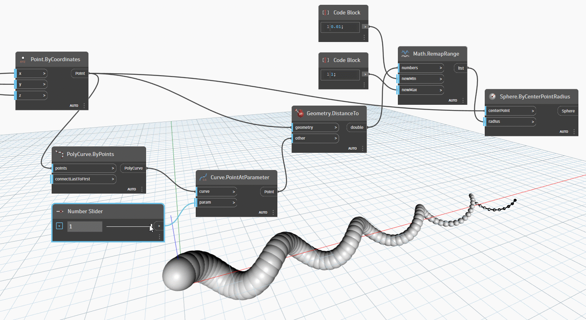
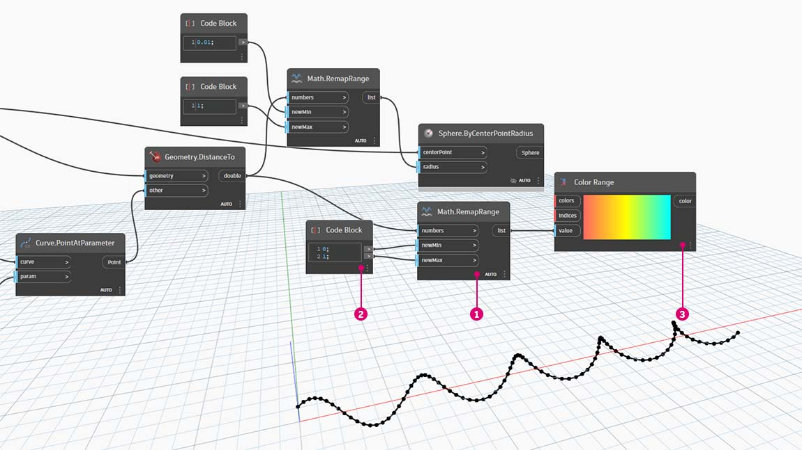

# 色

色は、効果的なビジュアルを作成するためだけではなく、ビジュアル プログラムの出力で差異をレンダリングするためにも重要なデータ タイプです。抽象的なデータや変化する数値を操作する場合、何がどの程度変化するのかを確認するのが難しいことがあります。Dynamo は、色の処理に優れたアプリケーションです。

### 色を作成する

Dynamo では、ARGB 入力を使用して色を作成します。これは、アルファ、赤、緑、青の各チャネルに対応しています。アルファは色の _透明度_ を表し、他の 3 つのチャネルは、色のスペクトル全体を生成するための原色として組み合わせて使用されます。

| アイコン                                     | 名前(構文)                 | 入力  | 出力 |
| ---------------------------------------- | ----------------------------- | ------- | ------- |
| .jpg>) | ARGB Color (**Color.ByARGB**) | A、R、G、B | color   |

### 色の値のクエリー

次の表に記載されている各ノードにより、色を定義するアルファ、赤、緑、青の各プロパティのクエリーが実行されます。Color.Components ノードは、これら 4 つのプロパティをそれぞれ異なる出力として生成します。そのため、色のプロパティのクエリーを実行する場合は、このノードを使用すると便利です。

| アイコン                                          | 名前(構文)                     | 入力 | 出力    |
| --------------------------------------------- | --------------------------------- | ------ | ---------- |
| (1) (1).jpg>) | アルファ(**Color.Alpha**)           | color  | A          |
| .jpg>)         | 赤(**Color.Red**)               | color  | R          |
| (1) (1).jpg>) | 緑(**Color.Green**)           | color  | G          |
| .jpg>)        | 青(**Color.Blue**)             | color  | B          |
| .jpg>)   | コンポーネント(**Color.Components**) | color  | A、R、G、B |

次の表に記載されている色は、**HSB 色空間**に対応しています。色を、色相、彩度、明るさに分割すると、より直感的に色を解釈することができます。たとえば、最初に処理する色を決め、次にその色の彩度と明るさを設定します。このように、色相、彩度、明るさをそれぞれ個別に設定していきます。

| アイコン                                         | 名前(構文)                     | 入力 | 出力    |
| -------------------------------------------- | --------------------------------- | ------ | ---------- |
| .jpg>)        | 色相(**Color.Hue**)               | color  | Hue        |
| .jpg>) | 彩度(**Color.Saturation**) | color  | Saturation |
| .jpg>) | 明るさ(**Color.Brightness**) | color  | Brightness |

### 色範囲

色範囲は、[\#part-ii-from-logic-to-geometry](3-logic.md#part-ii-from-logic-to-geometry "mention") の演習で説明した、数値のリストを別の範囲に再マッピングする **Remap Range** ノードに似ています。ただし、色範囲は、_数値_ の範囲にマッピングされるのではなく、入力された 0 から 1 までの数値に基づいて _色のグラデーション_ にマッピングされます。

現在のノードは正しく機能しますが、最初からすべてを正しく機能させるのは少し大変です。色のグラデーションを理解するための最適な方法は、色のグラデーションを対話式に試す方法です。ここでは、簡単な演習を行い、数値に対応する色の出力を使用してグラデーションを設定する方法を確認します。

> 1. 3 つの色を定義する: **Code Block** ノードを使用して _0_ から _255_ までの適切な数値の組み合わせに接続することにより、_赤、緑_ 、 _青_ を定義します。
> 2. **リストを作成する:** 3 つの色を 1 つのリストにマージします。
> 3. インデックスを定義する: 0 から 1 までの範囲で、各色のグリップ位置を定義するリストを作成します。緑の値が 0.75 になっていることに注意してください。これにより、色範囲スライダの水平方向のグラデーションの 4 分の 3 が緑色になります。
> 4. **Code Block ノードを設定する:** 0 から 1 までの値を入力することで、グラデーションを色に変換します。

### 色のプレビュー

**Display.ByGeometry** ノードを使用すると、Dynamo のビューポート内でジオメトリに色を付けることができます。この機能は、ジオメトリの各種タイプを区別する場合、パラメータの概念を表現する場合、シミュレーション用の解析凡例を定義する場合に便利です。この場合の入力は単純で、ジオメトリと色だけです。上の図のようなグラデーションを作成するには、color 入力を **Color** **Range** ノードに接続します。

### サーフェス上の色

**Display.BySurfaceColors** ノードを使用すると、サーフェス全体にデータを色でマッピングすることができます。この機能により、日照解析、エネルギー解析、近接度解析など、各種の解析で取得したデータを視覚化することができます。Dynamo では、他の CAD 環境でマテリアルにテクスチャを適用する場合と同様に、サーフェスに色を適用することができます。次の簡単な演習で、このツールの使用方法を確認します。

.jpg)

## 演習

### 色付き基本らせん

> 下のリンクをクリックして、サンプル ファイルをダウンロードします。
>
> すべてのサンプルファイルの一覧については、付録を参照してください。



この演習では、パラメータを使用して、ジオメトリと並行して色の管理を行います。この演習で使用するジオメトリは、単純ならせん構造です。このらせん構造は、**Code Block** ノードを使用して定義します。これは、パラメータを使用する関数をすばやく簡単に作成するための方法です。この演習の目的は、ジオメトリではなく色を操作することであるため、コード ブロックを使用してキャンバスを見やすい状態に保ったまま、らせん構造を効率的に作成します。この手引ではより高度なマテリアルを取り上げるようになるため、ここからは、コード ブロックを頻繁に使用することになります。

> 1. **Code Block** ノードを使用して、上図に示す式を持つ 2 つのコード ブロックを定義します。これは、パラメータを使用してらせん構造をすばやく作成するための方法です。
> 2. **Point.ByCoordinates** ノードの座標(x,y,z)に Code Block ノードの 3 つの出力を接続します。

これで、らせん構造を形成する点の配列が表示されます。次の手順では、このらせん構造の点群から曲線を作成して、完全ならせん構造を作成します。

> 1. **PolyCurve.ByPoints** ノードの _points_ 入力に **Point.ByCoordinates** ノードの出力を接続します。これにより、らせん状の曲線が作成されます。
> 2. **Curve.PointAtParameter** ノードの _curve_ 入力に **PolyCurve.ByPoints** ノードの出力を接続します。この手順の目的は、曲線に沿ってスライドするパラメータのアトラクタ点を作成することです。この曲線によってパラメータの点が評価されるため、0 から 1 の範囲で _param_ の値を入力する必要があります。
> 3. **Number Slider** ノードをキャンバスに追加したら、_Min_ の値を _0.0_ 、_Max_ の値を _1.0_、_Step_ の値を _.01_ に変更します。次に、Number Slider ノードの出力を **Curve.PointAtParameter** ノードの _param_ 入力に接続します。らせん構造全体に沿って表示されている点を、スライダのパーセンテージとして表すことができるようになりました(開始点は 0、終点は 1)。

これで、参照点が作成されました。次に、この参照点から、らせん構造を定義する元の点までの距離を比較します。この距離により、色とジオメトリをコントロールします。

> 1. **Geometry.DistanceTo** ノードの _other_ 入力に **Curve.PointAtParameter** ノードの出力を接続します。geometry 入力に **Point.ByCoordinates** ノードを接続します。
> 2. **Watch** ノードに、らせん構造の曲線を構成するそれぞれの点から参照点までの距離のリストが表示されます。

次の手順では、らせん構造の各点から参照点までの距離のリストを使用して、パラメータを設定します。また、これらの距離の値を使用して、曲線に沿った一連の球形の半径を定義します。これらの球形を適切なサイズに保つには、距離の値を _再マッピング_ する必要があります。

> 1. **Math.RemapRange** ノードの numbers 入力に **Geometry.DistanceTo** ノードの出力を接続します。
> 2. 値が _0.01_ の **Code Block** ノードを Math.RemapRange ノードの _newMin_ 入力に接続し、値が _1_ の Code Block ノードを Math.RemapRange ノードの _newMax_ 入力に接続します。
> 3. いずれかの **Watch** ノードに **Math.RemapRange** ノードの出力を接続し、もう一方の Watch ノードに **Geometry.DistanceTo** ノードの出力を接続します。次に、結果を比較します。

この手順により、距離のリストがより狭い範囲に再マッピングされます。再マッピングの結果が適切な場合であっても、_newMin_ と _newMax_ の値を編集することができます。これらの値は、範囲全体で _分布比率_ を保持したまま再マッピングされます。

> 1. **Sphere.ByCenterPointRadius** ノードの _radius_ 入力に **Math.RemapRange** ノードの出力を接続し、元の **Point.ByCoordinates** ノードの出力を Sphere.ByCenterPointRadius ノードの _centerPoint_ 入力に接続します。

Number Slider ノードの値を変更し、球体のサイズが更新されることを確認します。ここで、パラメータ ツールを使用します。

球体のサイズは、曲線に沿った参照点によって定義されるパラメータ配列を示しています。ここでは、球体の半径と同じ考え方で、球体の色を操作してみます。

> 1. **Color Range** ノードをキャンバス上に追加します。_value_ 入力にマウス ポインタを置くと、0 から 1 までの範囲で数値を指定する必要があることがわかります。ここでは、**Geometry.DistanceTo** ノードの出力から数値を再マッピングして、それらの数値をこの範囲に対応させる必要があります。
> 2. **Sphere.ByCenterPointRadius** ノードでのプレビューを一時的に無効にします(_右クリックして[プレビュー]を選択_)。

> 1. **Math.RemapRange** ノードの numbers 入力にも同様に**Geometry.DistanceTo** ノードの出力を接続します。
> 2. **Code Block** ノードを使用して、Math.RemapRange ノードの _newMin_ 入力の値として _0_ を設定し、_newMax_ 入力の値として _1_ を設定します。この場合、1 つのコード ブロックで 2 つの出力を定義できることに注意してください。
> 3. **Color Range** ノードの _value_ 入力に **Math.RemapRange** 出力を接続します。

> 1. **Color.ByARGB** ノードを使用して、2 つの色を作成します。この手順は複雑そうに感じるかもしれませんが、他のソフトウェアで使用する RGB カラーの場合と同じです。ここでは、ビジュアル プログラミングを使用して色を処理するというだけのことです。
> 2. **Code Block** ノードを使用して、_0_ と _255_ という 2 つの値を作成します。次に、上の図のように、この 2 つの値を **Color.ByARGB** の各入力に接続します(または、任意の色を 2 つ作成します)。
> 3. **Color Range** ノードの _colors_ 入力では、色のリストが必要になります。上の手順で作成した 2 つの色を使用して、色のリストを作成する必要があります。
> 4. **List.Create** ノードを使用して、2 つの色を 1 つのリストにマージします。次に、このノードの出力を **Color Range** ノードの _colors_ 入力に接続します。

> 1. **Display.ByGeometryColor** ノードの _geometry_ 入力に **Sphere.ByCenterPointRadius** ノードを接続し、_Color Range_ ノードを Display.ByGeometryColor ノードの _color_ 入力に接続します。これで、曲線領域全体にスムーズな色のグラデーションが適用されます。

前の手順の **Number Slider** ノードの値を定義内で変更すると、色とサイズが変更されます。この場合、色と半径のサイズは相互に直接関係しています。これで、2 つのパラメータ間の関係を視覚的に確認することができます。

### サーフェスで色を処理するための演習

> 下のリンクをクリックして、サンプル ファイルをダウンロードします。
>
> すべてのサンプルファイルの一覧については、付録を参照してください。



最初に、**Display.BySurfaceColors** ノードの入力として使用するサーフェスを作成(または参照)する必要があります。この例では、正弦曲線と余弦曲線間をロフトします。

> 1. このノード グループ は、Z 軸に沿って点を作成してから、正弦関数と余弦関数に基づいてそれらの点の位置を変更します。その後、2 つの点リストを使用して NURBS 曲線が生成されます。
> 2. **Surface.ByLoft** ノードを使用して、NURBS 曲線のリスト間に、補間されたサーフェスを生成します。

> 1. **File Path** ノードを使用して、下流のピクセル データのサンプリングを行うためのイメージ ファイルを選択します。
> 2. **File.FromPath** ノードを使用してファイル パスをファイルに変換し、そのファイルを **Image.ReadFromFile** ノードに渡してサンプリング用のイメージを出力します。
> 3. **Image.Pixels** ノードを使用してイメージを入力し、そのイメージの X、Y 座標に対応して使用されるサンプル値を指定します。
> 4. **Slider** ノードを使用して、**Image.Pixels** ノードのサンプル値を指定します。
> 5. **Display.BySurfaceColors** ノードを使用して、色の値の配列を、X、Y 座標に対応してサーフェス全体にマッピングします。

400x300 のサンプル解像度で、出力サーフェスのプレビューを拡大します。

