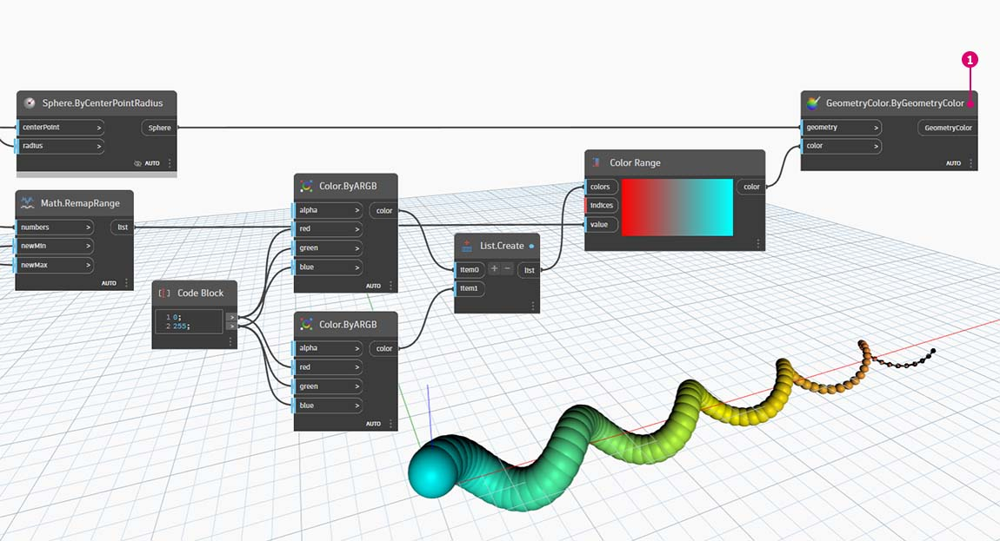

# Cor

A cor é um excelente tipo de dados para criar imagens atraentes, bem como para a diferença de renderização na saída do Programa visual. Ao trabalhar com dados abstratos e números variados, às vezes é difícil ver o que está mudando e até que ponto. Este é um ótimo aplicativo para cores.

### Criar cores

As cores no Dynamo são criadas usando entradas ARGB. Isso corresponde aos canais alfa, vermelho, verde e azul. O alfa representa a _transparência_ da cor, enquanto os outros três canais são usados como cores primárias para gerar todo o espectro de cores em conjunto.

| Ícone                                     | Nome (Sintaxe)                 | Entradas  | Saídas |
| ---------------------------------------- | ----------------------------- | ------- | ------- |
| .jpg>) | Cor ARGB (**Color.ByARGB**) | A,R,G,B | cor   |

### Consultar os valores de cor

As cores na tabela abaixo consultam as propriedades usadas para definir a cor: Alfa, Vermelho, Verde e Azul. Observe que o nó Color.Components nos fornece as quatro como resultados diferentes, o que torna este nó preferível para consultar as propriedades de uma cor.

| Ícone                                              | Nome (Sintaxe)                     | Entradas | Saídas    |
| ------------------------------------------------- | --------------------------------- | ------ | ---------- |
| (1) (2) (2).jpg>) | Alfa (**Color.Alpha**)           | cor  | A          |
|                    | Vermelho (**Color.Red**)               | cor  | R          |
| (1) (2) (1).jpg>) | Verde (**Color.Green**)           | cor  | G          |
|                   | Azul (**Color.Blue**)             | cor  | B          |
| .jpg>)       | Componentes (**Color.Components**) | cor  | A, R, G, B |

As cores na tabela abaixo correspondem ao **espaço de cores HSB**. A divisão das cores em matiz, saturação e brilho é, sem dúvida, algo mais intuitivo para a maneira como interpretamos as cores: qual deve ser a cor? Quão colorido deve ser? E quão clara ou escura deve ser a cor? Este é o detalhamento de matiz, saturação e brilho, respectivamente.

| Ícone                                         | Nome (Sintaxe)                     | Entradas | Saídas    |
| -------------------------------------------- | --------------------------------- | ------ | ---------- |
|               | Matiz (**Color.Hue**)               | cor  | Matiz        |
| .jpg>) | Saturação (**Color.Saturation**) | cor  | Saturação |
| .jpg>) | Brilho (**Color.Brightness**) | cor  | Brilho |

### Faixa de cores

A faixa de cores é similar ao nó **Remap Range** do exercício [\#part-ii-from-logic-to-geometry](3-logic.md#part-ii-from-logic-to-geometry "mention"): remapeia uma lista de números em outro domínio. Mas, em vez de mapear para um domínio de _números_, o mapeamento é feito para um _gradiente de cores_ com base nos números de entrada que variam de 0 a 1.

O nó atual funciona bem, mas pode ser um pouco estranho fazer com que tudo funcione da primeira vez. A melhor forma de se familiarizar com o gradiente de cores é testar o resultado de forma interativa. Vamos fazer um exercício rápido para rever como configurar um gradiente com cores de saída correspondentes aos números.

> 1. Definir três cores: usando um nó de  **bloco de código** defina _vermelho, verde_ e _azul_ inserindo as combinações apropriadas de _0_ e _255_.
> 2. **Criar lista:** mescle as três cores em uma lista.
> 3. Definir índices: crie uma lista para definir as posições da alça de cada cor (desde 0 até 1). Observe o valor de 0,75 para verde. Isso situa a cor verde a 3/4 do caminho através do gradiente horizontal no controle deslizante da faixa de cores.
> 4. **Bloco de código**: insira valores (entre 0 e 1) para converter em cores.

### Visualização da cor

O nó **Display.ByGeometry** fornece a capacidade de colorir a geometria na viewport do Dynamo. Isso é útil para separar diferentes tipos de geometria, demonstrando um conceito paramétrico ou definindo uma legenda de análise para simulação. As entradas são simples: geometria e cor. Para criar um gradiente como a imagem acima, a entrada de cor é conectada ao nó **Faixa** **de cores**.

### Cor em superfícies

O nó **Display.BySurfaceColors** fornece a capacidade de mapear dados em uma superfície usando a cor. Essa funcionalidade apresenta algumas possibilidades interessantes para visualizar os dados obtidos por meio de análise discreta, como solar, energia e proximidade. A aplicação de cor a uma superfície no Dynamo é semelhante à aplicação de uma textura a um material em outros ambientes CAD. Vamos demonstrar como usar essa ferramenta no breve exercício abaixo.

.jpg)

## Exercício

### Hélice básica com cores

> Faça o download do arquivo de exemplo clicando no link abaixo.
>
> É possível encontrar uma lista completa de arquivos de exemplo no Apêndice.



Este exercício foca no controle de cores parametricamente em paralelo com a geometria. A geometria é uma hélice básica, que definimos abaixo usando o **Bloco de código**. Essa é uma maneira rápida e fácil de criar uma função paramétrica; e, como nosso foco está na cor (e não na geometria), usamos o bloco de código para criar a hélice de forma eficiente sem sobrecarregar a tela. Usaremos o bloco de código com mais frequência à medida que o manual passar a abordar um material mais avançado.

> 1. **Bloco de código:** define os dois blocos de código com as fórmulas acima. Esse é um método paramétrico rápido para criar uma espiral.
> 2. **Point.ByCoordinates**: conecta as três saídas do bloco de código às coordenadas do nó.

Agora, vemos uma matriz de pontos criando uma hélice. A próxima etapa é criar uma curva através dos pontos de forma que possamos visualizar a hélice.

> 1. **PolyCurve.ByPoints:** conecta a saída **Point.ByCoordinates** à entrada _pontos_ do nó. Obtemos uma curva helicoidal.
> 2. **Curve.PointAtParameter:** conecta a saída **PolyCurve.ByPoints** à entrada _curva_. O propósito dessa etapa é criar um ponto paramétrico atrativo que desliza ao longo da curva. Como a curva está avaliando um ponto no parâmetro, precisaremos inserir um valor de _parâmetro_ entre 0 e 1.
> 3. **Controle deslizante de número:** após adicionar à tela, altere o valor _mín_ para _0,0_, o valor _máx_ para _1,0_ e o valor de _etapa_ para _0,01_. Conecte a saída do controle deslizante à entrada _parâmetro_ para **Curve.PointAtParameter**. Agora, vemos um ponto ao longo do comprimento da hélice, representado por uma porcentagem do controle deslizante (0 no ponto inicial, 1 no ponto final).

Com o ponto de referência criado, agora comparamos a distância do ponto de referência com os pontos originais que definem a hélice. Esse valor de distância determinará a geometria e a cor.

> 1. **Geometry.DistanceTo:** conecta a saída **Curve.PointAtParameter** à _entrada_. Conecte **Point.ByCoordinates** à entrada da geometria.
> 2. **Inspeção:** o resultado mostra uma lista de distâncias entre cada ponto helicoidal e o ponto de referência ao longo da curva.

A próxima etapa é determinar os parâmetros com a lista de distâncias, entre os pontos helicoidais e o ponto de referência. Usamos esses valores de distância para definir os raios de uma série de esferas ao longo da curva. Para manter as esferas em um tamanho adequado, precisamos _remapear_ os valores da distância.

> 1. **Math.RemapRange:** conecta a saída **Geometry.DistanceTo** à entrada dos números.
> 2. **Bloco de código:** conecta um bloco de código com um valor de _0,01_ à entrada _newMin_ e um bloco de código com um valor de _1_ à entrada _newMax_.
> 3. **Inspeção:** conecta a saída **Math.RemapRange** a um nó e a saída **Geometry.DistanceTo** a outro nó. Compare os resultados.

Essa etapa remapeou a lista de distâncias para um intervalo menor. Podemos editar os valores _newMin_ e _newMax_, conforme necessário. Os valores serão remapeados e terão a mesma _relação de distribuição_ em todo o domínio.

> 1. **Sphere.ByCenterPointRadius:** conecta a saída **Math.RemapRange** à entrada _raio_ e a saída original **Point.ByCoordinates** à entrada _centerPoint_.

Altere o valor do controle deslizante de número e observe o tamanho das esferas atualizadas. Agora, temos um modelo paramétrico

O tamanho das esferas demonstra a matriz paramétrica definida por um ponto de referência ao longo da curva. Vamos usar o mesmo conceito para o raio da esfera para determinar sua cor.

> 1. **Faixa de cores:** adiciona a parte superior da tela. Quando passamos o cursor sobre a entrada _valor_, notamos que os números solicitados estão entre 0 e 1. Precisamos remapear os números da saída **Geometry.DistanceTo** para que sejam compatíveis com esse domínio.
> 2. **Sphere.ByCenterPointRadius:** por enquanto, vamos desativar a visualização nesse nó (_clique com o botão direito do mouse > Visualização_).

> 1. **Math.RemapRange:** esse processo deverá ser familiar. Conecte a saída **Geometry.DistanceTo** à entrada de números.
> 2. **Bloco de código:** de forma semelhante a uma etapa anterior, crie um valor de _0_ para a entrada _newMin_ e um valor de _1_ para a entrada _newMax_. Neste caso, observe que podemos definir duas saídas de um único bloco de código.
> 3. **Faixa de cores:** conecte a saída **Math.RemapRange** à entrada _valor_.

> 1. **Color.ByARGB:** esse é o processo para criar duas cores. Embora esse processo possa parecer estranho, é o mesmo que as cores RGB em outro software, estamos apenas usando a programação visual para fazer isso.
> 2. **Bloco de código:** crie dois valores de _0_ e _255_. Conecte as duas saídas às duas entradas **Color.ByARGB** de acordo com a imagem acima (ou crie as duas cores favoritas).
> 3. **Faixa de cores:** a entrada _cores_ solicita uma lista de cores. É necessário criar essa lista com base nas duas cores criadas na etapa anterior.
> 4. **List.Create:** mescla as duas cores em uma lista. Conecte a saída à entrada _cores_ para a **Faixa de cores**.

> 1. **Display.ByGeometryColor:** conecta **Sphere.ByCenterPointRadius** à entrada _geometria_ e a _Faixa de cores_ à entrada _cor_. Agora temos um gradiente suave no domínio da curva.

Se alterarmos o valor do **Controle deslizante de número** anterior na definição, as cores e os tamanhos serão atualizados. As cores e o tamanho do raio estão diretamente relacionados neste caso: agora temos uma ligação visual entre dois parâmetros.

### Exercício de cor em superfícies

> Faça o download do arquivo de exemplo clicando no link abaixo.
>
> É possível encontrar uma lista completa de arquivos de exemplo no Apêndice.



Primeiro, é preciso criar (ou referenciar) uma superfície para usar como uma entrada para o nó **Display.BySurfaceColors**. Neste exemplo, estamos fazendo a transição entre uma curva seno e cosseno.

> 1. Esse grupo de nós está criando pontos ao longo do eixo Z e, em seguida, deslocando-os com base nas funções de seno e cosseno. As duas listas de pontos são, em seguida, usadas para gerar curvas NURBS.
> 2. **Surface.ByLoft**: gera uma superfície interpolada entre a lista de curvas NURBS.

> 1. **Caminho do arquivo**: selecione um arquivo de imagem de amostra com uso dos dados de pixel a jusante
> 2. **File.FromPath** para converter o caminho do arquivo em um arquivo e, em seguida, passar para **Image.ReadFromFile** para gerar uma imagem de amostra
> 3. **Image.Pixels**: insira uma imagem e forneça um valor de amostra para usar ao longo das dimensões x e y da imagem
> 4. **Controle deslizante**: fornece os valores para **Image.Pixels**
> 5. **Display.BySurfaceColors**: mapeia a matriz de valores de cores através da superfície ao longo de X e Y, respectivamente

Visualização aproximada da superfície de saída com resolução de 400 x 300 amostras

