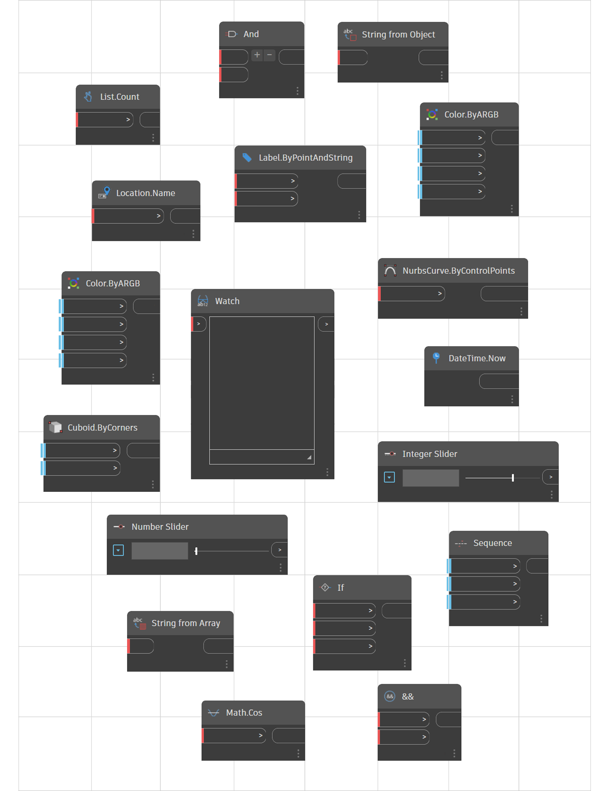

# Stavební bloky programů

Pro hlubší ponoření do vývoje vizuálních programů je potřeba lépe pochopit stavební bloky programu. Tato kapitola pokrývá základní koncepty týkající se dat, která jsou přenášena dráty v programu aplikace Dynamo.

