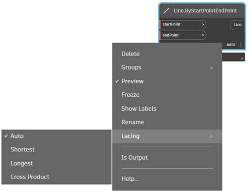
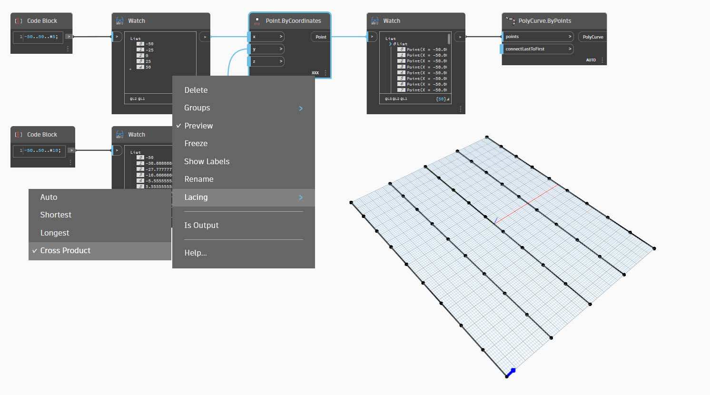

# O que é uma lista?

### O que é uma lista?

Uma lista é uma coleção de elementos ou de itens. Por exemplo, uma penca de bananas. Cada banana é um item na lista (ou penca). É mais fácil pegar uma penca de bananas em vez de cada banana individualmente, e o mesmo vale para agrupar elementos por relações paramétricas em uma estrutura de dados.

> Foto de [Augustus Binu](https://commons.wikimedia.org/wiki/File:Bananas\_white\_background\_DS.jpg?fastcci\_from=11404890\&c1=11404890\&d1=15\&s=200\&a=list).

Quando fazemos compras, colocamos todos os itens comprados em uma sacola. Essa sacola também é uma lista. Para fazer pão de banana, precisaremos de três pencas de bananas (vamos fazer _muito_ pão de banana). O saco representa uma lista de pencas de bananas e cada penca representa uma lista de bananas. O saco é uma lista de listas (bidimensionais) e a penca de bananas é uma lista (unidimensional).

No Dynamo, os dados da lista são ordenados e o primeiro item em cada lista tem um índice “0”. Abaixo, vamos discutir como as listas são definidas no Dynamo e como várias listas se relacionam entre si.

### Índices com base em zero

Uma coisa que pode parecer estranha no início é que o primeiro índice de uma lista é sempre 0; não 1. Portanto, quando falamos sobre o primeiro item de uma lista, na verdade, queremos dizer o item que corresponde ao índice 0.

Por exemplo, se você contasse o número de dedos que temos na mão direita, as chances são de que você teria contado de 1 a 5. No entanto, se você colocar seus dedos em uma lista, o Dynamo teria dado índices de 0 a 4. Embora isso possa parecer um pouco estranho para programadores iniciantes, o índice com base em zero é uma prática padrão na maioria dos sistemas de cálculo.

Observe que ainda temos cinco itens na lista; só que a lista está usando um sistema de contagem baseado em zero. E os itens que estão sendo armazenados na lista não precisam ser apenas números. Eles podem ser qualquer tipo de dados que o Dynamo suporta, como pontos, curvas, superfícies, famílias etc.

> a. Índice
>
> b. Ponto
>
> c. Item

Muitas vezes, a maneira mais fácil de analisar o tipo de dados armazenados em uma lista é conectar um nó de inspeção à saída de outro nó. Por padrão, o nó de inspeção exibe automaticamente todos os índices no lado esquerdo da lista e exibe os itens de dados na direita.

Esses índices são um elemento crucial ao trabalhar com listas.

### Entradas e saídas

Nas listas, as entradas e as saídas variam de acordo com o nó do Dynamo que está sendo usado. Como exemplo, vamos usar uma lista de cinco pontos e conectar essa saída a dois nós diferentes do Dynamo: **PolyCurve.ByPoints** e **Circle.ByCenterPointRadius**:

> 1. A entrada _pontos_ para **PolyCurve.ByPoints** está procurando _“Point[]”_. Isso representa uma lista de pontos
> 2. A saída para **PolyCurve.ByPoints** é uma policurva única criada com base em uma lista de cinco pontos.
> 3. A entrada _centerPoint_ para **Circle.ByCenterPointRadius** solicita _“Ponto”_.
> 4. A saída para **Circle.ByCenterPointRadius** é uma lista de cinco círculos, cujos centros correspondem à lista original de pontos.

Os dados de entrada para **PolyCurve.ByPoints** e **Circle.ByCenterPointRadius** são os mesmos. No entanto, o nó **Polycurve.ByPoints** gera uma policurva, enquanto o nó **Circle.ByCenterPointRadius** gera cinco círculos com centros em cada ponto. Isso faz sentido intuitivamente: a policurva é desenhada como uma curva que conecta os cinco os pontos, enquanto os círculos criam um círculo diferente em cada ponto. O que está acontecendo com os dados?

Passando o cursor do mouse sobre a entrada _pontos_ para **Polycurve.ByPoints**, vemos que a entrada está procurando _“Point[]”_. Observe os colchetes no final. Isso representa uma lista de pontos e, para criar uma policurva, a entrada precisa ser uma lista para cada policurva. Esse nó, portanto, condensará cada lista em uma policurva.

Por outro lado, a entrada _centerPoint_ para **Circle.ByCenterPointRadius** solicita _“Ponto”_. Esse nó procura um ponto, como um item, para definir o ponto central do círculo. É por isso que obtemos cinco círculos com base nos dados de entrada. Reconhecer essa diferença com as entradas no Dynamo ajuda a compreender melhor como os nós funcionam ao gerenciar os dados.

### Amarra

A correspondência de dados é um problema sem uma solução fácil. Isso ocorre quando um nó tem acesso a entradas de tamanhos diferentes. Alterar o algoritmo de correspondência de dados pode gerar resultados muito diferentes.

Imagine um nó que cria segmentos de linha entre pontos (**Line.ByStartPointEndPoint**). Ele terá dois parâmetros de entrada que fornecem as coordenadas dos pontos:

#### Lista mais curta

A maneira mais simples é conectar as entradas individualmente até que um dos fluxos se esgote. Isso é denominado algoritmo “Lista mais curta”. Este é o comportamento padrão dos nós do Dynamo:

#### Lista mais longa

O algoritmo “Lista mais longa” continua conectando entradas, reusando elementos, até que todos os fluxos se esgotem:

#### Produto transversal

Por fim, o método “Produto transversal” torna todas as conexões possíveis:

Como você pode ver, há diferentes maneiras de desenhar linhas entre estes conjuntos de pontos. É possível encontrar as opções de amarra clicando com o botão direito do mouse no centro de um nó e selecionando o menu “Amarra”.

### O que é replicação?

Imagine que você tem um cacho de uvas. Se você quisesse fazer suco de uva, não espremeria cada uva individualmente, mas sim colocaria todas no espremedor de uma vez. A replicação no Dynamo funciona de forma semelhante: em vez de aplicar uma operação a um item por vez, o Dynamo pode aplicá-la a uma lista inteira de uma só vez.

Os nós do Dynamo reconhecem automaticamente quando estão trabalhando com listas e aplicam suas operações em vários elementos. Isso significa que você não precisa percorrer os itens manualmente: isso simplesmente acontece. Mas como o Dynamo decide como processar listas quando há mais de uma?

Há duas formas principais:

#### Replicação cartesiana
Digamos que você esteja na cozinha, fazendo sucos de frutas. Você tem uma lista de frutas: `{apple, orange, pear}` e uma quantidade fixa de água para cada suco: `1 cup`. Você quer fazer um suco com cada fruta, usando a mesma quantidade de água. Nesse caso, a replicação cartesiana entra em ação.

No Dynamo, isso significa que você está alimentando a lista de frutas na entrada de frutas do nó Juice.Maker, enquanto a entrada de água permanece constante em 1 xícara. O nó então processa cada fruta individualmente, combinando-a com a quantidade fixa de água. O resultado é:

`apple juice with 1 cup of water` `orange juice with 1 cup of water` `pear juice with 1 cup of water`

Cada fruta é combinada com a mesma quantidade de água.

#### Replicação zip
A replicação zip funciona de forma um pouco diferente. Se você tivesse duas listas, uma para frutas: `{apple, orange, pear}` e outra para quantidades de açúcar: `{2 tbsp, 3 tbsp, 1 tbsp}`, a replicação zip combinaria os itens correspondentes de cada lista. Por exemplo:

`apple juice with 2 tablespoons of sugar` `orange juice with 3 tablespoons of sugar` `pear juice with 1 tablespoon of sugar`

Cada fruta é combinada com a quantidade correspondente de açúcar.

Para uma análise mais profunda sobre como isso funciona, confira os [Guias de replicação e amarra](https://github.com/DynamoDS/Dynamo/wiki/Replication-and-Replication-Guide-Part-1).

## Exercício

> Faça o download do arquivo de exemplo clicando no link abaixo.
>
> É possível encontrar uma lista completa de arquivos de exemplo no Apêndice.



Para demonstrar as operações de amarra abaixo, vamos usar esse arquivo base para definir a lista mais curta, a lista mais longa e o produto transversal.

Vamos alterar a amarra em **Point.ByCoordinates**, mas não alteraremos mais nada no gráfico acima.

### Lista mais curta

Escolhendo _lista mais curta_ como a opção de amarra (também é a opção padrão), obtemos uma linha diagonal básica composta por cinco pontos. Cinco pontos são o comprimento da lista menor; portanto, a amarra da lista mais curta é interrompida após atingir o final de uma lista.

### **Lista mais longa**

Alterando a amarra para _lista mais longa_, obtemos uma linha diagonal que se estende verticalmente. Pelo mesmo método que o diagrama conceitual, o último item na lista de cinco itens será repetido para alcançar o comprimento da lista mais longa.

### **Produto transversal**

Alterando a amarra para _Produto transversal_, temos todas as combinações entre cada lista, dando-nos uma grade de pontos 5 x 10. Essa é uma estrutura de dados equivalente ao produto transversal, como mostrado no diagrama conceitual acima, exceto pelo fato de que nossos dados agora são uma lista de listas. Conectando uma policurva, podemos ver que cada lista é definida pelo seu valor X, dando-nos uma linha de linhas verticais.

