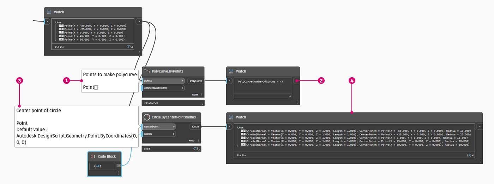

# 什么是列表

### 什么是列表？

列表是元素或项目的集合。以一串香蕉为例。每个香蕉都是列表（或串）中的一个项目。拾取一串香蕉比单独拾取每个香蕉要容易得多，同样适用于通过数据结构中的参数化关系对元素进行分组。

> 照片由 [Augustus Binu](https://commons.wikimedia.org/wiki/File:Bananas\_white\_background\_DS.jpg?fastcci\_from=11404890\&c1=11404890\&d1=15\&s=200\&a=list) 提供。

当我们购买生活用品时，我们会将所有购买物品放入一个袋子中。这个袋子也是一个列表。如果我们要制作香蕉面包，需要 3 束香蕉（我们要制作 _许多_ 香蕉面包）。袋子表示一列香蕉串，每串表示一列香蕉。袋子是一列列表（二维），香蕉串是一个列表（一维）。

在 Dynamo 中，会对列表数据进行排序，并且每个列表中第一项的索引均为“0”。下面，我们将讨论如何在 Dynamo 中定义列表以及如何将多个列表相互关联。

### 基于零的索引

乍看起来可能有些奇怪的是，列表的第一个索引始终为 0，而不是 1。因此，当我们谈论列表的第一项时，实际上是指对应于索引 0 的项。

例如，如果要计算我们右手的手指数，则很有可能您的计数是 1 到 5。但是，如果要将手指放入列表，Dynamo 会为其指定索引 0 到 4。尽管这对于编程初学者来说似乎有些奇怪，但是从零开始的索引是大多数计算系统中的标准做法。

请注意，列表中仍有 5 个项目；只是列表使用的是基于零的计数系统。而且，列表中存储的项目并不仅限于数字。它们可以是 Dynamo 支持的任何数据类型，例如点、曲线、曲面、族等。

> a.索引
>
> b.点
>
> c.项目

通常，查看列表中存储的数据类型的最简单方法是将“Watch”节点连接到另一个节点的输出。默认情况下，观察节点自动将所有索引显示在列表的左侧，并在右侧显示数据项。

这些索引是使用列表时的关键元素。

### 输入和输出

与列表相关，输入和输出因使用的 Dynamo 节点而异。例如，我们使用一列 5 个点，并将该输出连接到两个不同的 Dynamo 节点：**”PolyCurve.ByPoints”**和**“Circle.ByCenterPointRadius”**：

> 1. **“PolyCurve.ByPoints”** 的 _“points”_ 输入正在查找 _“Point[]”_。这表示一列点
> 2. **“PolyCurve.ByPoints”** 的输出是基于一列五个点所创建的一条复合线。
> 3. **“Circle.ByCenterPointRadius”** 的 _“centerPoint”_ 输入要求提供 _“Point”_。
> 4. **“Circle.ByCenterPointRadius”** 的输出是一列五个圆，其中心与点的原始列表相对应。

**“PolyCurve.ByPoints”** 和 **“Circle.ByCenterPointRadius”** 的输入数据相同，但 **“Polycurve.ByPoints”** 节点会提供一条复合线，而 **“Circle.ByCenterPointRadius”** 节点会提供 5 个圆（中心位于每个点处）。直观地讲，这很有意义：将复合线绘制为连接 5 个点的曲线，而圆在每个点处创建不同的圆。数据发生了什么变化？

通过将光标悬停在 **“Polycurve.ByPoints”** 的 _“points”_ 输入上，我们会看到该输入正在查找 _“Point[]”_。请注意末端的括号。这表示一列点，并且要创建复合线，输入需要每个复合线是一个列表。因此，该节点会将每个列表压缩为一个复合线。

另一方面，**“Circle.ByCenterPointRadius”** 的 _“centerPoint”_ 输入要求提供 _“Point”_。此节点会查找一个点作为项目，以定义圆的圆心。这就是我们基于输入数据获得五个圆的原因。在 Dynamo 中识别输入的这些差异有助于在管理数据时更好地了解节点的运行方式。

### 连缀

在没有清晰解决方案的情况下，数据匹配会是一个问题。当节点有权访问不同大小的输入时，就会发生这种情况。更改数据匹配算法可能会导致结果差异极大。

假定在各点之间创建线段的节点（**“Line.ByStartPointEndPoint”**）。它将有两个输入参数，两个输入参数均提供点坐标：

#### 最短列表

最简单的方法是逐一连接输入，直到其中一个流运行干。这称为“最短列表”算法。这是 Dynamo 节点的默认行为：

#### 最长列表

“最长列表”算法会一直连接输入、重用元素，直到所有流都流干为止：

#### 笛卡尔积

最后，“笛卡尔积”方法可以建立所有可能的连接：

如您所见，我们可以通过不同的方式在这些点集之间绘制直线。通过在某个节点的中心上单击鼠标右键并选择“连缀”菜单，即可找到连缀选项。

### 什么是复制？

想象一下你有一串葡萄。如果您想制作葡萄汁，您不会一颗一颗地榨葡萄——您会把它们一次全部放进榨汁机。Dynamo 中的数据同步工作方式类似：Dynamo 可以一次性将操作应用于整个列表，而不是一次将操作应用于一个条目。

Dynamo 节点会自动识别何时使用列表，并在多个图元之间应用其操作。这意味着您不必手动遍历条目 - 它会自行发生。但是，当存在多个列表时，Dynamo 决定如何处理列表？

主要有两种方法：

#### 笛卡尔复制
假设您在厨房里制作果汁。您有一个水果清单：`{apple, orange, pear}` 和每种果汁的固定量的水：`1 cup`。您想用每种水果制作果汁，用相同量的水。在这种情况下，笛卡尔复制开始发挥作用。

在 Dynamo 中，这意味着将水果清单输入到 Juice.Maker 节点的水果输入，而水输入保持不变，为 1 杯。然后，该节点单独处理每个水果，将其与固定量的水混合。结果为：

`apple juice with 1 cup of water` `orange juice with 1 cup of water` `pear juice with 1 cup of water`

每个水果都与相同数量的水配对。

#### Zip 复制
Zip 复制的工作方式略有不同。如果您有两个列表，一个用于水果：`{apple, orange, pear}`，另一个用于糖量：`{2 tbsp, 3 tbsp, 1 tbsp}`，Zip 复制将合并每个列表中的相应项目。例如：

`apple juice with 2 tablespoons of sugar` `orange juice with 3 tablespoons of sugar` `pear juice with 1 tablespoon of sugar`

每个水果都搭配其相应数量的糖。

要更深入地了解其工作原理，请查看[复制和连缀手册](https://github.com/DynamoDS/Dynamo/wiki/Replication-and-Replication-Guide-Part-1)。

## 练习

> 单击下面的链接下载示例文件。
>
> 可以在附录中找到示例文件的完整列表。



为了演示下面的连缀操作，我们将使用此基础文件定义最短列表、最长列表和笛卡尔积。

我们将更改 **“Point.ByCoordinates”** 上的连缀，但不会更改有关上图的其他任何内容。

### 最短列表

通过选择 _“最短列表”_ 作为连缀选项（也是默认选项），我们会得到一条由五个点组成的基本对角线。五个点是较小列表的长度，因此最短列表连缀在到达一个列表的末尾后即停止。

### **最长列表**

通过将连缀更改为 _“最长列表”_，我们得到一条垂直延伸的对角线。采用与概念图相同的方法，将重复该列表的 5 个项目中的最后一项，以达到较长列表的长度。

### **笛卡尔积**

通过将连缀更改为 _“笛卡尔积”_，我们得到每个列表之间的每个组合，从而获得 5x10 点栅格。这是与上述概念图中所示的笛卡尔积等效的数据结构，但数据现在是一列列表。通过连接复合线，我们可以看到每个列表均由其 X 值定义，从而得到一行垂直线。

