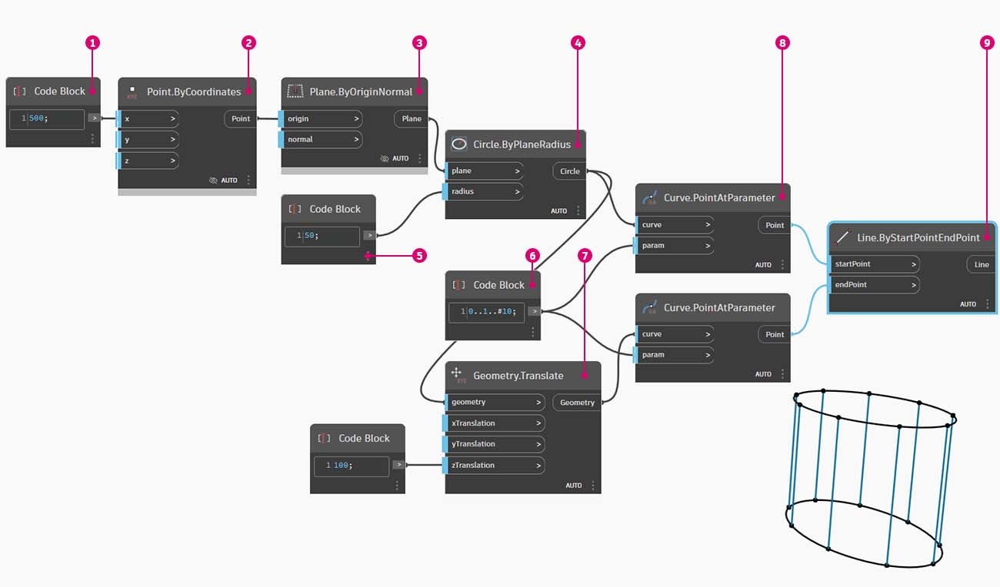
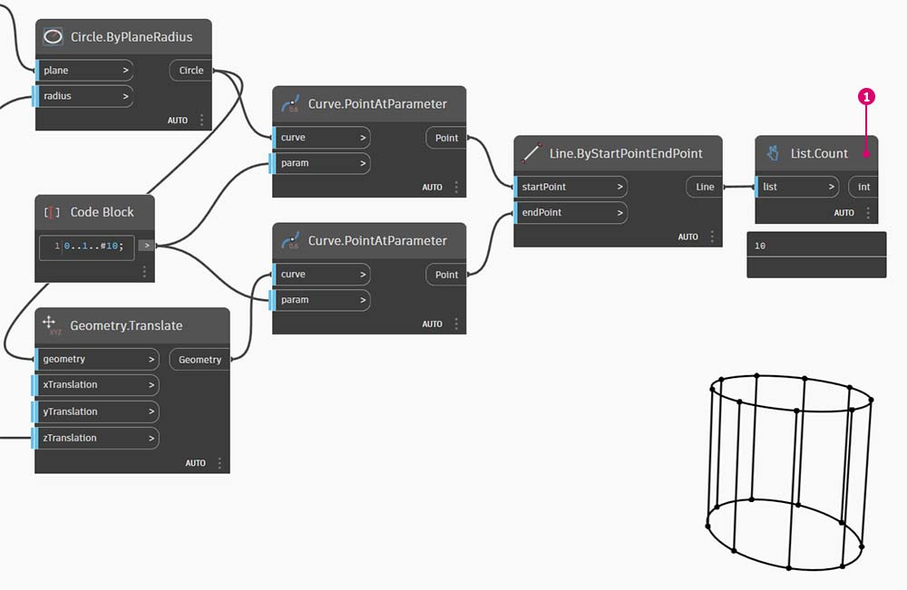
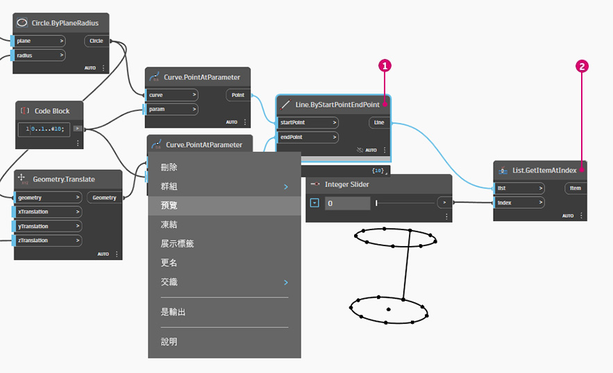
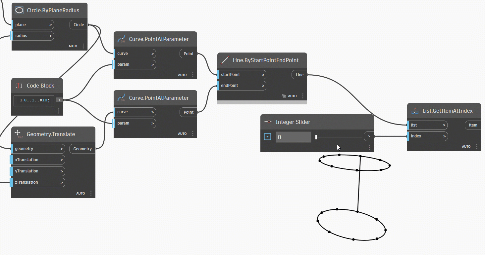
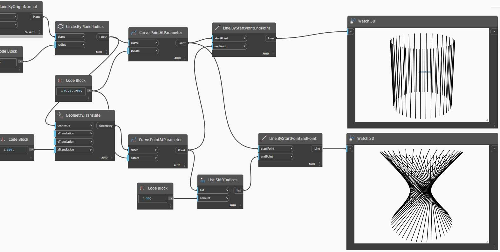

# Работа со списками

### Работа со списками

Определившись с тем, что такое список, поговорим о том, какие операции можно выполнять с ним. Представим список в виде колоды карт. Колода — это список, а каждая карта — элемент.

> Фото предоставлено [Кристианом Гидлефом (Christian Gidlöf)](https://commons.wikimedia.org/wiki/File:Playing\_cards\_modified.jpg)

### Запрос

Какие **запросы** доступны в списке? Это возможность вызова существующих свойств.

* Сколько карт в колоде? 52\.
* Количество мастей? 4\.
* Из какого материала они изготовлены? Бумага.
* Какова их длина? 3,5 дюйма, или 89 мм.
* Какова их ширина? 2,5 дюйма, или 64 мм.

### Действие

Какие **действия** можно выполнять со списком? Это изменяет список в зависимости от конкретной операции.

* Колоду можно перемешать.
* Колоду можно отсортировать по значению.
* Колоду можно отсортировать по масти.
* Колоду можно разделить.
* Колоду можно раздать отдельным игрокам.
* Можно выбрать отдельную карту из колоды.

У всех перечисленных выше операций есть аналогичные узлы Dynamo для работы со списками типовых данных. На уроке ниже будут рассмотрены основные операции, которые можно выполнять со списками.

## **Упражнение**

### **Операции со списками**

> Скачайте файл примера, щелкнув указанную ниже ссылку.
>
> Полный список файлов с примерами можно найти в приложении.



На изображении ниже показан базовый график для построения линий между двумя окружностями с целью представления основных операций со списками. Далее рассматривается управление данными в списке и демонстрируются визуальные результаты с помощью действий со списком.

> 1. Начните с узла **Code Block** со значением `500;`.
> 2. Соедините его с входным параметром «x» узла **Point.ByCoordinates**.
> 3. Соединим узел из предыдущего шага с входным параметром origin узла **Plane.ByOriginNormal**.
> 4. Соединим узел из предыдущего шага с входным параметром plane узла **Circle.ByPlaneRadius**
> 5. С помощью узла **Code Block** укажите значение `50;` в качестве значения параметра radius. Это будет первая окружность.
> 6. С помощью узла **Geometry.Translate** переместим окружность вверх на 100 единиц в направлении Z.
> 7. С помощью узла **Code Block** задайте диапазон из десяти чисел от 0 до 1, используя следующую строку кода: `0..1..#10;`.
> 8. Соединим блок кода из предыдущего шага с входным значением _param_ двух узлов **Curve.PointAtParameter**. Соединим узел **Circle.ByPlaneRadius** с входным параметром curve верхнего узла, а узел **Geometry.Translate** с входным параметром curve узла под ним.
> 9. С помощью узла **Line.ByStartPointEndPoint** соедините два узла **Curve.PointAtParameter**.

### List.Count

> Скачайте файл с примером, щелкнув ссылку ниже.
>
> Полный список файлов с примерами можно найти в приложении.



Узел _List.Count_ сравнительно прост: он подсчитывает количество значений в списке и возвращает это число. При работе со списками списков в использовании этого узла появляются дополнительные нюансы. О них мы поговорим в следующих разделах.

> 1. Узел **List.Count **_****_ возвращает количество линий в узле **Line.ByStartPointEndPoint**. В данном случае значение равно 10, что соответствует количеству точек, созданных с помощью исходного узла **Code Block**.

### List.GetItemAtIndex

> Скачайте файл с примером, щелкнув ссылку ниже.
>
> Полный список файлов с примерами можно найти в приложении.



**List.GetItemAtIndex** — основной способ запроса элемента в списке.

> 1. Сначала щелкните правой кнопкой мыши узел **Line.ByStartPointEndPoint**, чтобы отключить его предварительный просмотр.
> 2. С помощью узла **List.GetItemAtIndex** выбираем индекс _0_ или первый элемент в списке линий.

Измените значение регулятора от 0 до 9, чтобы выбрать другой элемент с помощью **List.GetItemAtIndex**.

### List.Reverse

> Скачайте файл с примером, щелкнув ссылку ниже.
>
> Полный список файлов с примерами можно найти в приложении.



Узел _List.Reverse_ располагает все элементы в списке в обратном порядке.

> 1. Для корректной визуализации обращенного списка линий создайте дополнительные линии, изменив значение узла **Code Block** на `0..1..#50;`.
> 2. Создайте копию узла **Line.ByStartPointEndPoint**, вставьте узел List.Reverse между узлом **Curve.PointAtParameter** и вторым узлом **Line.ByStartPointEndPoint**.
> 3. Используйте узлы **Watch3D** для предварительного просмотра двух различных результатов. Первый узел показывает результат без обращенного списка. Линии соединяются вертикально с точками напротив. Второй узел показывает результат обращения списка, где все точки соединяются с точками напротив в обратном порядке.

### List.ShiftIndices 

> Скачайте файл примера, щелкнув указанную ниже ссылку.
>
> Полный список файлов с примерами можно найти в приложении.



**List.ShiftIndices** — это удобный инструмент для создания скручиваний или спиралей и других подобных манипуляций с данными. Этот узел смещает элементы в списке на заданное количество индексов.

> 1. В том же сценарии, где был создан обращенный список, вставьте узел **List.ShiftIndices** между узлами **Curve.PointAtParameter** и **Line.ByStartPointEndPoint**.
> 2. С помощью узла **Code Block** укажите значение 1 для сдвига списка на один индекс.
> 3. Изменение незначительное, но все линии в нижнем узле **Watch3D** сместились на один индекс при соединении с другим набором точек.

Если увеличить значение в узле **Block Code**, например, до _30_, в диагональных линиях появляется существенное различие. В данном случае сдвиг работает аналогично диафрагме камеры, закручивая исходную цилиндрическую форму.

### List.FilterByBooleanMask 

> Скачайте файл примера, щелкнув указанную ниже ссылку.
>
> Полный список файлов с примерами можно найти в приложении.



Узел **List.FilterByBooleanMask** удаляет определенные элементы на основе списка логических операций или значений «Истина»/«Ложь».

Чтобы создать список значений «Истина» или «Ложь», необходимо выполнить несколько дополнительных действий.

> 1. С помощью узла **Code Block** задайте выражение со следующим синтаксисом: `0..List.Count(list);`. Соединим узел **Curve.PointAtParameter** с входным параметром _list_. Этот процесс будет рассмотрен подробнее в главе о блоках кода, но в данном случае строка кода дает список, где представлены все индексы узла **Curve.PointAtParameter**.
> 2. С помощью узла _**%**_** (модуль)** соедините выходной параметр узла _Code Block_ с входным параметром _x_, а значение _4_ с входным параметром _y_. Это позволит вычислить остаток при делении списка индексов на 4. Узел «Коэффициент» очень полезен при создании массивов. Все значения будут представлять собой возможный остаток от 4: 0, 1, 2, 3.
> 3. Благодаря узлу _**%**_** (модуль)** мы знаем, что значение 0 означает делимость индекса на 4 (0, 4, 8 и т. д.). С помощью узла **==** можно проверить делимость по значению _0_.
> 4. Узел **Watch** выводит лишь следующий результат: массив истинных и ложных значений в виде _true,false,false,false...._.
> 5. Соедините этот массив с входным параметром mask обоих узлов **List.FilterByBooleanMask**.
> 6. Соедините узел **Curve.PointAtParameter** с входными параметрами list узла **List.FilterByBooleanMask**.
> 7. Выходными данными для **Filter.ByBooleanMask** будут _in_ и _out_. _In_ — это значения, которым было присвоено значение маски _true_, а _out_ — значения, которым было присвоено значение _false_. Соедините выходные параметры _in_ с входными параметрами _startPoint_ и _endPoint_ узла **Line.ByStartPointEndPoint**, создав тем самым отфильтрованный список линий.
> 8. Узел **Watch3D** показывает, что количество линий меньше, чем количество точек. Отфильтровав только истинные значения, мы выбрали 25 % узлов.
