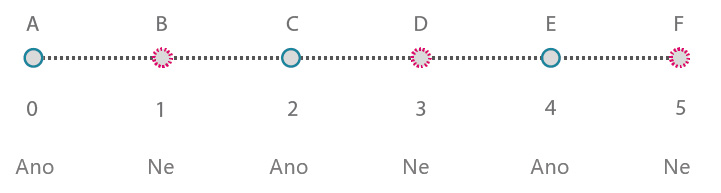

# リストの操作

### リストの操作

リストとは何かということを理解したところで、ここからは、リストに対して実行できる操作について見ていきます。ここでは、リストをトランプのカードだと考えてください。1 組のトランプがリストで、1 枚 1 枚のカードが 1 つの項目ということになります。

> 写真: [Christian Gidlef](https://commons.wikimedia.org/wiki/File:Playing\_cards\_modified.jpg)

### Query

リストに関する質問(**クエリー**)を作成する場合、次のような質問が考えられます。これにより、リストの特性(プロパティ)がわかります。

* Q: カードの数は?52.
* Q: スートの数は?4.
* Q: 素材は?A: 紙
* Q: 長さは?A: 89 ミリ
* Q: 幅は?A: 64 ミリ

### Action

リストに対して実行できる操作(**アクション**)としては、次のような操作が考えられます。この場合、実行する操作に応じてリストが変化します。

* カードをシャッフルする。
* 数字の順にカードを並べ替える。
* スート別にカードを並べ替える。
* カード全体をいくつかに分割する。
* 各プレーヤにカードを配ることにより、カード全体をいくつかに分割する。
* デッキから特定のカードを選ぶ。

Dynamo では、これらの操作に似た操作を実行することができます。その場合、Dynamo の各ノードを使用して、一般的なデータのリストを操作することになります。これ以降の各演習では、リストに対して実行できる基本的な操作をいくつか見ていきます。

## **演習**

### **リスト操作**

> 下のリンクをクリックして、サンプル ファイルをダウンロードします。
>
> すべてのサンプル ファイルの一覧については、付録を参照してください。



下の図は、2 つの円の間に線を引いて基本的なリスト操作を表しているベース グラフです。リスト内のデータを管理する方法を紹介し、次のリスト アクションを使用して視覚的な結果を示します。

> 1. 最初に、`500;` という値が表示されている **Code Block** ノードを使用します。
> 2. 上記の Code Block ノードを **Point.ByCoordinates** ノードの x 入力に接続します。
> 3. 上記のノードを **Plane.ByOriginNormal** ノードの origin 入力に接続します。
> 4. Plane.ByOriginNormal ノードを **Circle.ByPlaneRadius** ノードの plane 入力に接続します。
> 5. **Code Block** ノードを使用して、radius の値を `50;` に設定します。これは、最初に作成する円の半径です。
> 6. **Geometry.Translate** ノードを使用して、上記の円を Z の正の向きに 100 単位移動します。
> 7. **Code Block** ノードで `0..1..#10;` というコードを指定して、0 から 1 までの範囲で 10 個の数字を定義します。
> 8. 上記の Code Block ノードを 2 つの **Curve.PointAtParameter** ノードの _param_ 入力に接続します。次に、上部に配置されている方の Curve.PointAtParameter ノードの curve 入力に **Circle.ByPlaneRadius** ノードを接続し、下部に配置されている方の Curve.PointAtParameter ノードの curve 入力に **Geometry.Translate** ノードを接続します。
> 9. **Line.ByStartPointEndPoint** ノードを使用して、2 つの **Curve.PointAtParamete _r_** ノードを接続します。

### List.Count

> 下のリンクをクリックして、サンプル ファイルをダウンロードします。
>
> すべてのサンプル ファイルの一覧については、付録を参照してください。



_List.Count_ ノードは、リスト内の値の数をカウントしてその数を返すという単純なノードです。「リストのリスト」を操作する場合は、このノードの使用方法も多少複雑になりますが、それについてはこれ以降のセクションで説明します。

> 1. **List.Count **_****_ ノードは、**Line.ByStartPointEndPoint** ノード内の線分の数を返します。この場合は 10 という値が返されますが、これは、元の **Code Block** ノードで作成した点の数に対応しています。

### List.GetItemAtIndex

> 下のリンクをクリックして、サンプル ファイルをダウンロードします。
>
> すべてのサンプル ファイルの一覧については、付録を参照してください。



**List.GetItemAtIndex** ノードは、リスト内の項目のクエリーを実行するための基本的な方法です。

> 1. まず、**Line.ByStartPointEndPoint** ノードを右クリックして、プレビューをオフにします。
> 2. **List.GetItemAtIndex** ノードを使用して、インデックス値「_0_」を選択するか、線分のリスト内の先頭の項目を選択します。

スライダの値を 0 から 9 の間で変更し、**List.GetItemAtIndex** ノードを使用して別の項目を選択します。

### List.Reverse

> 下のリンクをクリックして、サンプル ファイルをダウンロードします。
>
> すべてのサンプル ファイルの一覧については、付録を参照してください。



_List.Reverse_ ノードは、リスト内のすべての項目の順序を逆にします。

> 1. 順序が逆になった線分のリストをわかりやすく表示するために、**Code Block** を `0..1..#50;` に変更して線分の数を増やします。
> 2. **Line.ByStartPointEndPoint** ノードを複製し、**Curve.PointAtParameter** ノードと 2 番目の **Line.ByStartPointEndPoint** ノードの間に List.Reverse ノードを挿入します。
> 3. **Watch3D** ノードを使用して、2 つの異なる結果をプレビューします。一方のノードには、リストが反転されていない結果が表示されます。それぞれの線分が、対応する点に対して垂直に接続されています。もう一方のノードには、反転していないリストとは逆の順序で、すべての点が接続されます。

### List.ShiftIndices

> 下のリンクをクリックして、サンプル ファイルをダウンロードします。
>
> すべてのサンプル ファイルの一覧については、付録を参照してください。



**List.ShiftIndices** ノードは、ねじれパターンやらせんパターンなどを作成する場合に便利なノードです。 このノードは、指定されたインデックス値の分だけ、リスト内の項目を移動します。

> 1. List.Reverse ノードの場合と同様に、**List.ShiftIndices** ノードを **Curve.PointAtParameter** ノードと **Line.ByStartPointEndPoint** ノードの間に挿入します。
> 2. **Code Block** ノードを使用して、リストを移動するインデックス値として「1」を指定します。
> 3. この場合の変化はわずかですが、下部に表示されている方の **Watch3D** ノード内のすべての線分が、インデックス 1 つ分だけ横にずれた点に接続されています。

**Code Block** ノードの値を「_30_」などの大きな値に変更すると、すべての線分が大きく変化することがわかります。元の円柱形状がこのように変化する動作は、カメラの絞りによく似ています。

### List.FilterByBooleanMask

> 下のリンクをクリックして、サンプル ファイルをダウンロードします。
>
> すべてのサンプル ファイルの一覧については、付録を参照してください。



**List.FilterByBooleanMask** ノードは、ブール値のリストに基づいて、特定の項目を削除します。ブール値とは、「true」または「false」を読み取る値のことです。

「true」または「false」を読み取る値のリストを作成するには、次の手順を実行します。

> 1. **Code Block** ノードを使用して、`0..List.Count(list);` という構文の式を作成します。次に、**Curve.PointAtParameter** ノードを _list_ 入力に接続します。この設定については、Code Block の章で詳しく説明します。ここでは、上記の構文を使用すると、**Curve.PointAtParameter** ノードの各インデックス値を表すリストが作成されるということだけを覚えてください。
> 2. **剰余演算**を処理する「_**%**_」ノードを使用して、_Code Block_ ノードの出力を _x_ 入力に接続し、_4_ という値を _y_ 入力に接続します。この操作により、インデックス値のリストを 4 で割った場合の余りが取得されます。剰余演算を処理する「%」ノードは、パターンを作成する場合に非常に便利なノードです。たとえば、整数を 4 で割った場合の余りは、0、1、2、3 のいずれかになります。
> 3. **剰余演算**を処理する「_**%**_」ノードの値が 0 になっている場合、インデックス値は 4 で割り切れる数値(0、4、8 など)であるということがわかります。「**==** 」ノードを使用して、インデックス値を「_0_」という値に対してテストすると、そのインデックス値が割り切れる数値であるかどうかを判断することができます。
> 4. **Watch** ノードには、_true,false,false,false..._ というパターンでテストの結果が表示されます。
> 5. この true/false のパターンを使用して、2 つの **List.FilterByBooleanMask** ノードの mask 入力に接続します。
> 6. **Curve.PointAtParameter** ノードを、2 つの **List.FilterByBooleanMask** ノードの list 入力に接続します。
> 7. **List.FilterByBooleanMask** の出力が _in_ と _out_ から読み取られます。 _in_ は、「_true_」というマスク値を持つ値を表し、_out_ は、「_false_」というマスク値を持つ値を表します。_in_ 出力を **Line.ByStartPointEndPoint** ノードの _startPoint_ 入力と _endPoint_ 入力に接続すると、フィルタされた線分のリストが作成されます。
> 8. 下部に表示されている方の **Watch3D** ノードに、線分の数が点の数よりも少ない円柱が表示されます。 フィルタ処理で true の値だけに絞り込んだため、ノードの 25% だけが選択されました。
