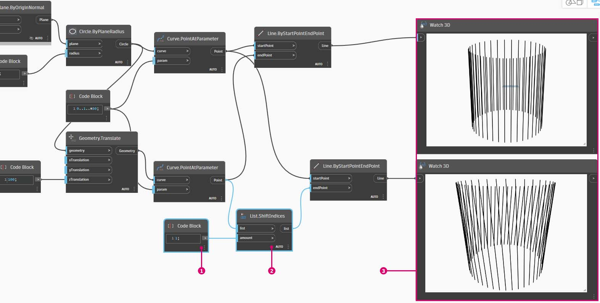
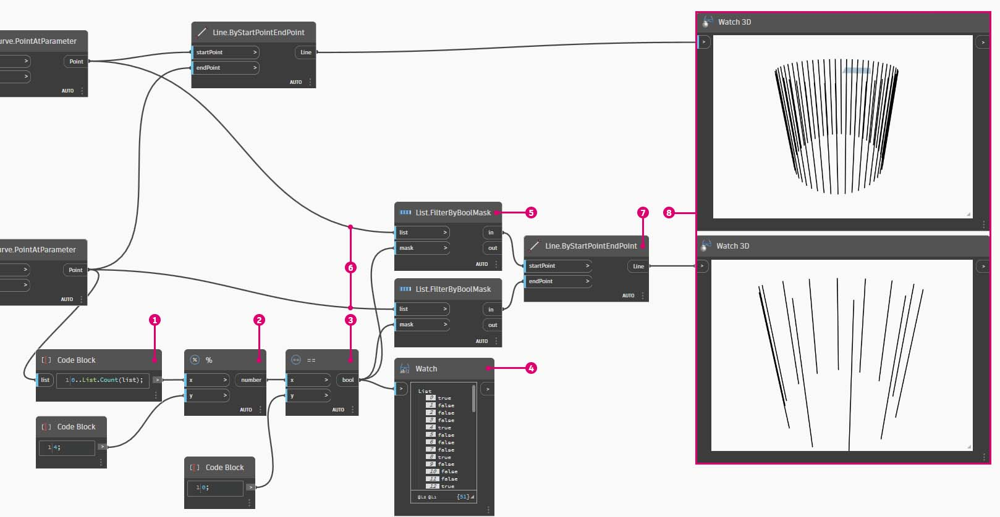

# Práce se seznamy

### Práce se seznamy

Teď, když jsme stanovili, co je to seznam, pojďme si promluvit o operacích, které s ním můžeme provádět. Představte si seznam jako balíček karet. Seznam je balíček a každá karta představuje položku.

> Autor fotografie: [Christian Gidlöf](https://commons.wikimedia.org/wiki/File:Playing\_cards\_modified.jpg)

### Dotaz

Jaké **dotazy** ze seznamu vytvoříme? Tím získáte přístup k existujícím vlastnostem.

* Počet karet v balíčku? 52\.
* Počet barev? 4\.
* Materiál? Papír.
* Délka? 3.5" nebo 89 mm.
* Šířka? 2.5" nebo 64 mm.

### Akce

Jaké **akce** můžeme se seznamem provést? Tím se změní seznam podle dané operace.

* Můžeme zamíchat balíček.
* Můžeme ho seřadit podle hodnot.
* Můžeme ho seřadit podle barev.
* Můžeme balíček rozdělit.
* Můžeme balíček rozdělit rozdáním karet.
* Můžeme z balíčku vybrat konkrétní kartu.

Všechny výše uvedené operace mají analogické uzly aplikace Dynamo pro práci se seznamy obecných dat. Níže uvedené lekce ukážou některé základní operace, které můžeme provádět na seznamech.

## **Cvičení**

### **Operace se seznamem**

> Kliknutím na odkaz níže si stáhněte vzorový soubor.
>
> Úplný seznam vzorových souborů najdete v dodatku.



Obrázek níže je základní graf, ve kterém nakreslíme čáry mezi dvěma kružnicemi, které představují základní operace se seznamy. Prozkoumáme, jak spravovat data v seznamu a jak prezentovat vizuální výsledky pomocí akcí v seznamu níže.

> 1. Začněte uzlem **Code Block** s hodnotou `500;`.
> 2. Propojte jej se vstupem x uzlu **Point.ByCoordinates**.
> 3. Uzel z předchozího kroku spojte se vstupem origin uzlu **Plane.ByOriginNormal**.
> 4. Pomocí uzlu **Circle.ByPlaneRadius** spojte uzel z předchozího kroku se vstupem plane.
> 5. Pomocí uzlu **Code Block** určete hodnotu `50;` pro vstup radius. Toto je první kruh, který vytvoříme.
> 6. Pomocí uzlu **Geometry.Translate** posuňte kružnici o 100 jednotek ve směru osy Z.
> 7. Pomocí uzlu **Code Block** definujte rozsah deseti čísel mezi 0 a 1 s tímto řádkem kódu: `0..1..#10;`
> 8. Blok kódu z předchozího kroku propojte se vstupem _param_ dvou uzlů **Curve.PointAtParameter**. Propojte uzel **Circle.ByPlaneRadius** se vstupem curve horního uzlu a uzel **Geometry.Translate** se vstupem curve dolního uzlu.
> 9. Pomocí uzlu **Line.ByStartPointEndPoint** spojte dva uzly **Curve.PointAtParamete**_r_.

### List.Count

> Kliknutím na odkaz níže si stáhněte vzorový soubor.
>
> Úplný seznam vzorových souborů najdete v dodatku.



Uzel _List.Count_ je jednoduchý: spočítá počet hodnot v seznamu a vrátí výsledné číslo. Tento uzel je při práci se seznamy seznamů složitější, ale to si předvedeme v následujících částech.

> 1. Uzel **List.Count **_****_ vrací počet řádků v uzlu **Line.ByStartPointEndPoint**. V tomto případě je to hodnota 10, která souhlasí s počtem bodů vytvořených z původního uzlu **Code Block**.

### List.GetItemAtIndex

> Kliknutím na odkaz níže si stáhněte vzorový soubor.
>
> Úplný seznam vzorových souborů najdete v dodatku.



**List.GetItemAtIndex** je základní způsob, jak dotazovat položku v seznamu.

> 1. Nejprve kliknutím pravým tlačítkem myši na uzel **Line.ByStartPointEndPoint** vypněte jeho náhled.
> 2. Pomocí uzlu **List.GetItemAtIndex** vybereme index _0_ nebo první položku v seznamu řádků.

Chcete-li pomocí uzlu **List.GetItemAtIndex** vybrat jinou položku, změňte hodnotu posuvníku v rozmezí od 0 do 9.

### List.Reverse

> Kliknutím na odkaz níže si stáhněte vzorový soubor.
>
> Úplný seznam vzorových souborů najdete v dodatku.



Možnost _List.Reverse_ obrátí pořadí všech položek v seznamu.

> 1. Chcete-li správně zobrazit obrácený seznam čar, vytvořte více čar změnou uzlu **Code Block** na `0..1..#50;`.
> 2. Duplikujte uzel **Line.ByStartPointEndPoint**, vložte uzel List.Reverse mezi uzel **Curve.PointAtParameter** a druhý uzel **Line.ByStartPointEndPoint**.
> 3. Pomocí uzlů **Watch3D** zobrazte náhled dvou různých výsledků. První zobrazí výsledek bez obráceného seznamu. Čáry se připojují vertikálně k sousedním bodům. Obrácený seznam však spojí všechny body v opačném pořadí v druhém seznamu.

### List.ShiftIndices 

> Kliknutím na odkaz níže si stáhněte vzorový soubor.
>
> Úplný seznam vzorových souborů najdete v dodatku.



**List.ShiftIndices** je dobrý nástroj ke tvorbě zkroucení, šroubovicových vzorů nebo jiných podobných manipulací s daty. Tento uzel přemístí položky v seznamu do daného počtu indexů.

> 1. Stejným postupem jako při otáčení seznamu připojte uzel **List.ShiftIndices** k uzlu **Curve.PointAtParameter** a **Line.ByStartPointEndPoint**.
> 2. Pomocí uzlu **Code Block** s hodnotou 1 posuňte seznam o jeden index.
> 3. Všimněte si, že změna je jemná, ale všechny čáry v dolním uzlu **Watch3D** se posunuly o jeden index při připojení k druhé sadě bodů.

Pokud například změníme uzel **Code Block** na větší hodnotu, například _30_, všimneme si významného rozdílu mezi příčnými čarami. V tomto případě funguje posun jako čočka kamery, což vytváří v původní válcové formě otočení.

### List.FilterByBooleanMask 

> Kliknutím na odkaz níže si stáhněte vzorový soubor.
>
> Úplný seznam vzorových souborů najdete v dodatku.



Uzel **List.FilterByBooleanMask** odebere určité položky podle seznamu logických hodnot nebo podle hodnot true nebo false.

Aby bylo možné vytvořit seznam hodnot true nebo false, je třeba ještě trochu pracovat...

> 1. Pomocí uzlu **Code Block** definujte výraz pomocí této syntaxe: `0..List.Count(list);`. Připojte uzel **Curve.PointAtParameter** ke vstupu _list_. Toto nastavení projdeme více v kapitole bloku kódu, ale v tomto případě nám řádek kódu poskytuje seznam reprezentující každý index uzlu **Curve.PointAtParameter**.
> 2. Pomocí uzlu _**%**_** (modulo)** spojte výstup uzlu _Code Block_se vstupem _x_ a hodnotu _4_ se vstupem _y_. Tak získáme zbytek po dělení seznamu indexů 4. Modulo je velmi užitečné pro vytváření vzorů. Všechny hodnoty budou možné zbytky po dělení 4: 0, 1, 2, 3.
> 3. Z uzlu _**%**_** (modulo)** víme, že hodnota 0 znamená, že index je dělitelný 4 (0, 4, 8 atd.). Pomocí uzlu **==** můžeme testovat dělitelnost porovnáním s hodnotou _0_.
> 4. Uzel **Watch** zobrazuje pouze toto: máme vzor s hodnotou true/false, který je následující: _true, false, false, false..._.
> 5. Pomocí tohoto vzoru true/false připojte vstupní hodnotu masky dvou uzlů **List.FilterByBooleanMask**.
> 6. Spojte uzel **Curve.PointAtParameter** s každým vstupem seznamu pro **List.FilterByBooleanMask**.
> 7. Výstup **Filter.ByBooleanMask** čte hodnoty _in_ a _out_. _In_ představuje hodnoty, které měly hodnotu masky _true_, zatímco _out_ představuje hodnoty, které měly hodnotu _false_. Zadáním výstupů _in_ do vstupů _startPoint_ a _endPoint_ uzlu **Line.ByStartPointEndPoint** jsme vytvořili filtrovaný seznam čar.
> 8. Uzel **Watch3D** ukazuje, že máme méně čar než bodů. Vybrali jsme pouze 25 % uzlů filtrováním pouze hodnot true.
