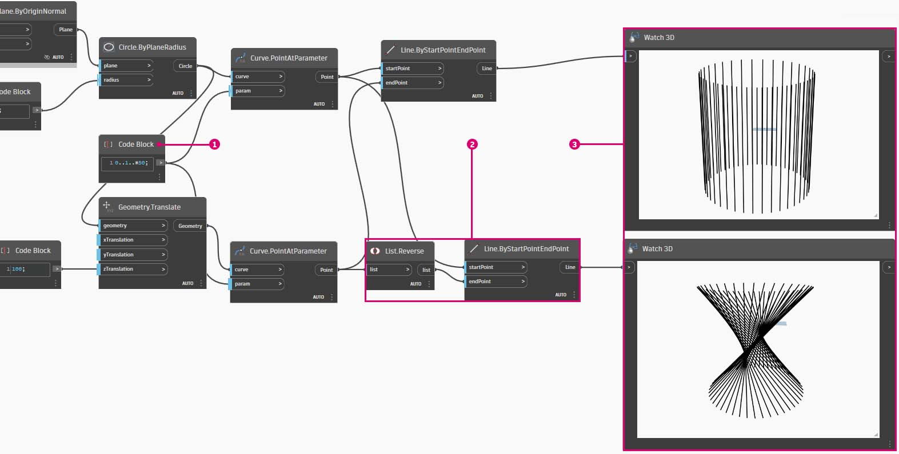

# Utilisation des listes

### Utilisation des listes

Maintenant que vous avez établi une liste, il est temps de découvrir les opérations que vous pouvez effectuer sur celle-ci. Imaginez que la liste est un paquet de cartes de jeu. Un paquet est la liste et chaque carte de jeu représente un élément.

> Photo de [Christian Gidlöf](https://commons.wikimedia.org/wiki/File:Playing\_cards\_modified.jpg)

### Query

Quelles **requêtes** pouvez-vous faire à partir de la liste ? Elles permettent d’accéder aux propriétés existantes.

* Nombre de cartes dans le paquet ? 52\.
* Nombre de couleurs ? 4\.
* Matériau ? Papier.
* Longueur ? 3,5 pouces ou 89 mm.
* Largeur ? 2,5 pouces ou 64 mm.

### Action

Quelles **actions** pouvez-vous effectuer dans la liste ? Elles permettent de modifier la liste en fonction d’une opération donnée.

* Vous pouvez mélanger le paquet.
* Vous pouvez trier le paquet par valeur.
* Vous pouvez trier le paquet par couleur.
* Vous pouvez diviser le paquet.
* Vous pouvez diviser le paquet en distribuant les mains individuelles.
* Vous pouvez sélectionner une carte spécifique dans le paquet.

Toutes les opérations répertoriées ci-dessus possèdent des nœuds Dynamo similaires qui permettent de travailler avec des listes de données génériques. Les leçons ci-dessous présentent certaines des opérations fondamentales que vous pouvez effectuer sur des listes.

## **Exercice**

### **Opérations de liste**

> Téléchargez le fichier d’exemple en cliquant sur le lien ci-dessous.
>
> Vous trouverez la liste complète des fichiers d'exemple dans l'annexe.



L’image ci-dessous est le graphique de base sur lequel vous dessinez des lignes entre deux cercles pour représenter les opérations de liste de base. Vous allez découvrir comment gérer les données dans une liste et afficher les résultats visuels à travers les actions de liste ci-dessous.

> 1. Commencez par un nœud **Code Block** avec une valeur de `500;`.
> 2. Connectez-le à l’entrée x d’un nœud **Point.ByCoordinates**.
> 3. Connectez le nœud de l’étape précédente à l’entrée d’origine d’un nœud **Plane.ByOriginNormal**.
> 4. À l’aide d’un nœud **Cercle.ByPlaneRadius**, connectez le nœud de l’étape précédente à l’entrée plane.
> 5. À l’aide d’un nœud **Code Block**, désignez une valeur de `50;` pour le rayon. Il s’agit du premier cercle créé.
> 6. À l’aide d’un nœud **Geometry.Translate**, déplacez le cercle de 100 unités vers le haut dans la direction Z.
> 7. À l’aide d’un nœud **Code Block**, définissez un intervalle de dix nombres entre 0 et 1 avec la ligne de code suivante : `0..1..#10;`
> 8. Connectez le bloc de code de l’étape précédente à l’entrée _param_ de deux nœuds **Curve.PointAtParameter**. Connectez **Circle.ByPlaneRadius** à l’entrée curve du nœud supérieur, puis **Geometry.Translate** à l’entrée curve du nœud situé en dessous.
> 9. À l’aide d’un nœud **Line.ByStartPointEndPoint**, connectez les deux nœuds **Curve.PointAtParameter**.

### List.Count

> Téléchargez le fichier d’exemple en cliquant sur le lien ci-dessous.
>
> Vous trouverez la liste complète des fichiers d'exemple dans l'annexe.



Le nœud _List.Count_ est simple : il compte le nombre de valeurs dans une liste et renvoie ce nombre. Ce nœud devient plus subtil lorsque vous travaillez avec des listes de listes, mais vous le découvrirez dans les sections suivantes.

> 1. Le nœud **List.Count **_****_ renvoie le nombre de lignes dans le nœud **Line.ByStartPointEndPoint**. Dans ce cas, la valeur est de 10, ce qui correspond au nombre de points créés à partir du nœud **Code Block** d’origine.

### List.GetItemAtIndex

> Téléchargez le fichier d’exemple en cliquant sur le lien ci-dessous.
>
> Vous trouverez la liste complète des fichiers d'exemple dans l'annexe.



**List.GetItemAtIndex** est une méthode fondamentale pour interroger un élément de la liste.

> 1. Tout d’abord, cliquez avec le bouton droit sur le nœud **Line.ByStartPointEndPoint** pour désactiver son aperçu.
> 2. À l’aide du nœud **List.GetItemAtIndex**, sélectionnez l’index _« 0 »_ ou le premier élément de la liste de lignes.

Modifiez la valeur du curseur entre 0 et 9 pour sélectionner un autre élément à l’aide de **List.GetItemAtIndex**.

### List.Reverse

> Téléchargez le fichier d’exemple en cliquant sur le lien ci-dessous.
>
> Vous trouverez la liste complète des fichiers d'exemple dans l'annexe.



_List.Reverse_ inverse l’ordre de tous les éléments d’une liste.

> 1. Pour visualiser correctement la liste inversée des lignes, créez plus de lignes en remplaçant le nœud **Code Block** par `0..1..#50;`.
> 2. Dupliquez le nœud **Line.ByStartPointEndPoint**, insérez un nœud List.Reverse entre **Curve.PointAtParameter** et le deuxième nœud **Line.ByStartPointEndPoint**.
> 3. Utilisez les nœuds **Watch3D** pour afficher un aperçu de deux résultats différents. Le premier affiche le résultat sans liste inversée. Les lignes se connectent verticalement aux points voisins. Toutefois, la liste inversée connecte tous les points à l’ordre opposé dans l’autre liste.

### List.ShiftIndices 

> Téléchargez le fichier d’exemple en cliquant sur le lien ci-dessous.
>
> Vous trouverez la liste complète des fichiers d'exemple dans l'annexe.



**List.ShiftIndices** est un bon outil pour créer des torsions ou des motifs hélicoïdaux, ou toute autre manipulation de données similaire. Ce nœud déplace les éléments d’une liste d’un certain nombre d’index.

> 1. Dans le même processus que la liste inversée, insérez un nœud **List.ShiftIndices** dans les nœuds **Curve.PointAtParameter** et **Line.ByStartPointEndPoint**.
> 2. À l’aide d’un nœud **Code Block**, définissez une valeur de « 1 » pour déplacer la liste d’un index.
> 3. Le changement est subtil, mais toutes les lignes du nœud **Watch3D** inférieur se sont déplacées d’un index lors de la connexion à l’autre jeu de points.

En remplaçant la valeur du nœud **Code Block** par une valeur plus élevée, _« 30 »_ par exemple, vous pouvez observer une différence significative dans les lignes diagonales. Le décalage fonctionne comme l’objectif d’une caméra dans ce cas, créant une torsion dans la forme cylindrique d’origine.

### List.FilterByBooleanMask 

> Téléchargez le fichier d’exemple en cliquant sur le lien ci-dessous.
>
> Vous trouverez la liste complète des fichiers d'exemple dans l'annexe.



**List.FilterByBooleanMask** supprime certains éléments en fonction d’une liste de valeurs booléennes ou les valeurs « true » ou « false ».

Pour créer une liste de valeurs « true » ou « false », vous devez travailler un peu plus…

> 1. À l’aide d’un nœud **Code Block**, définissez une expression avec la syntaxe : `0..List.Count(list);`. Connectez le nœud **Curve.PointAtParameter** à l’entrée _list_. Vous allez découvrir davantage cette configuration dans le chapitre relatif aux blocs de code, mais la ligne de code dans ce cas présente une liste représentant chaque index du nœud **Curve.PointAtParameter**.
> 2. À l’aide d’un nœud _**%**_** (module)**, connectez la sortie du nœud _Code Block_ à l’entrée _x_, et une valeur de _4_ à l’entrée _y_. Vous obtiendrez ainsi le reste lors de la division de la liste d’index par 4. Le module est un nœud très utile pour la création de réseaux. Toutes les valeurs sont lues comme étant les restes possibles de 4 : 0, 1, 2, 3.
> 3. Grâce au nœud _**%**_** (module)**, vous savez qu’une valeur de 0 signifie que l’index est divisible par 4 (0, 4, 8, etc.). À l’aide d’un nœud **==**, vous pouvez tester la visibilité en effectuant un test sur une valeur de _« 0 »_.
> 4. Le nœud **Watch** montre que vous avez un motif true/false qui indique : _true,false,false,false…_.
> 5. À l’aide de ce motif true/false, connectez-vous à l’entrée mask de deux nœuds **List.FilterByBooleanMask**.
> 6. Connectez le nœud **Curve.PointAtParameter** à chaque entrée list de **List.FilterByBooleanMask**.
> 7. La sortie de **Filter.ByBooleanMask** indique _« in »_ et _« out »_. L’expression _« in »_ représente les valeurs qui avaient une valeur de masque _« true »_ et l’expression _« out »_ représente les valeurs qui avaient la valeur _« false »_. En connectant les sorties _« in »_ aux entrées _startPoint_ et _endPoint_ d’un nœud **Line.ByStartPointEndPoint**, vous avez créé une liste filtrée de lignes.
> 8. Le nœud **Watch3D** indique que vous avez moins de lignes que de points. Vous n’avez sélectionné que 25 % des nœuds en filtrant uniquement les valeurs réelles.
