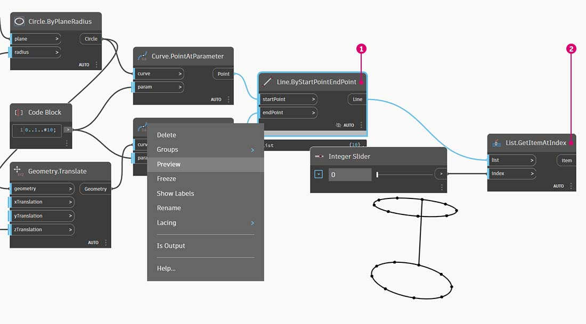

# Arbeiten mit Listen

### Arbeiten mit Listen

Im vorigen Kapitel wurde definiert, was unter einer Liste zu verstehen ist. Thema des folgenden Kapitels sind die Vorgänge, die für Listen durchgeführt werden können. Eine Liste lässt sich mit einem Stapel Spielkarten vergleichen. Der Stapel ist die Liste und jede Spielkarte steht für ein Element.

> Foto von [Christian Gidlöf](https://commons.wikimedia.org/wiki/File:Playing_cards_modified.jpg).

### Abfrage

Welche **Abfragen** sind in der Liste möglich? Dies ermöglicht den Zugriff auf vorhandene Eigenschaften.

* Anzahl der Karten im Stapel? 52\.
* Anzahl der Farben? 4\.
* Material? Papier.
* Länge? 3.5" bzw. 89 mm.
* Breite? 2.5" bzw. 64 mm.

### Aktion

Welche **Aktionen** können für die Liste durchgeführt werden? Diese bewirken Änderungen in der Liste entsprechend der angegebenen Operation.

* Sie können den Stapel neu mischen.
* Sie können den Stapel nach Wert sortieren.
* Sie können den Stapel nach Farben sortieren.
* Sie können den Stapel teilen.
* Sie können den Stapel unterteilen, indem Sie die Karten an verschiedene Spieler ausgeben.
* Sie können eine bestimmte Karte im Stapel auswählen.

In Dynamo sind Blöcke vorhanden, die den oben genannten Vorgängen entsprechen und die Arbeit mit Listen von allgemeinen Daten ermöglichen. Die Lektionen weiter unten demonstrieren einige der grundlegenden Operationen, die für Listen durchgeführt werden können.

## **Übung**

### **Operationen für Listen**

> Laden Sie die Beispieldatei herunter, indem Sie auf den folgenden Link klicken.
>
> Eine vollständige Liste der Beispieldateien finden Sie im Anhang.



Die folgende Abbildung zeigt das Basisdiagramm, in dem Linien zwischen zwei Kreisen gezeichnet werden, um einfache Listenoperationen darzustellen. Wir werden die Verwaltung von Daten in einer Liste genauer betrachten und die visuellen Ergebnisse anhand der unten aufgeführten Aktionen veranschaulichen.

> 1. Beginnen Sie mit einem **Code Block** mit dem Wert `500;`.
> 2. Verbinden Sie ihn mit der x-Eingabe eines **Point.ByCoordinates**-Blocks.
> 3. Verbinden Sie den Block aus dem vorigen Schritt mit der origin-Eingabe eines **Plane.ByOriginNormal**-Blocks.
> 4. Verbinden Sie in einem **Circle.ByPlaneRadius**-Block den Block aus dem vorigen Schritt mit dem plane-Eingang.
> 5. Legen Sie mithilfe eines **Code Block**-Blocks den Wert `50;` als Radius fest. Dadurch erstellen Sie den ersten Kreis.
> 6. Verschieben Sie mithilfe eines **Geometry.Translate**-Blocks den Kreis um 100 Einheiten nach oben in z-Richtung.
> 7. Definieren Sie mithilfe eines **Code Block**-Blocks einen Bereich von 10 Zahlen zwischen 0 und 1, wobei Sie die folgende Zeile verwenden: `0..1..#10;`
> 8. Verbinden Sie den Codeblock aus dem vorigen Schritt mit der _param_-Eingabe zweier **Curve.PointAtParameter**-Blöcke. Verbinden Sie **Circle.ByPlaneRadius** mit der curve-Eingabe des oberen Blocks und **Geometry.Translate** mit der curve-Eingabe des Blocks darunter.
> 9. Verbinden Sie in einem **Line.ByStartPointEndPoint**-Block die beiden **Curve.PointAtParameter**-Blöcke.

### List.Count

> Laden Sie die Beispieldatei herunter, indem Sie auf den folgenden Link klicken.
>
> Eine vollständige Liste der Beispieldateien finden Sie im Anhang.



Der Block _List.Count_ ist einfach: Er zählt die in einer Liste enthaltenen Werte und gibt ihre Anzahl zurück. Bei der Arbeit mit Listen von Listen gestaltet sich die Verwendung dieses Blocks differenzierter. Dies wird in weiter unten folgenden Abschnitten gezeigt.

> 1. Der **List.Count**-Block gibt die Anzahl der Linien aus dem **Line.ByStartPointEndPoint**-Block zurück. In diesem Fall beträgt dieser Wert 10\. Dies stimmt mit der Anzahl der Punkte überein, die mithilfe des ursprünglichen **Code Block**-Blocks erstellt wurden.

### List.GetItemAtIndex

> Laden Sie die Beispieldatei herunter, indem Sie auf den folgenden Link klicken.
>
> Eine vollständige Liste der Beispieldateien finden Sie im Anhang.



**List.GetItemAtIndex** ist ein grundlegendes Verfahren zum Abrufen von Elementen in der Liste.

> 1. Klicken Sie zuerst mit der rechten Maustaste auf den **Line.ByStartPointEndPoint**-Block, um dessen Vorschau zu deaktivieren.
> 2. Mithilfe von **List.GetItemAtIndex** wird der Index _"0"_ bzw. das erste Element in der Liste der Linien ausgewählt.

Ändern Sie den Schieberegler auf einen Wert zwischen 0 und 9, um mithilfe von **List.GetItemAtIndex** ein anderes Element auszuwählen.

### List.Reverse

> Laden Sie die Beispieldatei herunter, indem Sie auf den folgenden Link klicken.
>
> Eine vollständige Liste der Beispieldateien finden Sie im Anhang.



_List.Reverse_ kehrt die Reihenfolge aller Elemente in der Liste um.

> 1. Erstellen Sie für eine deutlichere Darstellung der Linienliste in umgekehrter Reihenfolge weitere Linien, indem Sie den **Code Block** in `0..1..#50;` ändern.
> 2. Duplizieren Sie den **Line.ByStartPointEndPoint**-Block, und fügen Sie einen List.Reverse-Block zwischen **Curve.PointAtParameter** und dem zweiten **Line.ByStartPointEndPoint**-Block ein.
> 3. Verwenden Sie **Watch3D**-Blöcke, um eine Vorschau von zwei verschiedenen Ergebnissen anzuzeigen. Der erste zeigt das Ergebnis ohne umgekehrte Liste. Die Linien verlaufen vertikal und verbinden benachbarte Punkte. Die Umkehrung einer der Listen bewirkt jedoch, dass alle Punkte in entgegengesetzter Reihenfolge mit Punkten in der anderen Liste verbunden werden.

### List.ShiftIndices 

> Laden Sie die Beispieldatei herunter, indem Sie auf den folgenden Link klicken.
>
> Eine vollständige Liste der Beispieldateien finden Sie im Anhang.



**List.ShiftIndices** ist ein geeignetes Werkzeug zum Erstellen verdrehter oder schraubenförmiger Muster oder für ähnliche Datenverarbeitungen. Dieser Block verschiebt die Elemente in einer Liste um die angegebene Anzahl von Indexpositionen.

> 1. Fügen Sie auf dieselbe Weise wie beim Umkehren der Liste einen **List.ShiftIndices**-Block zwischen **Curve.PointAtParameter** und **Line.ByStartPointEndPoint** ein.
> 2. Verwenden Sie einen **Codeblock**, dem Sie den Wert "1" zuweisen, zum Verschieben der Liste um eine Indexposition.
> 3. Sie erhalten keine extreme Veränderung, aber sämtliche Linien im unteren **Watch3D**-Block wurden bei der Verbindung mit der anderen Punktgruppe um eine Indexposition versetzt.

Wenn Sie im **Codeblock** einen größeren Wert, z. B. _"30"_ festlegen, ist ein deutlicher Unterschied in den diagonalen Linien zu erkennen. Die Verschiebung hat in diesem Fall dieselbe Wirkung wie die Irisblende einer Kamera und bewirkt eine Verdrehung der ursprünglichen Zylinderform.

### List.FilterByBooleanMask 

> Laden Sie die Beispieldatei herunter, indem Sie auf den folgenden Link klicken.
>
> Eine vollständige Liste der Beispieldateien finden Sie im Anhang.



**List.FilterByBooleanMask** entfernt bestimmte Elemente anhand einer Liste boolescher Werte bzw. der Werte "true" oder "false".

Um eine Liste mit true- und false-Werten zu erstellen, sind einige weitere Schritte erforderlich.

> 1. Definieren Sie mithilfe eines **Codeblocks** einen Ausdruck mit der folgenden Syntax: `0..List.Count(list);`. Verbinden Sie den **Curve.PointAtParameter**-Block mit der _list_-Eingabe. Diese Einrichtung wird im Kapitel zu Codeblöcken genauer behandelt. In diesem Fall erhalten Sie mit dieser Codezeile eine Liste mit sämtlichen Indizes aus dem **Curve.PointAtParameter**-Block.
> 2. Fügen Sie einen _**%**_-Block** (Modulo)** ein und verbinden Sie die Ausgabe des _Codeblocks_ mit der _x_-Eingabe und den Wert _4_ mit der _y_-Eingabe. Dadurch erhalten Sie den Rest bei der Division der Indizes in der Liste durch 4. Die Modulo-Funktion ist sehr hilfreich beim Erstellen von Mustern. Alle Werte werden als mögliche Reste für 4 ausgegeben: 0, 1, 2, 3.
> 3. Aus dem _**%**_**-Block (Modulo)** ergibt sich, dass Indizes mit dem Wert 0 durch 4 teilbar sind (0, 4, 8... usw.). Mithilfe eines **==**-Blocks kann die Teilbarkeit durch Vergleich mit dem Wert _0_ geprüft werden.
> 4. Der **Watch**-Block zeigt genau dieses Ergebnis, d. h. das folgende true/false-Muster: _true,false,false,false..._.
> 5. Verbinden Sie die Ausgabe mit diesem true/false-Muster mit der mask-Eingabe zweier **List.FilterByBooleanMask**-Blöcke.
> 6. Verbinden Sie jeweils den **Curve.PointAtParameter**-Block mit der list-Eingaben des **List.FilterByBooleanMask**-Blocks.
> 7. Die Ausgaben von **Filter.ByBooleanMask** lauten _"in"_ und _"out"_. _"In"_ steht für Werte mit dem Maskenwert _"true"_, _"out"_ für Werte mit dem Wert _"false"_. Indem Sie die _"in"_-Ausgaben mit den _startPoint_\- und _endPoint_-Eingaben eines **Line.ByStartPointEndPoint**-Blocks verbinden, erhalten Sie eine gefilterte Liste von Linien.
> 8. Im **Watch3D**-Block ist zu erkennen, dass weniger Linien als Punkte vorhanden sind. Durch Filtern ausschließlich der true-Werte wurden lediglich 25 % der Punkte ausgewählt.
