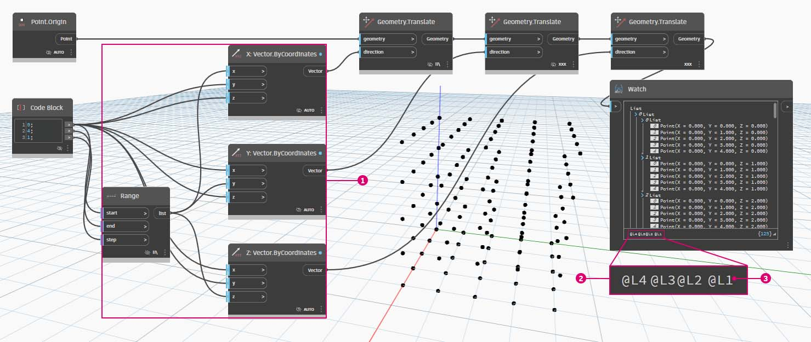
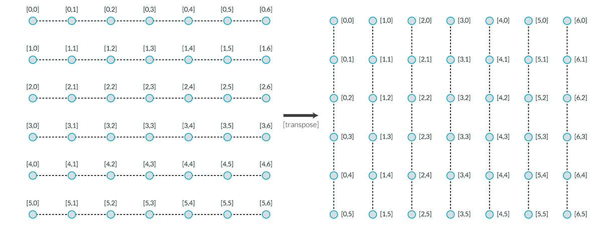

# Seznamy seznamů

### Seznamy seznamů

Do hierarchie bude nyní přidána další vrstva. Pokud vezmeme sadu karet z původního příkladu a vytvoříme krabici, která obsahuje více sad, krabice nyní představuje seznam sad a každá sada představuje seznam karet. Tomuto se říká seznam seznamů. Podívejte se na obrázek níže, představující analogii pro tuto část: na obrázku vidíme seznam sloupečků mincí a každý sloupeček obsahuje seznam mincí.

> Fotografii pořídil uživatel [Dori](https://commons.wikimedia.org/wiki/File:Stack\_of\_coins\_0214.jpg).

### Dotaz

Jaké **dotazy** můžeme provádět u seznamu seznamů? Tím získáte přístup k existujícím vlastnostem.

* Počet typů mincí? 2\.
* Hodnoty typu mincí? 0,01 a 0,25 USD.
* Materiál čtvrťáků? 75 % měď a 25 % nikl.
* Materiál centů? 97,5 % zinek a 2,5 % měď.

### Akce

Jaké **akce** můžeme provádět u seznamu seznamů? Tímto se změní seznam seznamů podle dané operace.

* Výběr konkrétního sloupku čtvrťáků nebo centů.
* Výběr konkrétního čtvrťáku nebo centu.
* Přeuspořádání sloupků čtvrťáků a centů
* Sloučení sloupků dohromady.

I zde aplikace Dynamo obsahuje analogický uzel pro každou z výše uvedených operací. Vzhledem k tomu, že pracujeme s abstraktními daty a ne s fyzickými objekty, potřebujeme sadu pravidel, která řídí pohyb nahoru a dolů v hierarchii dat.

Při práci se seznamy seznamů jsou data vrstvená a složitá, díky tomu však nastává příležitost provést skvělé parametrické operace. Níže uvedené lekce podrobně rozebírají základy a popisují několik dalších operací.

## Cvičení

### Hierarchie shora dolů

> Kliknutím na odkaz níže si stáhněte vzorový soubor.
>
> Úplný seznam vzorových souborů najdete v dodatku.



Základní koncepce této části: **aplikace Dynamo zpracovává seznamy jako objekty samy o sobě**. Tato hierarchie shora dolů se vyvíjí s ohledem na objektově orientované programování. Místo výběru dílčích prvků pomocí příkazu, jako je **List.GetItemAtIndex**, vybere aplikace Dynamo tento index v hlavním seznamu v datové struktuře. A tato položka může být i dalším seznamem. Následuje rozbor pomocí vzorového obrázku:

> 1. Pomocí **bloku kódu** jsme definovali dva rozsahy: `0..2; 0..3;`.
> 2. Tyto rozsahy jsou připojeny k uzlu **Point.ByCoordinates** s vázáním nastaveným na hodnotu _„Vektorový součin“_. Tím se vytvoří osnova bodů a také se na výstupu vrátí seznam seznamů.
> 3. Všimněte si, že uzel **Watch** předává 3 seznamy se 4 položkami v každém seznamu.
> 4. Při použití funkce **List.GetItemAtIndex** s indexem 0 aplikace Dynamo vybere první seznam a veškerý jeho obsah. Jiné programy mohou vybrat první položku každého seznamu v datové struktuře, aplikace Dynamo však při práci s daty využívá hierarchii shora dolů.

### List.Flatten

> Kliknutím na odkaz níže si stáhněte vzorový soubor.
>
> Úplný seznam vzorových souborů najdete v dodatku.



Metoda Flatten odebere všechny vrstvy dat z datové struktury. Toto je užitečné, pokud hierarchie dat nejsou pro vaši operaci podstatné, může to však představovat riziko, protože dojde k odebrání informací. Následující příklad znázorňuje výsledek vyrovnání seznamu dat.

> 1. Zadáním jednoho řádku kódu definujte rozsah v **bloku kódu**: `-250..-150..#4;`
> 2. Připojením _bloku kódu_ ke vstupu _x_ a _y_ uzlu **Point.ByCoordinates** nastavíme vázání na hodnotu _„Vektorový součin“_, abychom získali osnovu bodů.
> 3. Uzel **Watch** zobrazuje, že je k dispozici seznam seznamů.
> 4. Uzel **PolyCurve.ByPoints** bude odkazovat na každý seznam a vytvoří příslušný objekt polycurve. Všimněte si, že v náhledu aplikace Dynamo se v osnově nachází čtyři objekty polycurve představující jednotlivé řádky.

> 1. Vložením _vyrovnání_ před uzel objektu polycurve byl vytvořen jeden seznam pro všechny body. Uzel **PolyCurve.ByPoints** odkazuje na seznam k vytvoření jedné křivky a vzhledem k tomu, že všechny body jsou v jednom seznamu, vznikne jeden klikatý objekt polycurve, který prochází celým seznamem bodů.

K dispozici jsou také možnosti k vyrovnání izolovaných vrstev dat. Pomocí uzlu **List.Flatten** můžete definovat nastavený počet vrstev dat, které mají být vyrovnány z horní části hierarchie. Jedná se o skutečně užitečný nástroj, pokud máte potíže se složitými datovými strukturami, které nejsou nezbytně důležité pro váš pracovní postup. Další možností je použít uzel vyrovnání jako funkci v uzlu **List.Map**. Další informace o uzlu **List.Map** naleznete níže.

### Uzel Chop

> Kliknutím na odkaz níže si stáhněte vzorový soubor.
>
> Úplný seznam vzorových souborů najdete v dodatku.



Při parametrickém modelování se také někdy stane, že budete chtít upravit datovou strukturu existujícího seznamu. K tomuto účelu existuje také mnoho uzlů a Chop je tou nejzákladnější verzí. Pomocí uzlu Chop je možné rozdělit seznam na podseznamy s nastaveným počtem položek.

Příkaz Rozdělit rozdělí seznamy podle dané délky seznamu. V některých případech je příkaz Rozdělit opak příkazu Vyrovnat: místo odebrání datové struktury se přidají nové vrstvy. Toto je užitečný nástroj u geometrických operací, viz příklad níže.

### List.Map

> Kliknutím na odkaz níže si stáhněte vzorový soubor.
>
> Úplný seznam vzorových souborů najdete v dodatku.



Metoda **List.Map/Combine** použije funkci sady na vstupní seznam, ale o jeden krok níže v hierarchii. Kombinace jsou stejné jako u map, kromě toho, že mohou mít více vstupů odpovídajících zadání dané funkce.

_Poznámka: Toto cvičení bylo vytvořeno pomocí předchozí verze aplikace Dynamo. Většina funkčnosti metody_ **List.Map** _byla vyřešena přidáním funkce_ **List@Level** _. Další informace naleznete v části_ [_List@Level_](3-lists-of-lists.md#lists-of-lists) _níže._

V rámci rychlého úvodu si zopakujme uzel **List.Count** z předchozí části.

Uzel **List.Count** spočítá všechny položky v seznamu. Pomocí tohoto nástroje znázorníme, jak funguje metoda **List.Map**.

> 1.  Vložte dva řádky kódu do **bloku kódu**: `-50..50..#Nx; -50..50..#Ny;`
>
>     Blok kódu vytvoří po provedení zadání do tohoto kódu dva vstupy pro proměnné Nx a Ny.
> 2. Pomocí dvou _celočíselných posuvníků_ definujte hodnoty _Nx_ a _Ny_ jejich připojením k **bloku kódu**.
> 3. Připojte každý řádek bloku kódu do příslušných vstupů _X_ a _Y_ uzlu **Point.ByCoordinates**. Klikněte pravým tlačítkem na uzel, vyberte položku „Vázání“ a vyberte položku _„Vektorový součin“_. Tím se vytvoří osnova bodů. Vzhledem k tomu, že jsme definovali rozsah od -50 do 50, bude se rozsah pohybovat ve výchozí osnově aplikace Dynamo.
> 4. Uzel _**Watch**_ zobrazí vytvořené body. Všimněte si datové struktury. Vytvořili jsme seznam seznamů. Každý seznam představuje řádek bodů v osnově.

> 1. Připojte uzel **List.Count** k výstupu uzlu Watch z předchozího kroku.
> 2. Připojte uzel **Watch** k výstupu uzlu **List.Count**.

Všimněte si, že uzel List.Count vrací hodnotu 5. Jedná se o hodnotu rovnou proměnné "Nx", jak je definována v bloku kódu. Jak je to možné?

* Nejprve uzel **Point.ByCoordinates** použije jako primární vstup pro tvorbu seznamů vstup „x“. Pokud má proměnná Nx hodnotu 5 a proměnná Ny hodnotu 3, vznikne seznam 5 seznamů a každý z těch seznamů bude mít 3 položky.
* Vzhledem k tomu, že aplikace Dynamo zpracovává seznamy jako objekty samy o sobě, na hlavní seznam v hierarchii se použije uzel **List.Count**. Výsledkem je hodnota 5, nebo počet seznamů v hlavním seznamu.

> 1. Pomocí uzlu **List.Map** bude proveden krok dolů v hierarchii a na této úrovni se provede _„funkce“_.
> 2. Všimněte si, že uzel **List.Count** nemá žádný vstup. Používá se jako funkce, takže uzel **List.Count** se použije na každý jednotlivý seznam, o jeden krok níže v hierarchii. Prázdný vstup uzlu **List.Count** odpovídá zadání seznamu uzlu **List.Map**.
> 3. Výsledky metody **List.Count** nyní obsahují 5 položek, z nichž každá má hodnotu 3. Toto představuje délku každého dílčího seznamu.

### **List.Combine**

_Poznámka: Toto cvičení bylo vytvořeno pomocí předchozí verze aplikace Dynamo. Většina funkčnosti metody List.Combine byla vyřešena přidáním funkce_ **List@Level**_. Další informace naleznete v části_ [_List@Level_](6-3\_lists-of-lists.md#listlevel) _níže._

V tomto cvičení použijeme funkci **List.Combine** a ukážeme si, jak ji lze použít k aplikaci funkce na samostatné seznamy objektů.

Začněte nastavením dvou seznamů bodů.

> 1. Pomocí uzlu **Sequence** vygenerujte 10 hodnot, každou s přírůstkem 10 kroků.
> 2. Výsledek připojte ke vstupu x uzlu **Point.ByCoordinates**. Tím se v aplikaci Dynamo vytvoří seznam bodů.
> 3. Přidejte do pracovního prostoru druhý uzel **Point.ByCoordinates**, použijte stejný výstup **Sequence** jako jeho vstup x, ale jako vstup y použijte uzel **Integer Slider**, který nastavte na hodnotu 31 (může to být libovolná hodnota, pokud se nepřekrývá s první sadou bodů), aby se obě sady bodů navzájem nepřekrývaly.

Dále pomocí uzlu **List.Combine** použijeme funkci na objekty ve 2 samostatných seznamech. V tomto případě se bude jednat o jednoduchou funkci kreslení čar.

> 1. Přidejte do pracovního prostoru uzel **List.Combine** a připojte 2 sady bodů jako jeho vstupy list0 a list1.
> 2. Jako vstupní funkci uzlu **List.Combine** použijte uzel **Line.ByStartPointEndPoint**.

Po dokončení jsou 2 sady bodů komprimovány/spárovány dohromady pomocí funkce **Line.ByStartPointEndPoint** a vrátí 10 řádků v aplikaci Dynamo.


 Další příklad použití uzlu List.Combine naleznete ve cvičení v části N-rozměrné seznamy. 


### Funkce List@Level

> Kliknutím na odkaz níže si stáhněte vzorový soubor.
>
> Úplný seznam vzorových souborů najdete v dodatku.



Funkce **List@Level**, která má přednost před funkcí **List.Map**, umožňuje přímo na vstupním portu uzlu vybrat úroveň seznamu, se kterou chcete pracovat. Tuto funkci je možné použít na libovolný příchozí vstup uzlu a umožní přístup k úrovním seznamů rychleji a snadněji než jiné metody. Stačí jen uzlu určit úroveň seznamu, kterou chcete použít jako vstup, a uzel pak provede vše ostatní.

V tomto cvičení použijeme funkci **List@Level** k vyčlenění určité úrovně dat.

Začneme jednoduchou 3D osnovou bodů.

> 1. Vzhledem k tomu, že je osnova vytvořena pomocí rozsahu hodnot X, Y a Z, víme, že data jsou strukturována do tří vrstev: seznam X, seznam Y a seznam Z.
> 2. Tyto vrstvy existují v různých **úrovních**. Úrovně jsou značeny v dolní části bubliny náhledu. Sloupce úrovní seznamu odpovídají výše uvedeným datům seznamu, aby se snadněji rozpoznalo, na které úrovni se pracuje.
> 3. Úrovně seznamu jsou uspořádány v obráceném pořadí, čili data nejnižší úrovně jsou vždy v úrovni „L1“. Toto vám pomůže zajistit, aby grafy fungovaly podle plánu, i když se něco v předcházejícím dění změní.

> 1. Chcete-li použít funkci **List@Level**, klikněte na tlačítko „>“. V této nabídce se zobrazí dvě zaškrtávací políčka.
> 2. **Použít úrovně** – Povolí funkci **List@Level**. Po kliknutí na tuto možnost budete moci kliknout na požadovanou úroveň seznamu a vybrat vstupní úrovně seznamu, které má uzel použít. Pomocí této nabídky můžete rychle vyzkoušet různé možnosti úrovně kliknutím nahoru nebo dolů.
> 3. _Zachovat strukturu seznamu_ – pokud je tato možnost povolena, bude možné zachovat strukturu úrovně tohoto vstupu. Někdy můžete mít data záměrně uspořádaná do dílčích seznamů. Zaškrtnutím této možnosti můžete organizaci seznamu ponechat nedotčenou a neztratit žádné informace.

Pomocí naší jednoduché 3D osnovy je možné získat přístup a vizualizovat strukturu seznamu přepnutím mezi úrovněmi seznamu. Každá kombinace úrovně seznamu a indexu vrátí jinou sadu bodů z naší původní 3D sady.

> 1. Možnost „@L2“ v aplikaci DesignScript umožňuje vybrat pouze seznam na úrovni 2. Seznam na úrovni 2 s indexem 0 obsahuje pouze první sadu bodů Y, které vracejí pouze osnovu XZ.
> 2. Pokud se filtr úrovně změní na možnost „L1“, je možné zobrazit vše v první úrovni seznamu. Seznam na úrovni 1 s indexem 0 obsahuje všechny 3D body ve vyrovnaném seznamu.
> 3. Pokud se pokusíte o totéž u možnosti „L3“, zobrazí se pouze body třetí úrovně seznamu. Seznam na úrovni 2 s indexem 0 obsahuje pouze první sadu bodů Z, které vracejí pouze osnovu XY.
> 4. Pokud se pokusíte o totéž u možnosti „L4“, zobrazí se pouze body třetí úrovně seznamu. Seznam na úrovni 4 s indexem 0 obsahuje pouze první sadu bodů X, které vracejí pouze osnovu YZ.

Ačkoliv tento konkrétní příklad je také možné vytvořit pomocí metody **List.Map**, metoda **List@Level** výrazně zjednodušuje interakci a usnadňuje přístup k datům uzlu. Níže naleznete porovnání metod **List.Map** a **List@Level**:

> 1. Ačkoliv obě metody nabízí přístup ke stejným bodům, metoda **List@Level** umožňuje snadné přepínání mezi hladinami dat v rámci jednoho uzlu.
> 2. K získání přístupu k osnově bodů pomocí metody **List.Map** je kromě uzlu **List.Map** potřeba i uzel **List.GetItemAtIndex**. Pro každou úroveň seznamu, u které pokročíme na nižší úroveň, je třeba použít další uzel **List.Map**. Podle složitosti seznamů může být vyžadováno přidání značného množství uzlů **List.Map** do grafu, abyste získali přístup ke správné úrovni informací.
> 3. V tomto příkladu uzel **List.GetItemAtIndex** s uzlem **List.Map** vrátí stejnou sadu bodů se stejnou strukturou seznamu, jako když je v uzlu **List.GetItemAtIndex** vybrána možnost „@L3“.

### Transpozice

> Kliknutím na odkaz níže si stáhněte vzorový soubor.
>
> Úplný seznam vzorových souborů najdete v dodatku.



Transpozice je základní funkcí při práci se seznamy seznamů. Stejně jako v tabulkových programech i zde transpozice převrátí sloupce a řádky datové struktury. Níže je znázorněn příklad se základní maticí a v následující části je znázorněno, jak je možné pomocí transpozice tvořit geometrické vztahy.

Nyní odstraňte uzly **List.Count** z předchozího cvičení, přesuňte se ke geometrii a prohlédněte si, jak jsou data strukturována.

> 1. Připojte uzel **PolyCurve.ByPoints** k výstupu uzlu Watch z uzlu **Point.ByCoordinates**.
> 2. Výstup zobrazí 5 objektů polycurve a v náhledu aplikace Dynamo se zobrazí tyto objekty křivek. Uzel aplikace Dynamo hledá seznam bodů (nebo seznam seznamů bodů v tomto případě) a vytvoří z nich jeden objekt PolyCurve. Každý seznam byl v podstatě převeden na křivku v datové struktuře.

> 1. Uzel **List.Transpose** zamění všechny položky se všemi seznamy v seznamu seznamů. Zní to složitě, ale je to stejná logika jako transpozice v aplikaci Microsoft Excel: záměna sloupců a řádků v datové struktuře.
> 2. Všimněte si abstraktního výsledku: transpozice změnila strukturu seznamu z 5 seznamů o 3 položkách na 3 seznamy o 5 položkách.
> 3. Všimněte si geometrického výsledku: pomocí uzlu **PolyCurve.ByPoints** získáte 3 objekty polycurve v kolmém směru od původních křivek.

## Blok kódu k vytvoření seznamu

Blok kódu využívá znaky „[]“ jako zkratku k definování seznamu. Jedná se o mnohem rychlejší a plynulejší způsob tvorby seznamů než uzel **List.Create**. **Blok kódu** je podrobněji popsán v části [Bloky kódů a jazyk DesignScript](../../8\_coding\_in\_dynamo/8-1\_code-blocks-and-design-script/). V níže uvedeném obrázku můžete vidět, jak je možné definovat seznam s více výrazy pomocí bloku kódu.

#### Dotaz bloku kódu

**Blok kódu** používá znaky „[]“ jako rychlý a snadný způsob výběru konkrétních položek ze složité datové struktury. **Bloky kódu** jsou podrobněji popsány v části [Bloky kódů a jazyk DesignScript](../../8\_coding\_in\_dynamo/8-1\_code-blocks-and-design-script/). V níže uvedeném obrázku můžete vidět, jak je možné dotazovat seznam s více datovými typy pomocí bloku kódu.

## Cvičení – Dotazování a vkládání dat

> Kliknutím na odkaz níže si stáhněte vzorový soubor.
>
> Úplný seznam vzorových souborů najdete v dodatku.



Toto cvičení využívá část logiky stanovené v předchozím cvičení k úpravě povrchu. Cíl je intuitivní, nyní se však více zapojí navigace v datové struktuře. Chceme rozdělit povrch přesunem řídicího bodu.

Začněte s výše uvedeným řetězcem uzlů. Vytváříme základní povrch, který pokrývá výchozí osnovu aplikace Dynamo.

> 1. Pomocí **bloku kódu** vložte tyto dva řádky kódu a připojte je ke vstupům _u_ a _v_ uzlu **Surface.PointAtParameter**: `-50..50..#3;` `-50..50..#5;`
> 2. Zkontrolujte, zda je vázání uzlu **Surface.PointAtParameter** nastaveno na možnost _„Vektorový součin“_.
> 3. Uzel **Watch** zobrazuje, že byl vrácen seznam 3 seznamů, z nichž každý obsahuje 5 položek.

V tomto kroku je třeba dotazovat středový bod v osnově, kterou jste vytvořili. Chcete-li to provést, vyberte prostřední bod prostředního seznamu. To dává smysl, že?

> 1. Chcete-li potvrdit, že se jedná o správný bod, můžete toho dosáhnout kliknutím na položky uzlu Watch.
> 2. Pomocí **bloku kódu** zapište základní řádek kódu k dotazování se na seznam seznamů:\
`points[1][2];`
> 3. Pomocí funkce **Geometry.Translate** přesuňte vybraný bod nahoru ve směru osy _Z_ o _20_ jednotek.

> 1. Nyní vybereme také prostřední řádek bodů u uzlu **List.GetItemAtIndex**. Poznámka: Podobně jako v předchozím kroku můžete také zadat dotaz na seznam pomocí **bloku kódu** s řádkem `points[1];`.

Zatím jsme se úspěšně dotázali na střed a posunuli jej nahoru. Nyní je potřeba vložit tento přesunutý bod zpět do původní datové struktury.

> 1. Nejprve je třeba nahradit položku seznamu, kterou jsme izolovali v předchozím kroku.
> 2. Pomocí metody **List.ReplaceItemAtIndex** nahraďte prostřední položku a použijte index _2_ s náhradní položkou připojenou k přesunutému bodu (**Geometry.Translate**).
> 3. Výstup zobrazí, že přesunutý bod byl vložen přes vstup do prostřední položky seznamu.

Nyní, když byl seznam upraven, je třeba vložit tento seznam zpět do původní datové struktury: seznamu seznamů.

> 1. Podle stejné logiky nahraďte pomocí metody **List.ReplaceItemAtIndex** prostřední seznam upraveným seznamem.
> 2. Všimněte si, že **bloky kódu** definující index těchto dvou uzlů jsou 1 a 2, což odpovídá původnímu dotazu z **bloku kódu** (_points[1][2]_).
> 3. Po výběru seznamu na _indexu 1_ se v náhledu aplikace Dynamo zvýrazní datová struktura. Přesunutý bod tak byl úspěšně sloučen s původní datovou strukturou.

Z této sady bodů je možné vytvořit povrch mnoha způsoby. V tomto případě se vytvoří povrch šablonováním křivek dohromady.

> 1. Vytvořte uzel **NurbsCurve.ByPoints** a připojením nové datové struktury vytvořte tři křivky nurbs.

> 1. Připojte uzel **Surface.ByLoft** k výstupu uzlu **NurbsCurve.ByPoints**. Nyní máme upravený povrch. Je možné změnit původní hodnotu _Z_ geometrie. Proveďte posun a sledujte, jak se geometrie aktualizuje!
