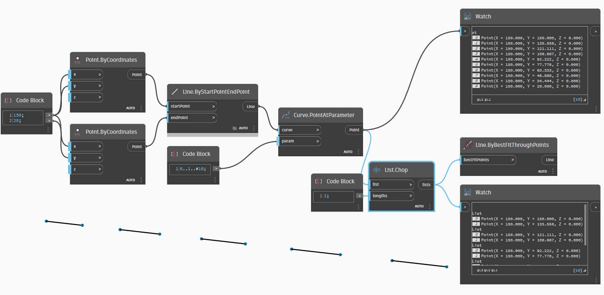
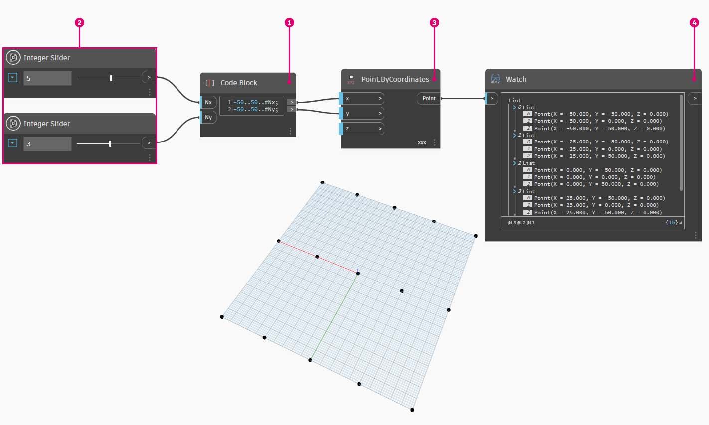

# Listes de listes

### Listes de listes

Ajoutons un autre niveau à la hiérarchie. Si vous prenez le paquet de cartes de l'exemple d'origine et si vous créez une boîte contenant plusieurs paquets, la case représente désormais une liste de paquets et chaque paquet représente une liste de cartes. Voici une liste de listes. Pour l’analogie de cette section, l’image ci-dessous contient une liste de rouleaux de pièces de monnaie, et chaque rouleau contient une liste de centimes.

> Photo de [Dori](https://commons.wikimedia.org/wiki/File:Stack\_of\_coins\_0214.jpg).

### Requête

Quelles **requêtes** pouvez-vous effectuer à partir de la liste de listes ? Elles permettent d’accéder aux propriétés existantes.

* Nombre de pièces de monnaie ? 2\.
* Valeurs des type de pièce de monnaie ? 0,01 $ et 0,25 $.
* Matériau des pièces de 0,25 $ ? 75 % de cuivre et 25 % de nickel.
* Matériau des centimes ? 97,5 % de zinc et 2,5 % de cuivre.

### Action

Quelles **actions** pouvez-vous effectuer dans la liste de listes ? Cette action permet de modifier la liste de listes en fonction d’une opération donnée.

* Sélectionnez une pile spécifique de pièces de 0,25 $ ou de centimes.
* Sélectionnez une pièce de 0,25 $ ou un centime spécifique.
* Réorganisez les piles de pièces de 0,25 $ et de centimes.
* Mélangez les piles ensemble.

Pour rappel, Dynamo possède un nœud analogue pour chacune des opérations ci-dessus. Puisque vous travaillez avec des données abstraites et non des objets physiques, vous avez besoin d’un ensemble de règles pour gérer la façon dont vous vous déplacez vers le haut et vers le bas de la hiérarchie de données.

Lorsque vous travaillez sur des listes de listes, les données sont superposées et complexes, mais cela permet de réaliser des opérations paramétriques extraordinaires. Déterminons les fondamentaux et discutons de certaines autres opérations dans les leçons ci-dessous.

## Exercice

### Hiérarchie verticale

> Téléchargez le fichier d’exemple en cliquant sur le lien ci-dessous.
>
> Vous trouverez la liste complète des fichiers d'exemple dans l'annexe.



Voici le concept fondamental à retenir de cette section : **Dynamo traite les listes comme des objets**. Cette hiérarchie verticale est développée en tenant compte de la programmation orientée objet. Au lieu de sélectionner des sous-éléments à l’aide d’une commande telle que **List.GetItemAtIndex**, Dynamo sélectionne cet index de la liste principale dans la structure de données. Cet élément peut être une autre liste. Nous allons le décomposer avec une image d’exemple :

> 1. Grâce au nœud **Code Block**, vous avez défini deux intervalles : `0..2; 0..3;`
> 2. Ces intervalles sont connectés à un nœud **Point.ByCoordinates** avec la combinaison définie sur _« Produit vectoriel »_. Cela crée une grille de points et renvoie également une liste de listes sous forme de sortie.
> 3. Le nœud **Watch** donne 3 listes contenant chacune 4 éléments.
> 4. Lorsque vous utilisez **List.GetItemAtIndex** avec un index de 0, Dynamo sélectionne la première liste et tout son contenu. D’autres programmes peuvent sélectionner le premier élément de chaque liste dans la structure de données, mais Dynamo utilise une hiérarchie verticale lorsque vous travaillez avec des données.

### List.Flatten

> Téléchargez le fichier d’exemple en cliquant sur le lien ci-dessous.
>
> Vous trouverez la liste complète des fichiers d'exemple dans l'annexe.



Le noeud Flatten permet de supprimer tous les niveaux de données d'une structure de données. Il est utile lorsque les hiérarchies de données ne sont pas nécessaires à votre opération, mais il comporte un risque car il supprime des informations. L’exemple ci-dessous montre le résultat de l’aplanissement d’une liste de données.

> 1. Insérez une ligne de code pour définir un intervalle dans le nœud **Code Block** : `-250..-150..#4;`
> 2. En connectant le _bloc de code_ aux entrées _x_ et _y_ d’un nœud **Point.ByCoordinates**, vous définissez la combinaison sur _« Produit vectoriel »_ pour obtenir une grille de points.
> 3. Le nœud **Watch** indique que vous avez une liste de listes.
> 4. Un nœud **PolyCurve.ByPoints** référence chaque liste et crée une polycourbe respective. Dans l’aperçu Dynamo, notez que quatre polycourbes représentent chaque ligne de la grille.

> 1. En insérant un nœud _Flatten_ avant le nœud de la polycourbe, vous créez une liste unique pour tous les points. Le nœud **PolyCurve.ByPoints** fait référence à une liste permettant de créer une courbe. Comme tous les points figurent sur une liste, une polycourbe en zigzag est générée pour l’ensemble de la liste de points.

Il existe également des options permettant d’aplanir les niveaux de données isolés. Le nœud **List.Flatten** permet de définir un nombre défini de niveaux de données à aplanir à partir du haut de la hiérarchie. Cet outil est très utile si vous avez des difficultés à gérer des structures de données complexes qui ne sont pas nécessairement pertinentes pour votre workflow. Une autre option consiste à utiliser le nœud Flatten comme fonction dans **List.Map**. Vous en découvrirez plus sur **List.Map** ci-dessous.

### Chop

> Téléchargez le fichier d’exemple en cliquant sur le lien ci-dessous.
>
> Vous trouverez la liste complète des fichiers d'exemple dans l'annexe.



Lors de la modélisation paramétrique, vous pouvez ajouter la structure de données à une liste existante. Il existe également de nombreux nœuds disponibles pour cette opération. La commande Chop est la version la plus élémentaire. Celle-ci vous permet de partitionner une liste en sous-listes contenant un nombre défini d'éléments.

La commande Chop divise les listes en fonction d'une longueur de liste donnée. D'une certaine manière, la commande de découpage est l'opposé de l'aplanissement : au lieu de supprimer la structure de données, elle y ajoute de nouveaux niveaux. Cet outil est utile pour les opérations géométriques comme dans l’exemple ci-dessous.

### List.Map

> Téléchargez le fichier d’exemple en cliquant sur le lien ci-dessous.
>
> Vous trouverez la liste complète des fichiers d'exemple dans l'annexe.



La commande **List.Map/Combine** applique une fonction définie à une liste d’entrées, mais à un niveau plus bas dans la hiérarchie. Les combinaisons correspondent aux mappages, à l’exception près que les combinaisons peuvent avoir plusieurs entrées correspondant à l’entrée d’une fonction donnée.

_Remarque : cet exercice a été créé avec une version précédente de Dynamo. La plupart des fonctionnalités_ **List.Map** _ont été résolues par l’ajout de la fonctionnalité_ **List@Level** _. Pour plus d’informations, reportez-vous à la rubrique_ [_List@Level_](3-lists-of-lists.md#lists-of-lists) _ci-dessous._

En guise d’introduction, examinons le nœud **List.Count** d’une section précédente.

Le nœud **List.Count** compte tous les éléments d’une liste. Vous allez l’utiliser pour montrer comment fonctionne **List.Map**.

> 1.  Insérez deux lignes de code dans le nœud **Code Block** : `-50..50..#Nx; -50..50..#Ny;`
>
>     Une fois le code saisi, le bloc de code créera deux entrées pour Nx et Ny.
> 2. Avec deux nœuds _Integer Slider_, définissez les valeurs _Nx_ et _Ny_ en les connectant au nœud **Code Block**.
> 3. Connectez chaque ligne du bloc de code aux entrées _X_ et _Y_ respectives d’un nœud **Point.ByCoordinates**. Cliquez avec le bouton droit de la souris sur le nœud, sélectionnez « Combinaison », puis _« Produit vectoriel »_. Cela crée une grille de points. Étant donné que vous avez défini l’intervalle de -50 à 50, élargissez la grille Dynamo par défaut.
> 4. Un nœud _**Watch**_ révèle les points créés. Observez la structure des données. Vous avez créé une liste de listes. Chaque liste représente une ligne de points de la grille.

> 1. Attachez un nœud **List.Count** à la sortie du nœud Watch de l’étape précédente.
> 2. Connectez un nœud **Watch** à la sortie **List.Count**.

Le nœud List.Count donne une valeur de 5. Il s'agit de la variable "Nx" telle que définie dans le bloc de code. Pourquoi ?

* Tout d’abord, le nœud **Point.ByCoordinates** utilise l’entrée « x » comme entrée principale pour la création de listes. Lorsque Nx est égale à 5 et Ny à 3, vous obtenez une liste de 5 listes, chacune comportant 3 éléments.
* Étant donné que Dynamo traite les listes comme des objets, un nœud **List.Count** est appliqué à la liste principale de la hiérarchie. Le résultat est une valeur de 5 ou le nombre de listes dans la liste principale.

> 1. En utilisant un nœud **List.Map**, vous descendez d’un niveau dans la hiérarchie et effectuez une _« fonction »_ à ce niveau.
> 2. Le nœud **List.Count** n’a pas d’entrée. Il est utilisé en tant que fonction, de sorte que le nœud **List.Count** sera appliqué à chaque liste individuelle d’un niveau vers le bas dans la hiérarchie. L’entrée vide de **List.Count** correspond à l’entrée de liste de **List.Map**.
> 3. Les résultats de **List.Count** donnent désormais une liste de 5 éléments, chacun d’entre eux ayant une valeur égale à 3. Cela représente la longueur de chaque sous-liste.

### **List.Combine**

_Remarque : cet exercice a été créé avec une version précédente de Dynamo. La plupart des fonctionnalités List.Combine ont été résolues avec l’ajout de la fonction_ **List@Level**. _ Pour plus d’informations, reportez-vous à la rubrique_ [_List@Level_](6-3\_lists-of-lists.md#listlevel) _ci-dessous._

Dans cet exercice, vous allez utiliser le nœud **List.Combine** pour montrer comment il peut être utilisé pour appliquer une fonction à des listes d’objets distinctes.

Commencez par configurer deux listes de points.

> 1. Utilisez le nœud **Sequence** pour générer 10 valeurs, chacune avec un incrément de 10 pas.
> 2. Connectez le résultat à l’entrée x d’un nœud **Point.ByCoordinates**. Cela permet de créer une liste de points dans Dynamo.
> 3. Ajoutez un deuxième nœud **Point.ByCoordinates** à l’espace de travail, utilisez la même sortie **Sequence** que son entrée x, mais utilisez un nœud **Integer Slider** comme entrée y et définissez sa valeur sur 31 (il peut s’agir de n’importe quelle valeur, à condition qu’elle ne chevauche pas le premier jeu de points), de sorte que les deux jeux de points ne se chevauchent pas.

Ensuite, utilisez le nœud **List.Combine** pour appliquer une fonction aux objets dans deux listes distinctes. Dans ce cas, il s’agit d’une fonction de dessin de ligne simple.

> 1. Ajoutez un nœud **List.Combine** à l’espace de travail et connectez les deux jeux de points comme entrées list0 et list1.
> 2. Utilisez **Line.ByStartPointEndPoint** comme fonction d’entrée pour le nœud **List.Combine**.

Une fois l’opération terminée, les deux jeux de points sont compressés/associés via une fonction **Line.ByStartPointEndPoint** et renvoient 10 lignes dans Dynamo.

 Reportez-vous à l’exercice dans Listes à n dimensions pour découvrir un autre exemple d’utilisation du nœud List.Combine. 

### List@Level

> Téléchargez le fichier d’exemple en cliquant sur le lien ci-dessous.
>
> Vous trouverez la liste complète des fichiers d'exemple dans l'annexe.



À privilégier par rapport **List.Map**, la fonctionnalité **List@Level** vous permet de sélectionner le niveau de liste que vous souhaitez utiliser directement au niveau du port d’entrée du nœud. Cette fonction peut être appliquée à toute entrée entrante d’un nœud et vous permet d’accéder aux niveaux de vos listes plus rapidement et plus facilement que d’autres méthodes. Indiquez simplement au nœud le niveau de la liste que vous souhaitez utiliser comme entrée et laissez le nœud faire le reste.

Dans cet exercice, vous allez utiliser la fonction **List@Level** pour isoler un niveau de données spécifique.

Nous allons commencer par une grille de points 3D simple.

> 1. Puisque la grille est construite avec un intervalle pour X, Y et Z, vous savez que les données sont structurées avec trois niveaux : une liste X, une liste Y et une liste Z.
> 2. Ces niveaux existent à différents **niveaux**. Les niveaux sont indiqués en bas de la bulle d’aperçu. Les colonnes de niveaux de la liste correspondent aux données de liste ci-dessus pour vous aider à identifier le niveau à utiliser.
> 3. Les niveaux de liste sont organisés dans l’ordre inverse de sorte que les données de niveau le plus bas soient toujours dans « L1 ». Cela permet de garantir le fonctionnement de vos graphiques tels qu’ils seront planifiés, même si tout est modifié en amont.

> 1. Pour utiliser la fonction **List@Level** , cliquez sur « > ». Dans ce menu, vous verrez deux cases à cocher.
> 2. **Utiliser les niveaux** : permet d’activer la fonctionnalité **List@Level**. Après avoir cliqué sur cette option, vous pourrez sélectionner les niveaux de liste d’entrée que le nœud doit utiliser. Ce menu vous permet de tester rapidement différentes options de niveau en cliquant sur les boutons haut ou bas.
> 3. _Conserver la structure de la liste_ : si cette option est activée, vous pouvez conserver la structure de niveau de cette entrée. Parfois, vous avez peut-être délibérément organisé vos données en sous-listes. En cochant cette option, vous pouvez conserver votre organisation de liste intacte et ne perdre aucune information.

La grille 3D simple vous permet d'accéder à la structure de la liste et de la visualiser en passant par les niveaux de liste. Chaque combinaison de niveau de liste et d’index renvoie un jeu de points différent de votre jeu 3D d’origine.

> 1. Dans DesignScript, "@L2" permet de sélectionner uniquement la liste au niveau 2. La liste au niveau 2 avec l'index 0 inclut uniquement le premier jeu de points Y, renvoyant uniquement la grille XZ.
> 2. Si vous définissez le filtre de niveaux sur "L1", vous pourrez voir l'intégralité du contenu du premier niveau de la liste. La liste au niveau 1 avec l'index 0 inclut tous vos points 3D dans une liste simple.
> 3. Si vous essayez de la même façon pour "L3", vous ne verrez que les troisièmes points de niveau de liste. La liste au niveau 3 avec l'index 0 inclut uniquement le premier jeu de points Z, renvoyant uniquement une grille XY.
> 4. Si vous essayez de la même façon pour "L4", vous ne verrez que les troisième points de niveau de liste. La liste au niveau 4 avec l’index 0 inclut uniquement le premier jeu de points X, renvoyant uniquement une grille YZ.

Bien que cet exemple particulier puisse également être créé avec **List.Map**, **List@Level** simplifie grandement l’interaction, ce qui facilite l’accès aux données de nœud. Comparez les méthodes **List.Map** et **List@Level** ci-dessous :

> 1. Bien que les deux méthodes vous donnent accès aux mêmes points, la méthode **List@Level** vous permet de basculer facilement entre les couches de données au sein d’un nœud unique.
> 2. Pour accéder à une grille de points avec **List.Map**, vous avez besoin d’un nœud **List.GetItemAtIndex** avec **List.Map**. Pour chaque niveau de liste que vous allez décaler vers le bas, utilisez un nœud **List.Map** supplémentaire. Selon la complexité de vos listes, vous devrez peut-être ajouter une quantité importante de nœuds **List.Map** à votre graphique pour accéder au niveau d’informations approprié.
> 3. Dans cet exemple, un nœud **List.GetItemAtIndex** avec un nœud **List.Map** renvoie le même jeu de points avec la même structure de liste que **List.GetItemAtIndex** avec « @L3 » sélectionné.

### Transposer

> Téléchargez le fichier d’exemple en cliquant sur le lien ci-dessous.
>
> Vous trouverez la liste complète des fichiers d'exemple dans l'annexe.



La fonction Transposer est une fonction fondamentale lorsque vous travaillez avec des listes de listes. Tout comme dans les programmes de feuille de calcul, une transposition inverse les colonnes et les lignes d'une structure de données. Nous allons le démontrer avec une matrice de base ci-dessous. Dans la section suivante, nous allons montrer comment une transposition peut être utilisée pour créer des relations géométriques.

Supprimez les nœuds **List.Count** de l’exercice précédent et passez à une géométrie pour voir comment les données sont structurées.

> 1. Connectez un nœud **PolyCurve.ByPoints** à la sortie du nœud Watch à partir de **Point.ByCoordinates**.
> 2. Le résultat affiche 5 polycourbes et les courbes sont visibles dans l’aperçu Dynamo. Le nœud Dynamo recherche une liste de points (ou une liste de listes de points dans ce cas) et crée une polycourbe à partir de ces points. Chaque liste a en fait été convertie en une courbe dans la structure de données.

> 1. Un nœud **List.Transpose** permet de remplacer l’ensemble des éléments par toutes les listes dans une liste de listes. Cette opération semble compliquée, mais la logique est la même que pour la fonction Transposer dans Microsoft Excel : remplacer des colonnes par des lignes dans une structure de données.
> 2. Observez le résultat abstrait : la transposition a modifié la structure de la liste d’une liste de 5 listes comportant chacune 3 éléments en 3 listes contenant 5 éléments.
> 3. Observez le résultat géométrique : à l’aide du nœud **PolyCurve.ByPoints**, vous obtenez 3 polycourbes perpendiculaires aux courbes d’origine.

## Code Block pour la création de listes

Le raccourci de bloc de code utilise « [] » pour définir une liste. Cette méthode est beaucoup plus rapide et fluide pour créer une liste que le nœud **List.Create**. Le nœud **Code Block** est abordé plus en détail dans la rubrique [Nœuds Code Block et DesignScript](../../8\_coding\_in\_dynamo/8-1\_code-blocks-and-design-script/). Consultez l’image ci-dessous pour découvrir comment définir une liste contenant plusieurs expressions à l’aide d’un bloc de code.

#### Requête de bloc de code

Le raccourci de **Code Block** utilise « [] » pour sélectionner facilement et rapidement des éléments spécifiques à partir d’une structure de données complexe. Les nœuds **Code Block** sont abordés plus en détail dans le chapitre [Nœuds Code Block et DesignScript](../../8\_coding\_in\_dynamo/8-1\_code-blocks-and-design-script/). Consultez l’image ci-dessous pour découvrir comment interroger une liste contenant plusieurs types de données à l’aide d’un bloc de code.

## Exercice - Interrogation et insertion de données

> Téléchargez le fichier d’exemple en cliquant sur le lien ci-dessous.
>
> Vous trouverez la liste complète des fichiers d'exemple dans l'annexe.



Cet exercice utilise une partie de la logique établie dans l'exercice précédent pour modifier une surface. Votre objectif ici est intuitif, mais la navigation dans la structure de données sera plus importante. Nous voulons articuler une surface en déplaçant un point de contrôle.

Commencez par la chaîne de nœuds ci-dessus. Vous allez créer une surface de base qui s’étend sur la grille Dynamo par défaut.

> 1. À l’aide du nœud **Code Block**, insérez ces deux lignes de code et connectez-les aux entrées _u_ et _v_ de **Surface.PointAtParameter**, respectivement : `-50..50..#3;` `-50..50..#5;`
> 2. Veillez à définir la combinaison de **Surface.PointAtParameter** sur _« Produit vectoriel »_.
> 3. Le nœud **Watch** indique que vous avez une liste de 3 listes, chacune comportant 5 éléments.

Dans cette étape, vous allez interroger le point central de la grille créée. Pour ce faire, sélectionnez le point central dans la liste centrale. Logique, non ?

> 1. Pour confirmer qu’il s’agit du bon point, vous pouvez également cliquer sur les éléments du nœud Watch pour confirmer que vous ciblez le bon point.
> 2. À l’aide du nœud **Code Block**, écrivez une ligne de code de base afin d’interroger une liste de listes :\
 `points[1][2];`
> 3. À l’aide de **Geometry.Translate**, vous allez déplacer le point sélectionné vers le haut dans la direction _Z_ de _20_ unités.

> 1. Sélectionnez également la ligne centrale des points avec un nœud **List.GetItemAtIndex**. Remarque : comme lors de l’étape précédente, vous pouvez également interroger la liste avec le nœud **Code Block**, à l’aide d’une ligne de `points[1];`.

Jusqu’à présent, vous avez interrogé le point central et l’avez déplacé vers le haut. Vous devez à présent insérer ce point déplacé dans la structure de données d’origine.

> 1. Vous devez d’abord remplacer l’élément de la liste isolé à l’étape précédente.
> 2. À l’aide de **List.ReplaceItemAtIndex**, remplacez l’élément central à l’aide d’un index de _« 2 »_ par l’élément de remplacement connecté au point déplacé (**Geometry.Translate**).
> 3. La sortie montre que vous avez saisi le point déplacé dans l’élément central de la liste.

Maintenant que vous avez modifié la liste, vous devez la réinsérer dans la structure de données d’origine : la liste de listes.

> 1. En suivant la même logique, utilisez **List.ReplaceItemAtIndex** pour remplacer la liste centrale par la liste modifiée.
> 2. Les nœuds **Code Block**_s_ définissant l’index de ces deux nœuds sont 1 et 2, ce qui correspond à la requête d’origine du nœud **Code Block** (_points[1][2]_).
> 3. En sélectionnant la liste à l’_index 1_, la structure de données s’affiche en surbrillance dans l’aperçu Dynamo. Vous avez fusionné le point déplacé dans la structure de données d’origine.

Il existe plusieurs façons de créer une surface à partir de cet ensemble de points. Dans ce cas, vous allez créer une surface en lissant des courbes.

> 1. Créez un nœud **NurbsCurve.ByPoints** et connectez la nouvelle structure de données pour créer trois courbes NURBS.

> 1. Connectez une surface **Surface.ByLoft** à la sortie de **NurbsCurve.ByPoints**. Vous avez maintenant une surface modifiée. Vous pouvez modifier la valeur _Z_ d’origine de la géométrie. Effectuez la conversion et observez la mise à jour de la géométrie.
