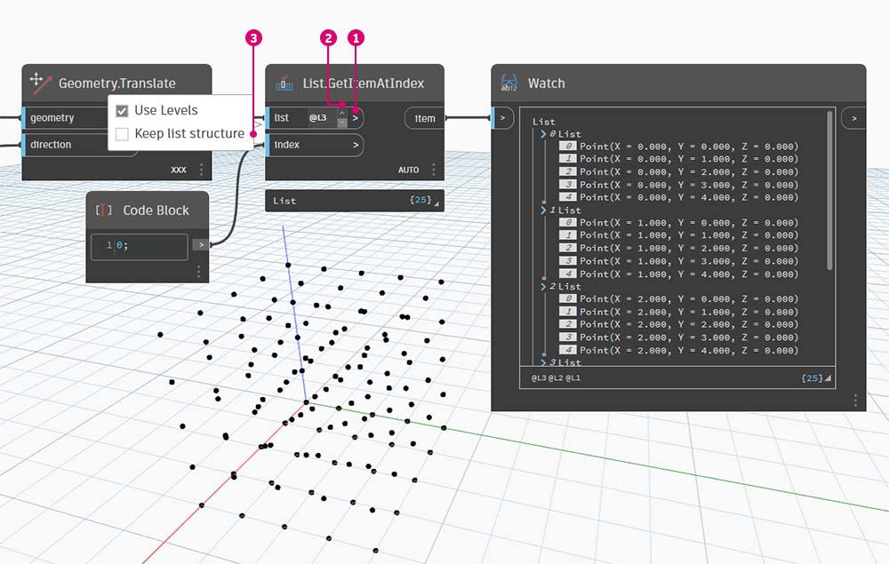

# 列表的列表

### 列表的列表

让我们再为层次结构添加一个层级。如果我们从原始示例中获取数据卡组并创建包含多个数据卡组的框，则该框现在表示一列数据卡组，每个数据卡组表示一列数据卡。这是一列列表。在本节的类比中，下图包含一列硬币卷，每个卷包含一列便士。

> 照片由 [Dori](https://commons.wikimedia.org/wiki/File:Stack\_of\_coins\_0214.jpg) 拍摄。

### 查询

我们可以在该列列表中进行哪些**查询**？这将访问现有特性。

* 硬币类型的数量？2\.
* 硬币类型值？$0.01 和 $0.25。
* 两角五分的材料？75% 铜和 25% 镍。
* 便士材料？97.5% 锌和 2.5% 铜。

### 操作

我们可以对该列列表执行哪些**操作**？这会根据给定的操作更改该列列表。

* 选择一叠特定的两角五分或便士。
* 选择一个特定的两角五分或便士。
* 重新排列各叠两角五分和便士。
* 将各叠堆叠在一起。

同样，Dynamo 为上述每项操作都提供了一个分析节点。由于我们处理的是抽象数据而不是物理对象，因此我们需要一组规则来控制如何上下移动数据层次结构。

在处理列表的列表时，数据是分层且复杂的，但这使得有机会执行一些很棒的参数化操作。让我们来分解基础知识，并在下面的课程中再讨论几项操作。

## 练习

### 自上而下层次结构

> 单击下面的链接下载示例文件。
>
> 可以在附录中找到示例文件的完整列表。



要从本部分中了解的基本概念：**Dynamo 将列表视为自身内部和自身的对象**。这种自上而下层次结构是在考虑面向对象编程的情况下开发的。Dynamo 会选择数据结构中主列表的索引，而不是使用诸如 **“List.GetItemAtIndex”** 之类的命令选择子元素。该项可以是另一个列表。让我们用示例图像进行分解：

> 1. 使用 **“代码块”**，我们已定义两个范围：`0..2; 0..3;`
> 2. 这些范围连接到 **“Point.ByCoordinates”** 节点，其中连缀设置为 _“叉积”_。这将创建点栅格，并且还会返回一列列表作为输出。
> 3. 请注意，**“Watch”** 节点提供 3 个列表，其中每个列表中有 4 个项目。
> 4. 使用 **“List.GetItemAtIndex”** 时，在索引为 0 的情况下，Dynamo 会选择第一个列表及其所有内容。其他程序可能会选择数据结构中每个列表的第一个项目，但 Dynamo 在处理数据时采用自上而下层次结构。

### List.Flatten

> 单击下面的链接下载示例文件。
>
> 可以在附录中找到示例文件的完整列表。



“展平”会从数据结构中删除所有层级的数据。这在操作不需要数据层次结构时非常有用，但由于它会删除信息，因此可能存在风险。下面的示例显示了展平一列数据的结果。

> 1. 在 **“代码块”** 中插入一行代码以定义一个范围：`-250..-150..#4;`
> 2. 通过将 _“代码块”_ 插入到 **“Point.ByCoordinates”** 节点的 _“x”_ 和 _“y”_ 输入，我们会将连缀设置为 _“叉积”_ 以获取点栅格。
> 3. **“Watch”** 节点显示我们有一列列表。
> 4. **“PolyCurve.ByPoints”** 节点将引用每个列表并创建相应的复合线。请注意，在 Dynamo 预览中，我们有四条复合线分别表示栅格中的每一行。

> 1. 通过在复合线节点之前插入 _“展平”_，我们为所有点创建了一个列表。**“PolyCurve.ByPoints”** 节点引用列表来创建一条曲线，并且由于所有点都在一个列表中，因此我们得到了一条锯齿形复合线，该复合线贯穿整个点列表。

还有用于展平孤立层级数据的选项。使用 **“List.Flatten”** 节点，可以定义一定数量的数据层级，以从层次结构的顶部展平。如果要处理的复杂数据结构不一定与工作流相关，那么这是一个非常有用的工具。另一个选择是在 **“List.Map”** 中将展平节点用作函数。我们将在下面详细介绍 **“List.Map”**。

### 切除

> 单击下面的链接下载示例文件。
>
> 可以在附录中找到示例文件的完整列表。



使用参数化建模时，有时您还希望将修改现有列表的数据结构。此外，还有许多节点可用于此操作，其中最基本的版本是“切除”。使用“切除”，我们可以将一个列表划分为具有一定数量项目的子列表。

“切除”命令会根据给定的列表长度来分割列表。在某些方面，切除与展平相反：它不是删除数据结构，而是向其中添加新的层级。这是一个有助于执行几何操作（如以下示例）的工具。

### List.Map

> 单击下面的链接下载示例文件。
>
> 可以在附录中找到示例文件的完整列表。



**“List.Map/Combine”** 会将设置的函数应用于输入列表，但在层次结构中向下一步。组合与贴图相同，但组合可以具有与给定函数的输入相对应的多个输入。

_注意：此练习是使用 Dynamo 的先前版本创建的。通过添加_**“List@Level”**_功能，_**“List.Map”**_的大部分功能已经解决。有关详细信息，请参见下面的_[_“List@Level”_](6-3\_lists-of-lists.md#listlevel)_。_。

通过简单介绍一下，我们来回顾上一节中的 **“List.Count”** 节点。

**“List.Count”** 节点对列表中的所有项目进行计数。我们将使用此节点来演示 **“List.Map”** 如何工作。

> 1.  将两行代码插入到 **“代码块”**：`-50..50..#Nx; -50..50..#Ny;`
>
>     在键入此代码后，代码块将为 Nx 和 Ny 创建两个输入。
> 2. 使用两个 _整数滑块_，通过将它们连接到 **“代码块”** 来定义 _“Nx”_ 和 _“Ny”_ 值。
> 3. 将代码块的每行连接到 **“Point.ByCoordinates”** 节点的相应 _“X”_ 和 _“Y”_ 输入。在节点上单击鼠标右键，选择“连缀”，然后选择 _“叉积”_。这将创建点栅格。因为我们定义的范围是 -50 到 50，所以我们跨越了默认的 Dynamo 栅格。
> 4. _**“Watch”**_ 节点显示所创建的点。请注意数据结构。我们已创建一列列表。每个列表都表示栅格的一行点。

\

> 1. 将上一步中的**“List.Count”**节点附加到“Watch”节点的输出。
> 2. 将 **“Watch”** 节点连接到 **“List.Count”** 输出。

请注意，“List.Count”节点提供的值为“5”。这等于代码块中所定义的“Nx”变量。这是为什么呢？

* 首先，**“Point.ByCoordinates”** 节点使用“x”输入作为用于创建列表的主输入。当 Nx 为 5 且 Ny 为 3 时，我们得到一列 5 个列表，每个列表都包含 3 个项目。
* 由于 Dynamo 将列表视为自身内部和自身的对象，因此 **“List.Count”** 节点会应用于层次结构中的主列表。结果为值 5 或主列表中列表的数量。

> 1. 通过使用 **“List.Map”** 节点，我们在层次结构中向下一步，然后在此级别上执行 _“函数”_。
> 2. 请注意，**“List.Count”** 节点没有输入。它将用作一个函数，因此 **“List.Count”** 节点将应用于层次结构中向下一步的每个单独列表。**“List.Count”** 的空白输入对应于 **“List.Map”** 的列表输入。
> 3. **“List.Count”** 的结果现在提供一列 5 个项目，每个项目的值为 3。这表示每个子列表的长度。

### **List.Combine**

_注意：此练习是使用 Dynamo 的先前版本创建的。通过添加_**“List@Level”**_功能，“List.Combine”的大部分功能已经解决。有关详细信息，请参见下面的_[_“List@Level”_](6-3\_lists-of-lists.md#listlevel)_。_。

在本练习中，我们将使用 **“List.Combine”** 演示如何使用它来在单独的对象列表中应用函数。

首先，设置两个点列表。

> 1. 使用 **“Sequence”** 节点生成 10 个值，每个值都有 10 步增量。
> 2. 将结果连接到 **“Point.ByCoordinates”** 节点的 x 输入。这将在 Dynamo 中创建点列表。
> 3. 将第二个 **“Point.ByCoordinates”** 节点添加到工作空间、使用相同的 **“Sequence”** 输出作为其 x 输入，但使用 **“Interger Slider”** 作为其 y 输入并将其值设置为 31（它可以是任何值，只要它们不与第一组点重叠），这样 2 组点就不会相互重叠。

接下来，我们将使用 **“List.Combine”** 对 2 个单独列表中的对象应用函数。在本例中，它将是一个简单的绘制线函数。

> 1. 将 **“List.Combine”** 添加到工作空间，并连接 2 组点作为其 list0 和 list1 输入。
> 2. 使用 **“Line.ByStartPointEndPoint”** 作为 **“List.Combine”** 的输入函数。

完成后，通过 **“Line.ByStartPointEndPoint”** 函数将 2 组点压缩/成对组合在一起，并在 Dynamo 中返回 10 行。

请参见 n 维列表中的练习，以查看使用“List.Combine”的另一个示例。

### List@Level

> 单击下面的链接下载示例文件。
>
> 可以在附录中找到示例文件的完整列表。



相较于 **“List.Map”**，**“List@Level”** 功能允许直接选择要在节点的输入端口上使用的列表级别。此功能可应用于节点的任何传入输入，并让您可以更快、更容易地访问列表的各级别（相较于其他方法）。只需告诉节点要使用列表的哪个级别作为输入，然后让节点执行其余操作即可。

在本练习中，我们将使用 **“List@Level”** 功能隔离特定级别的数据。

我们将从一个简单的三维点栅格开始。

> 1. 该栅格使用 X、Y 和 Z 范围构建，因此我们知道数据结构由 3 个层级组成：X 列表、Y 列表和 Z 列表。
> 2. 这些层级存在于不同的**级别**上。级别显示在预览气泡的底部。“列表级别”列与上述列表数据相对应，以帮助确定要在哪个级别工作。
> 3. “列表级别”按相反顺序进行组织，以便最低级别数据始终位于“L1”。这将有助于确保图形按计划工作，即使上游发生任何更改也是如此。

> 1. 要使用 **“List@Level”** 函数，请单击“>”。在此菜单中，您会看到两个复选框。
> 2. **使用级别** \- 这会启用 **“List@Level”** 功能。单击此选项后，将能够点进，然后选择希望节点使用的输入列表级别。使用此菜单，可以通过单击上下箭头来快速试用不同的级别选项。
> 3. _保持列表结构_ \- 如果已启用，则可以选择保持该输入的级别结构。有时，您可能会有目的地将数据组织到子列表中。选中此选项，即可使列表组织保持完整，而不会丢失任何信息。

使用简单的三维栅格，我们可以通过切换“列表级别”来访问和可视化列表结构。每个列表级别和索引组合将从原始三维集中返回一组不同的点。

> 1. DesignScript 中的“@L2”允许我们仅选择级别 2 的列表。级别 2 列表（索引为 0）仅包含第一组 Y 点，从而仅返回 XZ 栅格。
> 2. 如果将级别过滤器更改为“L1”，则我们将能够看到第一列表级别中的所有内容。级别 1 列表（索引 0）将所有三维点都包括在一个展平列表中。
> 3. 如果我们尝试对“L3”执行相同操作，则我们仅会看到第三列表级别点。级别 3 列表（索引为 0）仅包含第一组 Z 点，从而仅返回 XY 栅格。
> 4. 如果我们尝试对“L4”执行相同操作，则我们仅会看到第三列表级别点。级别 4 列表（索引为 0）仅包含第一组 X 点，从而仅返回 YZ 栅格。

尽管也可以使用 **“List.Map”** 创建此特定示例，但 **“List@Level”** 会极大地简化交互，从而可以轻松访问节点数据。请在下面查看 **“List.Map”** 和 **“List@Level”** 方法的比较：

> 1. 尽管这两种方法都将允许我们访问相同的点，但 **“List@Level”** 方法允许我们轻松地在一个节点内的数据层之间切换。
> 2. 要使用 **“List.Map”** 访问点栅格，我们需要使用 **“List.GetItemAtIndex”** 节点以及 **“List.Map”**。对于我们要向下步进的每个列表级别，我们需要使用额外的 **“List.Map”** 节点。根据列表的复杂程度，这可能需要将大量 **“List.Map”** 节点添加到图形中，才能访问正确级别的信息。
> 3. 在此示例中，**“List.GetItemAtIndex”** 节点与 **“List.Map”** 节点结合使用会返回列表结构与 **“List.GetItemAtIndex”**（在选择“@L3”的情况下）相同的一组相同点。

### Transpose

> 单击下面的链接下载示例文件。
>
> 可以在附录中找到示例文件的完整列表。



“Transpose”是一个处理列表的列表时的基本函数。与在电子表格程序中一样，转置会翻转数据结构的列和行。我们将在下面的基本矩阵中对此进行演示，并且在以下部分中我们将演示如何使用转置来创建几何关系。

让我们从上一个练习中删除 **“List.Count”** 节点，然后转到一些几何图形以查看数据的结构。

> 1. 从 **“Point.ByCoordinates”** 将 **“PolyCurve.ByPoints”** 连接到“Watch”节点的输出。
> 2. 输出会显示 5 条复合线，我们可以在 Dynamo 预览中看到这些曲线。Dynamo 节点将查找一列点（或在本例中为一列点列表）并基于它们创建一条复合线。实际上，每个列表已转换为数据结构中的曲线。

> 1. **“List.Transpose”** 节点将切换一列列表中所有列表的所有项目。这听起来很复杂，但其逻辑与 Microsoft Excel 中的“转置”相同：在数据结构中切换列和行。
> 2. 请注意抽象结果：“转置”将列表结构从 5 列（每列 3 个项目）更改为 3 列（每列 5 个项目）。
> 3. 请注意几何结果：使用 **“PolyCurve.ByPoints”**，我们在与原始曲线的垂直方向上获得 3 条复合线。

## 用于创建列表的代码块

代码块简写使用“[]”来定义列表。与 **“List.Create”** 节点相比，这种方法可更快、更流畅地创建列表。**代码块**会在 [“代码块和 DesignScript”](../../8\_coding\_in\_dynamo/8-1\_code-blocks-and-design-script/) 中进行更详细的介绍。请参照下图，以注意如何使用代码块定义具有多个表达式的列表。

#### 代码块查询

**代码块**简写使用“[]”作为要从复杂数据结构中选择所需特定项目的快速简便方法。**代码块**会在[“代码块和 DesignScript”](../../8\_coding\_in\_dynamo/8-1\_code-blocks-and-design-script/)一章中进行更详细的介绍。请参照下图，以注意如何使用代码块查询具有多个数据类型的列表。

## 练习 - 查询和插入数据

> 单击下面的链接下载示例文件。
>
> 可以在附录中找到示例文件的完整列表。



本练习使用在上一个练习中建立的某些逻辑来编辑曲面。我们在此处的目标一目了然，但将更多涉及数据结构导航。我们希望通过移动控制点来接合曲面。

从上述节点字符串开始。我们将创建一个跨越默认 Dynamo 栅格的基本曲面。

> 1. 使用 **“代码块”**，插入以下两行代码并分别连接到 **“Surface.PointAtParameter”** 的 _“u”_ 和 _“v”_ 输入：`-50..50..#3;` `-50..50..#5;`
> 2. 确保将 **“Surface.PointAtParameter”** 的“连缀”设置为 _“叉积”_。
> 3. **“Watch”** 节点显示我们有一列 3 个列表（每个列表都含有 5 个项目）。

在此步骤中，我们要在已创建的栅格中查询中心点。为此，我们将选择中间列表中的中间点。有道理，对吧？

> 1. 要确认这一点是正确的，我们还可以单击“Watch”节点项目来确认我们面向的目标是正确的。
> 2. 使用 **“代码块”**，我们将编写一行基本代码，用于查询一列列表：\
 `points[1][2];`
> 3. 使用 **“Geometry.Translate”**，我们会将选定点在 _Z_ 方向上上移 _20_ 个单位。

> 1. 我们还要使用 **“List.GetItemAtIndex”** 节点选择中间行的点。注意：与上一步类似，我们还可以使用 **“代码块”**，通过一行代码 `points[1];` 查询列表

到目前为止，我们已成功查询中心点并将其向上移动。现在，我们需要将此移动的点插回原始数据结构。

> 1. 首先，我们要替换在上一步中隔离的列表项。
> 2. 使用 **“List.ReplaceItemAtIndex”**，我们会将使用且索引为 _“2”_ 的中间项替换为与移动的点（ **“Geometry.Translate”** ）相连的替换项。
> 3. 输出显示我们已将移动的点输入到列表的中间项。

现在，我们已经修改了列表，我们需要将此列表插回原始数据结构：列表的列表。

> 1. 遵循相同的逻辑，使用 **“List.ReplaceItemAtIndex”** 将中间列表替换为我们修改的列表。
> 2. 请注意，为这两个节点定义索引的 “**代码块**_”_ 为 1 和 2，这与 **“代码块”** (_points[1][2]_) 中的原始查询匹配。
> 3. 通过选择 _“索引 1”_ 处的列表，我们会看到数据结构在 Dynamo 预览中亮显。我们已成功将移动的点合并到原始数据结构中。

基于这组点生成曲面的方法有多种。在本例中，我们将通过一起放样曲线来创建曲面。

> 1. 创建 **“NurbsCurve.ByPoints”** 节点并连接新的数据结构，来创建三条 NURBS 曲线。

> 1. 将 **“Surface.ByLoft”** 连接到 **“NurbsCurve.ByPoints”** 的输出。现在，我们得到了一个修改的曲面。我们可以更改几何图形的原始 _Z_ 值。平移并观察几何图形更新！
