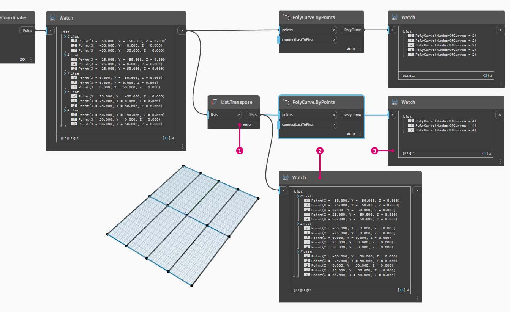
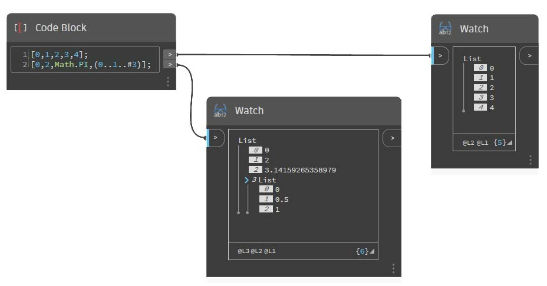

# Listy list

### Listy list

Dodajmy jeszcze jeden poziom do hierarchii. Jeśli weźmiemy talię kart z pierwszego przykładu i utworzymy pudełko z wieloma taliami, to pudełko reprezentuje listę talii, a każda talia reprezentuje listę kart. Tak działa lista list. Na potrzeby porównania w tej sekcji zakładamy, że ilustracja poniżej zawiera listę rolek monet, a każda rolka zawiera listę monet pensów.

> Zdjęcie autorstwa [Dori](https://commons.wikimedia.org/wiki/File:Stack\_of\_coins\_0214.jpg).

### Zapytanie

Jakie **zapytania** możemy utworzyć względem listy list? Umożliwia to dostęp do istniejących właściwości.

* Ile jest typów monet? 2\.
* Jakie są wartości typów monet? 0,01 USD i 0,25 USD.
* Z czego składają się monety 0,25 USD? 75% miedzi i 25% niklu.
* Z czego składają się monety 0,01 USD? 97,5% cynku i 2,5% miedzi.

### Działanie

Jakie **działania** możemy wykonać na liście list? Lista list ulegnie zmianie zależnie od zadanej operacji.

* Wybranie określonego stosu monet 0,25 lub 0,01 USD.
* Wybranie określonej monety.
* Zmiana kolejności stosów monet 0,25 i 0,01 USD.
* Wymieszanie stosów.

Dodatek Dynamo zawiera węzeł odpowiadający każdej z powyższych operacji. Pracujemy na danych abstrakcyjnych, a nie obiektach fizycznych, dlatego jest potrzebny zestaw reguł dotyczących poruszania się w hierarchii danych.

W przypadku list list dane są złożone i znajdują się na wielu warstwach. Taka reprezentacja pozwala wykonywać wiele przydatnych operacji parametrycznych. W poniższych lekcjach omówimy podstawy tego systemu i jeszcze kilka operacji.

## Ćwiczenie

### Hierarchia obiektów

> Pobierz plik przykładowy, klikając poniższe łącze.
>
> Pełna lista plików przykładowych znajduje się w załączniku.



Najważniejsze założenie wynikające z tej sekcji jest takie, że **dodatek Dynamo traktuje każdą listę jako obiekt**. Taka hierarchia jest przydatna w przypadku programowania obiektowego. Zamiast wybierać elementy podrzędne przy użyciu poleceń takich jak **List.GetItemAtIndex**, dodatek Dynamo wybierze ten indeks na głównej liście struktury danych. Pod tym indeksem znajduje się kolejna lista. Przeanalizujemy ten mechanizm na przykładowej ilustracji:

> 1. W węźle **Code Block** zdefiniowaliśmy dwa zakresy: `0..2; 0..3;`
> 2. Te zakresy są połączone z węzłem **Point.ByCoordinates**, gdzie skratowanie ustawiono na _Iloczyn wektorowy_. Powstaje w ten sposób siatka punktów, a na wyjściu jest generowana lista list.
> 3. Węzeł **Watch** wskazuje, że na każdej liście znajdują się 3 listy po 4 elementy.
> 4. W przypadku użycia węzła **List.GetItemAtIndex** z indeksem 0 dodatek Dynamo wybierze pierwszą listę z całą jej zawartością. Inne programy mogą wybrać pierwszy element każdej z list w strukturze danych, ale w dodatku Dynamo jest stosowana hierarchiczna obsługa danych.

### List.Flatten

> Pobierz plik przykładowy, klikając poniższe łącze.
>
> Pełna lista plików przykładowych znajduje się w załączniku.



Węzeł Flatten usuwa wszystkie poziomy ze struktury danych. Jest to przydatne, gdy hierarchia danych nie jest potrzebna w danej operacji, ale też ryzykowne, gdyż powoduje usunięcie informacji. Poniższy przykład ilustruje skutek spłaszczenia listy danych.

> 1. Wstaw wiersz kodu, aby zdefiniować zakres w węźle **Code Block**: `-250..-150..#4;`
> 2. Połączymy węzeł _Code Block_ z danymi wejściowymi _x_ i _y_ węzła **Point.ByCoordinates** i ustawimy skratowanie na _Iloczyn wektorowy_, aby usunąć siatkę punktów.
> 3. Węzeł **Watch** wskazuje, że powstała lista list.
> 4. Węzeł **PolyCurve.ByPoints** będzie odnosił się do każdej z listy i utworzy odpowiadające im krzywe złożone. W podglądzie dodatku Dynamo widać, że istnieją cztery krzywe złożone (polycurve) reprezentujące poszczególne wiersze siatki.

> 1. Wstawiając funkcję _Flatten_ (spłaszczenia) przed węzłem krzywej złożonej, utworzyliśmy pojedynczą listę zawierającą wszystkie punkty. Węzeł **PolyCurve.ByPoints** odnosi się do listy, aby utworzyć jedną krzywą. Ponieważ wszystkie punkty są na liście, uzyskujemy jedną, skomplikowaną krzywą złożoną zawierającą te punkty.

Można również spłaszczyć wybrane poziomy danych. Węzeł **List.Flatten** pozwala zdefiniować zestaw tych poziomów danych w hierarchii, które mają zostać spłaszczone. Jest to bardzo przydatne narzędzie podczas przetwarzania złożonych struktur danych, które nie są bezpośrednio powiązane z bieżącym procesem roboczym. Oprócz tego można użyć węzła spłaszczania jako funkcji węzła **List.Map**. Poniżej przedstawiono więcej informacji na temat węzła **List.Map**.

### Podział

> Pobierz plik przykładowy, klikając poniższe łącze.
>
> Pełna lista plików przykładowych znajduje się w załączniku.



Gdy model jest oparty na parametrach, czasami trzeba zmodyfikować strukturę danych istniejącej listy. Można to zrobić przy użyciu różnych węzłów, a węzeł podziału oferuje najprostszy mechanizm. Pozwala on podzielić listę na listy podrzędne o określonej liczbie elementów.

Polecenie Chop dzieli listy zależnie od długości listy wejściowej. W pewnym sensie dzielenie jest operacją odwrotną do spłaszczania: zamiast redukować strukturę danych, generuje nowe poziomy. Jest to przydatne narzędzie podczas pracy nad geometrią, tak jak na poniższym przykładzie.

### List.Map

> Pobierz plik przykładowy, klikając poniższe łącze.
>
> Pełna lista plików przykładowych znajduje się w załączniku.



Węzeł **List.Map/Combine** stosuje zadaną funkcję do listy wejściowej, ale o jeden poziom niżej w hierarchii. Kombinacje działają analogicznie do map, ale mają wiele wejść odpowiadających wejściu zadanej funkcji.

_Uwaga: to ćwiczenie utworzono we wcześniejszej wersji dodatku Dynamo. Wiele funkcji węzła_ **List.Map** _przestało być potrzebnych po wprowadzeniu funkcji_ **List@Level**_. Więcej informacji można znaleźć w sekcji_ [_List@Level_](3-lists-of-lists.md#lists-of-lists) _poniżej._

Na wstępie przyjrzymy się węzłowi **List.Count** z poprzedniej sekcji.

Węzeł **List.Count** liczy wszystkie elementy na liście. Użyjemy go, aby zademonstrować działanie węzła **List.Map**.

> 1.  Wstaw dwa wiersze kodu do węzła **Code Block**: `-50..50..#Nx; -50..50..#Ny;`
>
>     Po wpisaniu tego kodu blok będzie tworzył dwie dane wejściowe: Nx i Ny.
> 2. Korzystając z dwóch suwaków _Integer Slider_, zdefiniuj wartości _Nx_ i _Ny_ przez połączenie ich z węzłem **Code Block**.
> 3. Połącz poszczególne wiersze węzła Code Block odpowiednio z danymi wejściowymi _X_ i _Y_ węzła **Point.ByCoordinates**. Kliknij węzeł prawym przyciskiem myszy, wybierz opcję Skratowanie i wybierz pozycję _Iloczyn wektorowy_. Zostanie utworzona siatka punktów. Ustawiliśmy zakres od –50 do 50, dlatego odpowiada to domyślnej siatce dodatku Dynamo.
> 4. Węzeł _**Watch**_ ujawnia utworzone punkty. Przyjrzyjmy się strukturze danych. Powstała lista list. Każda lista odpowiada wierszowi punktów siatki.

> 1. Połącz węzeł **List.Count** z wyjściem węzła obserwacyjnego z poprzedniego kroku.
> 2. Połącz węzeł **Watch** z wyjściem węzła **List.Count**.

Węzeł List.Count generuje wartość 5. Jest to równe zmiennej Nx zdefiniowanej w bloku kodu. Dlaczego tak jest?

* Najpierw węzeł **Point.ByCoordinates** używa wejścia „x” jako głównej wartości wejściowej podczas tworzenia list. Gdy wartość Nx wynosi 5, a Ny wynosi 3, powstaje lista 5 list po 3 elementy.
* Dodatek Dynamo traktuje listy jako obiekty, dlatego węzeł **List.Count** jest stosowany do listy głównej w hierarchii. Daje to wynik 5, czyli liczbę list na liście głównej.

> 1. Przy użyciu węzła **List.Map** przejdziemy niżej w hierarchii i wykonamy pewną _funkcję_ na tym poziomie.
> 2. Węzeł **List.Count** nie ma żadnych wejść. Jest używany jako funkcja. Oznacza to, że węzeł **List.Count** jest stosowany do każdej z listy na niższym poziomie w hierarchii. Puste wejście węzła **List.Count** odpowiada liście wyjściowej węzła **List.Map**.
> 3. Jako wynik węzła **List.Count** otrzymujemy teraz listę 5 elementów, każdy o wartości 3. Odpowiada to długości poszczególnych podlist.

### **List.Combine**

_Uwaga: to ćwiczenie utworzono we wcześniejszej wersji dodatku Dynamo. Wiele funkcji węzła List.Combine przestało być potrzebnych po wprowadzeniu funkcji_ **List@Level**_. Więcej informacji można znaleźć w sekcji_ [_List@Level_](6-3\_lists-of-lists.md#listlevel) _poniżej._

W tym ćwiczeniu użyjemy węzła **List.Combine**, aby zademonstrować, jak można użyć go do zastosowania funkcji w oddzielnych listach obiektów.

Zacznij od przygotowania dwóch list punktów.

> 1. Użyj węzła **Sequence**, aby wygenerować 10 wartości, z których każda będzie miała przyrost 10-krokowy.
> 2. Połącz wynik z wejściem x węzła **Point.ByCoordinates**. Spowoduje to utworzenie listy punktów w dodatku Dynamo.
> 3. Dodaj drugi węzeł **Point.ByCoordinates** do obszaru roboczego, użyj tego samego wyjścia **Sequence** co w przypadku wejścia x, ale jako wejścia y użyj **Interger Slider** i ustaw jego wartość na 31 (może to być dowolna wartość, o ile nie będzie zachodzić na pierwszy zestaw punktów), tak aby 2 zestawy punktów nie nakładały się na siebie.

Następnie użyjemy węzła **List.Combine**, aby zastosować funkcję do obiektów na 2 osobnych listach. W tym przypadku będzie to prosta funkcja rysowania linii.

> 1. Dodaj węzeł **List.Combine** do obszaru roboczego i połącz 2 zestawy punktów jako wejścia list0 i list1.
> 2. Użyj **Line.ByStartPointEndPoint** jako funkcji wejściowej dla węzła **List.Combine**.

Po zakończeniu te 2 zestawy punktów są spakowane/sparowane za pomocą funkcji **Line.ByStartPointEndPoint** i powodują zwrócenie 10 linii w dodatku Dynamo.


 Zapoznaj się z ćwiczeniem w części dotyczącej list n-wymiarowych, aby zobaczyć inny przykład użycia węzła List.Combine. 


### List@Level

> Pobierz plik przykładowy, klikając poniższe łącze.
>
> Pełna lista plików przykładowych znajduje się w załączniku.



Funkcja **List@Level** jest preferowana względem węzła **List.Map**. Umożliwia ona bezpośrednie wybranie poziomu listy, który ma być przetwarzany — wprost na porcie wejściowym węzła. Tę funkcję można zastosować do dowolnego wejścia przychodzącego węzła, aby uzyskać dostęp do poziomów list szybciej i łatwiej niż w przypadku innych metod. Wystarczy wskazać węzłowi, który poziom listy ma być używany jako wejście, a węzeł zrobi resztę.

W tym ćwiczeniu użyjemy funkcji **List@Level**, aby odizolować określony poziom danych.

Zaczniemy od prostej trójwymiarowej siatki punktów.

> 1. Siatka jest tworzona przy użyciu zakresów X, Y i Z, dlatego wiemy, że struktura danych ma trzy poziomy: listy X, Y i Z.
> 2. Dane istnieją na różnych **poziomach**. Poziomy są wskazywane u dołu podglądu. Kolumny poziomów list odpowiadają danym na powyższych listach, co ułatwia identyfikację poziomu, który ma być przetwarzany.
> 3. Lista poziomów jest uporządkowana w odwrotnej kolejności — najniższy poziom danych na niej to zawsze poziom L1. Gwarantuje to odpowiednie działanie wykresów, nawet jeśli zostaną zmienione w przyszłości.

> 1. Aby użyć funkcji **List@Level**, kliknij przycisk >. W tym menu znajdują się dwa pola wyboru.
> 2. **Użyj poziomów** — powoduje to włączenie funkcji **List@Level**. Po kliknięciu tej opcji można klikać, aby wybierać poziomy list wejściowych, których ma używać węzeł. To menu pozwala szybko wypróbować różne opcje dotyczące poziomów, klikając strzałki w górę lub w dół.
> 3. _Zachowaj strukturę listy_ — gdy ta opcja jest włączona, można zachować strukturę poziomów danych wejściowych. Czasami dane są celowo uporządkowane na podlistach. Zaznaczenie tej opcji pozwala zachować porządek list i uniknąć utraty informacji.

Dzięki prostej siatce 3D można otwierać i wizualizować strukturę list, przełączając różne poziomy list. Każda kombinacja poziomu list i indeksu zwraca inny zestaw punktów z oryginalnego zestawu 3D.

> 1. Filtr „@L2” w kodzie DesignScript umożliwia wybranie samej listy na poziomie 2. Lista na poziomie 2 z indeksem 0 zawiera tylko pierwszy zestaw punktów Y — zwracana jest siatka na płaszczyźnie XZ.
> 2. Jeśli zmienimy filtr poziomów na „L1”, uzyskamy dostęp do wszystkich danych na pierwszym poziomie list. Lista na poziomie 1 z indeksem 0 jest płaską listą z wszystkimi punktami 3D.
> 3. Filtr „L3” udostępnia tylko punkty z trzeciego poziomu list. Lista na poziomie 3 z indeksem 0 zawiera tylko pierwszy zestaw punktów Z — zwracana jest siatka na płaszczyźnie XY.
> 4. Filtr „L4” udostępnia tylko punkty z trzeciego poziomu list. Lista na poziomie 4 z indeksem 0 zawiera tylko pierwszy zestaw punktów X — zwracana jest siatka na płaszczyźnie YZ.

Choć dane z tego przykładu można uzyskać przy użyciu węzła **List.Map**, funkcja **List@Level** zdecydowanie upraszcza te interakcje, przez co ułatwia dostęp do danych węzła. Poniżej przedstawiono porównanie metod **List.Map** i **List@Level**:

> 1. Choć obie metody pozwalają uzyskać dostęp do tych samych punktów, funkcja **List@Level** ułatwia wybranie odpowiednich warstw danych w jednym węźle.
> 2. Aby użyć siatki punktów za pomocą węzła **List.Map**, trzeba użyć węzła **List.GetItemAtIndex** w połączeniu z węzłem **List.Map**. Każde przejście na niższy poziom listy wymaga użycia dodatkowego węzła **List.Map**. Zależnie od złożoności używanych list uzyskanie dostępu do odpowiednich informacji może wymagać dodania wielu węzłów **List.Map** do wykresu.
> 3. W tym przykładzie węzeł **List.GetItemAtIndex** połączony z węzłem **List.Map** zwraca ten sam zestaw punktów z tą samą strukturą list co węzeł **List.GetItemAtIndex** z wybraną opcją „@L3”.

### Transpozycja

> Pobierz plik przykładowy, klikając poniższe łącze.
>
> Pełna lista plików przykładowych znajduje się w załączniku.



Transpozycja jest podstawową funkcją obsługi list zawierających listy. Podobnie jak w arkuszach kalkulacyjnych, transpozycja polega na zamianie węzłów z kolumnami w strukturze danych. Zademonstrujemy to na prostej macierzy poniżej. W kolejnej sekcji przedstawimy sposób tworzenia relacji geometrycznych przy użyciu transpozycji.

Usuniemy węzły **List.Count** z poprzednich ćwiczeń i przeniesiemy je do geometrii, aby sprawdzić strukturę danych.

> 1. Połącz węzeł **PolyCurve.ByPoints** z wyjściem węzła obserwacyjnego węzła **Point.ByCoordinates**.
> 2. Wyjście wskazuje 5 krzywych złożonych i widzimy te krzywe w podglądzie dodatku Dynamo. Węzeł Dynamo wyszukuje listę punktów (w tym przypadku jest to lista list punktów) i tworzy z nich pojedynczą krzywą złożoną. Każda z tych list jest konwertowana na krzywą w strukturze danych.

> 1. Węzeł **List.Transpose** zamieni wszystkie elementy z wszystkimi listami na liście list. Choć brzmi to jak złożona operacja, działa tak samo jak transpozycja w programie Microsoft Excel: zamienia kolumny z wierszami w strukturze danych.
> 2. Wynik abstrakcyjny: Transpozycja zmieniła strukturę listy. Zamiast 5 list po 3 elementy otrzymujemy 3 listy po 5 elementów.
> 3. Wynik geometryczny: przy użyciu węzła **PolyCurve.ByPoints** otrzymujemy 3 krzywe złożone biegnące prostopadle do oryginalnych krzywych.

## Węzeł Code Block do tworzenia listy

W kodzie bloku można użyć zapisu „[]”, aby utworzyć listę. Jest to szybsze i wygodniejsze niż użycie węzła **List.Create**. Węzeł **Code Block** jest bardziej szczegółowo opisany w rozdziale [Węzły Code Block i DesignScript](../../8\_coding\_in\_dynamo/8-1\_code-blocks-and-design-script/). Na poniższej ilustracji przedstawiono, jak zdefiniować w bloku kodu listę zawierającą wiele wyrażeń.

#### Zapytanie w bloku kodu

W węźle **Code Block** można użyć zapisu „[]”, aby szybko wybrać określone elementy ze złożonej struktury danych. Węzły **Code Block** są bardziej szczegółowo opisane w rozdziale [Węzły Code Block i DesignScript](../../8\_coding\_in\_dynamo/8-1\_code-blocks-and-design-script/). Na poniższej ilustracji przedstawiono, jak w bloku kodu uzyskać dostęp do listy zawierającej wiele typów danych.

## Ćwiczenie — pobieranie i wstawianie danych

> Pobierz plik przykładowy, klikając poniższe łącze.
>
> Pełna lista plików przykładowych znajduje się w załączniku.



W tym ćwiczeniu zmienimy powierzchnię przy użyciu logiki zdefiniowanej w poprzednim ćwiczeniu. Tutaj nasz cel jest intuicyjny, ale nawigacja w strukturze danych wymaga więcej uwagi. Chcemy poruszyć powierzchnią, przesuwając punkt kontrolny.

Zacznij od powyższego ciągu węzłów. Tworzymy prostą powierzchnię obejmującą domyślą siatkę dodatku Dynamo.

> 1. Przy użyciu węzła **Code Block** wstaw te dwa wiersze kodu i połącz blok z wejściami _u_ i _v_ węzła **Surface.PointAtParameter**: `-50..50..#3;` `-50..50..#5;`
> 2. Pamiętaj, aby ustawić skratowanie węzła **Surface.PointAtParameter** na _Iloczyn wektorowy_.
> 3. Węzeł **Watch** wskazuje, że powstały 3 listy po 5 elementów.

W tym kroku chcemy pobrać punkt środkowy utworzonej siatki. Aby to zrobić, wybierzemy środkowy punkt środkowej listy. To naprawdę proste.

> 1. Aby upewnić się, że to właściwy punkt, można też klikać w węźle Watch, aby sprawdzić, czy używamy odpowiedniego elementu.
> 2. Przy użyciu węzła **Code Block** napiszemy prosty kod pobierający listę list:\
 `points[1][2];`
> 3. Przy użyciu węzła **Geometry.Translate** przesuniemy wybrany punkt w kierunku _Z_ o _20_ jednostek.

> 1. Wybierzmy też środkowy wiersz punktów, używając węzła **List.GetItemAtIndex**. Uwaga: podobnie jak w poprzednim kroku, możemy pobrać elementy listy przy użyciu węzła **Code Block** zawierającego wiersz `points[1];`

Pobraliśmy punkt środkowy i przesunęliśmy go w górę. Teraz chcemy wstawić przesunięty punkt z powrotem do struktury danych.

> 1. Najpierw chcemy zastąpić odizolowany w poprzednim kroku element listy.
> 2. Zastąpimy środkowy element przy użyciu węzła **List.ReplaceItemAtIndex**. Użyjemy indeksu _2_, a zastępujący go element będzie połączony z przesuniętym punktem (**Geometry.Translate**).
> 3. W danych wyjściowych widzimy, że wprowadziliśmy przesunięty punkt jako środkowy element listy.

Mając zmodyfikowaną listę, musimy wstawić ją z powrotem do oryginalnej struktury danych: listy list.

> 1. W analogiczny sposób użyjemy węzła **List.ReplaceItemAtIndex**, aby wstawić naszą listę w miejsce środkowej listy.
> 2. Węzły **Code Block** definiujące indeks tych dwóch węzłów mają numery 1 i 2, co odpowiada oryginalnemu zapytaniu w węźle **Code Block** (_points[1][2]_).
> 3. Po wybraniu listy o _indeksie 1_ zobaczymy tę strukturę danych podświetloną w podglądzie dodatku Dynamo. Pomyślnie scaliliśmy przesunięty punkt z oryginalną strukturą danych.

Istnieją różne sposoby uzyskania powierzchni z tego zestawu punktów. W tym przypadku utworzymy ją przez wyciągnięcie połączonych krzywych.

> 1. Utwórz węzeł **NurbsCurve.ByPoints** i połącz z nim nową strukturę danych, aby utworzyć trzy krzywe NURBS.

> 1. Połącz węzeł **Surface.ByLoft** z wyjściem węzła **NurbsCurve.ByPoints**. Otrzymaliśmy zmodyfikowaną powierzchnię. Możemy zmienić oryginalną wartość _Z_ geometrii. Użyj translacji i zobacz, jak zostanie zaktualizowana geometria.
