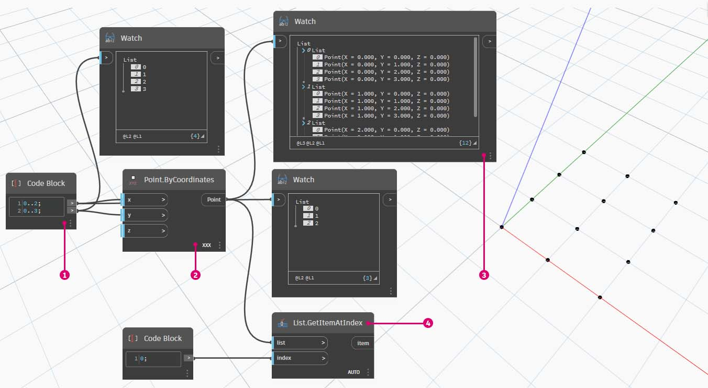
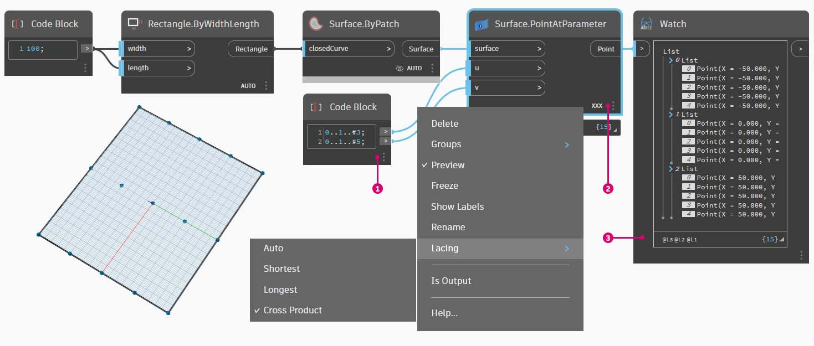

# 清單的清單

### 清單的清單

接下來在階層中再加入一層。我們以最初範例中的一副紙牌為例，如果製作容納多副紙牌的盒子，那麼現在盒子就代表各副紙牌的清單，而每副紙牌代表紙牌的清單。這是清單的清單。為了說明本節內容，我們進行類比，以下影像包含多疊硬幣，每疊包含多個一美分硬幣。

> 相片由 [Dori](https://commons.wikimedia.org/wiki/File:Stack\_of\_coins\_0214.jpg) 拍攝。

### 查詢

我們可以對清單的清單執行哪些**查詢**？這將存取既有性質。

* 有幾種硬幣類型？2\.
* 硬幣類型值？1 美分和 25 美分。
* 25 美分硬幣的材料是什麼？75% 的銅與 25% 的鎳。
* 一美分硬幣的材料是什麼？97.5% 的鋅與 2.5% 的銅。

### 動作

我們可以對清單的清單執行哪些**動作**？這會根據指定的作業變更清單的清單。

* 選取特定的一疊 25 美分硬幣或一美分硬幣。
* 選取特定的一枚 25 美分硬幣或一美分硬幣。
* 重新排列各疊 25 美分硬幣與一美分硬幣。
* 攪亂各疊硬幣。

再說一次，對於上述每項作業，Dynamo 都有類比節點。由於我們使用的是抽象資料，而不是實際物件，因此需要採用一組規則以管理資料階層上下移動的方式。

處理清單的清單時，資料分層放置且非常複雜，但是您可藉此執行某些良好的參數式作業。在以下課程中，我們將分類講解基礎知識，並討論更多作業。

## 練習

### 由上而下的階層

> 按一下下方的連結下載範例檔案。
>
> 附錄中提供完整的範例檔案清單。



本節將瞭解的基本概念：**Dynamo 將清單視為其本身的物件**。此由上而下的階層在開發時，考慮到以物件為導向的程式設計。Dynamo 並非使用類似於 **List.GetItemAtIndex** 的指令選取子元素，而是選取資料結構中的主要清單索引。項目可以是另一個清單。接下來我們使用範例影像進行分解說明：

> 1. 我們使用 **Code Block** 定義了兩個範圍：`0..2; 0..3;`
> 2. 這些範圍連接至 **Point.ByCoordinates** 節點，交織設定為 _「笛卡兒積」_。這會建立點的格線，也會傳回清單的清單作為輸出。
> 3. 請注意，**Watch** 節點可產生 3 個清單，每個清單中包含 4 個項目。
> 4. 使用 **List.GetItemAtIndex** 時，透過索引 0，Dynamo 會選取第一個清單及其所有內容。其他程式可能會在資料結構中選取每個清單的第一個項目，但 Dynamo 在處理資料時，採用由上而下的階層。

### List.Flatten

> 按一下下方的連結下載範例檔案。
>
> 附錄中提供完整的範例檔案清單。



平坦化會移除資料結構中的所有資料層。若您的作業不需要資料階層，這會很有用，但是存在風險，因為它會移除資訊。以下範例將展示對資料清單進行平坦化的結果。

> 1. 在 **Code Block** 中插入一行程式碼以定義範圍：`-250..-150..#4;`
> 2. 透過將 _Code Block_ 插入 **Point.ByCoordinates** 節點的 _x_ 與 _y_ 輸入，我們將交織設定為 _「笛卡兒積」_ 以取得點的格線。
> 3. **Watch** 節點顯示我們有一個清單的清單。
> 4. **PolyCurve.ByPoints** 節點將參考每個清單，並建立各自的 polycurve。請注意，在 Dynamo 預覽中有四個 polycurve，分別代表格線的每一列。

> 1. 透過在 polycurve 節點前插入 _平坦化_，我們建立了一個所有點的清單。**PolyCurve.ByPoints** 節點會參考清單來建立一條曲線，由於所有點都在一個清單上，因此我們將得到通過整個清單中所有點的一條曲折 polycurve。

此外，還提供對隔離層的資料進行平坦化的選項。使用 **List.Flatten** 節點，您可以定義從階層頂部進行平坦化的資料層數量。如果您對運用複雜的資料結構感到吃力，而這些資料結構不一定與您的工作流程相關，則該工具確實非常有用。其他選項會將平坦化節點用作 **List.Map** 中的函數。我們將在下面詳細討論 **List.Map**。

### 細分

> 按一下下方的連結下載範例檔案。
>
> 附錄中提供完整的範例檔案清單。



執行參數式塑型時，有時您也會想要對既有清單修改資料結構。有許多節點可用於實現此功能，細分是最基本的版本。使用細分，我們可以將清單分割為包含一定數量項目的子清單。

「細分」指令可根據指定的清單長度分割清單。在某種程度上，細分與平坦化恰恰相反：細分不是移除資料結構，而是在其中加入新層。對於諸如以下範例等幾何圖形作業，此工具很有用。

### List.Map

> 按一下下方的連結下載範例檔案。
>
> 附錄中提供完整的範例檔案清單。



**List.Map/Combine** 會對輸入清單套用一個設定好的函數，但下一階層的清單。組合與對映相同，只是組合可以有多個輸入對應於給定函數的輸入。

_注意：此練習使用舊版本的 Dynamo 建立。大部分 _**List.Map**_ 功能已透過增加 _**List@Level**_ 功能解決。如需更多資訊，請參閱以下的 _[_List@Level_](6-3\_lists-of-lists.md#listlevel)_。_

我們回顧上一節的 **List.Count** 節點來快速介紹。

**List.Count** 節點會對清單中的所有項目進行計數。我們將使用此節點示範 **List.Map** 的運作方式。

> 1.  在 **Code Block** 中插入兩行程式碼：`-50..50..#Nx; -50..50..#Ny;`
>
>     輸入此程式碼後，Code Block 會建立 Nx 與 Ny 兩個輸入。
> 2. 使用兩個 _Integer Slider_ 連接至 **Code Block** 以定義 _Nx_ 與 _Ny_ 值。
> 3. 將 Code Block 每一行分別連接至 **Point.ByCoordinates** 節點的 _X_ 與 _Y_ 輸入。在節點上按一下右鍵，選取「交織」，然後選擇 _「笛卡兒積」_。這會建立點的格線。由於我們定義的範圍是從 -50 到 50，因此將跨越預設的 Dynamo 格線。
> 4. _**Watch**_ 節點會顯示已建立的點。請注意資料結構。我們已建立一個清單的清單。每個清單都代表格線的一列點。

.jpg)

> 1. 將 **List.Count** 節點連接至上一步驟中 Watch 節點的輸出。
> 2. 將 **Watch** 節點連接至 **List.Count** 輸出。

請注意，List.Count 節點提供的值為 5。這等於 Code Block 中定義的「Nx」變數。為何會發生這種情況？

* 首先，**Point.ByCoordinates** 節點使用「x」輸入作為建立清單的主要輸入。若 Nx 為 5 且 Ny 為 3，我們會得到一個 5 個清單的清單，每個清單有 3 個項目。
* 因為 Dynamo 單獨只把清單視為對象，因此 **List.Count** 節點是套用到階層中的主要清單。結果值為 5，即主要清單中的清單數量。

> 1. 使用 **List.Map** 節點，我們進到階層的下一層，並在此層級執行 _function_。
> 2. 請注意，**List.Count** 節點沒有輸入。它是當作一個函數，因此會將 **List.Count** 節點套用至階層中下一層級的每個清單。**List.Count** 的空白輸入對應於 **List.Map** 的清單輸入。
> 3. 現在 **List.Count** 的結果提供一個 5 個項目的清單，每個項目的值為 3。這代表每個子清單的長度。

### **List.Combine**

_注意：此練習使用舊版本的 Dynamo 建立。大部分 List.Map 功能已透過增加 _**List@Level**_ 功能解決。如需更多資訊，請參閱以下的 _[_List@Level_](6-3\_lists-of-lists.md#listlevel)_。_

在本練習中，我們將使用 **List.Combine** 示範如何對不同物件清單中套用函數。

首先設定兩個點清單。

> 1. 使用 **Sequence** 節點產生 10 個值，每個值都有 10 個步長增量。
> 2. 將結果連接至 **Point.ByCoordinates** 節點的 x 輸入。這會在 Dynamo 中建立一個點清單。
> 3. 在工作區中增加第二個 **Point.ByCoordinates** 節點，使用相同的 **Sequence** 輸出做為其 x 輸入，但使用 **Interger Slider** 做為其 y 輸入，並將其值設定為 31 (可以是任何值，只要不與第一組點重疊即可)，讓兩組點不會彼此重疊。

接下來，我們使用 **List.Combine** 對 2 個單獨清單中的物件套用函數。在此範例中，是一個簡單的繪製線條函數。

> 1. 在工作區中加入 **List.Combine**，連接 2 組點做為其 list0 與 list1 輸入。
> 2. 使用 **Line.ByStartPointEndPoint** 做為 **List.Combine** 的輸入函數。

完成後，2 組點會透過 **Line.ByStartPointEndPoint** 函數配對，並在 Dynamo 中傳回 10 條線。

 請參閱 n 維清單中的練習，以查看使用 List.Combine 的另一個範例。

### List@Level

> 按一下下方的連結下載範例檔案。
>
> 附錄中提供完整的範例檔案清單。



比 **List.Map** 更好的是，**List@Level** 功能可讓您在節點的輸入埠直接選取要使用的清單層級。此功能可套用至節點的任何輸入，您可藉此較其他方法更快更輕鬆地存取清單的層級。您只需向節點告知要用作輸入的清單層級，節點會執行其餘作業。

在本練習中，我們將使用 **List@Level** 功能隔離特定層級的資料。

我們將從簡單的 3D 點格線開始。

> 1. 格線是使用 X、Y 與 Z 的範圍建構而成，我們知道資料的結構包含 3 層：X 清單、Y 清單及 Z 清單。
> 2. 這些層處於不同的**層級**。預覽標示圈底部指出了層級。清單的層級欄對應於上面的清單資料，可協助識別工作所在的層級。
> 3. 清單層級以反轉順序排列，因此最低層級的資料始終位於「L1」。這有助於確保圖表按計劃工作，即使上游發生變更，也是如此。

> 1. 若要使用 **List@Level** 函數，請按一下「>」。在此功能表中，您會看到兩個勾選方塊。
> 2. **使用層級** \- 這會啟用 **List@Level** 功能。按一下此選項後，您就能在當中點按，然後選取希望節點使用的輸入清單層級。透過此功能表，您就能按一下向上或向下，快速試用不同的層級選項。
> 3. _保留清單結構_ \- 如果啟用，您可以選擇保留該輸入的層級結構。有時，您可能會特意將資料組織到子清單中。勾選此選項，可以保持清單組織不變，確保不會遺失任何資訊。

使用簡單的 3D 格線，我們可以切換清單層級，以存取與視覺化清單結構。清單層級與索引的每個組合都會從原始的 3D 點集傳回一組不同的點。

> 1. 透過 DesignScript 中的「@L2」，我們可以只選取層級 2 的清單。層級 2 的清單 (索引為 0) 只會包括第一組 Y 點，只傳回 XZ 格線。
> 2. 如果將層級篩選變更為「L1」，我們可以看到第一個清單層級內的所有內容。層級 1 的清單 (索引為 0) 會以一個展開清單包括所有 3D 點。
> 3. 如果我們嘗試改成「L3」並執行相同作業，只會看到第三個清單層級的點。層級 3 的清單 (索引為 0) 只會包括第一組 Z 點，只傳回 XY 格線。
> 4. 如果我們嘗試改成「L4」並執行相同作業，只會看到第三個清單層級的點。層級 4 的清單 (索引為 0) 只會包括第一組 X 點，只傳回 YZ 格線。

雖然我們也可以使用 **List.Map** 建立此特定範例，但是 **List@Level** 能夠大幅簡化互動方式，讓存取節點資料更輕鬆。請看下面 **List.Map** 與 **List@Level** 方法的比較：

> 1. 雖然使用兩種方法都可以存取相同的點，但是使用 **List@Level** 方法可以在單一節點內輕鬆切換不同資料層。
> 2. 若要使用 **List.Map** 存取點格線，我們需要一起使用 **List.GetItemAtIndex** 節點和 **List.Map**。如果我們要下移每個清單層級，都必須額外使用一個 **List.Map** 節點。視清單的複雜性而定，您可能需要在圖表中加入大量 **List.Map** 節點，才能存取適當層級的資訊。
> 3. 在此範例中，**List.GetItemAtIndex** 節點搭配 **List.Map** 節點，與 **List.GetItemAtIndex** (選取「@L3」) 傳回相同清單結構的相同一組點。

### 轉置

> 按一下下方的連結下載範例檔案。
>
> 附錄中提供完整的範例檔案清單。



轉置是處理清單的清單時的基本功能。正如在試算表程式中，轉置會翻轉資料結構的欄與列。我們將使用以下的基本矩陣示範這一點，在之後的一節中，我們將示範如何使用轉置建立幾何關係。

接下來刪除上一個練習中的 **List.Count** 節點，而改用某些幾何圖形以查看資料的構建方式。

> 1. 將 **PolyCurve.ByPoints** 從 **Point.ByCoordinates** 連接至 Watch 節點的輸出。
> 2. 輸出顯示 5 條 PolyCurve，我們可以在 Dynamo 預覽中看到這些曲線。Dynamo 節點將尋找點清單 (在此案例中是點清單的清單)，並根據點清單建立單一 polycurve。實質上，每個清單都已轉換為資料結構中的曲線。

> 1. **List.Transpose** 節點會切換所有項目，以及清單的清單中的所有清單。這似乎很複雜，但其邏輯與 Microsoft Excel 中的轉置相同：切換資料結構中的欄與列。
> 2. 請注意摘要結果：轉置會將清單結構從 5 個清單 (每個含 3 個項目) 變更為 3 個清單 (每個含 5 個項目)。
> 3. 請注意幾何圖形結果：使用 **PolyCurve.ByPoints**，會在原始曲線的垂直方向產生 3 條 PolyCurve。

## 清單建立的程式碼區塊

程式碼區塊速寫使用「[]」定義清單。與 **List.Create** 節點相比，這是更快速更流暢的清單建立方式。在[程式碼區塊和 DesignScript](../../8\_coding\_in\_dynamo/8-1\_code-blocks-and-design-script/) 中會更詳細地討論**程式碼區塊**。參考以下影像，請注意使用程式碼區塊如何定義具有多個表示式的清單。

#### 程式碼區塊查詢

**程式碼區塊**速寫使用「[]」是一個快速輕鬆的方式，可從複雜的資料結構中選取所需的特定項目。在[程式碼區塊和 DesignScript 一章](../../8\_coding\_in\_dynamo/8-1\_code-blocks-and-design-script/)會更詳細地討論**程式碼區塊**。參考以下影像，請注意使用程式碼區塊如何查詢具有多種資料類型的清單。

## 練習 - 查詢與插入資料

> 按一下下方的連結下載範例檔案。
>
> 附錄中提供完整的範例檔案清單。



此練習將使用上一個練習中建立的一些邏輯以編輯曲面。我們在這裡的目標非常直觀，但資料結構導覽較為複雜。我們要透過移動控制點來連接曲面。

先從上述節點的字串開始。我們將建立跨越預設 Dynamo 格線的基本曲面。

> 1. 使用 **Code Block**，插入這兩行程式碼，然後分別連接到 **Surface.PointAtParameter** 的 _u_ 與 _v_ 輸入：`-50..50..#3;` `-50..50..#5;`
> 2. 請確保將 **Surface.PointAtParameter** 的「交織」設定為 _「笛卡兒積」_。
> 3. **Watch** 節點顯示我們有一個 3 個清單的清單，每個清單有 5 個項目。

在這一步，我們要查詢所建立格線內的中心點。為了執行此作業，我們將選取中間清單內的中間點。很合理，對嗎？

> 1. 為了確認這是否為正確的點，也可以在 Watch 節點項目中到處按一下，以確認我們針對的是正確的點。
> 2. 使用 **Code Block**，我們將編寫一行基本程式碼來查詢清單的清單：\
 `points[1][2];`
> 3. 使用 **Geometry.Translate**，我們將選取的點沿 _Z_ 方向上移 _20_ 個單位。

> 1. 我們也使用 **List.GetItemAtIndex** 節點選取中間列的點。注意：與上一個步驟類似，我們也可以透過 **Code Block**，使用 `points[1];` 這一行查詢清單

到目前為止，我們已成功查詢到中心點，並將其上移。現在，我們需要將移動的該點重新插入原始資料結構。

> 1. 首先，我們要更換上一步驟中所隔離清單的項目。
> 2. 使用 **List.ReplaceItemAtIndex**，我們將運用索引 _2_，將中間項目更換為連接至移動點的更換項目 (**Geometry.Translate**)。
> 3. 輸出顯示出我們已將移動點輸入至清單的中間項目。

現在，我們已修改清單，需要將此清單重新插入原始資料結構：清單的清單。

> 1. 採用相同的邏輯，使用 **List.ReplaceItemAtIndex** 將中間清單更換為我們修改後的清單。
> 2. 請注意，對這兩個節點定義索引的 **Code Block** __ 為 1 與 2，這與 **Code Block** (_points[1][2]_) 中的原始查詢相符。
> 3. 透過選取位於 _索引 1_ 的清單，我們可以在 Dynamo 預覽中看到亮顯的資料結構。我們已成功將移動點合併至原始資料結構中。

有許多方式可以使用這組點建立曲面。在此案例中，我們將對曲線進行斷面混成，以建立曲面。

> 1. 建立 **NurbsCurve.ByPoints** 節點，並連接新資料結構以建立三條 nurbs 曲線。

> 1. 將 **Surface.ByLoft** 連接至 **NurbsCurve.ByPoints** 的輸出。現在我們已修改曲面。我們可以變更幾何圖形的原始 _Z_ 值。平移並查看幾何圖形更新！
