# Многомерные списки

Добавим еще больше уровней в иерархию и углубимся в нашу кроличью нору. Структура данных может быть гораздо более объемной, чем простой двумерный список списков. Поскольку списки являются самостоятельными элементами в Dynamo, мы можем создать данные с практически неограниченным количеством измерений.

Это похоже на матрешку. Каждый список можно рассматривать как один контейнер, который содержит несколько элементов. Каждый список обладает собственными свойствами и рассматривается как отдельный объект.

> Набор матрешек (фотография предоставлена [Zeta](https://www.flickr.com/photos/beppezizzi/145493363)) является аналогией многомерных списков. Каждый слой представляет список, и каждый список содержит элементы. В Dynamo каждый контейнер может содержать несколько контейнеров (представляющих элементы каждого списка).

Многомерные списки сложно объяснить визуально, но в данном разделе есть несколько упражнений, которые помогут вам разобраться в работе со списками, число измерений которых превышает два.

### Сопоставление и комбинации

Сопоставление — возможно, самый сложный аспект управления данными в Dynamo, особенно когда речь идет о сложных иерархических структурах, состоящих из списков. В рамках приведенных ниже упражнений мы рассмотрим случаи, в которых следует использовать сопоставление и комбинации при работе с многомерными данными.

Основные сведения по работе с узлами **List.Map** и **List.Combine** можно найти в предыдущем разделе. Эти узлы будут использованы для работы со сложной структурой данных в последнем из приведенных ниже упражнений.

## Упражнение. Двумерные списки. Основы

> Скачайте файл с примером, щелкнув ссылку ниже.
>
> Полный список файлов с примерами можно найти в приложении.



Это первое из трех упражнений, направленных на работу с импортированной геометрией. От упражнения к упражнению структура данных будет усложняться.

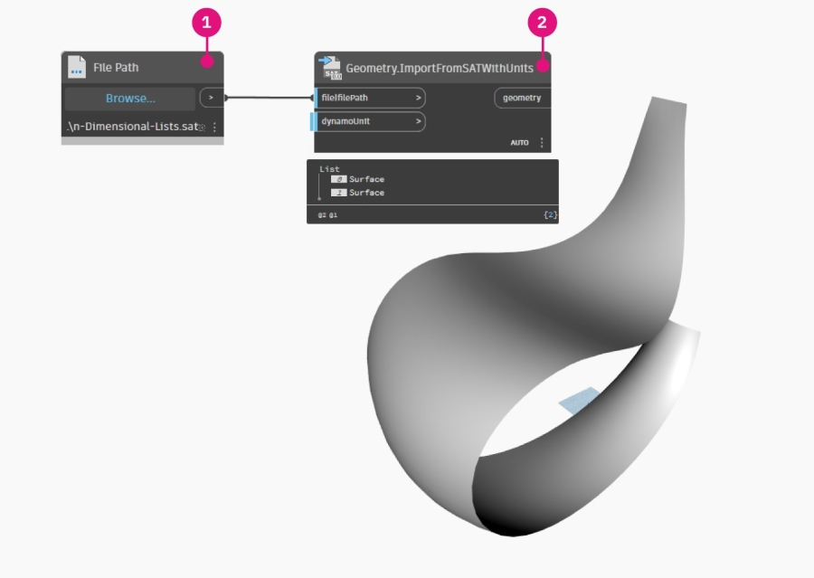

> 1. Начнем с файла SAT, расположенного в папке с файлами для упражнения. Добавим его в приложение с помощью узла **File Path**.
> 2. Узел **Geometry.ImportFromSAT** импортирует геометрию в Dynamo и отображает ее в виде двух поверхностей.

Для простоты в этом упражнении вы будете работать только с одной поверхностью.

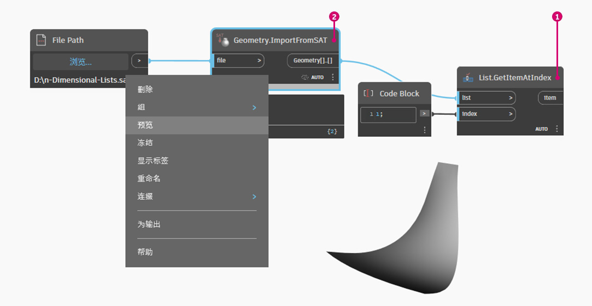

> 1. Чтобы выбрать верхнюю поверхность, задайте индекс 1. Для этого добавьте узел **List.GetItemAtIndex**.
> 2. Отключите предварительный просмотр геометрии в области предварительного просмотра **Geometry.ImportFromSAT**.

Теперь нужно преобразовать поверхность в сетку точек.

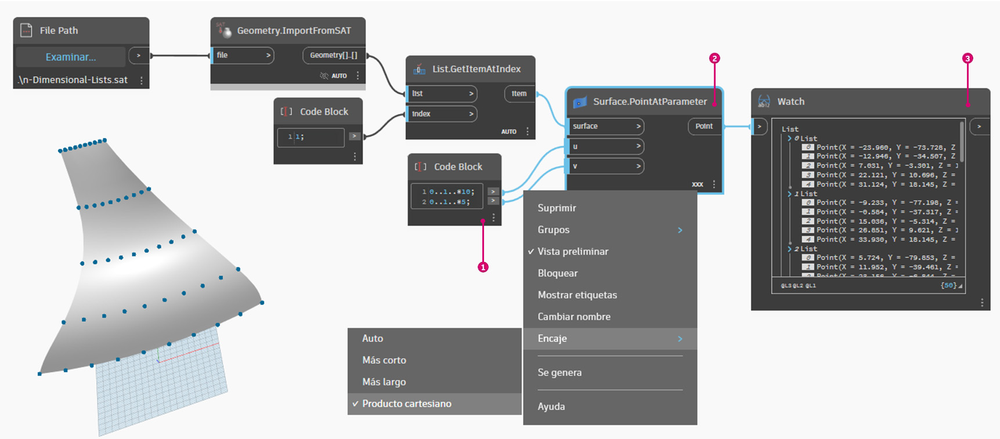

> 1\. С помощью узла **Code Block** вставьте две следующие строки кода: `0..1..#10;` `0..1..#5;`.
>
> 2\. Используя узел **Surface.PointAtParameter**, соедините два значения Code Block с входными параметрами «u» и _v_. Задайте для параметра _Переплетение_ этого узла значение _Векторное произведение_.
>
> 3\. Полученная структура данных отображается в области предварительного просмотра Dynamo.

Затем используйте точки из последнего шага для создания десяти кривых вдоль поверхности.

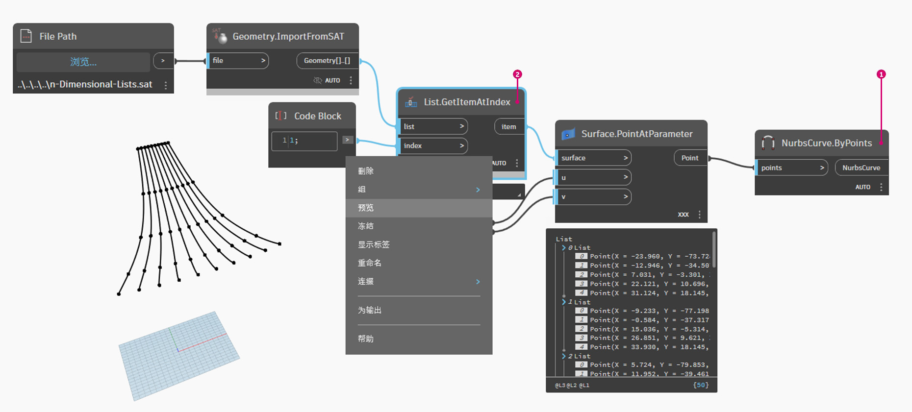

> 1. Чтобы отобразить структуру данных, соедините узел **NurbsCurve.ByPoints** с портом вывода узла **Surface.PointAtParameter**.
> 2. Для получения более четкого результата можно отключить предварительный просмотр в узле **List.GetItemAtIndex**.

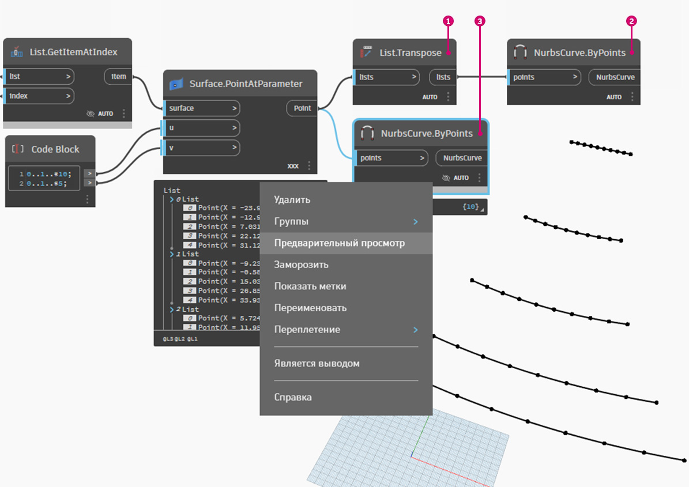

> 1. Базовый узел **List.Transpose** позволяет поменять местами столбцы и строки в списке списков.
> 2. При соединении порта вывода узла **List.Transpose** с узлом **NurbsCurve.ByPoints** вы получите пять кривых, идущих горизонтально вдоль поверхности.
> 3. Для получения того же результата можно отключить предварительный просмотр в узле **NurbsCurve.ByPoints** на предыдущем шаге.

## Упражнение. 2D-списки. Для опытных пользователей

Усложним задачу. Предположим, что нам нужно выполнить определенное действие с кривыми, которые мы получили в предыдущем упражнении. Например, нужно связать эти кривые с другой поверхностью и выполнить лофтинг между ними По сути, логика остается прежней, но задача требует более внимательной работы со структурой данных.

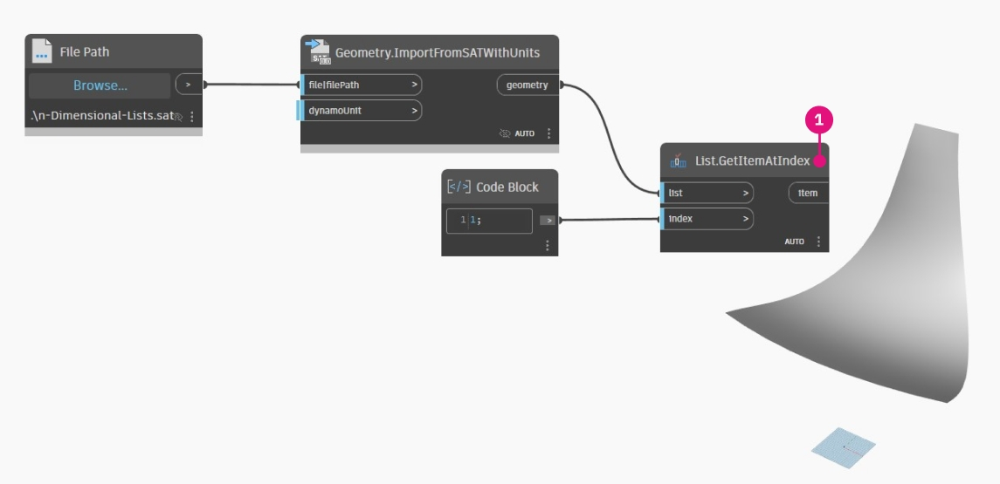

> 1. Начнем с операции, уже знакомой вам по предыдущему упражнению. Изолируйте верхнюю поверхность импортированной геометрии с помощью узла **List.GetItemAtIndex**.

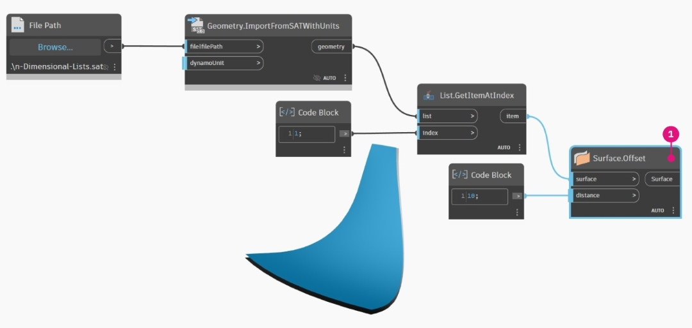

> 1. Используя узел **Surface.Offset**, задайте значение _10_, чтобы сместить поверхность.

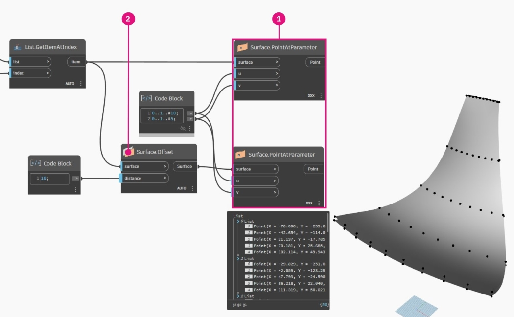

> 1. Как и в предыдущем упражнении, добавьте узел _Code Block_ с двумя следующими строками кода: `0..1..#10;` `0..1..#5;`.
> 2. Соедините порты вывода этого узла с двумя узлами **Surface.PointAtParameter** и задайте для параметра _Переплетение_ каждого из них значение _Векторное произведение_. Один из этих узлов соединен с исходной поверхностью, а второй — с поверхностью смещения.

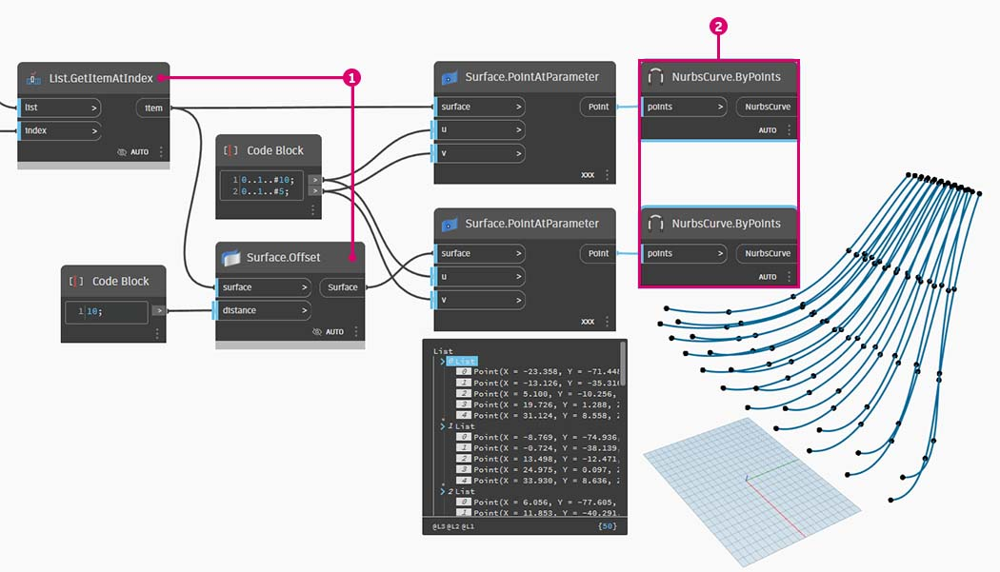

> 1. Отключите предварительный просмотр этих поверхностей.
> 2. Как и в предыдущем упражнении, соедините порты вывода с двумя узлами **NurbsCurve.ByPoints**. В результате отображаются кривые, соответствующие двум поверхностям.

> 1. С помощью узла **List.Create** можно объединить два набора кривых в один список списков.
> 2. В результате создаются два списка с десятью элементами, каждый из которых представляет собой связанный набор NURBS-кривых.
> 3. С помощью узла **Surface.ByLoft** можно создать визуальное представление этой структуры данных. Узел выполняет лофтинг для всех кривых в каждом списке.

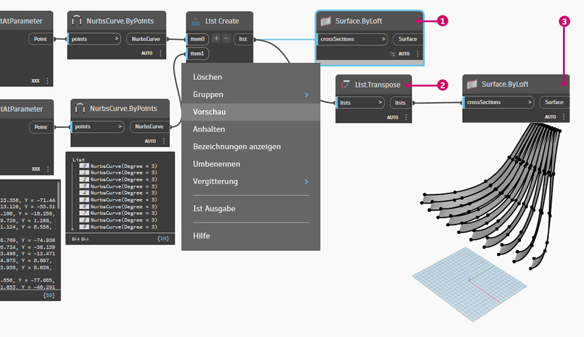

> 1. Отключите предварительный просмотр узла **Surface.ByLoft** на предыдущем шаге.
> 2. Как вы помните, узел **List.Transpose** позволяет поменять местами столбцы и строки в списке списков. В результате использования этого узла два списка из десяти кривых каждый преобразуются в десять списков из двух кривых каждый. Теперь каждая NURBS-кривая связана с соседней кривой на другой поверхности.
> 3. С помощью узла **Surface.ByLoft** мы получили реберную конструкцию.

Далее демонстрируется альтернативный процесс получения этого результата

> 1. Перед началом отключите предварительный просмотр **Surface.ByLoft** во избежание путаницы.
> 2. Вместо узла **List.Transpose** можно использовать узел **List.Combine**. Он выполняет роль _«комбинатора»_ для каждого вложенного списка.
> 3. В данном случае мы используем **List.Create** в качестве _«комбинатора»_ для создания списка по каждому элементу во вложенных списках.
> 4. Добавив узел **Surface.ByLoft**, мы получаем те же поверхности, что и на предыдущем шаге. В данном случае узел Transpose является более простым вариантом, но при работе с еще более сложной структурой данных надежнее будет использовать узел **List.Combine**.

> 1. Вернемся на несколько шагов назад. Если вы хотите изменить ориентацию кривых в реберной конструкции, узел **List.Transpose** следует применить до соединения с узлом **NurbsCurve.ByPoints**. В результате столбцы и строки поменяются местами, и мы получим пять горизонтальных ребер.

## Упражнение. Трехмерные списки

Продолжаем усложнять задачи. В этом упражнении мы используем обе импортированные поверхности, чтобы создать сложную иерархическую структуру данных. По сути, вам предстоит выполнить то же самое действие, пользуясь той же самой логикой, что и ранее.

Вернемся к файлу, импортированному в предыдущем упражнении.

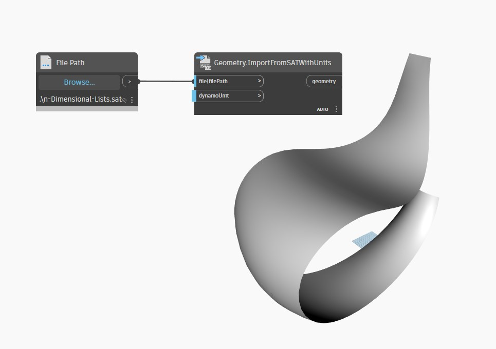

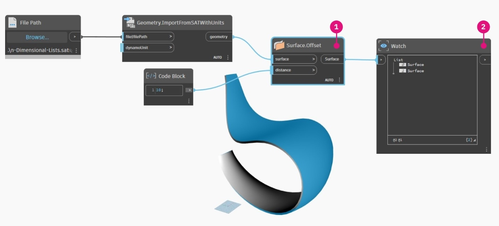

> 1. Как и в предыдущем упражнении, используйте узел **Surface.Offset**, чтобы задать значение смещения, равное _10_.
> 2. Обратите внимание, что добавление узла смещения привело к созданию двух поверхностей.

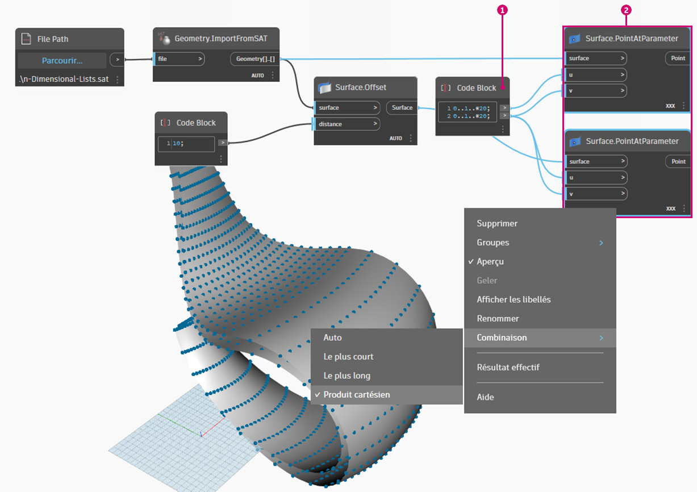

> 1. Как и в предыдущем упражнении, добавьте узел **Code Block** с двумя следующими строками кода: `0..1..#20;` `0..1..#20;`.
> 2. Соедините порты вывода этого узла с двумя узлами **Surface.PointAtParameter** и задайте для параметра «Переплетение» каждого из них значение _Векторное произведение_. Один из этих узлов соединен с исходными поверхностями, а второй — с поверхностями смещения.

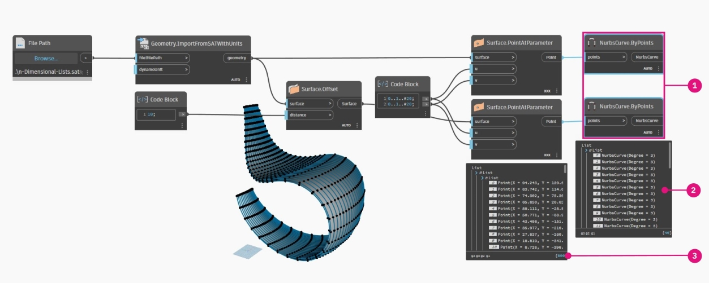

> 1. Как и в предыдущем упражнении, соедините порты вывода с двумя узлами **NurbsCurve.ByPoints**.
> 2. Посмотрите на выходные данные узла **NurbsCurve.ByPoints** и обратите внимание, что они представляют собой список, состоящий из двух списков, что является более сложной структурой, чем в предыдущем упражнении. Данные упорядочиваются по базовой поверхности, поэтому в структуру данных добавлен еще один уровень.
> 3. Обратите внимание, что структура данных в узле **Surface.PointAtParameter** стала более сложной. В нем представлен список, состоящий из списков списков.

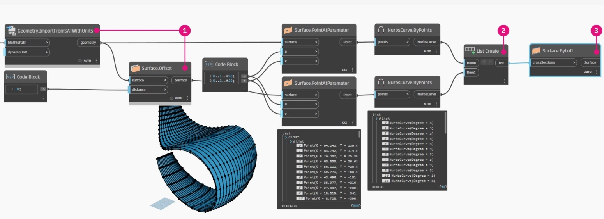

> 1. Перед продолжением отключите предварительный просмотр существующих поверхностей.
> 2. С помощью узла **List.Create** объедините NURBS-кривые в одну структуру данных, чтобы создать список, состоящий из списков списков.
> 3. При подключении узла **Surface.ByLoft** мы получаем новую версию исходных поверхностей, так как они остаются в собственном списке в соответствии с исходной структурой данных.

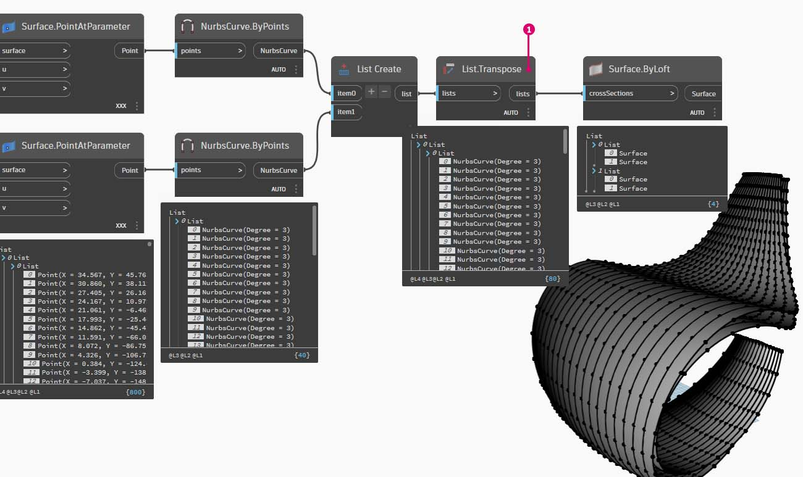

> 1. В предыдущем упражнении мы использовали узел **List.Transpose** для создания реберной конструкции. В этом случае данная функция не подходит. Перенос следует использовать с двумерными списками, но мы имеем дело с трехмерным списком, поэтому перестановка столбцов и строк не сработает. Поскольку списки являются объектами, то узел **List.Transpose** выполнит перестановку между списками с вложенными списками, но она не затронет NURBS-кривые в списках на уровень ниже.

> 1. В этом случае **List.Combine** является более подходящим инструментом. При работе с более сложными структурами данных используются узлы **List.Map** и **List.Combine**.
> 2. Используя **List.Create** в качестве _«комбинатора»_, создайте структуру данных, которая лучше подойдет для ваших целей.

> 1. Структуру данных все еще требуется перенести на один уровень вниз по иерархии. Для этого используйте узел **List.Map**. Его работа аналогична узлу **List.Combine**, однако в нем используется только один список входных данных, а не два или больше.
> 2. К узлу **List.Map** будет применена функция **List.Transpose**, которая меняет местами столбцы и строки вложенных списков в главном списке.

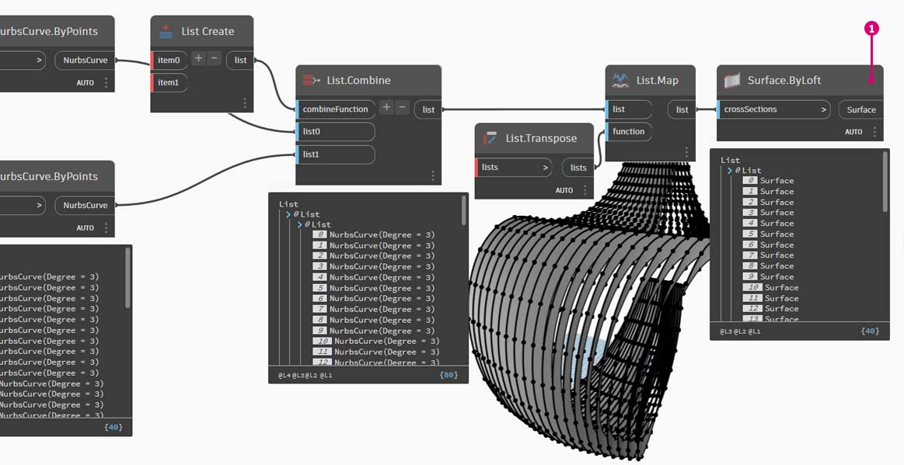

> 1. Наконец, выполните лофтинг между NURBS-кривыми с использованием соответствующей иерархии данных, чтобы получить реберную конструкцию.

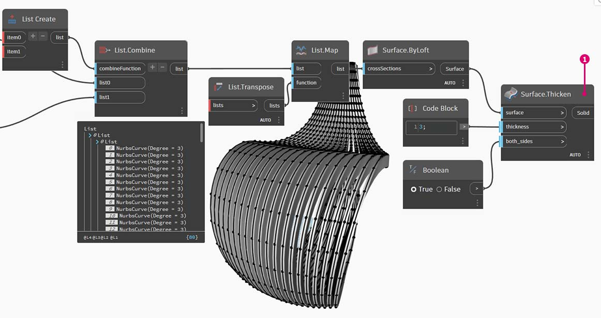

> 1. Добавим глубину геометрии с помощью узла **Surface.Thicken** с входными параметрами, как показано на изображении.

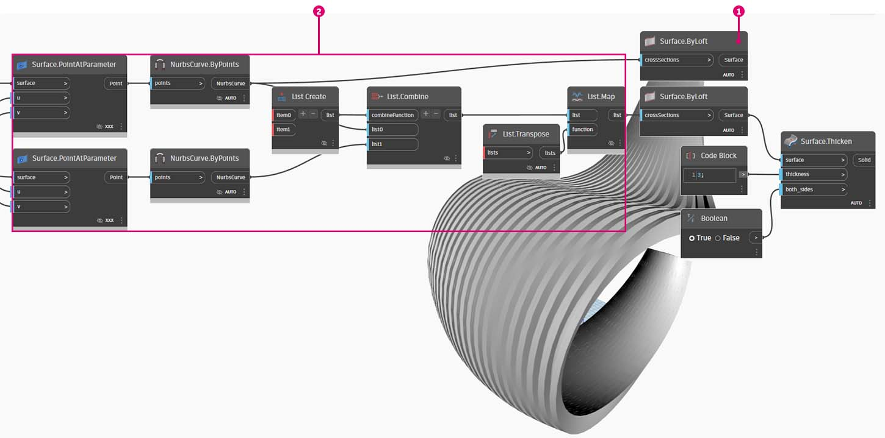

> 1. Будет полезно добавить поверхность, поддерживающую конструкцию, поэтому добавьте еще один узел **Surface.ByLoft** и используйте в качестве входного параметра первый вывод узла **NurbsCurve.ByPoints** из предыдущего шага.
> 2. Чтобы не перегружать экран, отключите предварительный просмотр этих узлов. Щелкните узел правой кнопкой мыши и снимите флажок «Предварительный просмотр», чтобы лучше рассмотреть результат.

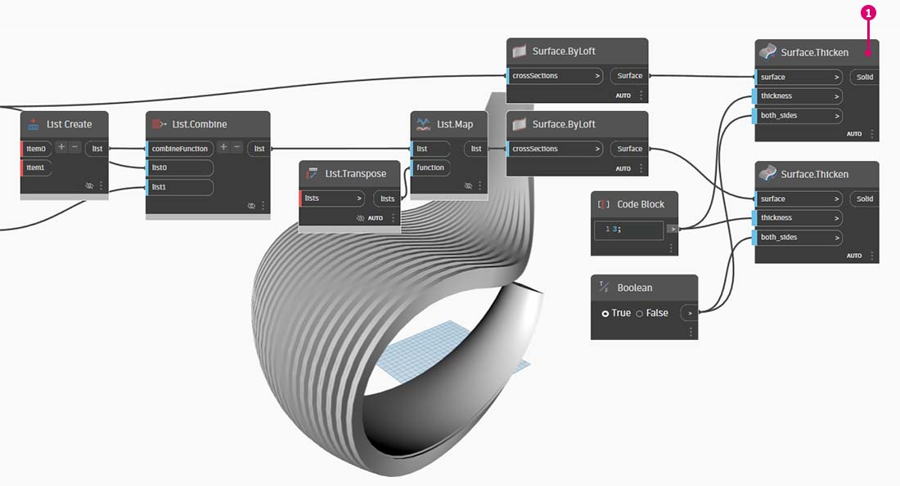

> 1. Теперь увеличьте толщину выбранных поверхностей.

В результате мы получили нечто, похожее на слегка неустойчивое кресло-качалку. Зато сколько данных ушло на его создание!

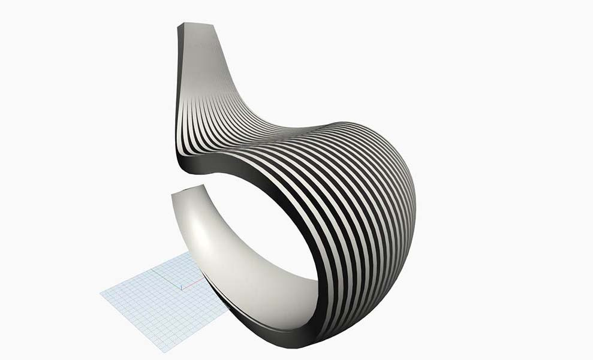

Наконец, изменим направление бороздок. Для этого выполните процедуру, аналогичную преобразованию, которое вы уже использовали ранее.

> 1. Чтобы заполнить еще один уровень иерархии, используйте узел **List.Map** с функцией **List.Transpose**, чтобы изменить направление NURBS-кривых.

> 1. Если требуется увеличить количество канавок, то данные узла **Code Block** можно изменить на следующие: `0..1..#20;` `0..1..#30;`.

Если первая версия кресла-качалки была обтекаемой, то вторая получилась более похожей на колесо внедорожника.

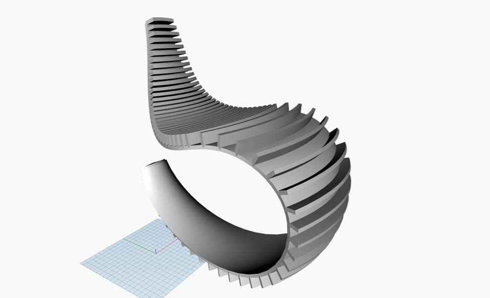
