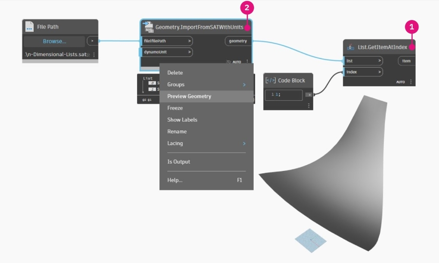
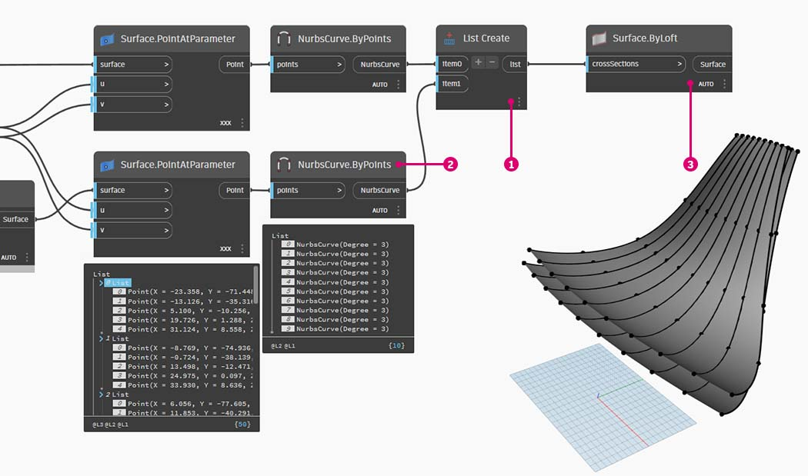
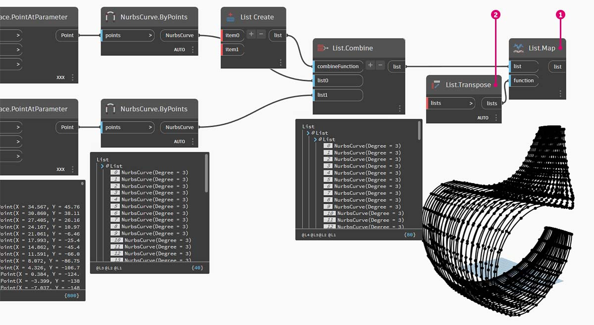

# Listas de n dimensiones

Adentrándonos aún más en el laberinto, vamos a agregar más niveles a la jerarquía. La estructura de datos puede ampliarse mucho más allá de una lista de listas bidimensional. Dado que las listas son elementos en sí mismos en Dynamo, podemos crear datos con tantas dimensiones como sea posible.

La analogía con la que trabajaremos aquí son las muñecas rusas. Cada lista se puede considerar como un contenedor que contiene varios elementos. Cada lista tiene sus propias propiedades y también se considera su propio objeto.

> Un conjunto de muñecas rusas (fotografía de [Zeta](https://www.flickr.com/photos/beppezizzi/145493363)) es una analogía de las listas de n dimensiones. Cada capa representa una lista y cada lista contiene elementos. En el caso de Dynamo, cada contenedor puede tener varios contenedores dentro (que representan los elementos de cada lista).

Las listas de n dimensiones son difíciles de explicar visualmente, pero hemos configurado algunos ejercicios en este capítulo que se centran en trabajar con listas que van más allá de las dos dimensiones.

### Asignación y combinaciones

La asignación es, probablemente, la parte más compleja de la administración de datos en Dynamo y es especialmente relevante al trabajar con jerarquías de listas complejas. Con la serie de ejercicios incluidos a continuación, mostraremos cuándo utilizar la asignación y las combinaciones a medida que los datos se convierten en datos multidimensionales.

Las introducciones preliminares a **List.Map** y **List.Combine** se pueden encontrar en la sección anterior. En el último ejercicio de los que se incluyen a continuación, usaremos estos nodos en una estructura de datos compleja.

## Ejercicio - Listas 2D: nivel básico

> Descargue el archivo de ejemplo. Para ello, haga clic en el vínculo siguiente.
>
> En el Apéndice, se incluye una lista completa de los archivos de ejemplo.



Este es el primero de una serie de tres ejercicios que se centra en la articulación de la geometría importada. Cada parte de esta serie de ejercicios aumentará en la complejidad de la estructura de datos.

> 1. Comencemos con el archivo .sat de la carpeta de archivos del ejercicio. Se puede acceder a este archivo mediante el nodo **File Path**.
> 2. Con **Geometry.ImportFromSAT**, la geometría se importa a nuestra vista preliminar de Dynamo como dos superficies.

En este sencillo ejercicio, vamos a trabajar con una de las superficies.

> 1. Seleccionaremos el índice de 1 para capturar la superficie superior. Esta acción se realiza con el nodo **List.GetItemAtIndex**.
> 2. Desactive la vista preliminar de geometría de la vista preliminar de **Geometry.ImportFromSAT**.

El siguiente paso es dividir la superficie en una rejilla de puntos.

> 1\. Mediante el **bloque de código**, inserte estas dos líneas de código: `0..1..#10;` `0..1..#5;`.
>
> 2\. Con **Surface.PointAtParameter**, conecte los dos valores del bloque de código a u y _v_. Cambie el _encaje_ de este nodo a _"Producto vectorial"_.
>
> 3\. La salida muestra la estructura de datos, que también está visible en la vista preliminar de Dynamo.

A continuación, utilice los puntos del último paso para generar 10 curvas a lo largo de la superficie.

> 1. Para obtener información sobre cómo se organiza la estructura de datos, conectemos un nodo **NurbsCurve.ByPoints** a la salida de **Surface.PointAtParameter**.
> 2. Por ahora, puede desactivar la vista preliminar del nodo **List.GetItemAtIndex** para obtener un resultado más claro.

> 1. Un nodo **List.Transpose** básico cambiará las columnas y las filas de una lista de listas.
> 2. Al conectar la salida de **List.Transpose** a **NurbsCurve.ByPoints**, se obtienen cinco curvas que discurren horizontalmente a través de la superficie.
> 3. Puede desactivar la vista preliminar del nodo **NurbsCurve.ByPoints** en el paso anterior para obtener el mismo resultado en la imagen.

## Ejercicio - Listas 2D: nivel avanzado

Aumentemos la complejidad. Supongamos que deseamos realizar una operación en las curvas creadas en el ejercicio anterior. Tal vez nos gustaría relacionar estas curvas con otra superficie y solevar entre ellas. Esto requiere más atención en la estructura de datos, pero la lógica subyacente es la misma.

> 1. Comience con un paso del ejercicio anterior, aislando la superficie superior de la geometría importada con el nodo **List.GetItemAtIndex**.

> 1. Con **Surface.Offset**, desfase la superficie con un valor de _10_.

> 1. Del mismo modo que en el ejercicio anterior, defina un _bloque de código_ con estas dos líneas de código: `0..1..#10;` `0..1..#5;`.
> 2. Conecte estas salidas a dos nodos **Surface.PointAtParameter**, cada uno con el _encaje_ establecido en _"Producto vectorial"_. Uno de estos nodos está conectado a la superficie original, mientras que el otro está conectado a la superficie desfasada.

> 1. Desactive la vista preliminar de estas superficies.
> 2. Como en el ejercicio anterior, conecte la salida a dos nodos **NurbsCurve.ByPoints**. En el resultado, se muestran las curvas correspondientes a dos superficies.

> 1. Con **List.Create**, podemos combinar los dos conjuntos de curvas en una lista de listas.
> 2. Observe en la salida que tenemos dos listas con 10 elementos cada una que representan cada conjunto de conexiones de curvas NURBS.
> 3. Al ejecutar **Surface.ByLoft**, podemos visualizar con claridad esta estructura de datos. El nodo soleva todas las curvas de cada sublista.

> 1. Desactive la vista preliminar del nodo **Surface.ByLoft** en el paso anterior.
> 2. Al utilizar **List.Transpose**, recuerde que estamos volteando todas las columnas y filas. Este nodo transferirá dos listas de diez curvas a diez listas de dos curvas. Ahora cada curva NURBS está relacionada con la curva contigua de la otra superficie.
> 3. Con **Surface.ByLoft**, llegamos a una estructura con nervios.

A continuación, mostraremos un proceso alternativo para lograr este resultado.

> 1. Antes de empezar, desactive la vista preliminar de **Surface.ByLoft** en el paso anterior para evitar confusiones.
> 2. Una alternativa a **List.Transpose** es utilizar **List.Combine**. Esta acción pondrá en funcionamiento un _"combinador"_ en cada sublista.
> 3. En este caso, utilizaremos **List.Create** como _"combinador"_, que creará una lista de cada elemento de las sublistas.
> 4. Con el nodo **Surface.ByLoft**, se obtienen las mismas superficies que en el paso anterior. La transposición es más fácil de utilizar en este caso, pero cuando la estructura de datos se vuelve más compleja, **List.Combine** es más fiable.

> 1. Retrocediendo unos pasos, si deseamos cambiar la orientación de las curvas en la estructura con nervios, debemos utilizar un nodo **List.Transpose** antes de conectar con **NurbsCurve.ByPoints**. Esto invertirá las columnas y las filas, lo que nos dará cinco nervios horizontales.

## Ejercicio - Listas 3D

Ahora, vamos a ir un paso más allá. En este ejercicio, trabajaremos con ambas superficies importadas y crearemos una jerarquía de datos compleja. Aun así, nuestro objetivo es completar la misma operación con la misma lógica subyacente.

Comience con el archivo importado del ejercicio anterior.

> 1. Como en el ejercicio anterior, utilice el nodo **Surface.Offset** para desfasar por un valor de _10_.
> 2. Observe en la salida que hemos creado dos superficies con el nodo de desfase.

> 1. Del mismo modo que en el ejercicio anterior, defina un **bloque de código** con estas dos líneas de código: `0..1..#20;` `0..1..#20;`.
> 2. Conecte estas salidas a dos nodos **Surface.PointAtParameter**, cada uno con el encaje establecido en _"Producto vectorial"_. Uno de estos nodos está conectado a las superficies originales, mientras que el otro está conectado a las superficies desfasadas.

> 1. Como en el ejercicio anterior, conecte la salida a dos nodos **NurbsCurve.ByPoints**.
> 2. En la salida de **NurbsCurve.ByPoints**, observe que se trata de una lista de dos listas, que es más compleja que la del ejercicio anterior. Los datos se clasifican según la superficie subyacente, por lo que hemos añadido otro nivel a los datos estructurados.
> 3. Observe que los datos se vuelven más complejos en el nodo **Surface.PointAtParameter**. En este caso, tenemos una lista compuesta por listas de listas.

> 1. Antes de continuar, desactive la vista preliminar de las superficies existentes.
> 2. Con el nodo **List.Create**, se fusionan las curvas NURBS en una estructura de datos, lo que crea una lista de listas de listas.
> 3. Al conectar un nodo **Surface.ByLoft**, se obtiene una versión de las superficies originales, ya que cada una de ellas permanece en su propia lista tal como se crearon a partir de la estructura de datos original.

> 1. En el ejercicio anterior, pudimos utilizar **List.Transpose** para crear una estructura con nervios. Esto no funcionaría aquí. La transposición se debe utilizar en una lista bidimensional y, puesto que tenemos una lista tridimensional, una operación de "voltear columnas y filas" no funcionaría de manera tan sencilla. Recuerde que las listas son objetos, de modo que **List.Transpose** voltearía las listas sin sublistas, pero no voltearía las curvas NURBS ubicadas una lista más abajo en la jerarquía.

> 1. **List.Combine** funcionará mejor aquí. Debemos usar los nodos **List.Map** y **List.Combine** cuando trabajamos con estructuras de datos más complejas.
> 2. Al utilizar **List.Create** como _"combinador"_, creamos una estructura de datos que funcionará mejor para nosotros.

> 1. La estructura de datos aún debe transponerse un paso hacia abajo en la jerarquía. Para ello, utilizaremos **List.Map**. Funciona como **List.Combine**, salvo que utiliza solo una lista de entrada, en lugar de dos o más.
> 2. La función que aplicaremos a **List.Map** es **List.Transpose**, que volteará las columnas y las filas de las sublistas de nuestra lista principal.

> 1. Por último, podemos solevar las curvas NURBS junto con una jerarquía de datos adecuada, lo que nos proporciona una estructura con nervios.

> 1. Añadamos profundidad a la geometría mediante un nodo **Surface.Thicken** con los parámetros de entrada, como se muestra.

> 1. Será recomendable una superficie que respalde también esta estructura, por lo que añada otro nodo **Surface.ByLoft** y utilice la primera salida de **NurbsCurve.ByPoints** de un paso anterior como entrada.
> 2. A medida que se sobrecargue la vista preliminar, desactive la vista preliminar de estos nodos. Para ello, haga clic con el botón derecho en cada uno de ellos y desactive la opción "vista preliminar" para ver mejor el resultado.

> 1. Y si engrosamos las superficies seleccionadas, la articulación está completa.

No es la mecedora más cómoda del mercado, pero hay muchos datos en ella.

En el último paso, vamos a invertir la dirección de los miembros estriados. Como ya usamos la transposición en el ejercicio anterior, haremos algo similar aquí.

> 1. Tenemos un nivel más en la jerarquía, por lo que debemos utilizar **List.Map** con la función **List.Tranpose** para cambiar la dirección de las curvas NURBS.

> 1. Es posible que deseemos aumentar el número de huellas. Para ello, podemos cambiar el **bloque de código** al siguiente: `0..1..#20;` `0..1..#30;`.

La primera versión de la mecedora era elegante, así que nuestro segundo modelo ofrece una versión todoterreno del asiento reclinable.

