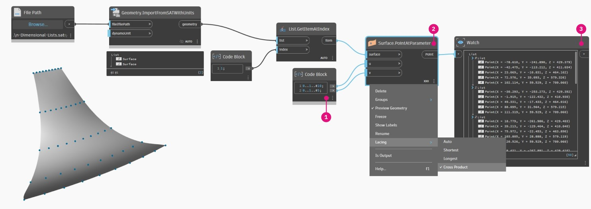
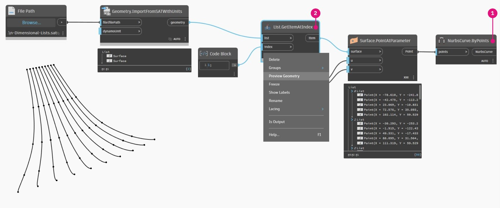
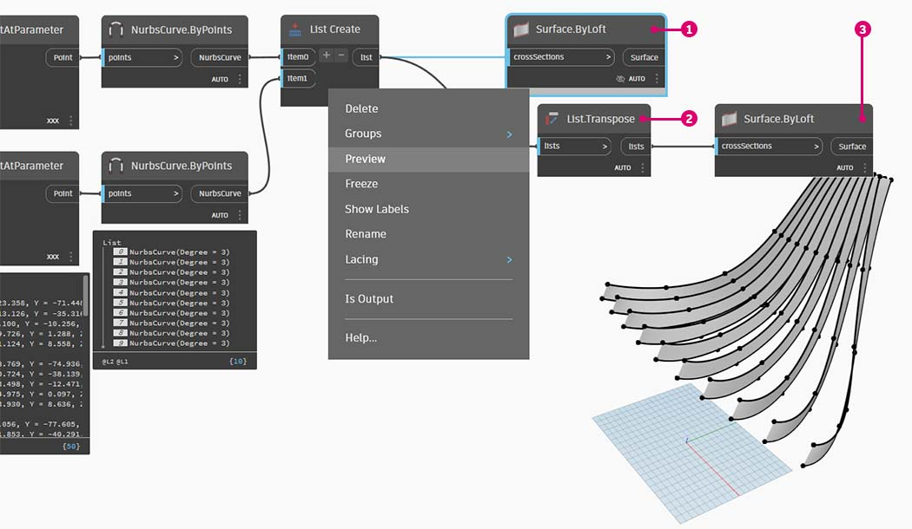
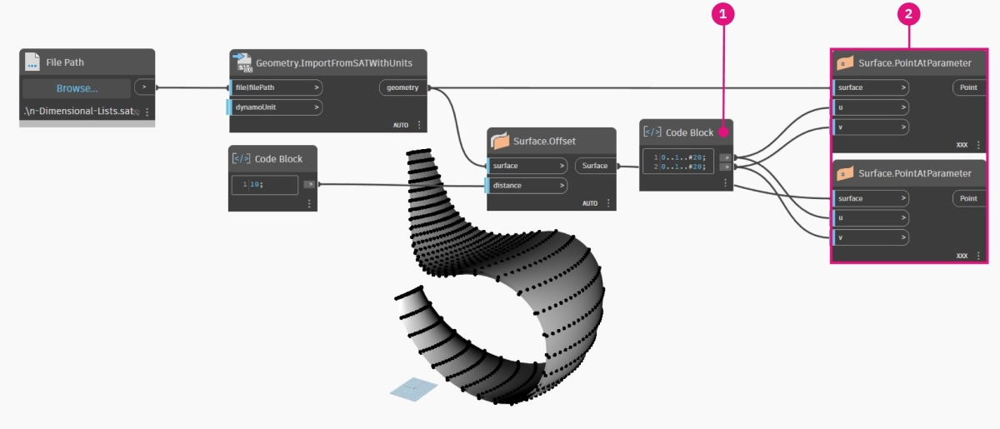
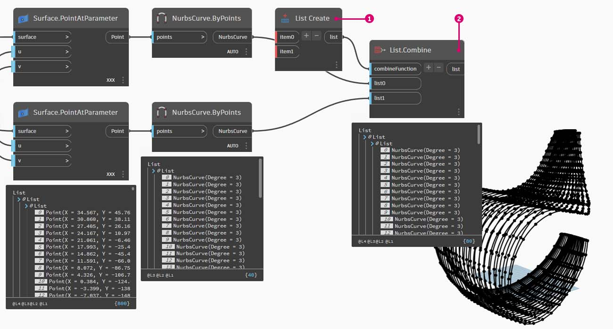
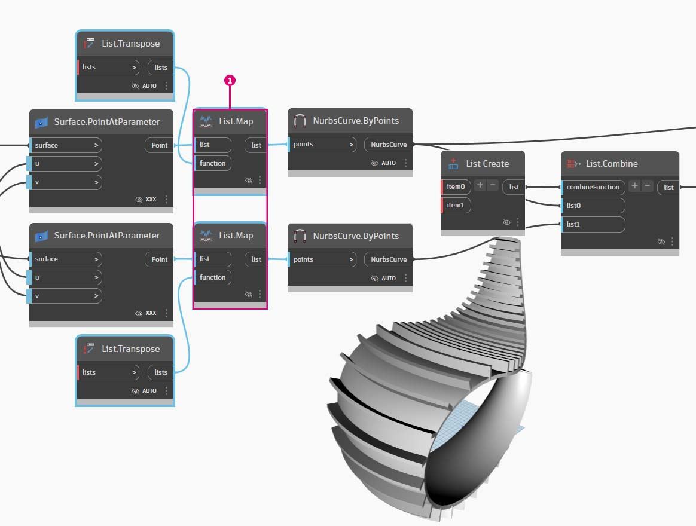

# Listas n-dimensionais

Em um passo mais avançado, vamos adicionar ainda mais camadas à hierarquia. A estrutura de dados pode se expandir muito além de uma lista bidimensional de listas. Como as listas são itens por si só no Dynamo, podemos criar dados com tantas dimensões quanto possível.

A analogia com a qual vamos trabalhar aqui são as bonecas russas. Cada lista pode ser considerada como um contêiner com vários itens. Cada lista tem suas próprias propriedades e também é considerada como seu próprio objeto.

> Um conjunto de bonecas russas (Foto de [Zeta](https://www.flickr.com/photos/beppezizzi/145493363)) é uma analogia das Listas n-dimensionais. Cada camada representa uma lista e cada lista contém itens. No caso do Dynamo, cada contêiner pode ter vários contêineres dentro (representando os itens de cada lista).

As listas n-dimensionais são difíceis de explicar visualmente, mas criamos alguns exercícios neste capítulo, focados no trabalho com listas que vão além de duas dimensões.

### Mapeamento e combinações

O mapeamento é, sem dúvida, a parte mais complexa do gerenciamento de dados no Dynamo e é especialmente relevante ao trabalhar com hierarquias complexas de listas. Com a série de exercícios abaixo, vamos demonstrar quando usar o mapeamento e as combinações, à medida que os dados se tornam multidimensionais.

A introdução inicial a **List.Map** e **List.Combine** pode ser encontrada na seção anterior. No último exercício abaixo, vamos usar esses nós em uma estrutura de dados complexa.

## Exercício – Listas 2D – Básico

> Faça o download do arquivo de exemplo clicando no link abaixo.
>
> É possível encontrar uma lista completa de arquivos de exemplo no Apêndice.



Este exercício é o primeiro de uma série de três focado na articulação da geometria importada. Cada parte desta série de exercícios aumenta a complexidade da estrutura de dados.

> 1. Vamos começar com o arquivo .sat na pasta de arquivos de exercícios. É possível selecionar esse arquivo usando o nó **Caminho do arquivo**.
> 2. Com **Geometry.ImportFromSAT**, a geometria é importada para nossa visualização do Dynamo como duas superfícies.

Neste exercício, queremos mantê-la simples e trabalhar com uma das superfícies.

> 1. Vamos selecionar o índice de 1 para selecionar a superfície superior. Isso é feito com o nó **List.GetItemAtIndex**.
> 2. Desative a visualização da geometria da visualização de **Geometry.ImportFromSAT**.

A próxima etapa é dividir a superfície em um eixo de pontos.

> 1\. Usando o **Bloco de código**, insira estas duas linhas de código: `0..1..#10;` `0..1..#5;`
>
> 2\. Com **Surface.PointAtParameter**, conecte os dois valores do bloco de código a u e _v_. Altere a _amarra_ desse nó para _“Produto transversal”_.
>
> 3\. A saída exibe a estrutura de dados, que também está visível na visualização do Dynamo.

Em seguida, usamos os Pontos da última etapa para gerar dez curvas ao longo da superfície.

> 1. Para obter uma visão de como a estrutura de dados está organizada, vamos conectar **NurbsCurve.ByPoints** à saída de **Surface.PointAtParameter**.
> 2. Você pode desativar a visualização do nó **List.GetItemAtIndex** por enquanto para obter um resultado mais claro.

> 1. Um **List.Transpose** básico inverterá as colunas e as linhas de uma lista de listas.
> 2. Conectando a saída de **List.Transpose** a **NurbsCurve.ByPoints**, agora obtemos cinco curvas sendo executadas horizontalmente na superfície.
> 3. Você pode desativar a visualização do nó **NurbsCurve.ByPoints** na etapa anterior para obter o mesmo resultado na imagem.

## Exercício – Listas 2D – Avançado

Vamos aumentar a complexidade. Suponha que desejamos executar uma operação nas curvas criadas no exercício anterior. Talvez desejemos relacionar essas curvas com outra superfície e fazer a transição entre elas. Isso requer mais atenção à estrutura de dados, mas a lógica é a mesma.

> 1. Comece com uma etapa do exercício anterior, isolando a superfície superior da geometria importada com o nó **List.GetItemAtIndex**.

> 1. Usando **Surface.Offset**, desloque a superfície por um valor de _10_.

> 1. Da mesma forma que no exercício anterior, defina um _bloco de código_ com estas duas linhas de código: `0..1..#10;` `0..1..#5;`
> 2. Conecte essas saídas aos dois nós **Surface.PointAtParameter**, cada um com a _amarra_ definida como _“Produto transversal”_. Um desses nós está conectado à superfície original, enquanto o outro está conectado à superfície de deslocamento.

> 1. Desative a visualização dessas superfícies.
> 2. Como no exercício anterior, conecte as saídas aos dois nós **NurbsCurve.ByPoints**. O resultado mostra curvas correspondentes às duas superfícies.

> 1. Usando **List.Create**, é possível combinar os dois conjuntos de curvas em uma lista de listas.
> 2. Observe que, na saída, temos duas listas com dez itens em cada uma, representando cada conjunto de conexão de curvas Nurbs.
> 3. Executando o nó **Surface.ByLoft**, podemos entender visualmente essa estrutura de dados. O nó efetua a transição de todas as curvas em cada sublista.

> 1. Desative a visualização do nó **Surface.ByLoft** na etapa anterior.
> 2. Se **List.Transpose** for usado, lembre-se de que estamos invertendo todas as colunas e linhas. Esse nó transferirá duas listas de dez curvas em dez listas de duas curvas. Agora, temos cada curva Nurbs relacionada à curva vizinha na outra superfície.
> 3. Usando **Surface.ByLoft**, chegamos a uma estrutura nervurada.

Em seguida, demonstraremos um processo alternativo para alcançar esse resultado

> 1. Antes de começarmos, desative a visualização de **Surface.ByLoft** na etapa anterior para evitar confusão.
> 2. Uma alternativa para **List.Transpose** é usar **List.Combine**. Isso executará um _“combinador”_ em cada sublista.
> 3. Neste caso, estamos usando **List.Create** como o _“combinador”_, o que criará uma lista de cada item nas sublistas.
> 4. Usando o nó **Surface.ByLoft**, obtemos as mesmas superfícies que as da etapa anterior. A transposição é mais fácil de usar nesse caso, mas quando a estrutura de dados se torna ainda mais complexa, **List.Combine** é mais confiável.

> 1. Retrocedendo algumas etapas, se quisermos alternar a orientação das curvas na estrutura nervurada, deveremos usar **List.Transpose** antes de conectar a **NurbsCurve.ByPoints**. Isso inverterá as colunas e linhas, resultando em cinco nervuras horizontais.

## Exercício – Listas 3D

Agora, vamos um pouco mais longe. Neste exercício, vamos trabalhar com as duas superfícies importadas, criando uma hierarquia de dados complexa. Ainda assim, nosso objetivo é concluir a mesma operação com a mesma lógica subjacente.

Comece com o arquivo importado do exercício anterior.

> 1. Como no exercício anterior, use o nó **Surface.Offset** para deslocar por um valor de _10_.
> 2. Observe, na saída, que criamos duas superfícies com o nó de deslocamento.

> 1. Da mesma forma que no exercício anterior, defina um **Bloco de código** com estas duas linhas de código: `0..1..#20;` `0..1..#20;`
> 2. Conecte essas saídas aos dois nós **Surface.PointAtParameter**, cada um com a amarra definida como _“Produto transversal”_. Um desses nós está conectado às superfícies originais, enquanto o outro está conectado às superfícies de deslocamento.

> 1. Como no exercício anterior, conecte as saídas aos dois nós **NurbsCurve.ByPoints**.
> 2. Observando a saída de **NurbsCurve.ByPoints,**, é possível ver que esta é uma lista de duas listas, que é mais complexa do que no exercício anterior. Os dados são categorizados pela superfície subjacente; portanto, adicionamos outro nível aos dados estruturados.
> 3. Observe que as coisas se tornam mais complexas no nó **Surface.PointAtParameter**. Neste caso, temos uma lista de listas de listas.

> 1. Antes de prosseguir, desative a visualização das superfícies existentes.
> 2. Usando o nó **List.Create**, mesclamos as curvas Nurbs em uma estrutura de dados, criando uma lista de listas de listas.
> 3. Conectando um nó **Surface.ByLoft**, obtemos uma versão das superfícies originais, pois cada uma delas permanece em sua própria lista, conforme foram criadas com base na estrutura de dados original.

> 1. No exercício anterior, usamos **List.Transpose** para criar uma estrutura nervurada. Isso não funcionará aqui. A transposição deve ser usada em uma lista bidimensional e, como nós temos uma lista tridimensional, uma operação de “inverter colunas e linhas” não funcionará tão facilmente. Lembre-se de que as listas são objetos; portanto, **List.Transpose** inverterá nossas listas com as sublistas, mas não inverterá as curvas Nurbs uma lista mais abaixo na hierarquia.

> 1. **List.Combine** funcionará melhor neste caso. Devemos usar os nós **List.Map** e **List.Combine** quando chegarmos a estruturas de dados mais complexas.
> 2. Usando **List.Create** como o _“combinador”_, criamos uma estrutura de dados que funcionará melhor.

> 1. A estrutura de dados ainda precisa ser transposta uma etapa abaixo na hierarquia. Para fazer isso, vamos usar **List.Map**. Isso funciona como **List.Combine**, mas com uma lista de entrada, em vez de duas ou mais.
> 2. A função que será aplicada a **List.Map** é **List.Transpose**, que inverterá as colunas e as linhas das sublistas em nossa lista principal.

> 1. Finalmente, podemos fazer a transição entre as curvas Nurbs junto com uma hierarquia de dados adequada, gerando uma estrutura nervurada.

> 1. Vamos adicionar alguma profundidade à geometria com um nó **Surface.Thicken**, com as configurações de entrada conforme mostrado.

> 1. É recomendado adicionar uma superfície de apoio a duas estruturas; portanto, adicione outro nó **Surface.ByLoft** e use a primeira saída de **NurbsCurve.ByPoints** de uma etapa anterior como entrada.
> 2. À medida que a visualização for ficando confusa, desative a visualização desses nós clicando com o botão direito do mouse em cada um deles e desmarque a opção “Visualização” para ver melhor o resultado.

> 1. Depois de tornarmos mais espessas essas superfícies selecionadas, nossa articulação estará completa.

Não é a cadeira de balanço mais confortável de todos os tempos, mas há muitos dados em jogo.

Última etapa: vamos inverter a direção dos membros com listras. Como usamos a função de transposição no exercício anterior, faremos algo semelhante aqui.

> 1. Como temos mais um nível para a hierarquia, vamos precisar usar **List.Map** com uma função de **List.Tranpose** para alterar a direção das curvas Nurbs.

> 1. Podemos querer aumentar o número de degraus, então podemos alterar o **Bloco de código** para `0..1..#20;` `0..1..#30;`

Como a primeira versão da cadeira de balanço era elegante, nosso segundo modelo oferece uma versão alternativa, de utilidade esportiva para descanso dorsal.

