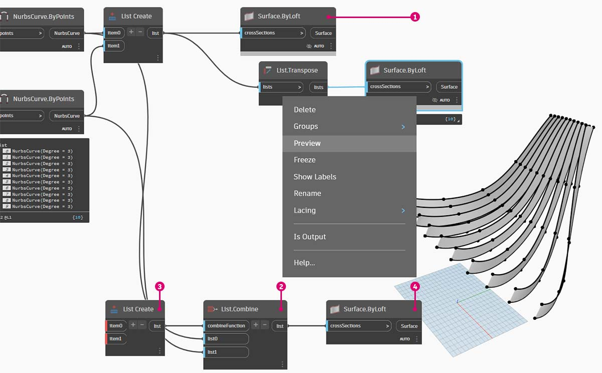

# Elenchi n-dimensionali

Per rendere le cose più complicate, aggiungere ancora più livelli alla gerarchia. La struttura di dati può essere espansa ben oltre un elenco bidimensionale di elenchi. Poiché gli elenchi sono elementi di per sé in Dynamo, è possibile creare dati con il maggior numero possibile di quote.

Qui come analogia si utilizzeranno le bambole matrioske russe. Ogni elenco può essere considerato come un contenitore contenente più elementi. Ogni elenco ha le sue proprietà ed è anche considerato come il suo oggetto.

> Una serie di bambole matrioske russe (foto di [Zeta](https://www.flickr.com/photos/beppezizzi/145493363)) è un'analogia per gli elenchi n-dimensionali. Ogni livello rappresenta un elenco e ogni elenco contiene voci al suo interno. Nel caso di Dynamo, ogni contenitore può avere più contenitori all'interno (che rappresentano le voci di ogni elenco).

Gli elenchi n-dimensionali sono difficili da spiegare visivamente, ma in questo capitolo sono stati creati alcuni esercizi che si concentrano sull'utilizzo di elenchi che si estendono per oltre due dimensioni.

### Mappaggio e combinazioni

Il mappaggio è probabilmente la parte più complessa della gestione di dati in Dynamo ed è particolarmente importante quando si utilizzano gerarchie complesse di elenchi. Con la serie di esercizi riportati di seguito, sarà illustrato quando utilizzare il mappaggio e le combinazioni quando i dati diventano multidimensionali.

Le introduzioni preliminari di **List.Map** e **List.Combine** sono disponibili nella sezione precedente. Nell'ultimo esercizio riportato di seguito, questi nodi verranno utilizzati in una struttura di dati complessa.

## Esercizio - Elenchi 2D - Base

> Scaricare il file di esempio facendo clic sul collegamento seguente.
>
> Un elenco completo di file di esempio è disponibile nell'Appendice.



Questo esercizio è il primo di una serie di tre che si concentra sull'articolazione della geometria importata. Ogni parte di questa serie di esercizi incrementerà la complessità della struttura di dati.

> 1. Si inizia con il file .sat nella cartella dei file degli esercizi. È possibile selezionare questo file utilizzando il nodo **File Path**.
> 2. Con **Geometry.ImportFromSAT**, la geometria viene importata nell'anteprima di Dynamo come due superfici.

Per questo esercizio, si desidera eseguire una procedura semplice e utilizzare una delle superfici.

> 1. Selezionare l'indice di 1 per acquisire la superficie superiore. Questa operazione viene eseguita con il nodo **List.GetItemAtIndex**.
> 2. Disattivare l'anteprima della geometria dall'anteprima di **Geometry.ImportFromSAT**.

Il passaggio successivo consiste nel dividere la superficie in una griglia di punti.

> 1\. Utilizzando **Code Block**, inserire queste due righe di codice: `0..1..#10;` `0..1..#5;`.
>
> 2\. Con **Surface.PointAtParameter**, collegare i due valori di Code Block a u e _v_. Modificare il _collegamento_ di questo nodo in _Globale_.
>
> 3\. L'output mostra la struttura di dati, visibile anche nell'anteprima di Dynamo.

Quindi, utilizzare i punti dell'ultimo passaggio per generare dieci curve lungo la superficie.

> 1. Per esaminare come è organizzata la struttura di dati, collegare **NurbsCurve.ByPoints** all'output di **Surface.PointAtParameter**.
> 2. Per ora, è possibile disattivare l'anteprima del nodo **List.GetItemAtIndex** per ottenere un risultato più chiaro.

> 1. Un nodo **List.Transpose** di base inverte le colonne e le righe di un elenco di elenchi.
> 2. Collegando l'output di **List.Transpose** a **NurbsCurve.ByPoints**, si ottengono cinque curve che percorrono orizzontalmente la superficie.
> 3. È possibile disattivare l'anteprima del nodo **NurbsCurve.ByPoints** nel passaggio precedente per ottenere lo stesso risultato nell'immagine.

## Esercizio - Elenchi 2D - Avanzato

Viene aumentata la complessità. Si supponga di voler eseguire un'operazione sulle curve create nell'esercizio precedente. Forse si desidera correlare queste curve ad un'altra superficie ed eseguire il loft tra di esse. Ciò richiede maggiore attenzione alla struttura di dati, ma la logica sottostante è la stessa.

> 1. Iniziare con un passaggio dell'esercizio precedente, isolando la superficie superiore della geometria importata con il nodo **List.GetItemAtIndex**.

> 1. Utilizzando **Surface.Offset**, eseguire l'offset della superficie di un valore di _10_.

> 1. Allo stesso modo dell'esercizio precedente, definire un _Code Block_ con queste due righe di codice: `0..1..#10;` `0..1..#5;`.
> 2. Collegare questi output a due nodi **Surface.PointAtParameter**, ciascuno con il _collegamento_ impostato su _Globale_. Uno di questi nodi è collegato alla superficie originale, mentre l'altro è collegato alla superficie di offset.

> 1. Disattivare l'anteprima di queste superfici.
> 2. Come nell'esercizio precedente, collegare gli output a due nodi **NurbsCurve.ByPoints**. Il risultato mostra le curve corrispondenti a due superfici.

> 1. Utilizzando **List.Create**, è possibile combinare i due gruppi di curve in un elenco di elenchi.
> 2. Notare dall'output che sono presenti due elenchi con dieci voci ciascuno, che rappresentano ogni serie di curve NURBS collegate.
> 3. Se si esegue **Surface.ByLoft**, è possibile rendere visivamente chiara questa struttura di dati. Il nodo esegue il loft di tutte le curve in ogni sottoelenco.

> 1. Disattivare l'anteprima del nodo **Surface.ByLoft** nel passaggio precedente.
> 2. Utilizzando **List.Transpose**, tenere presente che si stanno invertendo tutte le colonne e le righe. Questo nodo trasferirà due elenchi di dieci curve in dieci elenchi di due curve. Ora si ha ogni curva NURBS correlata alla curva adiacente sull'altra superficie.
> 3. Utilizzando **Surface.ByLoft**, si arriva a una struttura con nervatura.

Successivamente, verrà illustrato un processo alternativo per ottenere questo risultato.

> 1. Prima di iniziare, disattivare l'anteprima di **Surface.ByLoft** nel passaggio precedente per evitare confusione.
> 2. In alternativa a **List.Transpose** utilizzare **List.Combine**. In questo modo verrà eseguito un _"combinatore"_ in ogni sottoelenco.
> 3. In questo caso, si utilizza **List.Create** come _"combinatore"_, che crea un elenco di ogni voce nei sottoelenchi.
> 4. Utilizzando il nodo **Surface.ByLoft**, si ottengono le stesse superfici del passaggio precedente. La trasposizione è più semplice da utilizzare in questo caso, ma quando la struttura di dati diventa ancora più complessa, **List.Combine** è più affidabile.

> 1. Tornando indietro di alcuni passaggi, per cambiare l'orientamento delle curve nella struttura con nervatura, si desidera utilizzare **List.Transpose** prima di collegarsi a **NurbsCurve.ByPoints**. In questo modo verranno invertite le colonne e le righe, ottenendo 5 nervature orizzontali.

## Esercizio - Elenchi 3D

Adesso si farà un passo avanti. In questo esercizio, si utilizzeranno entrambe le superfici importate, creando una gerarchia di dati complessa. Tuttavia, il nostro obiettivo è completare la stessa operazione con la stessa logica sottostante.

Iniziare con il file importato dell'esercizio precedente.

> 1. Come nell'esercizio precedente, utilizzare il nodo **Surface.Offset** per eseguire l'offset di un valore di _10_.
> 2. Notare dall'output che sono state create due superfici con il nodo di offset.

> 1. Allo stesso modo dell'esercizio precedente, definire un **Code Block** con queste due righe di codice: `0..1..#20;` `0..1..#20;`.
> 2. Collegare questi output a due nodi **Surface.PointAtParameter**, ciascuno con il collegamento impostato su _Globale_. Uno di questi nodi è collegato alle superfici originali, mentre l'altro è collegato alle superfici di offset.

> 1. Come nell'esercizio precedente, collegare gli output a due nodi **NurbsCurve.ByPoints**.
> 2. Osservando l'output di **NurbsCurve.ByPoints**, si noterà che questo è un elenco di due elenchi, che è più complesso rispetto all'esercizio precedente. I dati vengono suddivisi in categorie in base alla superficie sottostante, pertanto è stato aggiunto un altro livello ai dati strutturati.
> 3. Notare che le cose diventano più complesse nel nodo **Surface.PointAtParameter**. In questo caso abbiamo un elenco di elenchi di elenchi.

> 1. Prima di procedere, disattivare l'anteprima delle superfici esistenti.
> 2. Utilizzando il nodo **List.Create**, le curve NURBS vengono unite in una struttura di dati, creando un elenco di elenchi di elenchi.
> 3. Collegando un nodo **Surface.ByLoft**, si ottiene una versione delle superfici originali, in quanto ciascuna di esse rimane nel proprio elenco, così come è stata creata dalla struttura di dati originale.

> 1. Nell'esercizio precedente, è stato possibile utilizzare **List.Transpose** per creare una struttura a nervatura. Questo metodo non funzionerà qui. Una trasposizione deve essere utilizzata in un elenco bidimensionale e, poiché disponiamo di un elenco tridimensionale, un'operazione di "inversione di colonne e righe" non sarà facile. Tenere presente che gli elenchi sono oggetti, pertanto **List.Transpose** inverte gli elenchi con sottoelenchi, ma non inverte le curve NURBS ad un elenco inferiore nella gerarchia.

> 1. **List.Combine** funzionerà meglio in questo caso. Per ottenere strutture di dati più complesse, si desidera utilizzare i nodi **List.Map** e **List.Combine**.
> 2. Utilizzando **List.Create** come _"combinatore"_, verrà creata una struttura di dati che funzionerà meglio.

> 1. La struttura di dati deve ancora essere trasposta ad un livello più basso nella gerarchia. Per eseguire questa operazione, utilizzare **List.Map**. Funziona come **List.Combine**, tranne che con un elenco di input, anziché due o più.
> 2. La funzione che verrà applicata a **List.Map** è **List.Transpose**, che consente di invertire le colonne e le righe dei sottoelenchi all'interno dell'elenco principale.

> 1. Infine, è possibile eseguire il loft delle curve NURBS con una gerarchia di dati corretta, restituendo una struttura con nervatura.

> 1. Aggiungere un po' di profondità alla geometria con un nodo **Surface.Thicken** con le impostazioni di input come mostrato.

> 1. Sarà utile aggiungere una superficie di supporto a questa struttura, quindi aggiungere un altro nodo **Surface.ByLoft** e utilizzare il primo output di **NurbsCurve.ByPoints** di un passaggio precedente come input.
> 2. Poiché l'anteprima sta diventando ingombra di oggetti, disattivare l'anteprima di questi nodi facendo clic con il pulsante destro del mouse su ciascuno di essi e deselezionare Anteprima per vedere meglio il risultato.

> 1. E con l'ispessimento di queste superfici selezionate, l'articolazione è completata.

Non è la sedia a dondolo più comoda di sempre, ma include molti dati.

Come ultimo passaggio, invertire la direzione dei membri striati. Dal momento che è stata utilizzata la trasposizione nell'esercizio precedente, si farà qualcosa di simile qui.

> 1. Poiché c'è un livello in più nella gerarchia, è necessario utilizzare **List.Map** con una funzione **List.Tranpose** per modificare la direzione delle curve NURBS.

> 1. Potrebbe essere necessario aumentare il numero di pedate, in modo da poter modificare **Code Block** in `0..1..#20;` `0..1..#30;`.

La prima versione della sedia a dondolo era elegante, quindi il secondo modello offre una versione sportiva e informale della seduta.

