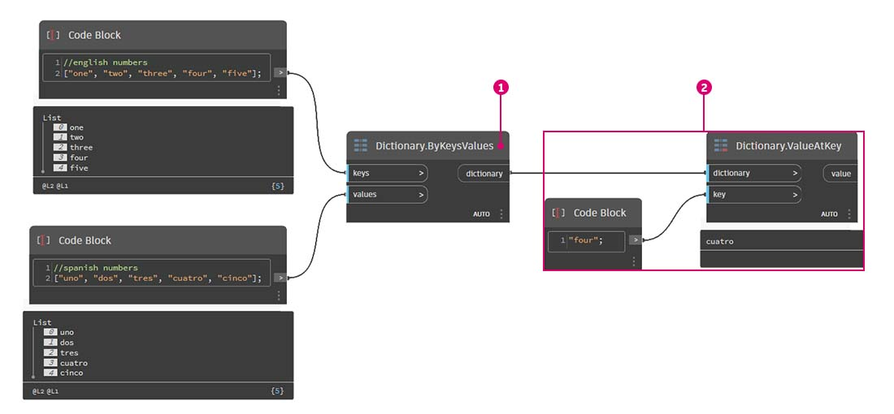

# Co je to slovník

Aplikace Dynamo 2.0 oddělila datový typ slovník od datového typu seznam. Tato změna může výrazně změnit způsob, jakým pracujete s daty. Před verzí 2.0 byly slovníky a seznamy spojeny v jediný datový typ. Stručně řečeno, seznamy byly ve skutečnosti slovníky s celočíselnými klíči.

### **Co je to slovník?**

Slovník je datový typ, který se skládá z kolekce dvojic klíč-hodnota, kde klíč je v rámci kolekce jedinečný. Slovník nemá žádné pořadí a umožňuje vyhledávat hodnoty pomocí klíčů (a nikoliv pomocí hodnot indexů jako u seznamů). _V aplikaci Dynamo 2.0 mohou být jako klíče použity pouze řetězce._

### **Co je to seznam?**

Seznam je datový list, který se skládá z kolekce hodnot v určitém pořadí. V aplikaci Dynamo seznamy používají celočíselné hodnoty indexů.

### **Proč k této změně došlo a proč je důležitá?**

Díky oddělení slovníků od seznamů můžete slovníky používat k rychlému a snadnému ukládání a vyhledávání hodnot, aniž by bylo nutné pamatovat si hodnoty indexů nebo uchovávat data ve striktní struktuře seznamu. Během uživatelského testování jsme zjistili, že nahrazením uzlů `GetItemAtIndex` slovníky došlo k výraznému zmenšení velikosti grafu.

### **K jakým změnám došlo?**

* Došlo ke změnám _syntaxe_, která souvisí s inicializací a prací se slovníky a seznamy v blocích kódu.
  * Slovníky používají následující syntaxi: `{key:value}`
  * Seznamy používají následující syntaxi: `[value,value,value]`
* Do knihovny byly přidány _nové uzly_, které vám pomohou vytvářet, upravovat a dotazovat slovníky.
*   Seznamy vytvořené v blocích kódu verze 1.x budou po načtení skriptu automaticky převedeny do nové syntaxe seznamu, která používá hranaté závorky `[ ]` místo složených závorek `{ }` \\.

    ***

\ (4).jpg>)

***

### **Proč je to důležité? K čemu se to používá?**

V počítačových vědách jsou slovníky, podobně jako seznamy, kolekcemi objektů. Zatímco seznamy mají položky v určitém pořadí, slovníky jsou _neuspořádané_ kolekce. Nejsou závislé na pořadových číslech (indexech), používají místo nich _klíče_.

Na obrázku níže je znázorněno potenciální využití slovníků. Slovníky se často používají ke spojení dvou různých položek, které spolu nemusí souviset. V našem případě propojujeme španělské slovo s anglickým pro později vyhledání.

> 1. Vytvoří slovník, který propojí obě části dat.
> 2. Získá hodnotu s daným klíčem.
