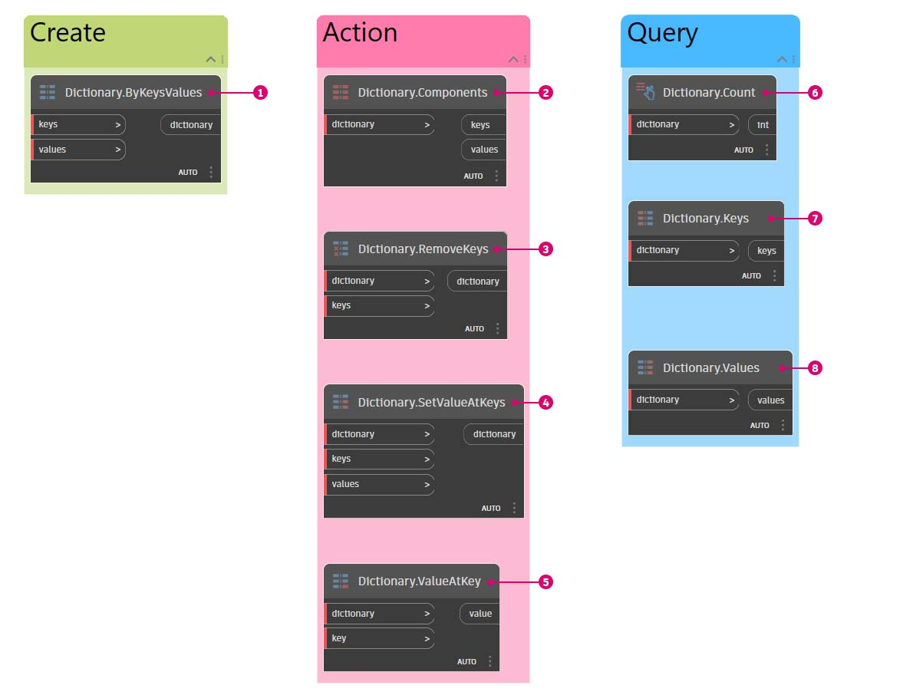

# Wörterbuch-Blöcke

Dynamo 2.0 stellt eine Reihe von Wörterbuch-Blöcken für die Verwendung bereit. Dies umfasst die Blöcke für _Erstellen, Aktion und Abfragen_.

#### Erstellen

1. `Dictionary.ByKeysValues` erstellt ein Wörterbuch mit den bereitgestellten Werten und Schlüsseln. _(Die Anzahl der Einträge entspricht der Länge der kürzesten Liste.)_

#### Aktion

2. `Dictionary.Components` erstellt die Komponenten des Eingabe-Wörterbuchs. _(Dieser Vorgang ist die Umkehrung der Block-Erstellung.)_

3. `Dictionary.RemoveKeys` erzeugt ein neues Wörterbuch-Objekt und entfernt die Eingabe-Schlüssel.

4. `Dictionary.SetValueAtKeys` erzeugt ein neues Wörterbuch anhand der eingegebenen Schlüssel und Werte und ersetzt den aktuellen Wert in den entsprechenden Schlüsseln.

5. `Dictionary.ValueAtKey` gibt den Wert am Eingabeschlüssel zurück.

#### Anzahl

6. `Dictionary.Count` gibt an, wie viele Schlüssel-Wert-Paare sich im Wörterbuch befinden.

7. `Dictionary.Keys` gibt zurück, welche Schlüssel derzeit im Wörterbuch gespeichert sind.

8. `Dictionary.Values` gibt zurück, welche Werte derzeit im Wörterbuch gespeichert sind.

Die Möglichkeit, Daten allgemein mit Wörterbücher in Beziehung zu setzen, ist eine großartige Alternative zur vorherigen Verwendung von Indizen und Listen.
