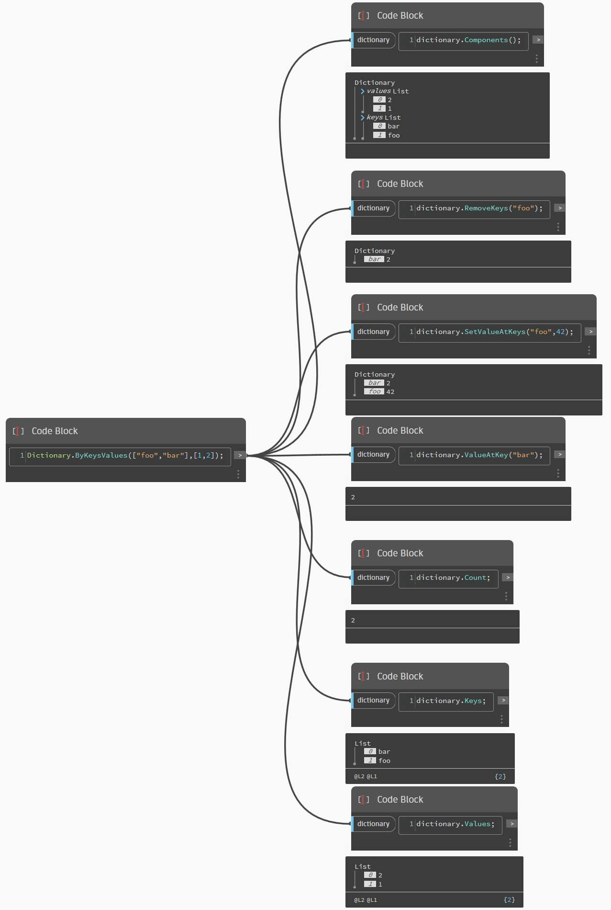

# 코드 블록의 사전

Dynamo 2.0에서는 사전에 대해 이전에 앞서 논의한 노드가 도입되어 있으며, 코드 블록에도 이에 대한 새 기능이 포함되어 있습니다.

아래와 같은 구문이나 노드의 DesignScript 기반 표현을 사용할 수 있습니다.

 (1).jpg>)

사전은 Dynamo의 객체 유형이므로 사전에서 다음 커밋을 수행할 수 있습니다.

이러한 종류의 상호작용을 유지하는 것은 Revit 데이터를 문자열에 연관 지을 때 특히 유용합니다. 다음으로, 몇 가지 Revit 사용 사례를 살펴보겠습니다.
