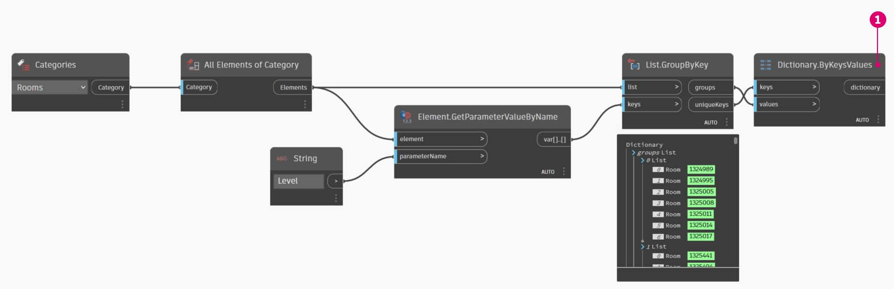

# Revit-Anwendungsfälle

Wollten Sie jemals etwas in Revit anhand eines Datenelements nachschlagen?

Wahrscheinlich haben Sie bereits etwas wie das folgende Beispiel durchgeführt.

In der Abbildung unten sammeln wir alle Räume im Revit-Modell, rufen den Index des gewünschten Raum (nach Raumnummer) ab, und erhalten schließlich die Indexnummer des Raums.

> 1. Alle Räume im Modell sammeln.
> 2. Zu suchende Raumnummer.
> 3. Rufen Sie die Raumnummer ab und ermitteln Sie, an welchem Index sie sich befindet.
> 4. Rufen Sie den Raum am Index ab.

## Übung : Raumwörterbuch

### Teil I: Erstellen eines Raumwörterbuchs

> Laden Sie die Beispieldatei herunter, indem Sie auf den folgenden Link klicken.
>
> Eine vollständige Liste der Beispieldateien finden Sie im Anhang.



Lassen Sie uns das nun mit Wörterbüchern probieren. Zuerst müssen wir alle Räume in das Revit-Modell sammeln.

> 1. Wir wählen wir die Revit-Kategorie, die wir verwendenden möchten (in diesem Fall Räume).
> 2. Wir weisen Dynamo an, alle diese Elemente zu sammeln.

Als Nächstes müssen wir entscheiden, welche Schlüssel wir verwenden, um diese Daten zu suchen. (Informationen zu Schlüsseln finden Sie im Abschnitt [Was ist ein Wörterbuch?](1-what-is-a-dictionary.md)).

> 1. Die Daten, die wir verwenden, ist die Raumnummer.

Jetzt erstellen wir das Wörterbuch mit den angegebenen Schlüsseln und Elementen.

> 1. Der Block **Dictionary.ByKeysValues** erstellt ein Wörterbuch anhand der entsprechenden Eingaben.
> 2. Bei `Keys` muss es sich um eine Zeichenfolge handelt, aber `values` können verschiedene Objekttypen sein.

Jetzt können wir einen Raum aus dem Wörterbuch über seine Raumnummer abrufen.

> 1. `String` ist der Schlüssel, den wir verwenden, um ein Objekt im Wörterbuch nachzuschlagen.
> 2. **Dictionary.ValueAtKey** ruft das Objekt aus dem Wörterbuch ab.

### Teil II: Abrufen von Werten

Mit derselben Wörterbuch-Logik können wir auch Wörterbücher mit gruppierten Objekten erstellen. Wenn wir zum Beispiel alle Räume auf einer bestimmten Ebene nachschlagen möchten, können wir das obige Diagramm folgendermaßen verändern.

> 1. Anstatt die Zimmernummer als Schlüssel zu nutzen, können wir nun einen Parameterwert verwenden (in diesem Fall Ebene).

> 1. Jetzt können wir die Räume nach der Ebene gruppieren, auf der sie sich befinden.

> 1. Wir haben die Elemente nach Ebene gruppiert. Jetzt können wir die gemeinsam verwendeten Schlüssel (eindeutige Schlüssel) als Schlüssel für das Wörterbuch und die Listen der Räume als die Elemente verwenden.

> 1. Letztendlich können wird die Ebenen im Revit-Modell nutzen, um zu ermitteln, welche Räume sich auf dieser Ebene im Wörterbuch befinden. `Dictionary.ValueAtKey` nimmt den Ebenennamen und gibt die Raumobjekte auf dieser Ebene wieder.

Mit dem Wörterbuch stehen uns praktisch unbeschränkte Möglichkeiten zur Verfügung. Die Möglichkeit, eine Beziehung zwischen Ihren BIM-Daten in Revit und dem eigentlichen Element herzustellen, ermöglicht zahlreiche Anwendungsfälle.
