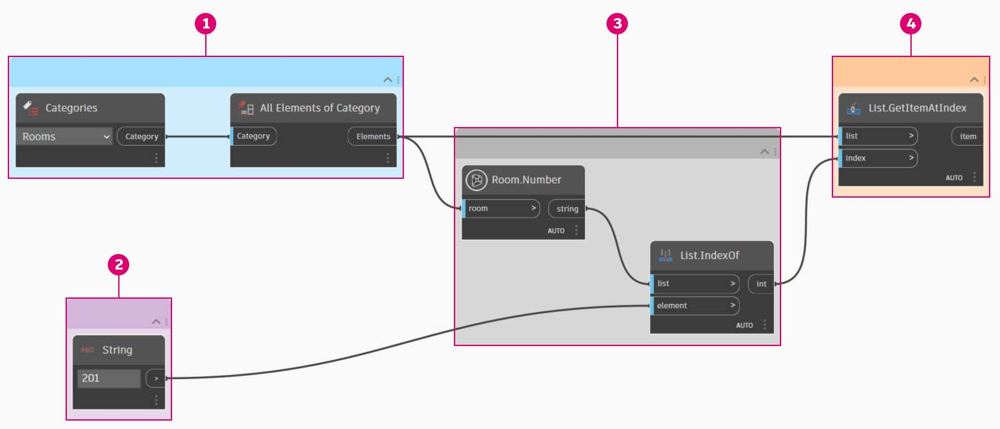

# Casi di utilizzo di Revit

Si è mai voluto cercare qualcosa in Revit a partire da un dato?

Se la risposta è affermativa, è stato fatto qualcosa di simile al seguente esempio.

Nell'immagine seguente si raccolgono tutti i locali nel modello di Revit, si ottiene l'indice del locale desiderato (per numero del locale) e infine si acquisisce il locale in corrispondenza dell'indice.

> 1. Raccogliere tutti i locali nel modello.
> 2. Specificare il numero del locale da trovare.
> 3. Ottenere il numero del locale e individuare l'indice in cui si trova.
> 4. Ottenere il locale in corrispondenza dell'indice.

## Esercizio: Dizionario dei locali

### Parte I: Creazione del dizionario dei locali

> Scaricare il file di esempio facendo clic sul collegamento seguente.
>
> Un elenco completo di file di esempio è disponibile nell'Appendice.



Ora procedere ricreando questa idea utilizzando i dizionari. Innanzitutto, è necessario raccogliere tutti i locali nel modello di Revit.

> 1. Scegliere la categoria di Revit che si desidera utilizzare (in questo caso, i locali).
> 2. Si indicherà a Dynamo di raccogliere tutti questi elementi.

Successivamente, è necessario decidere quali chiavi utilizzare per la ricerca di questi dati. Per informazioni sulle chiavi, vedere la sezione [Che cos'è un dizionario?](1-what-is-a-dictionary.md).

> 1. I dati che verranno utilizzati sono il numero del locale.

Ora verrà creato il dizionario con le chiavi e gli elementi specificati.

> 1. Il nodo **Dictionary.ByKeysValues** creerà un dizionario a partire dagli input appropriati.
> 2. `Keys` deve essere una stringa, mentre `values` può essere diversi tipi di oggetto.

Infine, è possibile recuperare un locale dal dizionario con il relativo numero.

> 1. `String` sarà la chiave utilizzata per cercare un oggetto nel dizionario.
> 2. **Dictionary.ValueAtKey** consentirà ora di ottenere l'oggetto dal dizionario.

### Parte II: Ricerca di valori

Utilizzando la stessa logica del dizionario, è possibile creare dizionari anche con oggetti raggruppati. Se si volessero cercare tutti i locali ad un determinato livello, è possibile modificare il grafico sopra come indicato di seguito.

> 1. Invece di utilizzare il numero del locale come chiave, è possibile utilizzare il valore di un parametro (in questo caso si utilizzerà il livello).

> 2. Ora è possibile raggruppare i locali in base al livello in cui risiedono.

> 3. Con gli elementi raggruppati per livello, è ora possibile utilizzare le chiavi condivise (chiavi univoche) come chiave per il dizionario e gli elenchi di locali come elementi.

> 4. Infine, utilizzando i livelli nel modello di Revit, è possibile cercare i locali che risiedono in tale livello nel dizionario.`Dictionary.ValueAtKey` recupererà il nome del livello e restituirà gli oggetti locale in corrispondenza di tale livello.

Le opportunità di utilizzo del dizionario sono davvero infinite. La possibilità di correlare i dati BIM in Revit all'elemento stesso offre diversi casi di utilizzo.
