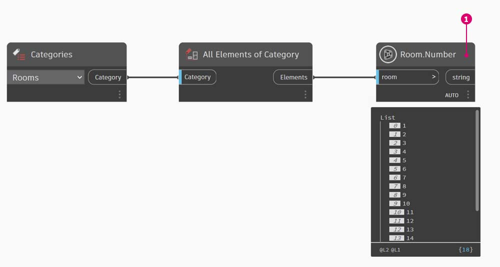

# Revit 使用情況

您是否曾想要依據 Revit 包含的資料片段查看其中的一些內容？

如果您完成了類似下列作業，就可能達到這個目的。

在下面的影像中，我們收集 Revit 模型中的所有房間、取得所需房間的索引 (依房間號碼)，最後取得索引處的房間。

> 1. 收集模型中所有的房間。
> 2. 要尋找的房間號碼。
> 3. 得到房間號碼，並尋找其所在的索引。
> 4. 得到索引處的房間。

## 練習：房間字典

### 第 I 部分：建立房間字典

> 按一下下方的連結下載範例檔案。
>
> 附錄中提供完整的範例檔案清單。



現在讓我們使用字典重新創造這個構想。首先我們必須收集 Revit 模型中所有的房間。

> 1. 我們選擇我們想要使用的 Revit 品類 (在本案例中，我們使用房間)。
> 2. 我們告訴 Dynamo 收集所有這些元素

接著，我們必須決定要使用哪些鍵來查詢此資料。(在[什麼是字典？](1-what-is-a-dictionary.md)一節可以找到鍵的相關資訊)。

> 1. 我們要使用的資料是房間號碼。

現在，我們要使用給定的鍵和元素建立字典。

> 1. **Dictionary.ByKeysValues** 節點會在給定適當輸入的狀況下建立字典。
> 2. `Keys` 必須是字串，而 `values` 可以是各種物件類型。

最後，我們現在可以從字典中使用房間號碼擷取房間。

> 1. `String` 是我們要用來從字典中查詢物件的鍵。
> 2. **Dictionary.ValueAtKey** 現在會從字典中取得物件。

### 第 II 部分：尋找值

使用同樣的字典邏輯，我們也可以使用群組的物件建立字典。如果我們想要查詢給定樓層的所有房間，可以修改上面的圖表，如下所示。

> 1. 我們現在不使用房間號碼做為鍵，而是使用參數值 (在此案例中，我們將使用樓層)。

> 2. 現在，我們可以依據房間所在的樓層將房間分組。

> 3. 有了依樓層分組的元素，我們現在可以使用共用鍵 (唯一鍵) 做為字典的鍵，使用房間的清單做為元素。

> 4. 最後，使用 Revit 模型中的樓層，我們可以在字典中查詢哪些房間位於該樓層。`Dictionary.ValueAtKey` 會採用樓層名稱，然後傳回該樓層的房間物件。

使用字典的時機非常多。將 Revit 中的 BIM 資料與元素本身建立關係，就可以產生各種使用情況。
