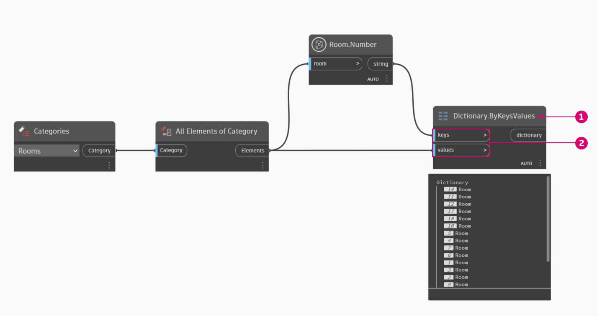
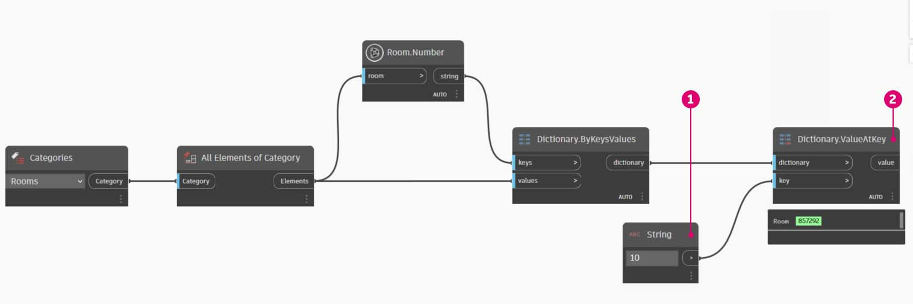
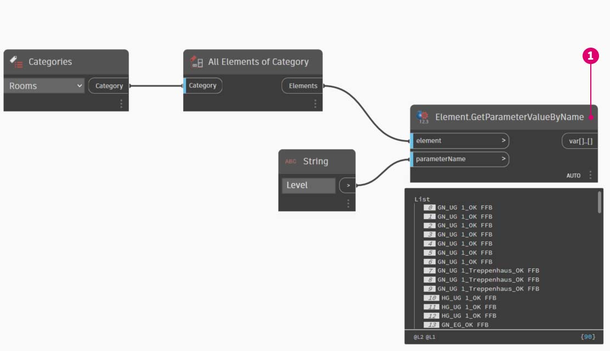
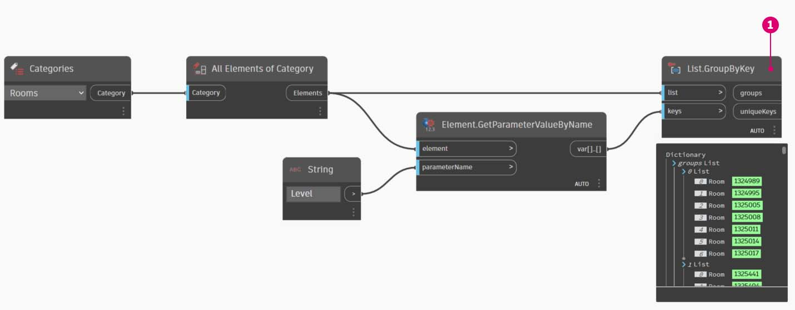

# Примеры использования Revit

Вам когда-нибудь приходилось искать в Revit информацию по фрагменту данных?

Вы наверняка уже проделывали нечто похожее на описанное в следующем примере.

Процесс, проиллюстрированный ниже, включает следующие этапы: сбор всех помещений в модели Revit, получение индекса нужного помещения (по его номеру) и, наконец, извлечение этого помещения по индексу.

> 1. Объединение всех помещений в модели.
> 2. Номер необходимого помещения.
> 3. Получение номера помещения и определение индекса.
> 4. Получение помещения по индексу.

## Упражнение «Словарь помещений»

### Часть I. Создание словаря помещений

> Скачайте файл примера, щелкнув указанную ниже ссылку.
>
> Полный список файлов примеров можно найти в приложении.



А теперь посмотрите, как тот же процесс выглядит при использовании словарей. Сначала необходимо собрать все помещения в модели Revit.

> 1. Выберите нужную категорию Revit (в данном случае работа ведется с помещениями).
> 2. Запрограммируйте сбор всех таких элементов в Dynamo.

Затем необходимо решить, какие ключи будут использоваться для поиска этих данных. Сведения о ключах см. в разделе [Что такое словарь](1-what-is-a-dictionary.md).

> 1. Данные, которые будут использоваться, — это номер помещения.

Теперь создайте словарь по заданным ключам и элементам.

> 1. Узел **Dictionary.ByKeysValues** создает словарь с соответствующими входными данными.
> 2. Данные `Keys` должны быть строковыми, а поле `values` поддерживает разные типы объектов.

Наконец, извлеките помещение из словаря с номером помещения.

> 1. Порт `String` выдает ключ, который используется для поиска объекта в словаре.
> 2. Метод **Dictionary.ValueAtKey** получает объект из словаря.

### Часть II. Поиск значений

Используя аналогичную логику работы со словарями, можно создавать словари, содержащие сгруппированные объекты. Если нужно найти все помещения на конкретном этаже, измените приведенный выше график следующим образом.

> 1. Вместо использования номера помещения в качестве ключа, можно использовать значение параметра (в данном случае этаж).

> 2. Теперь можно сгруппировать помещения по этажу, на котором они находятся.

> 3. Когда элементы сгруппированы по этажам, можно использовать общие (уникальные) ключи в качестве ключей для словаря, а списки помещений — в качестве его элементов.

> 4. Наконец, используя этажи, заданные в модели Revit, выполните поиск в словаре всех помещений, расположенных на нужном этаже. Метод `Dictionary.ValueAtKey` использует имя этажа в качестве входных данных и возвращает объекты помещений на этом этаже.

Возможности использования словарей практически безграничны. Сама по себе возможность соотнесения данных BIM в Revit с тем или иным элементом открывает широкий спектр вариантов применения.
