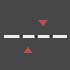

# 节点索引

此索引提供有关此入门手册中使用的所有节点以及其他可能有用构件的信息。这只是对 Dynamo 中提供的 500 个节点中一部分节点的介绍。

## 显示

### 颜色

|                                                  |                                                                                                                       |                                                                 |
| ------------------------------------------------ | --------------------------------------------------------------------------------------------------------------------- | --------------------------------------------------------------- |
|                                                  | 创建                                                                                                                |                                                                 |
|           | 
<strong>Color.ByARGB</strong> 按 Alpha、红色、绿色和蓝色分量构造颜色。
                  | \     |
| \        | 
<strong>颜色范围</strong> 基于起点颜色和终点颜色之间的颜色渐变获取颜色。
      | .jpg)        |
|                                                  | 操作                                                                                                               |                                                                 |
|       | 
<strong>Color.Brightness</strong> 获取该颜色的亮度值。
                                 | .jpg)   |
| \.jpg>) | 
<strong>Color.Components</strong> 按以下顺序列出颜色分量：Alpha、红、绿、蓝。
 | \  |
|       | 
<strong>Color.Saturation</strong> 获取该颜色的饱和度值
                                  | \ |
|              | 
<strong>Color.Hue</strong> 获取该颜色的色调值。
                                               | \        |
|                                                  | 查询                                                                                                                 |                                                                 |
| \.jpg>)     | 
<strong>Color.Alpha</strong> 查找颜色的 Alpha 分量：0 到 255。
                                 | \      |
|             | 
<strong>Color.Blue</strong> 查找颜色的蓝色分量：0 到 255。
                                   | \       |
|            | 
<strong>Color.Green</strong> 查找颜色的绿色分量：0 到 255。
                                 | \      |
|              | 
<strong>Color.Red</strong> 查找颜色的红色分量：0 到 255。
                                     | \        |

|                                                               |                                                                                           |                                                                                 |
| ------------------------------------------------------------- | ----------------------------------------------------------------------------------------- | ------------------------------------------------------------------------------- |
|                                                               | 创建                                                                                    |                                                                                 |
| .jpg) | 
<strong>GeometryColor.ByGeometryColor</strong> 使用一种颜色显示几何图形。
 | \ |

### Watch

|                                             |                                                                               |                                                                 |
| ------------------------------------------- | ----------------------------------------------------------------------------- | --------------------------------------------------------------- |
|                                             | 操作                                                                       |                                                                 |
| \    | 
<strong>View.Watch</strong> 将节点输出内容可视化。
           | \       |
| \ | 
<strong>View.Watch 3D</strong> 显示几何图形的动态预览。
 | \ |

## 输入

|                                              |                                                                                                          |                                                               |
| -------------------------------------------- | -------------------------------------------------------------------------------------------------------- | ------------------------------------------------------------- |
|                                              | 操作                                                                                                  |                                                               |
|           | 
<strong>布尔</strong> 在“True”和“False”之间选择。
                                   | \        |
| \.jpg>)  | 
<strong>代码块</strong> 允许直接编写 DesignScript 代码。
              | \     |
| \ | 
<strong>Directory Path</strong> 允许您选择系统上的目录以获取其路径
 | \ |
| \      | 
<strong>文件路径</strong> 允许您选择系统上的文件以获取其文件名
       | \      |
| \ | 
<strong>Integer Slider</strong> 用于生成整数值的滑块。
                         | \ |
|            | 
<strong>数字</strong> 创建数字。
                                                      | .jpg)          |
| \  | 
<strong>Number Slider</strong> 用于生成数字值的滑块。
                          | \  |
|            | 
<strong>字符串</strong> 创建字符串。
                                                      | \         |
| \ | 
<strong>Object.IsNull</strong> 确定给定对象是否为 Null。
                         | \ |

## 列表

|                                                          |                                                                                                                                                                                                                                               |                                                                         |
| -------------------------------------------------------- | --------------------------------------------------------------------------------------------------------------------------------------------------------------------------------------------------------------------------------------------- | ----------------------------------------------------------------------- |
|                                                          | 创建                                                                                                                                                                                                                                        |                                                                         |
| \                | 
<strong>List.Create</strong> 基于给定输入创建一个新列表。
                                                                                                                                                              | \.jpg>)          |
| \               | 
<strong>List.Combine</strong> 将组合器应用于两个序列中的每个元素
                                                                                                                                                 | \             |
|                         | 
<strong>数字范围</strong> 按指定范围创建一系列数字
                                                                                                                                                  | .jpg)                     |
|                      | 
<strong>数字序列</strong> 创建一系列数字。
                                                                                                                                                                     | \                 |
|                                                          | 操作                                                                                                                                                                                                                                       |                                                                         |
| \                  | 
<strong>List.Chop</strong> 将某个列表切成一组列表，其中每个列表包含给定数量的项目。
                                                                                                                               | \                |
| .jpg)                   | 
<strong>List.Count</strong> 返回存储于给定列表中的项数。
                                                                                                                                                   | \                    |
| \               | 
<strong>List.Flatten</strong> 按一定数量展平一列嵌套列表。
                                                                                                                                                  | \             |
| \   | 
<strong>List.FilterByBoolMask</strong> 通过在单独布尔列表中查找相应索引过滤序列。
                                                                                                       | \ |
| \     | 
<strong>List.GetItemAtIndex</strong> 获取位于指定索引处给定列表中的项目。
                                                                                                                        | \   |
|                                                          | 
<strong>List.Map</strong> 将函数应用于列表的所有元素，从而基于结果生成一个新列表。
                                                                                                                    | \                 |
|                                                          | 
<strong>List.Reverse</strong> 以相反顺序创建包含给定列表各项的新列表。
                                                                                                                        | \             |
| \ | 
<strong>List.ReplaceItemAtIndex</strong> 替换位于指定索引处给定列表中的项目。
                                                                                                                  | \    |
| \         | 
<strong>List.ShiftIndices</strong> 将列表中的索引右移给定数量
                                                                                                                                      | \       |
| \   | 
<strong>List.TakeEveryNthItem</strong> 在给定偏移后是给定值倍数的索引处提取给定列表的项。
                                                                                  | \ |
| \             | 
<strong>List.Transpose</strong> 交换一列列表中的行和列。如果一些行长短不一，则 Null 值将作为占位符插入结果数组中，使其始终为矩形
 | \           |

## 逻辑

|                                |                                                                                                                                                                                                              |                                                   |
| ------------------------------ | ------------------------------------------------------------------------------------------------------------------------------------------------------------------------------------------------------------ | ------------------------------------------------- |
|                                | 操作                                                                                                                                                                                                      |                                                   |
|  | 
<strong>If</strong> 条件语句。检查测试输入的布尔值。如果测试输入为 True，则结果将输出 True 输入，否则结果将输出 False 输入。
 | \ |

## 数学

|                                                       |                                                                                                                            |                                                                        |
| ----------------------------------------------------- | -------------------------------------------------------------------------------------------------------------------------- | ---------------------------------------------------------------------- |
|                                                       | 操作                                                                                                                    |                                                                        |
| \                | 
<strong>Math.Cos</strong> 查找角度的余弦。
                                                          | \                |
| \ | 
<strong>Math.DegreesToRadians</strong> 将以度为单位的角度换算为以弧度为单位的角度。
                      | \ |
| \                | 
<strong>Math.Pow</strong> 求数字的指定次幂。
                                                | \                |
| \ | 
<strong>Math.RadiansToDegrees</strong> 将以弧度为单位的角度换算为以度为单位的角度。
                      | \ |
| \        | 
<strong>Math.RemapRange</strong> 调整数字列表的范围，同时保留分布率。
 | \        |
| \                | 
<strong>Math.Sin</strong> 查找角度的正弦。
                                                            | \                |
| .jpg)                  | 
<strong>映射</strong> 将值映射到输入范围
                                                            | \                |

## 字符串

|                                                |                                                                                                                                                      |                                                                 |
| ---------------------------------------------- | ---------------------------------------------------------------------------------------------------------------------------------------------------- | --------------------------------------------------------------- |
|                                                | 操作                                                                                                                                              |                                                                 |
| \    | 
<strong>String.Concat</strong> 将多个字符串合并为单个字符串。
                                                         | \    |
| \  | 
<strong>String.Contains</strong> 确定给定字符串是否包含给定子字符串。
                                              | \  |
| \      | 
<strong>String.Join</strong> 将多个字符串合并为单个字符串，在每个连接的字符串之间插入给定分隔符。
 | \      |
| \     | 
<strong>String.Split</strong> 使用由给定分隔符字符串确定的分段，将单个字符串拆分为字符串列表。
    | \     |
| \ | 
<strong>String.ToNumber</strong> 将字符串转换为整数或双精度数。
                                                              | \ |

## 几何图形

### 圆

|                                                             |                                                                                                                                                          |                                                                                     |
| ----------------------------------------------------------- | -------------------------------------------------------------------------------------------------------------------------------------------------------- | ----------------------------------------------------------------------------------- |
|                                                             | 创建                                                                                                                                                   |                                                                                     |
| \ | 
<strong>Circle.ByCenterPointRadius</strong> 以世界坐标系 Z 轴为法线，通过在世界坐标系 XY 平面输入圆心和半径创建圆。
 | \ |
| \        | 
<strong>Circle.ByPlaneRadius</strong> 在输入平面内以输入平面原点（根）为圆心，按给定半径创建圆。
  | \               |

|                                                                           |                                                                                                                                                                                                    |                                                                                              |
| ------------------------------------------------------------------------- | -------------------------------------------------------------------------------------------------------------------------------------------------------------------------------------------------- | -------------------------------------------------------------------------------------------- |
|                                                                           | 创建                                                                                                                                                                                             |                                                                                              |
| \                 | 
<strong>CoordinateSystem.ByOrigin</strong> 创建坐标系，方法是使其原点位于输入点，X 和 Y 轴设置为 WCS 的 X 和 Y 轴
                                               | \                  |
| .jpg) | 
<strong>CoordinateSystem.ByCylindricalCoordinates</strong> 在指定柱面坐标参数处相对于指定坐标系创建坐标系
 | \ |

### 立方体

|                                                                  |                                                                                                                                            |                                                                                    |
| ---------------------------------------------------------------- | ------------------------------------------------------------------------------------------------------------------------------------------ | ---------------------------------------------------------------------------------- |
|                                                                  | 创建                                                                                                                                     |                                                                                    |
| \                   | 
<strong>Cuboid.ByLengths</strong> 以 WCS 原点为中心，使用宽度、长度和高度创建立方体。
                        | \                   |
| .jpg)            | 
<strong>Cuboid.ByLengths</strong>（原点）

以输入点为中心，使用特定宽度、长度和高度创建立方体。
 | \            |
| .jpg) | 
<strong>Cuboid.ByLengths</strong>（坐标系）

以 WCS 原点为中心，使用宽度、长度和高度创建立方体。
  | \ |
| .jpg)                 | 
<strong>Cuboid.ByCorners</strong>

通过从低点到高点延伸创建立方体。
                                      | \                   |
| \                      | 
<strong>Cuboid.Length</strong>

返回立方体的输入尺寸标注，而不是实际的世界空间尺寸标注。**
           | \                       |
| .jpg)                     | 
<strong>Cuboid.Width</strong>

返回立方体的输入尺寸标注，而不是实际的世界空间尺寸标注。**
            | \                        |
| .jpg)                    | 
<strong>Cuboid.Height</strong>

返回立方体的输入尺寸标注，而不是实际的世界空间尺寸标注。**
           | \                       |
| \             | 
<strong>BoundingBox.ToCuboid</strong>

获取边界框作为实心长方体
                                                  | \              |

**换句话说，如果创建一个立方体宽度（X 轴）长度为 10，并将其转换为在 X 方向缩放 2 倍的坐标系，则宽度仍将是 10。ASM 不允许以任何可预测的顺序提取实体的顶点，因此无法在转换后确定尺寸标注。

### 曲线

|                                                        |                                                                                                                                                  |                                                                         |
| ------------------------------------------------------ | ------------------------------------------------------------------------------------------------------------------------------------------------ | ----------------------------------------------------------------------- |
|                                                        | 操作                                                                                                                                          |                                                                         |
| \            | 
<strong>Curve.Extrude</strong>（距离） 朝法向量方向拉伸曲线。
                                             | \            |
| \ | 
<strong>Curve.PointAtParameter</strong> 获取 StartParameter() 和 EndParameter() 之间指定参数处曲线上的点。
 | \ |

### 几何图形修改器

|                                                        |                                                                                                                                    |                                                                         |
| ------------------------------------------------------ | ---------------------------------------------------------------------------------------------------------------------------------- | ----------------------------------------------------------------------- |
|                                                        | 操作                                                                                                                            |                                                                         |
| \     | 
<strong>Geometry.DistanceTo</strong> 获取从该几何图形到另一几何图形的距离。
                                  | \     |
| \         | 
<strong>Geometry.Explode</strong> 将复合或非单独图元拆分为其构件
                | \         |
| \ | 
<strong>Geometry.ImportFromSAT</strong> 输入几何图形的列表
                                                      | \ |
| \          | 
<strong>Geometry.Rotate</strong>（基准面） 绕平面原点和法线将对象旋转指定度数。
 | \          |
| \       | 
<strong>Geometry.Translate</strong> 将任意几何图形类型按给定距离朝给定方向平移。
           | \       |

### 线

|                                                                    |                                                                                                                                                          |                                                                                     |
| ------------------------------------------------------------------ | -------------------------------------------------------------------------------------------------------------------------------------------------------- | ----------------------------------------------------------------------------------- |
|                                                                    | 创建                                                                                                                                                   |                                                                                     |
| \      | 
<strong>Line.ByBestFitThroughPoints</strong> 创建最逼近点散布图的直线。
                                       | \      |
| \ | 
<strong>Line.ByStartPointDirectionLength</strong> 从某个点开始创建直线，朝向量方向延伸指定长度。
 | \ |
| \.jpg>)         | 
<strong>Line.ByStartPointEndPoint</strong> 在两个输入点之间创建一条直线。
                                                   | \        |
| \                     | 
<strong>Line.ByTangency</strong> 创建与输入曲线相切的直线，定位于输入曲线的参数点处。
               | \                     |
|                                                                    | 查询                                                                                                                                                    |                                                                                     |
| \                       | 
<strong>Line.Direction</strong> 曲线的方向。
                                                                                    | \                       |

### NurbsCurve

|                                                             |                                                                                                               |                                                                              |
| ----------------------------------------------------------- | ------------------------------------------------------------------------------------------------------------- | ---------------------------------------------------------------------------- |
|                                                             | 创建                                                                                                        |                                                                              |
| \ | 
<strong>NurbsCurve.ByControlPoints</strong> 使用显式控制点创建 BSplineCurve。
 | \ |
| \         | 
<strong>NurbsCurve.ByPoints</strong> 通过在各点之间插值创建 BSplineCurve
          | \         |

### NurbsSurface

|                                                               |                                                                                                                                                                                            |                                                                                |
| ------------------------------------------------------------- | ------------------------------------------------------------------------------------------------------------------------------------------------------------------------------------------ | ------------------------------------------------------------------------------ |
|                                                               | 创建                                                                                                                                                                                     |                                                                                |
| \ | 
<strong>NurbsSurface.ByControlPoints</strong> 通过使用具有指定 U 和 V 度数的显式控制点创建 NurbsSurface。
                                             | \ |
| \         | 
<strong>NurbsSurface.ByPoints</strong> 使用指定插值点以及 U 和 V 度数创建 NurbsSurface。生成的曲面将通过所有点。
 | \         |

### 平面

|                                                      |                                                                                                                  |                                                                       |
| ---------------------------------------------------- | ---------------------------------------------------------------------------------------------------------------- | --------------------------------------------------------------------- |
|                                                      | 创建                                                                                                           |                                                                       |
| \ | 
<strong>Plane.ByOriginNormal</strong> 以原点为中心，通过输入法向量创建平面。
 | \ |
| \               | 
<strong>Plane.XY</strong> 在世界坐标 XY 平面中创建平面
                                              | \               |

### 点

|                                                              |                                                                                                                                           |                                                                               |
| ------------------------------------------------------------ | ----------------------------------------------------------------------------------------------------------------------------------------- | ----------------------------------------------------------------------------- |
|                                                              | 创建                                                                                                                                    |                                                                               |
| \ | 
<strong>Point.ByCartesianCoordinates</strong> 在给定坐标系中通过 3 个笛卡尔坐标形成一个点
          | \ |
| \        | 
<strong>Point.ByCoordinates</strong>（二维） 在 XY 平面中通过 2 个笛卡尔坐标形成一个点。Z 分量为 0。
 | \        |
| \        | 
<strong>Point.ByCoordinates</strong>（三维） 通过给定的 3 个笛卡尔坐标形成一个点。
                                           | \        |
| \                   | 
<strong>Point.Origin</strong> 获取原点 (0,0,0)
                                                                      | \                   |
|                                                              | 操作                                                                                                                                   |                                                                               |
| \                      | 
<strong>Point.Add</strong> 将向量添加到点。相当于平移（向量）。
                                             | \                      |
|                                                              | 查询                                                                                                                                     |                                                                               |
| \                        | 
<strong>Point.X</strong> 获取点的 X 分量
                                                                         | \                        |
| \                        | 
<strong>Point.Y</strong> 获取点的 Y 分量
                                                                         | \                        |
| \                        | 
<strong>Point.Z</strong> 获取点的 Z 分量
                                                                         | \                        |

### 复合线

|                                                   |                                                                                                                                                                                       |                                                                    |
| ------------------------------------------------- | ------------------------------------------------------------------------------------------------------------------------------------------------------------------------------------- | ------------------------------------------------------------------ |
|                                                   | 创建                                                                                                                                                                                |                                                                    |
| \ | 
<strong>Polycurve.ByPoints</strong> 由连接点的直线序列生成 PolyCurve。对于闭合曲线，最后一个点应与起点位于同一位置。
 | \ |

### 矩形

|                                                         |                                                                                                                                                                               |                                                                          |
| ------------------------------------------------------- | ----------------------------------------------------------------------------------------------------------------------------------------------------------------------------- | ------------------------------------------------------------------------ |
|                                                         | 创建                                                                                                                                                                        |                                                                          |
| \ | 
<strong>Rectangle.ByWidthLength</strong>（平面） 以输入平面原点为中心，按输入宽度（平面 X 轴长度）和长度（平面 Y 轴长度）创建矩形。
 | \ |

### 球体

|                                                             |                                                                                                                             |                                                                              |
| ----------------------------------------------------------- | --------------------------------------------------------------------------------------------------------------------------- | ---------------------------------------------------------------------------- |
|                                                             | 创建                                                                                                                      |                                                                              |
| \ | 
<strong>Sphere.ByCenterPointRadius</strong> 以输入点为球心，按给定半径创建实心球体。
 | \ |

### 表面

|                                                           |                                                                                                                                                      |                                                                           |
| --------------------------------------------------------- | ---------------------------------------------------------------------------------------------------------------------------------------------------- | ------------------------------------------------------------------------- |
|                                                           | 创建                                                                                                                                               |                                                                           |
| \(1) (1) (5).jpg>) | 
<strong>Surface.ByLoft</strong> 通过在输入横截面曲线之间放样来创建实体
                                             | \            |
| \(1) (1) (4).jpg>) | 
<strong>Surface.ByPatch</strong> 通过在由输入曲线确定的闭合边界内填充来创建曲面。
                 | .jpg)              |
|                                                           | 操作                                                                                                                                              |                                                                           |
| \              | 
<strong>Surface.Offset</strong> 在曲面法线方向上，按指定距离偏移曲面
                                        | \             |
| .jpg)  | 
<strong>Surface.PointAtParameter</strong> 返回指定 U 和 V 参数处的点。
                                              | \ |
| .jpg)           | 
<strong>Surface.Thicken</strong> 将曲面加厚为实体，以朝曲面法线方向在曲面两侧进行拉伸。
 | \            |

### UV

|                                                 |                                                                           |                                                                  |
| ----------------------------------------------- | ------------------------------------------------------------------------- | ---------------------------------------------------------------- |
|                                                 | 创建                                                                    |                                                                  |
| \ | 
<strong>UV.ByCoordinates</strong> 由两个双精度数创建 UV。
 | \ |

### 向量

|                                                         |                                                                                          |                                                                      |
| ------------------------------------------------------- | ---------------------------------------------------------------------------------------- | -------------------------------------------------------------------- |
|                                                         | 创建                                                                                   |                                                                      |
| \.jpg>) | 
<strong>Vector.ByCoordinates</strong> 由 3 个欧几里得坐标形成一个向量
 | \ |
| .jpg)            | 
<strong>Vector.XAxis</strong> 获取规范 X 轴向量 (1,0,0)
         | \              |
| .jpg)            | 
<strong>Vector.YAxis</strong> 获取规范 Y 轴向量 (0,1,0)
         | \              |
| .jpg)            | 
<strong>Vector.ZAxis</strong> 获取规范 Z 轴向量 (0,0,1)
         | \              |
|                                                         | 操作                                                                                  |                                                                      |
| \.jpg>)     | 
<strong>Vector.Normalized</strong> 获取向量的规范版本
      | \     |

## 坐标系

|                                                                           |                                                                                                                                                                                                    |                                                                                              |
| ------------------------------------------------------------------------- | -------------------------------------------------------------------------------------------------------------------------------------------------------------------------------------------------- | -------------------------------------------------------------------------------------------- |
|                                                                           | 创建                                                                                                                                                                                             |                                                                                              |
| \                 | 
<strong>CoordinateSystem.ByOrigin</strong> 创建坐标系，方法是使其原点位于输入点，X 和 Y 轴设置为 WCS 的 X 和 Y 轴
                                               | \                  |
| .jpg) | 
<strong>CoordinateSystem.ByCylindricalCoordinates</strong> 在指定柱面坐标参数处相对于指定坐标系创建坐标系
 | \ |

## 运算符

|                                                  |                                                                                                                         |                                                               |
| ------------------------------------------------ | ----------------------------------------------------------------------------------------------------------------------- | ------------------------------------------------------------- |
| \.jpg>)       | 
<strong>+</strong> 加
                                                                                   | \       |
| \.jpg>)    | 
<strong>-</strong> 减
                                                                                | \    |
| \.jpg>) | 
<strong>*</strong> 乘
                                                                             | \ |
| \.jpg>)       | 
<strong>/</strong> 部门
                                                                                   | \       |
| .jpg)         | 
<strong>%</strong> 模块除法会查找在除以第二个输入后得到的第一个输入的余数
 | \              |
| .jpg)        | 
<strong><</strong> 小于
                                                                             | \      |
| \.jpg>)   | 
<strong>></strong> 大于
                                                                               | \   |
| \.jpg>)             | 
<strong>==</strong> 两个值之间的相等测试。
                                           | \             |
