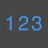
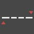
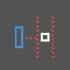
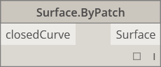
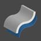
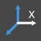
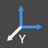
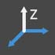

# Índice de nodos

Este índice proporciona información adicional sobre todos los nodos utilizados en este manual de introducción, así como sobre otros componentes que pueden resultar útiles. Esto es solo una introducción a algunos de los 500 nodos disponibles en Dynamo.

## Mostrar

### Color

|                                                  |                                                                                                                       |                                                                 |
| ------------------------------------------------ | --------------------------------------------------------------------------------------------------------------------- | --------------------------------------------------------------- |
|                                                  | CREAR                                                                                                                |                                                                 |
|           | 
<strong>Color.ByARGB</strong> Genera un color mediante componentes alfa, rojo, verde y azul.
                  | \     |
| \        | 
<strong>Color Range</strong> Obtiene un color de un degradado de color entre un color inicial y un color final.
      | \        |
|                                                  | ACCIONES                                                                                                               |                                                                 |
|       | 
<strong>Color.Brightness</strong> Obtiene el valor de brillo de este color.
                                 |    |
|  | 
<strong>Color.Components</strong> Enumera los componentes del color en el orden siguiente: alfa, rojo, verde y azul.
 | \  |
|       | 
<strong>Color.Saturation</strong> Obtiene el valor de saturación de este color.
                                  | \ |
|              | 
<strong>Color.Hue</strong> Obtiene el valor de matiz de este color.
                                               | \        |
|                                                  | CONSULTA                                                                                                                 |                                                                 |
|      | 
<strong>Color.Alpha</strong> Busca el componente alfa del color, de 0 a 255.
                                 | \      |
|             | 
<strong>Color.Blue</strong> Busca el componente azul del color, de 0 a 255.
                                   | \       |
|            | 
<strong>Color.Green</strong> Busca el componente verde del color, de 0 a 255.
                                 | \      |
|              | 
<strong>Color.Red</strong> Busca el componente rojo del color, de 0 a 255.
                                     | \        |

|                                                               |                                                                                           |                                                                                 |
| ------------------------------------------------------------- | ----------------------------------------------------------------------------------------- | ------------------------------------------------------------------------------- |
|                                                               | CREAR                                                                                    |                                                                                 |
| \ | 
<strong>GeometryColor.ByGeometryColor</strong> Muestra geometría mediante un color.
 | \ |

### Visualización

|                                             |                                                                               |                                                                 |
| ------------------------------------------- | ----------------------------------------------------------------------------- | --------------------------------------------------------------- |
|                                             | ACCIONES                                                                       |                                                                 |
| !     | 
<strong>View.Watch</strong> Permite visualizar la salida del nodo.
           | \       |
| \ | 
<strong>View.Watch 3D</strong> Muestra una vista preliminar dinámica de la geometría.
 | \ |

## Entrada

|                                              |                                                                                                          |                                                               |
| -------------------------------------------- | -------------------------------------------------------------------------------------------------------- | ------------------------------------------------------------- |
|                                              | ACCIONES                                                                                                  |                                                               |
|           | 
<strong>Boolean</strong> Selección entre un valor "true" (verdadero) y "false" (falso).
                                   | \        |
|   | 
<strong>Code Block</strong> Permite la creación directa de código de DesignScript.
              | \     |
| \ | 
<strong>Directory Path</strong> Permite seleccionar un directorio del sistema para obtener su ruta.
 | \ |
| \      | 
<strong>File Path</strong> Permite seleccionar un archivo del sistema para obtener su nombre de archivo.
       | \      |
| \ | 
<strong>Integer Slider</strong> Un control deslizante que genera valores enteros.
                         | \ |
|            | 
<strong>Number</strong> Crea un número.
                                                      |           |
| \  | 
<strong>Number Slider</strong> Un control deslizante que genera valores numéricos.
                          | \  |
|            | 
<strong>String</strong> Crea una cadena.
                                                      | \         |
| \ | 
<strong>Object.IsNull</strong> Determina si el objeto especificado es nulo.
                         | \ |

## Lista

|                                                          |                                                                                                                                                                                                                                               |                                                                         |
| -------------------------------------------------------- | --------------------------------------------------------------------------------------------------------------------------------------------------------------------------------------------------------------------------------------------- | ----------------------------------------------------------------------- |
|                                                          | CREAR                                                                                                                                                                                                                                        |                                                                         |
| \                | 
<strong>List.Create</strong> Crea una nueva lista a partir de las entradas especificadas.
                                                                                                                                                              | \          |
| \               | 
<strong>List.Combine</strong> Aplica un combinador a cada elemento en dos secuencias
                                                                                                                                                 | \             |
|                         | 
<strong>Number Range</strong> Crea una secuencia de números o letras en el intervalo especificado.
                                                                                                                                                  |                      |
|                      | 
<strong>Number Sequence</strong> Crea una secuencia de números.
                                                                                                                                                                     | \                 |
|                                                          | ACCIONES                                                                                                                                                                                                                                       |                                                                         |
| \                  | 
<strong>List.Chop</strong> Divide una lista en un conjunto de listas en el que cada una contiene la cantidad especificada de elementos.
                                                                                                                               | \                |
| \                   | 
<strong>List.Count</strong> Obtiene el número de elementos almacenados en la lista especificada.
                                                                                                                                                   | \                    |
| \               | 
<strong>List.Flatten</strong> Aplana una lista anidada de listas en función de una determinada cantidad.
                                                                                                                                                  | \             |
| \   | 
<strong>List.FilterByBoolMask</strong> Filtra una secuencia mediante la búsqueda de los índices correspondientes en una lista independiente de valores booleanos.
                                                                                                       | \ |
| \     | 
<strong>List.GetItemAtIndex</strong> Devuelve un elemento de la lista especificada que se encuentra en el índice indicado.
                                                                                                                        | \   |
|                                                          | 
<strong>List.Map</strong> Aplica una función a todos los elementos de una lista y genera una lista nueva a partir de los resultados.
                                                                                                                    | \                 |
|                                                          | 
<strong>List.Reverse</strong> Crea una lista con los elementos de la lista especificada, pero en el orden inverso.
                                                                                                                        | \             |
| \ | 
<strong>List.ReplaceItemAtIndex</strong> Sustituye un elemento de la lista especificada que se encuentra en el índice indicado.
                                                                                                                  | \    |
| \         | 
<strong>List.ShiftIndices</strong> Desplaza a la derecha los índices de la lista en función de la cantidad especificada.
                                                                                                                                      | \       |
| \   | 
<strong>List.TakeEveryNthItem</strong> Recupera elementos de la lista especificada en los índices que son múltiplos del valor especificado y después del desfase indicado.
                                                                                  | \ |
| \             | 
<strong>List.Transpose</strong> Intercambia filas y columnas en una lista de listas. Si hay algunas filas más cortas que otras, los valores nulos se insertan como marcadores de posición en la matriz resultante de forma que siempre sean rectangulares.
 | \           |

## Lógica

|                                |                                                                                                                                                                                                              |                                                   |
| ------------------------------ | ------------------------------------------------------------------------------------------------------------------------------------------------------------------------------------------------------------ | ------------------------------------------------- |
|                                | ACCIONES                                                                                                                                                                                                      |                                                   |
|  | 
<strong>If</strong> Sentencia condicional. Comprueba el valor booleano de la entrada de prueba. Si la entrada de prueba es "true" (verdadera), el resultado genera la entrada "true"; de lo contrario, el resultado genera la entrada "false" (falsa).
 | \ |

## Matemáticas

|                                                       |                                                                                                                            |                                                                        |
| ----------------------------------------------------- | -------------------------------------------------------------------------------------------------------------------------- | ---------------------------------------------------------------------- |
|                                                       | ACCIONES                                                                                                                    |                                                                        |
| \                | 
<strong>Math.Cos</strong> Devuelve el coseno de un ángulo.
                                                          | \                |
| \ | 
<strong>Math.DegreesToRadians</strong> Convierte un ángulo expresado en grados en un ángulo expresado en radianes.
                      | \ |
| \                | 
<strong>Math.Pow</strong> Eleva un número a la potencia especificada.
                                                | \                |
| \ | 
<strong>Math.RadiansToDegrees</strong> Convierte un ángulo expresado en radianes en un ángulo expresado en grados.
                      | \ |
| \        | 
<strong>Math.RemapRange</strong> Ajusta el intervalo de una lista de números conservando la relación de distribución.
 | \        |
| \                | 
<strong>Math.Sin</strong> Calcula el seno de un ángulo.
                                                            | \                |
|                   | 
<strong>Map</strong> Asigna un valor a un rango de entrada.
                                                            | \                |

## Cadena

|                                                |                                                                                                                                                      |                                                                 |
| ---------------------------------------------- | ---------------------------------------------------------------------------------------------------------------------------------------------------- | --------------------------------------------------------------- |
|                                                | ACCIONES                                                                                                                                              |                                                                 |
| \    | 
<strong>String.Concat</strong> Concatena varias cadenas y crea una sola cadena.
                                                         | \    |
| \  | 
<strong>String.Contains</strong> Determina si la cadena indicada contiene la subcadena especificada.
                                              | \  |
| \      | 
<strong>String.Join</strong> Concatena varias cadenas en una sola e inserta el separador especificado entre cada una de las cadenas unidas.
 | \      |
| \     | 
<strong>String.Split</strong> Divide una cadena en una lista de cadenas. Las cadenas de separación especificadas determinan las divisiones.
    | \     |
| \ | 
<strong>String.ToNumber</strong> Convierte una cadena en un número entero o doble.
                                                              | \ |

## Geometría

### Círculo

|                                                             |                                                                                                                                                          |                                                                                     |
| ----------------------------------------------------------- | -------------------------------------------------------------------------------------------------------------------------------------------------------- | ----------------------------------------------------------------------------------- |
|                                                             | CREAR                                                                                                                                                   |                                                                                     |
| \ | 
<strong>Circle.ByCenterPointRadius</strong> Crea un círculo con punto central y radio en el plano XY universal, con el plano Z universal como normal.
 | \ |
| \        | 
<strong>Circle.ByPlaneRadius</strong> Crea un círculo centrado en el origen de plano de entrada (raíz), que se encuentra en el plano de entrada, con el radio especificado.
  | \               |

|                                                                           |                                                                                                                                                                                                    |                                                                                              |
| ------------------------------------------------------------------------- | -------------------------------------------------------------------------------------------------------------------------------------------------------------------------------------------------- | -------------------------------------------------------------------------------------------- |
|                                                                           | CREAR                                                                                                                                                                                             |                                                                                              |
| \                 | 
<strong>CoordinateSystem.ByOrigin</strong> Crea un CoordinateSystem con origen en el punto de entrada con los ejes X e Y establecidos como los ejes X e Y de SCU.
                                               | \                  |
| \ | 
<strong>CoordinateSystem.ByCylindricalCoordinates</strong> Crea un CoordinateSystem en los parámetros de coordenadas cilíndricas especificados respecto al sistema de coordenadas especificado.
 | \ |

### Ortoedro

|                                                                  |                                                                                                                                            |                                                                                    |
| ---------------------------------------------------------------- | ------------------------------------------------------------------------------------------------------------------------------------------ | ---------------------------------------------------------------------------------- |
|                                                                  | CREAR                                                                                                                                     |                                                                                    |
| \                   | 
<strong>Cuboid.ByLengths</strong> Crea un ortoedro centrado en el origen de SCU con anchura, longitud y altura.
                        | \                   |
| \            | 
<strong>Cuboid.ByLengths</strong> (origin)

Crea un ortoedro centrado en el punto de entrada con la anchura, la longitud y la altura especificadas.
 | \            |
| \ | 
<strong>Cuboid.ByLengths</strong> (coordinateSystem)

Crea un ortoedro centrado en el origen de SCU con anchura, longitud y altura.
  | \ |
| \                 | 
<strong>Cuboid.ByCorners</strong>

Crea un ortoedro que abarca del punto inferior al punto superior.
                                      | \                   |
| \                      | 
<strong>Cuboid.Length</strong>

Devuelve las cotas de entrada del cubo, NO las cotas reales del espacio universal. **
           | \                       |
| \                     | 
<strong>Cuboid.Width</strong>

Devuelve las cotas de entrada del cubo, NO las cotas reales del espacio universal. **
            | \                        |
| \                    | 
<strong>Cuboid.Height</strong>

Devuelve las cotas de entrada del cubo, NO las cotas reales del espacio universal. **
           | \                       |
| \             | 
<strong>BoundingBox.ToCuboid</strong>

Obtiene el cuadro delimitador como un ortoedro sólido.
                                                  | \              |

 **En otras palabras, si crea una longitud de anchura de ortoedro (eje X) de 10 y la transforma en un CoordinateSystem con dos veces la escala en X, la anchura seguirá siendo 10. ASM no permite extraer los vértices de un cuerpo en ningún orden predecible, por lo que es imposible determinar las cotas después de una transformación. 

### Curva

|                                                        |                                                                                                                                                  |                                                                         |
| ------------------------------------------------------ | ------------------------------------------------------------------------------------------------------------------------------------------------ | ----------------------------------------------------------------------- |
|                                                        | ACCIONES                                                                                                                                          |                                                                         |
| \            | 
<strong>Curve.Extrude</strong> (distance) Extruye una curva en la dirección del vector normal.
                                             | \            |
| \ | 
<strong>Curve.PointAtParameter</strong> Obtiene un punto en la curva en el parámetro especificado entre StartParameter() y EndParameter().
 | \ |

### Modificadores de geometría

|                                                        |                                                                                                                                    |                                                                         |
| ------------------------------------------------------ | ---------------------------------------------------------------------------------------------------------------------------------- | ----------------------------------------------------------------------- |
|                                                        | ACCIONES                                                                                                                            |                                                                         |
| \     | 
<strong>Geometry.DistanceTo</strong> Obtiene la distancia entre esta geometría y otra.
                                  | \     |
| \         | 
<strong>Geometry.Explode</strong> Separa elementos compuestos o no separados en sus componentes.
                | \         |
| \ | 
<strong>Geometry.ImportFromSAT</strong> Lista de geometrías importadas
                                                      | \ |
| \          | 
<strong>Geometry.Rotate</strong> (basePlane) Rota un objeto sobre la normal y el origen del plano el número de grados especificado.
 | \          |
| \       | 
<strong>Geometry.Translate</strong> Traslada cualquier tipo de geometría según la distancia especificada en la dirección indicada.
           | \       |

### Línea

|                                                                    |                                                                                                                                                          |                                                                                     |
| ------------------------------------------------------------------ | -------------------------------------------------------------------------------------------------------------------------------------------------------- | ----------------------------------------------------------------------------------- |
|                                                                    | CREAR                                                                                                                                                   |                                                                                     |
| \      | 
<strong>Line.ByBestFitThroughPoints</strong> Crea una línea que aproxima al máximo un diagrama de dispersión de puntos.
                                       | \      |
| \ | 
<strong>Line.ByStartPointDirectionLength</strong> Crea una línea recta desde el punto inicial y la extiende la longitud especificada en la dirección del vector.
 | \ |
|          | 
<strong>Line.ByStartPointEndPoint</strong> Crea una línea recta entre dos puntos de entrada.
                                                   | \        |
| \                     | 
<strong>Line.ByTangency</strong> Crea una línea tangente a la curva de entrada, que se coloca en el parámetro de punto de la curva de entrada.
               | \                     |
|                                                                    | CONSULTA                                                                                                                                                    |                                                                                     |
| \                       | 
<strong>Line.Direction</strong> La dirección de la curva.
                                                                                    | \                       |

### NurbsCurve

|                                                             |                                                                                                               |                                                                              |
| ----------------------------------------------------------- | ------------------------------------------------------------------------------------------------------------- | ---------------------------------------------------------------------------- |
|                                                             | Crear                                                                                                        |                                                                              |
| \ | 
<strong>NurbsCurve.ByControlPoints</strong> Crea una BSplineCurve mediante puntos de control explícitos.
 | \ |
| \         | 
<strong>NurbsCurve.ByPoints</strong> Crea una BSplineCurve mediante la interpolación entre puntos.
          | \         |

### NurbsSurface

|                                                               |                                                                                                                                                                                            |                                                                                |
| ------------------------------------------------------------- | ------------------------------------------------------------------------------------------------------------------------------------------------------------------------------------------ | ------------------------------------------------------------------------------ |
|                                                               | Crear                                                                                                                                                                                     |                                                                                |
| \ | 
<strong>NurbsSurface.ByControlPoints</strong> Crea una NurbsSurface mediante el uso de puntos de control explícitos y los grados especificados para U y V.
                                             | \ |
| \         | 
<strong>NurbsSurface.ByPoints</strong> Crea una NurbsSurface con los puntos interpolados y los grados especificados para U y V. La superficie resultante atravesará todos los puntos.
 | \         |

### Plano

|                                                      |                                                                                                                  |                                                                       |
| ---------------------------------------------------- | ---------------------------------------------------------------------------------------------------------------- | --------------------------------------------------------------------- |
|                                                      | CREAR                                                                                                           |                                                                       |
| \ | 
<strong>Plane.ByOriginNormal</strong> Crea un plano centrado en el punto raíz con el vector normal de entrada.
 | \ |
| \               | 
<strong>Plane.XY</strong> Crea un plano en el plano XY universal.
                                              | \               |

### Punto

|                                                              |                                                                                                                                           |                                                                               |
| ------------------------------------------------------------ | ----------------------------------------------------------------------------------------------------------------------------------------- | ----------------------------------------------------------------------------- |
|                                                              | CREAR                                                                                                                                    |                                                                               |
| \ | 
<strong>Point.ByCartesianCoordinates</strong> Genera un punto en el sistema de coordenadas especificado con tres coordenadas cartesianas.
          | \ |
| \        | 
<strong>Point.ByCoordinates</strong> (2D) Genera un punto en el plano XY con las dos coordenadas cartesianas especificadas. El componente Z es 0.
 | \        |
| \        | 
<strong>Point.ByCoordinates</strong> (3D) Genera un punto con las tres coordenadas cartesianas especificadas.
                                           | \        |
| \                   | 
<strong>Point.Origin</strong> Obtiene el punto de origen (0,0,0).
                                                                      | \                   |
|                                                              | ACCIONES                                                                                                                                   |                                                                               |
| \                      | 
<strong>Point.Add</strong> Añade un vector a un punto. Equivale a Translate (Vector).
                                             | \                      |
|                                                              | CONSULTA                                                                                                                                     |                                                                               |
| \                        | 
<strong>Point.X</strong> Obtiene el componente X de un punto.
                                                                         | \                        |
| \                        | 
<strong>Point.Y</strong> Obtiene el componente Y de un punto.
                                                                         | \                        |
| \                        | 
<strong>Point.Z</strong> Obtiene el componente Z de un punto.
                                                                         | \                        |

### PolyCurve

|                                                   |                                                                                                                                                                                       |                                                                    |
| ------------------------------------------------- | ------------------------------------------------------------------------------------------------------------------------------------------------------------------------------------- | ------------------------------------------------------------------ |
|                                                   | CREAR                                                                                                                                                                                |                                                                    |
| \ | 
<strong>Polycurve.ByPoints</strong> Crea una PolyCurve a partir de una secuencia de líneas que conectan puntos. En una curva cerrada, el último punto debe estar en la misma ubicación que el punto inicial.
 | \ |

### Rectángulo

|                                                         |                                                                                                                                                                               |                                                                          |
| ------------------------------------------------------- | ----------------------------------------------------------------------------------------------------------------------------------------------------------------------------- | ------------------------------------------------------------------------ |
|                                                         | CREAR                                                                                                                                                                        |                                                                          |
| \ | 
<strong>Rectangle.ByWidthLength</strong> (plane) Crea un rectángulo centrado en la raíz del plano de entrada con la anchura (longitud del eje X del plano) y la longitud de entrada (longitud del eje Y del plano).
 | \ |

### Esfera

|                                                             |                                                                                                                             |                                                                              |
| ----------------------------------------------------------- | --------------------------------------------------------------------------------------------------------------------------- | ---------------------------------------------------------------------------- |
|                                                             | CREAR                                                                                                                      |                                                                              |
| \ | 
<strong>Sphere.ByCenterPointRadius</strong> Crea una esfera sólida centrada en el punto de entrada con el radio especificado.
 | \ |

### Superficie

|                                                           |                                                                                                                                                      |                                                                           |
| --------------------------------------------------------- | ---------------------------------------------------------------------------------------------------------------------------------------------------- | ------------------------------------------------------------------------- |
|                                                           | CREAR                                                                                                                                               |                                                                           |
|  | 
<strong>Surface.ByLoft</strong> Crea una superficie mediante la solevación entre curvas de sección transversal de entrada.
                                             | \            |
|  | 
<strong>Surface.ByPatch</strong> Crea una superficie mediante el relleno del interior de un contorno cerrado definido por curvas de entrada.
                 |               |
|                                                           | ACCIONES                                                                                                                                              |                                                                           |
| \              | 
<strong>Surface.Offset</strong> Desfasa la superficie en la dirección de la normal de superficie en función de la distancia especificada.
                                        | \             |
|   | 
<strong>Surface.PointAtParameter</strong> Devuelve el punto en los parámetros U y V especificados.
                                              | \ |
|            | 
<strong>Surface.Thicken</strong> Engrosa la superficie hasta convertirla en un sólido y realiza la extrusión en la dirección de las normales de superficie en ambos lados de la superficie.
 | \            |

### UV

|                                                 |                                                                           |                                                                  |
| ----------------------------------------------- | ------------------------------------------------------------------------- | ---------------------------------------------------------------- |
|                                                 | CREAR                                                                    |                                                                  |
| \ | 
<strong>UV.ByCoordinates</strong> Crea un UV a partir de dos dobles.
 | \ |

### Vector

|                                                         |                                                                                          |                                                                      |
| ------------------------------------------------------- | ---------------------------------------------------------------------------------------- | -------------------------------------------------------------------- |
|                                                         | CREAR                                                                                   |                                                                      |
| \ | 
<strong>Vector.ByCoordinates</strong> Genera un vector mediante tres coordenadas euclidianas.
 | \ |
|             | 
<strong>Vector.XAxis</strong> Obtiene el vector del eje X canónico (1,0,0).
         | \              |
|             | 
<strong>Vector.YAxis</strong> Obtiene el vector del eje Y canónico (0,1,0).
         | \              |
|             | 
<strong>Vector.ZAxis</strong> Obtiene el vector del eje Z canónico (0,0,1).
         | \              |
|                                                         | ACCIONES                                                                                  |                                                                      |
| \     | 
<strong>Vector.Normalized</strong> Obtiene la versión normalizada de un vector.
      | \     |

## CoordinateSystem

|                                                                           |                                                                                                                                                                                                    |                                                                                              |
| ------------------------------------------------------------------------- | -------------------------------------------------------------------------------------------------------------------------------------------------------------------------------------------------- | -------------------------------------------------------------------------------------------- |
|                                                                           | CREAR                                                                                                                                                                                             |                                                                                              |
| \                 | 
<strong>CoordinateSystem.ByOrigin</strong> Crea un CoordinateSystem con origen en el punto de entrada con los ejes X e Y establecidos como los ejes X e Y de SCU.
                                               | \                  |
| \ | 
<strong>CoordinateSystem.ByCylindricalCoordinates</strong> Crea un CoordinateSystem en los parámetros de coordenadas cilíndricas especificados respecto al sistema de coordenadas especificado.
 | \ |

## Operadores

|                                                  |                                                                                                                         |                                                               |
| ------------------------------------------------ | ----------------------------------------------------------------------------------------------------------------------- | ------------------------------------------------------------- |
|        | 
<strong>+</strong> Suma
                                                                                   | \       |
|     | 
<strong>-</strong> Resta
                                                                                | \    |
|  | 
<strong>*</strong> Multiplicación
                                                                             | \ |
|        | 
<strong>/</strong> División
                                                                                   | \       |
|          | 
<strong>%</strong> La división modular busca el resto de la primera entrada después la división por la segunda entrada
 | \              |
| \        | 
<strong><</strong> Menor que
                                                                             | \      |
| \   | 
<strong>></strong> Mayor que
                                                                               | \   |
|              | 
<strong>==</strong> Este operador comprueba la igualdad entre dos valores.
                                           | \             |
