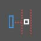
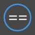

# Index des nœuds

Cet index fournit des informations supplémentaires sur tous les nœuds utilisés dans ce guide, ainsi que sur les autres composants que vous trouverez utiles. Il s'agit juste d'une introduction de quelques-uns des 500 nœuds disponibles dans Dynamo.

## Affichage

### Color

|                                                    |                                                                                                                                                             |                                                                     |
| -------------------------------------------------- | ----------------------------------------------------------------------------------------------------------------------------------------------------------- | ------------------------------------------------------------------- |
|                                                    | CREER                                                                                                                                                       |                                                                     |
| .jpg>)     | 
<strong>Color.ByARGB</strong> Créer une couleur au moyen de composants alpha, rouges, verts et bleus.
                                             |          |
| .jpg>)      | 
<strong>Intervalles de couleurs</strong> Obtenir une couleur à partir d'un dégradé de couleurs entre une couleur de départ et une couleur de fin.
 | .jpg>)                       |
|                                                    | ACTIONS                                                                                                                                                     |                                                                     |
| .jpg>) | 
<strong>Color.Brightness</strong> Obtient la valeur de luminosité de cette couleur.
                                                               | .jpg>)                  |
| .jpg>)   | 
<strong>Color.Components</strong> Répertorie les composants de la couleur dans l’ordre suivant : alpha, rouge, vert, bleu.
                        | .jpg>)  |
| .jpg>) | 
<strong>Color.Saturation</strong> Obtient la valeur de saturation de cette couleur.
                                                               | .jpg>) |
| .jpg>)        | 
<strong>Color.Hue</strong> Obtient la valeur de teinte de cette couleur.
                                                                          | .jpg>)        |
|                                                    | REQUETE                                                                                                                                                     |                                                                     |
| .jpg>)       | 
<strong>Color.Alpha</strong> Rechercher le composant alpha d’une couleur, de 0 à 255.
                                                             | .jpg>)      |
| .jpg>)       | 
<strong>Color.Blue</strong> Rechercher le composant bleu d’une couleur, de 0 à 255.
                                                               | .jpg>)       |
| .jpg>)      | 
<strong>Color.Green</strong> Rechercher le composant vert d’une couleur, de 0 à 255.
                                                              | .jpg>)      |
| .jpg>)        | 
<strong>Color.Red</strong> Rechercher le composant rouge d’une couleur, de 0 à 255.
                                                               | .jpg>)        |

|                                                                                     |                                                                                                       |                                                                                     |
| ----------------------------------------------------------------------------------- | ----------------------------------------------------------------------------------------------------- | ----------------------------------------------------------------------------------- |
|                                                                                     | CREER                                                                                                 |                                                                                     |
| .jpg>) | 
<strong>GeometryColor.ByGeometryColor</strong> Affiche la géométrie à l'aide d'une couleur.
 | .jpg>) |

### Watch

|                                                 |                                                                                       |                                                                     |
| ----------------------------------------------- | ------------------------------------------------------------------------------------- | ------------------------------------------------------------------- |
|                                                 | ACTIONS                                                                               |                                                                     |
| .jpg>)    | 
<strong>View.Watch</strong> Visualiser la sortie du nœud.
                   | .jpg>)       |
| .jpg>) | 
<strong>View.Watch 3D</strong> Affiche un aperçu dynamique de la géométrie.
 | .jpg>) |

## Entrée

|                                                  |                                                                                                                                      |                                                                   |
| ------------------------------------------------ | ------------------------------------------------------------------------------------------------------------------------------------ | ----------------------------------------------------------------- |
|                                                  | ACTIONS                                                                                                                              |                                                                   |
| .jpg>)        | 
<strong>Opération booléenne</strong> Sélection entre True et False.
                                                        | .jpg>)        |
| .jpg>)      | 
<strong>Code Block</strong> Permet de créer le code DesignScript directement.
                                              | .jpg>)     |
| .jpg>) | 
<strong>Chemin de répertoire</strong> Permet de sélectionner un répertoire sur le système pour obtenir son chemin d’accès
  | .jpg>) |
| .jpg>)      | 
<strong>Chemin du fichier</strong> Permet de sélectionner un fichier sur le système, de façon à obtenir son nom de fichier
 | .jpg>)      |
| .jpg>) | 
<strong>Integer Slider</strong> Curseur qui génère des valeurs entières.
                                                   | .jpg>) |
| .jpg>)         | 
<strong>Nombre</strong> Permet de créer un nombre.
                                                                         | .jpg>)                          |
| .jpg>)  | 
<strong>Curseur de nombre</strong> Curseur qui génère des valeurs numériques.
                                              | .jpg>)  |
| .jpg>)         | 
<strong>Chaîne</strong> Crée une chaîne.
                                                                                   | .jpg>)         |
| .jpg>) | 
<strong>Object.IsNull</strong> Détermine si l’objet indiqué est nul.
                                                       | .jpg>) |

## List

|                                                              |                                                                                                                                                                                                                                                                                      |                                                                             |
| ------------------------------------------------------------ | ------------------------------------------------------------------------------------------------------------------------------------------------------------------------------------------------------------------------------------------------------------------------------------ | --------------------------------------------------------------------------- |
|                                                              | CREER                                                                                                                                                                                                                                                                                |                                                                             |
| .jpg>)                | 
<strong>List.Create</strong> Permet de créer une liste des entrées indiquées.
                                                                                                                                                                                              | .jpg>)              |
| .jpg>)               | 
<strong>List.Combine</strong> Applique un combinateur à chaque élément en deux séquences
                                                                                                                                                                                   | .jpg>)             |
| .jpg>)                      | 
<strong>Number Range</strong> Crée une séquence de nombres dans l’intervalle spécifié
                                                                                                                                                                                      | .jpg>)                                     |
| .jpg>)                   | 
<strong>Number Sequence</strong> Crée une série de numéros.
                                                                                                                                                                                                                | .jpg>)                 |
|                                                              | ACTIONS                                                                                                                                                                                                                                                                              |                                                                             |
| .jpg>)                  | 
<strong>List.Chop</strong> Couper une liste en un ensemble de listes contenant chacune le nombre donné d’éléments.
                                                                                                                                                         | .jpg>)                |
|          | 
<strong>List.Count</strong> Renvoie le nombre d’éléments stockés dans la liste indiquée.
                                                                                                                                                                                   |                         |
| .jpg>)               | 
<strong>List.Flatten</strong> Aplanit une liste imbriquée de listes en fonction d’une quantité spécifique.
                                                                                                                                                                 | .jpg>)             |
| .jpg>)   | 
<strong>List.FilterByBoolMask</strong> Filtre une séquence en recherchant les index correspondants dans une liste distincte de booléens.
                                                                                                                                   | .jpg>) |
| .jpg>)     | 
<strong>List.GetItemAtIndex</strong> Obtient un élément de la liste indiquée qui se trouve au niveau de l’index spécifié.
                                                                                                                                                  | .jpg>)   |
|                                                              | 
<strong>List.Map</strong> Applique une fonction sur tous les éléments d’une liste, générant une nouvelle liste à partir des résultats
                                                                                                                                      | .jpg>)                 |
|                                                              | 
<strong>List.Reverse</strong> Crée une liste contenant les éléments de la liste indiquée, mais dans l’ordre inverse
                                                                                                                                                        | .jpg>)             |
| .jpg>) | 
<strong>List.ReplaceItemAtIndex</strong> Remplacer un élément de la liste indiquée qui se trouve au niveau de l’index spécifié
                                                                                                                                             | .jpg>)    |
| .jpg>)         | 
<strong>List.ShiftIndices</strong> Décale les index dans la liste vers la droite en fonction de la quantité indiquée
                                                                                                                                                       | .jpg>)       |
| .jpg>)   | 
<strong>List.TakeEveryNthItem</strong> Récupère les éléments de la liste indiquée aux index qui sont des multiples de la valeur indiquée, après le décalage indiqué.
                                                                                                       | .jpg>) |
| .jpg>)             | 
<strong>List.Transpose</strong> Permute les lignes et les colonnes d’une liste de listes. Si certaines lignes sont plus courtes que d’autres, des valeurs nulles sont insérées en tant qu’espaces réservés dans le réseau résultant afin qu’il soit toujours rectangulaire
 | .jpg>)           |

## Logique

|                                      |                                                                                                                                                                                                                       |                                                       |
| ------------------------------------ | --------------------------------------------------------------------------------------------------------------------------------------------------------------------------------------------------------------------- | ----------------------------------------------------- |
|                                      | ACTIONS                                                                                                                                                                                                               |                                                       |
| .jpg>) | 
<strong>Si</strong> Instruction conditionnelle. Vérifie la valeur booléenne de l'entrée de test. Si l’entrée de test est True, le résultat génère la valeur True, sinon le résultat génère la valeur False.
 | .jpg>) |

## Math

|                                                           |                                                                                                                                       |                                                                            |
| --------------------------------------------------------- | ------------------------------------------------------------------------------------------------------------------------------------- | -------------------------------------------------------------------------- |
|                                                           | ACTIONS                                                                                                                               |                                                                            |
| .jpg>)                | 
<strong>Math.Cos</strong> Trouve le cosinus d’un angle.
                                                                     | .jpg>)                |
| .jpg>) | 
<strong>Math.DegreesToRadians</strong> Convertit un angle en degrés en angle en radians.
                                    | .jpg>) |
| .jpg>)                | 
<strong>Math.Pow</strong> Élève un nombre à la puissance spécifiée.
                                                         | .jpg>)                |
| .jpg>) | 
<strong>Math.RadiansToDegrees</strong> Convertit un angle en radians en angle en degrés.
                                    | .jpg>) |
| .jpg>)        | 
<strong>Math.RemapRange</strong> Ajuste l’intervalle d’une liste de nombres, tout en conservant le rapport de distribution.
 | .jpg>)        |
| .jpg>)                | 
<strong>Math.Sin</strong> Détermine le sinus d’un angle.
                                                                    | .jpg>)                |
|                            | 
<strong>Carte</strong> Mappe une valeur dans un intervalle d’entrée
                                                         | .jpg>)                |

## String

|                                                    |                                                                                                                                                          |                                                                     |
| -------------------------------------------------- | -------------------------------------------------------------------------------------------------------------------------------------------------------- | ------------------------------------------------------------------- |
|                                                    | ACTIONS                                                                                                                                                  |                                                                     |
| .jpg>)    | 
<strong>String.Concat</strong> Concatène plusieurs chaînes en une seule chaîne.
                                                                | .jpg>)    |
| .jpg>)  | 
<strong>String.Contains</strong> Détermine si la chaîne indiquée contient la sous-chaîne indiquée.
                                             | .jpg>)  |
| .jpg>)      | 
<strong>String.Join</strong> Concatène plusieurs chaînes en une seule chaîne et insère le séparateur indiqué entre chaque chaîne jointe.
       |           |
| .jpg>)     | 
<strong>String.Split</strong> Divise une chaîne unique en une liste de chaînes, les chaînes de séparation indiquées déterminant les divisions.
 | .jpg>)     |
| .jpg>) | 
<strong>String.ToNumber</strong> Convertit une chaîne en nombre entier ou double.
                                                              | .jpg>) |

## Géométrie

### Circle

|                                                                 |                                                                                                                                                                           |                                                                                         |
| --------------------------------------------------------------- | ------------------------------------------------------------------------------------------------------------------------------------------------------------------------- | --------------------------------------------------------------------------------------- |
|                                                                 | CREER                                                                                                                                                                     |                                                                                         |
| .jpg>) | 
<strong>Circle.ByCenterPointRadius</strong> Crée un Circle à l'aide d'un point central d'entrée et un rayon dans le plan XY univers, avec l'univers Z standard.
 | .jpg>) |
| .jpg>)        | 
<strong>Circle.ByPlaneRadius</strong> Créer un Circle centré au niveau de l'origine du plan d'entrée (racine), dans le plan d'entrée, avec un rayon donné.
      | .jpg>)               |

|                                                                                                  |                                                                                                                                                                                                               |                                                                                                  |
| ------------------------------------------------------------------------------------------------ | ------------------------------------------------------------------------------------------------------------------------------------------------------------------------------------------------------------- | ------------------------------------------------------------------------------------------------ |
|                                                                                                  | CREER                                                                                                                                                                                                         |                                                                                                  |
| .jpg>)                                    | 
<strong>CoordinateSystem.ByOrigin</strong> Créer un CoordinateSystem avec une origine au point d’entrée, avec les axes X et Y définis en tant qu’axes X et Y SCG.
                                   | .jpg>)                  |
| .jpg>) | 
<strong>CoordinateSystem.ByCylindricalCoordinates</strong> Crée un CoordinateSystem en fonction des paramètres de coordonnées cylindriques spécifiés par rapport au système de coordonnées spécifié
 | .jpg>) |

### Cuboid

|                                                                                        |                                                                                                                                                                                    |                                                                                        |
| -------------------------------------------------------------------------------------- | ---------------------------------------------------------------------------------------------------------------------------------------------------------------------------------- | -------------------------------------------------------------------------------------- |
|                                                                                        | CREER                                                                                                                                                                              |                                                                                        |
|                                          | 
<strong>Cuboid.ByLengths</strong> Permet de créer un nœud Cuboid centré au niveau de l’origine SCG, avec une largeur, une longueur et une hauteur.
                       | .jpg>)                   |
| .jpg>)            | 
<strong>Cuboid.ByLengths</strong> (origine)

Créer un Cuboid centré au point d'entrée, en fonction de la largeur, de la longueur et de la hauteur spécifiées.
          | .jpg>)            |
| .jpg>) | 
<strong>Cuboid.ByLengths</strong> (coordinateSystem)

Permet de créer un nœud Cuboid centré au niveau de l’origine SCG, avec une largeur, une longueur et une hauteur.
 | .jpg>) |
| .jpg>)                   | 
<strong>Cuboid.ByCorners</strong>

Permet de créer un nœud Cuboid compris entre un point bas et un point haut.
                                                         | .jpg>)                   |
|                                             | 
<strong>Cuboid.Length</strong>

Permet de renvoyer les cotes d’entrée du nœud Cuboid, et NON les cotes réelles de l’espace univers. **
                                 | .jpg>)                       |
| .jpg>)                        | 
<strong>Cuboid.Width</strong>

Permet de renvoyer les cotes d’entrée du nœud Cuboid, et NON les cotes réelles de l’espace univers. **
                                  | .jpg>)                        |
| .jpg>)                       | 
<strong>Cuboid.Height</strong>

Permet de renvoyer les cotes d’entrée du nœud Cuboid, et NON les cotes réelles de l’espace univers. **
                                 | .jpg>)                       |
|                                    | 
<strong>BoundingBox.ToCuboid</strong>

Permet d’obtenir la zone de délimitation en tant que cuboïde solide.
                                                            | .jpg>)              |


\*\*En d’autres termes, si vous créez un nœud Cuboid avec la largeur de l’axe X et la longueur 10, puis le transformez en CoordinateSystem avec une échelle de 2 dans X, la largeur sera toujours 10. ASM ne vous permet pas d’extraire les sommets d’un corps dans un ordre prévisible. Il est donc impossible de déterminer les cotes après une transformation.


### Curve

|                                                            |                                                                                                                                                   |                                                                             |
| ---------------------------------------------------------- | ------------------------------------------------------------------------------------------------------------------------------------------------- | --------------------------------------------------------------------------- |
|                                                            | ACTIONS                                                                                                                                           |                                                                             |
| .jpg>)            | 
<strong>Curve.Extrude</strong> (distance) Extrude une Curve dans la direction du vecteur de la normale.
                                 | .jpg>)            |
| .jpg>) | 
<strong>Curve.PointAtParameter</strong> Obtenir un point sur la Curve à un paramètre spécifié entre StartParameter() et EndParameter().
 | .jpg>) |

### Geometry Modifiers

|                                                            |                                                                                                                                                           |                                                                             |
| ---------------------------------------------------------- | --------------------------------------------------------------------------------------------------------------------------------------------------------- | --------------------------------------------------------------------------- |
|                                                            | ACTIONS                                                                                                                                                   |                                                                             |
| .jpg>)     | 
<strong>Geometry.DistanceTo</strong> Obtenir la distance entre cette géométrie et une autre.
                                                    | .jpg>)     |
| .jpg>)         | 
<strong>Geometry.Explode</strong> Sépare les éléments composés ou non séparés dans leurs composants
                                             | .jpg>)         |
| .jpg>) | 
<strong>Geometry.ImportFromSAT</strong> Liste des géométries importées
                                                                          | .jpg>) |
| .jpg>)          | 
<strong>Geometry.Rotate</strong> (basePlane) Fait pivoter l’objet autour de l’origine et de la normale du plan en fonction d’un degré spécifié.
 | .jpg>)          |
| .jpg>)       | 
<strong>Geometry.Translate</strong> Convertit tout type de géométrie selon la distance donnée dans la direction donnée.
                         | .jpg>)       |

### Ligne

|                                                                        |                                                                                                                                                                                    |                                                                                         |
| ---------------------------------------------------------------------- | ---------------------------------------------------------------------------------------------------------------------------------------------------------------------------------- | --------------------------------------------------------------------------------------- |
|                                                                        | CREER                                                                                                                                                                              |                                                                                         |
| .jpg>)      | 
<strong>Line.ByBestFitThroughPoints</strong> Crée une ligne représentant au mieux un diagramme de dispersion de points.
                                                  | .jpg>)      |
| .jpg>) | 
<strong>Line.ByStartPointDirectionLength</strong> Créer une ligne droite partant du point, s’étendant dans la direction du vecteur en fonction de la longueur spécifiée.
 | .jpg>) |
| .jpg>)             | 
<strong>Line.ByStartPointEndPoint</strong> Crée une ligne droite entre deux points d’entrée.
                                                                             | .jpg>)        |
| .jpg>)                     | 
<strong>Line.ByTangency</strong> Créer une ligne tangente à la Curve d’entrée, située sur le point paramétrique de la Curve d’entrée.
                                    | .jpg>)                     |
|                                                                        | REQUETE                                                                                                                                                                            |                                                                                         |
| .jpg>)                       | 
<strong>Line.Direction</strong> Direction de la Curve.
                                                                                                                   | .jpg>)                       |

### NurbsCurve

|                                                                 |                                                                                                                        |                                                                                  |
| --------------------------------------------------------------- | ---------------------------------------------------------------------------------------------------------------------- | -------------------------------------------------------------------------------- |
|                                                                 | Créer                                                                                                                  |                                                                                  |
| .jpg>) | 
<strong>NurbsCurve.ByControlPoints</strong> Crée une BSplineCurve à l’aide de points de contrôle explicites.
 | .jpg>) |
| .jpg>)         | 
<strong>NurbsCurve.ByPoints</strong> Créer une BSplineCurve par interpolation entre des points
               | .jpg>)         |

### NurbsSurface

|                                                                   |                                                                                                                                                                                      |                                                                                    |
| ----------------------------------------------------------------- | ------------------------------------------------------------------------------------------------------------------------------------------------------------------------------------ | ---------------------------------------------------------------------------------- |
|                                                                   | Créer                                                                                                                                                                                |                                                                                    |
| .jpg>) | 
<strong>NurbsSurface.ByControlPoints</strong> Créer une NurbsSurface en utilisant des points de contrôle explicites avec les degrés U et V indiqués.
                       | .jpg>) |
| .jpg>)         | 
<strong>NurbsSurface.ByPoints</strong> Crée une NurbsSurface avec des points interpolés et des degrés U et V spécifiés. La surface résultante passera par tous les points.
 | .jpg>)         |

### Plan

|                                                          |                                                                                                                                           |                                                                           |
| -------------------------------------------------------- | ----------------------------------------------------------------------------------------------------------------------------------------- | ------------------------------------------------------------------------- |
|                                                          | CREER                                                                                                                                     |                                                                           |
| .jpg>) | 
<strong>Plane.ByOriginNormal</strong> Créer un plan centré au niveau du point d’origine, avec le vecteur de la normal d’entrée.
 | .jpg>) |
| .jpg>)               | 
<strong>Plane.XY</strong> Crée un plan dans l’univers XY
                                                                        | .jpg>)               |

### Point

|                                                                  |                                                                                                                                                                    |                                                                                   |
| ---------------------------------------------------------------- | ------------------------------------------------------------------------------------------------------------------------------------------------------------------ | --------------------------------------------------------------------------------- |
|                                                                  | CREER                                                                                                                                                              |                                                                                   |
| .jpg>) | 
<strong>Point.ByCartesianCoordinates</strong> Former un point dans le système de coordonnées indiqué avec trois coordonnées cartésiennes
                 | .jpg>) |
| .jpg>)        | 
<strong>Point.ByCoordinates</strong> (2d) Former un point dans le plan XY en fonction de deux coordonnées cartésiennes. Le composant Z est défini sur 0.
 | .jpg>)        |
| .jpg>)        | 
<strong>Point.ByCoordinates</strong> (3d) Former un point en fonction de 3 coordonnées cartésiennes.
                                                     | .jpg>)        |
| .jpg>)                   | 
<strong>Point.Origin</strong> Obtenir le point d'origine (0,0,0)
                                                                                         | .jpg>)                   |
|                                                                  | ACTIONS                                                                                                                                                            |                                                                                   |
| .jpg>)                      | 
<strong>Point.Add</strong> Ajouter un vecteur à un point. Il en va de même pour l’option Conversion (vecteur).
                                           | .jpg>)                      |
|                                                                  | REQUETE                                                                                                                                                            |                                                                                   |
| .jpg>)                        | 
<strong>Point.X</strong> Obtenir le composant X d’un point
                                                                                               | .jpg>)                        |
| .jpg>)                        | 
<strong>Point.Y</strong> Obtenir le composant Y d’un point
                                                                                               | .jpg>)                        |
| .jpg>)                        | 
<strong>Point.Z</strong> Obtenir le composant Z d’un point
                                                                                               | .jpg>)                        |

### Polycourbe

|                                                       |                                                                                                                                                                                                                       |                                                                        |
| ----------------------------------------------------- | --------------------------------------------------------------------------------------------------------------------------------------------------------------------------------------------------------------------- | ---------------------------------------------------------------------- |
|                                                       | CREER                                                                                                                                                                                                                 |                                                                        |
| .jpg>) | 
<strong>Polycurve.ByPoints</strong> Créer une polycourbe à partir d’une séquence de lignes connectant des points. Pour la courbe fermée, le dernier point doit être au même endroit que le point de départ.
 | .jpg>) |

### Rectangle

|                                                             |                                                                                                                                                                                                                                             |                                                                              |
| ----------------------------------------------------------- | ------------------------------------------------------------------------------------------------------------------------------------------------------------------------------------------------------------------------------------------- | ---------------------------------------------------------------------------- |
|                                                             | CREER                                                                                                                                                                                                                                       |                                                                              |
| .jpg>) | 
<strong>Rectangle.ByWidthLength</strong> (Plane) Créer un rectangle centré au niveau de la racine du plan d'entrée, avec la largeur d'entrée (longueur de l'axe X du plan) et la longueur d'entrée (longueur de l'axe Y du plan).
 | .jpg>) |

### Sphere

|                                                                 |                                                                                                                                         |                                                                                  |
| --------------------------------------------------------------- | --------------------------------------------------------------------------------------------------------------------------------------- | -------------------------------------------------------------------------------- |
|                                                                 | CREER                                                                                                                                   |                                                                                  |
| .jpg>) | 
<strong>Sphere.ByCenterPointRadius</strong> Créer une sphère solide centrée au niveau du point d’entrée, avec un rayon donné.
 | .jpg>) |

### Surface

|                                                     |                                                                                                                                                                                          |                                                                               |
| --------------------------------------------------- | ---------------------------------------------------------------------------------------------------------------------------------------------------------------------------------------- | ----------------------------------------------------------------------------- |
|                                                     | CREER                                                                                                                                                                                    |                                                                               |
|            | 
<strong>Surface.ByLoft</strong> Créer un nœud Surface par lissage entre les nœuds Curves de profil de coupe d’entrée
                                                           | .jpg>)            |
|            | 
<strong>Surface.ByPatch</strong> Créer un nœud Surface en remplissant l’intérieur d’un contour fermé défini par les nœuds Curves d’entrée.
                                     |                                    |
|                                                     | ACTIONS                                                                                                                                                                                  |                                                                               |
|         | 
<strong>Surface.Offset</strong> Décaler la surface dans la direction de la normale de surface selon une distance spécifiée
                                                     | .jpg>)             |
|  | 
<strong>Surface.PointAtParameter</strong> Renvoyer le point avec les paramètres U et V indiqués.
                                                                               | .jpg>) |
|           | 
<strong>Surface.Thicken</strong> Épaissir la surface dans un solide, en réalisant une extrusion dans la direction des normales de la surface sur les deux côtés de la surface.
 | .jpg>)            |

### UV

|                                                 |                                                                                   |                                                                      |
| ----------------------------------------------- | --------------------------------------------------------------------------------- | -------------------------------------------------------------------- |
|                                                 | CREER                                                                             |                                                                      |
|  | 
<strong>UV.ByCoordinates</strong> Créer un UV à partir de deux doubles.
 | .jpg>) |

### Vecteur

|                                                     |                                                                                                          |                                                                          |
| --------------------------------------------------- | -------------------------------------------------------------------------------------------------------- | ------------------------------------------------------------------------ |
|                                                     | CREER                                                                                                    |                                                                          |
|  | 
<strong>Vector.ByCoordinates</strong> Former un vecteur à l’aide de 3 coordonnées euclidiennes
 | .jpg>) |
|              | 
<strong>Vector.XAxis</strong> Obtient le vecteur d’axe X canonique (1,0,0)
                     | .jpg>)              |
|              | 
<strong>Vector.YAxis</strong> Obtient le vecteur d’axe Y canonique (0,1,0)
                     | .jpg>)              |
|              | 
<strong>Vector.ZAxis</strong> Obtient le vecteur d’axe Z canonique (0,0,1)
                     | .jpg>)              |
|                                                     | ACTIONS                                                                                                  |                                                                          |
|      | 
<strong>Vector.Normalized</strong> Obtenir la version normalisée d’un vecteur
                  | .jpg>)     |

## CoordinateSystem

|                                                                                                  |                                                                                                                                                                                                               |                                                                                                  |
| ------------------------------------------------------------------------------------------------ | ------------------------------------------------------------------------------------------------------------------------------------------------------------------------------------------------------------- | ------------------------------------------------------------------------------------------------ |
|                                                                                                  | CREER                                                                                                                                                                                                         |                                                                                                  |
| .jpg>)                                    | 
<strong>CoordinateSystem.ByOrigin</strong> Créer un CoordinateSystem avec une origine au point d’entrée, avec les axes X et Y définis en tant qu’axes X et Y SCG.
                                   | .jpg>)                  |
| .jpg>) | 
<strong>CoordinateSystem.ByCylindricalCoordinates</strong> Crée un CoordinateSystem en fonction des paramètres de coordonnées cylindriques spécifiés par rapport au système de coordonnées spécifié
 | .jpg>) |

## Opérateurs

|                                                              |                                                                                                                                      |                                                                   |
| ------------------------------------------------------------ | ------------------------------------------------------------------------------------------------------------------------------------ | ----------------------------------------------------------------- |
| .jpg>)                   | 
<strong>+</strong> Addition
                                                                                                | .jpg>)       |
| .jpg>)                | 
<strong>-</strong> Soustraction
                                                                                            | .jpg>)    |
| .jpg>)             | 
<strong>*</strong> Multiplication
                                                                                          | .jpg>) |
| .jpg>)                   | 
<strong>/</strong> Division
                                                                                                | .jpg>)       |
|                           | 
<strong>%</strong> La division modulaire recherche le reste de la première entrée après la division par la deuxième entrée
 |                   |
| .jpg>) | 
<strong>&#x3C;</strong> Inférieur à
                                                                                        | .jpg>)      |
|                    | 
<strong>></strong> Supérieur à
                                                                                             | .jpg>)   |
|                                | 
<strong>==</strong> L’égalité des deux valeurs est un test d’égalité.
                                                      |                                                                   |
